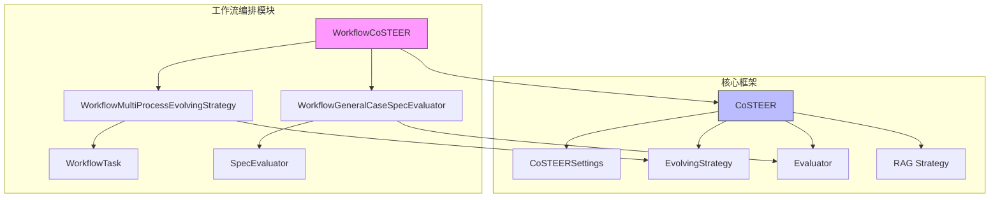
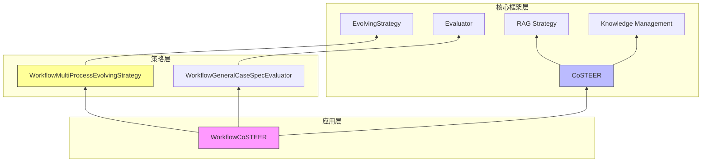
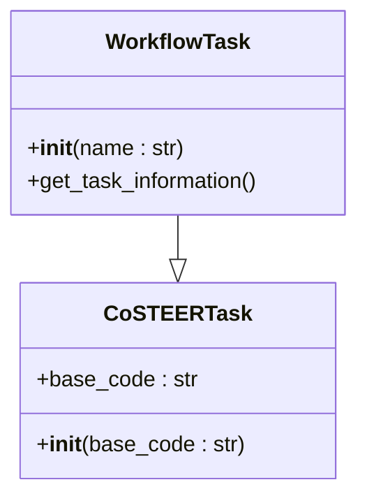
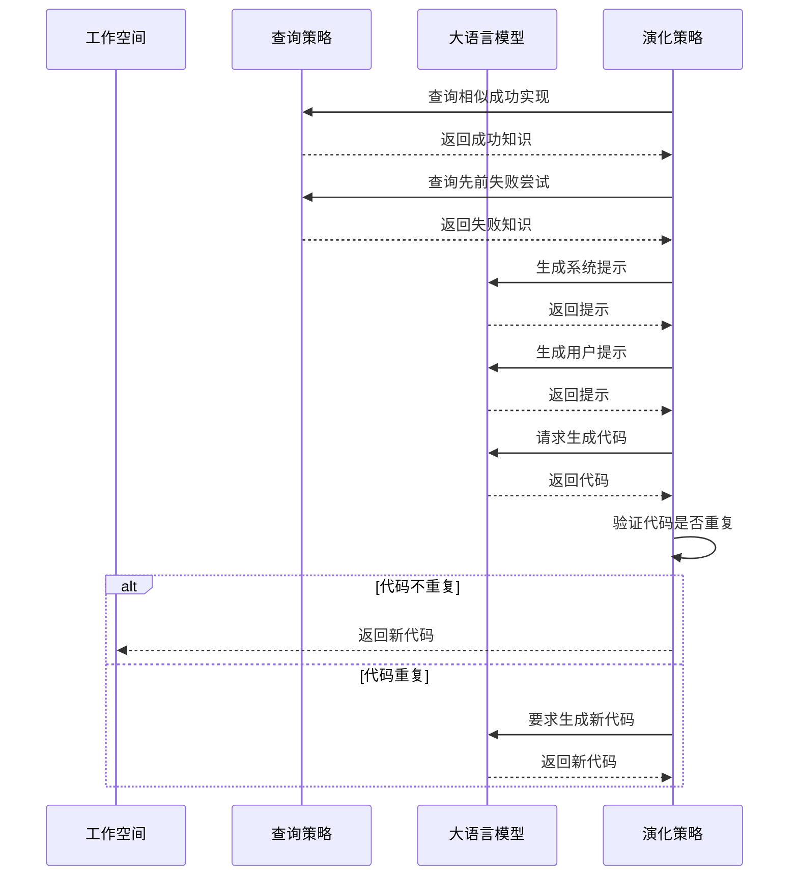
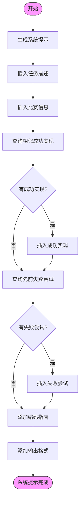
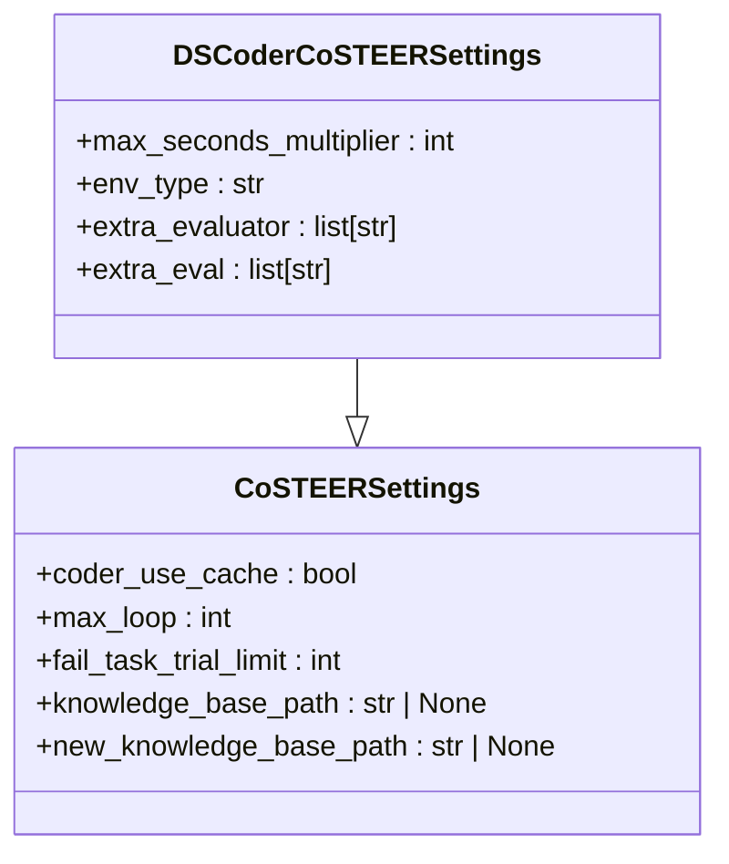
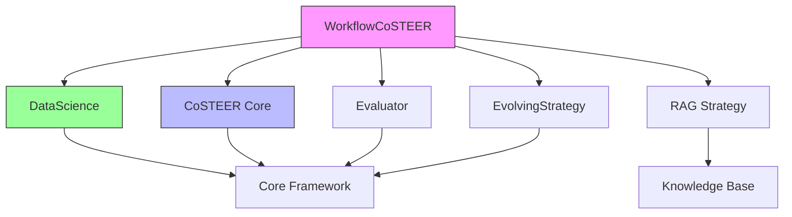

# 工作流编排Coder

<cite>
**本文档中引用的文件**  
- [CoSTEER/__init__.py](file://rdagent/components/coder/CoSTEER/__init__.py)
- [CoSTEER/config.py](file://rdagent/components/coder/CoSTEER/config.py)
- [CoSTEER/prompts.yaml](file://rdagent/components/coder/CoSTEER/prompts.yaml)
- [data_science/workflow/__init__.py](file://rdagent/components/coder/data_science/workflow/__init__.py)
- [data_science/workflow/exp.py](file://rdagent/components/coder/data_science/workflow/exp.py)
- [data_science/workflow/prompts.yaml](file://rdagent/components/coder/data_science/workflow/prompts.yaml)
- [data_science/conf.py](file://rdagent/components/coder/data_science/conf.py)
- [app/data_science/conf.py](file://rdagent/app/data_science/conf.py)
- [CoSTEER/evolving_strategy.py](file://rdagent/components/coder/CoSTEER/evolving_strategy.py)
- [CoSTEER/evaluators.py](file://rdagent/components/coder/CoSTEER/evaluators.py)
- [data_science/share/ds_costeer.py](file://rdagent/components/coder/data_science/share/ds_costeer.py)
</cite>

## 目录
1. [介绍](#介绍)
2. [项目结构](#项目结构)
3. [核心组件](#核心组件)
4. [架构概述](#架构概述)
5. [详细组件分析](#详细组件分析)
6. [依赖分析](#依赖分析)
7. [性能考虑](#性能考虑)
8. [故障排除指南](#故障排除指南)
9. [结论](#结论)

## 介绍
工作流编排Coder（WorkflowCoSTEER）是RD-Agent系统中的一个关键组件，专门负责生成和管理复杂的数据科学工作流。该系统通过先进的提示模板、任务依赖管理和错误处理机制，能够自动生成符合特定规范的可执行工作流脚本。WorkflowCoSTEER集成了并发控制、资源分配和重试策略等配置，确保工作流的高效执行。本文档将详细说明其核心机制，包括如何表达DAG结构、任务调度逻辑以及与核心实验框架的集成方式。

## 项目结构
工作流编排Coder位于`rdagent/components/coder/data_science/workflow/`目录下，是CoSTEER框架在数据科学场景下的具体实现。该模块与其他数据科学组件（如特征工程、模型训练等）协同工作，共同构建完整的机器学习流水线。系统通过分层架构设计，将任务定义、策略执行、知识管理和评估反馈等职责分离，实现了高内聚低耦合的模块化设计。

**图示来源**
- [data_science/workflow/__init__.py](file://rdagent/components/coder/data_science/workflow/__init__.py)
- [CoSTEER/__init__.py](file://rdagent/components/coder/CoSTEER/__init__.py)

**本节来源**
- [data_science/workflow/__init__.py](file://rdagent/components/coder/data_science/workflow/__init__.py)
- [CoSTEER/__init__.py](file://rdagent/components/coder/CoSTEER/__init__.py)

## 核心组件
工作流编排Coder的核心组件包括任务定义、演化策略、评估器和配置管理。`WorkflowTask`类定义了工作流任务的基本属性和行为，而`WorkflowMultiProcessEvolvingStrategy`则负责具体的任务实现逻辑。系统通过`CoSTEERMultiEvaluator`对生成的工作流代码进行多维度评估，并利用`DSCoderCoSTEERSettings`中的配置参数控制并发、资源和重试等行为。这些组件协同工作，确保工作流的正确生成和高效执行。

**本节来源**
- [data_science/workflow/exp.py](file://rdagent/components/coder/data_science/workflow/exp.py)
- [data_science/workflow/__init__.py](file://rdagent/components/coder/data_science/workflow/__init__.py)
- [CoSTEER/evaluators.py](file://rdagent/components/coder/CoSTEER/evaluators.py)
- [data_science/conf.py](file://rdagent/components/coder/data_science/conf.py)

## 架构概述
工作流编排Coder采用分层架构设计，自上而下分为应用层、策略层和核心框架层。应用层包含具体场景的实现，如`WorkflowCoSTEER`；策略层定义了任务实现的具体方法，如`WorkflowMultiProcessEvolvingStrategy`；核心框架层提供了通用的演化、评估和知识管理功能。这种分层设计使得系统既具有良好的扩展性，又能保持核心逻辑的稳定性。

**图示来源**
- [data_science/workflow/__init__.py](file://rdagent/components/coder/data_science/workflow/__init__.py)
- [CoSTEER/__init__.py](file://rdagent/components/coder/CoSTEER/__init__.py)
- [CoSTEER/evolving_strategy.py](file://rdagent/components/coder/CoSTEER/evolving_strategy.py)

## 详细组件分析

### 工作流任务分析
`WorkflowTask`类继承自`CoSTEERTask`，代表一个具体的工作流编排任务。该类通过`get_task_information`方法提供任务描述，供演化策略和评估器使用。任务对象在系统中作为基本的执行单元，贯穿于整个工作流生成和评估过程。

#### 类图

**图示来源**
- [data_science/workflow/exp.py](file://rdagent/components/coder/data_science/workflow/exp.py)
- [CoSTEER/task.py](file://rdagent/components/coder/CoSTEER/task.py)

#### 演化策略分析
`WorkflowMultiProcessEvolvingStrategy`是工作流编排的核心策略类，负责实现单个任务并将其分配给演化项。该策略通过查询相似成功知识和先前失败尝试来指导代码生成，确保新生成的代码既能借鉴成功经验，又能避免重复错误。

**图示来源**
- [data_science/workflow/__init__.py](file://rdagent/components/coder/data_science/workflow/__init__.py)
- [CoSTEER/evolving_strategy.py](file://rdagent/components/coder/CoSTEER/evolving_strategy.py)

**本节来源**
- [data_science/workflow/__init__.py](file://rdagent/components/coder/data_science/workflow/__init__.py)
- [data_science/workflow/exp.py](file://rdagent/components/coder/data_science/workflow/exp.py)

### 提示模板分析
工作流编排的提示模板采用Jinja2语法，动态生成指导大语言模型的指令。系统模板包含任务描述、比赛信息、相关知识（包括成功实现和失败尝试）以及编码指南，而用户模板则提供具体的代码规范、各组件代码和先前的实现反馈。

#### 模板结构流程图

**图示来源**
- [data_science/workflow/prompts.yaml](file://rdagent/components/coder/data_science/workflow/prompts.yaml)

#### 配置管理分析
配置管理通过`DSCoderCoSTEERSettings`类实现，继承自`CoSTEERSettings`并添加了数据科学场景特有的配置项。系统支持通过环境变量前缀`DS_Coder_CoSTEER_`进行配置，并提供了`get_ds_env`函数来根据配置创建适当的执行环境。

**图示来源**
- [data_science/conf.py](file://rdagent/components/coder/data_science/conf.py)
- [CoSTEER/config.py](file://rdagent/components/coder/CoSTEER/config.py)

**本节来源**
- [data_science/conf.py](file://rdagent/components/coder/data_science/conf.py)
- [data_science/workflow/prompts.yaml](file://rdagent/components/coder/data_science/workflow/prompts.yaml)

## 依赖分析
工作流编排Coder与多个组件存在紧密依赖关系。它依赖于核心的CoSTEER框架提供基础的演化和评估能力，依赖于数据科学共享模块提供场景特定的功能，同时通过RAG策略与知识管理系统交互。这些依赖关系通过清晰的接口定义，确保了组件间的松耦合和高内聚。

**图示来源**
- [data_science/workflow/__init__.py](file://rdagent/components/coder/data_science/workflow/__init__.py)
- [CoSTEER/__init__.py](file://rdagent/components/coder/CoSTEER/__init__.py)
- [data_science/share/ds_costeer.py](file://rdagent/components/coder/data_science/share/ds_costeer.py)

**本节来源**
- [data_science/workflow/__init__.py](file://rdagent/components/coder/data_science/workflow/__init__.py)
- [CoSTEER/__init__.py](file://rdagent/components/coder/CoSTEER/__init__.py)
- [data_science/share/ds_costeer.py](file://rdagent/components/coder/data_science/share/ds_costeer.py)

## 性能考虑
工作流编排Coder在性能方面进行了多项优化。系统通过多进程并行执行任务实现，利用`multiprocessing_wrapper`函数提高执行效率。同时，通过`max_seconds_multiplier`配置项控制开发任务的最大执行时间，防止无限循环。知识查询策略也经过优化，限制了查询的相似成功实现和失败尝试的数量，确保系统响应的及时性。

## 故障排除指南
当工作流编排出现问题时，应首先检查配置文件中的`max_loop`和`fail_task_trial_limit`设置是否合理。如果代码生成陷入循环，可能是提示模板未能有效避免重复代码，需要检查`implement_one_task`方法中的重复检测逻辑。评估失败时，应查看`CoSTEERMultiFeedback`中的详细反馈信息，定位具体的问题环节。

**本节来源**
- [CoSTEER/config.py](file://rdagent/components/coder/CoSTEER/config.py)
- [CoSTEER/__init__.py](file://rdagent/components/coder/CoSTEER/__init__.py)
- [CoSTEER/evaluators.py](file://rdagent/components/coder/CoSTEER/evaluators.py)

## 结论
工作流编排Coder（WorkflowCoSTEER）是一个功能强大且设计精良的系统，能够有效生成和管理复杂的数据科学工作流。通过分层架构设计、清晰的组件职责划分和灵活的配置管理，系统实现了高内聚低耦合的模块化设计。其核心机制，包括DAG结构表达、任务调度逻辑和错误处理策略，共同确保了工作流的正确生成和高效执行。未来可以通过进一步优化知识查询策略和增强提示模板的指导性，提升系统的整体性能和可靠性。