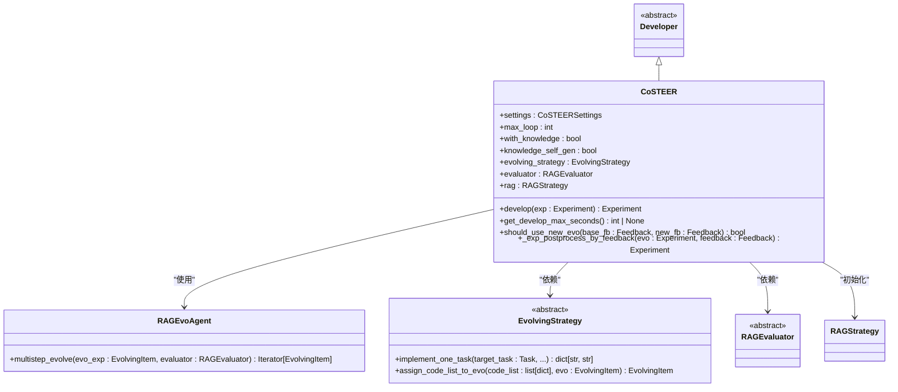
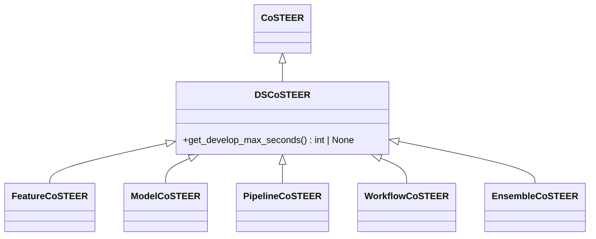
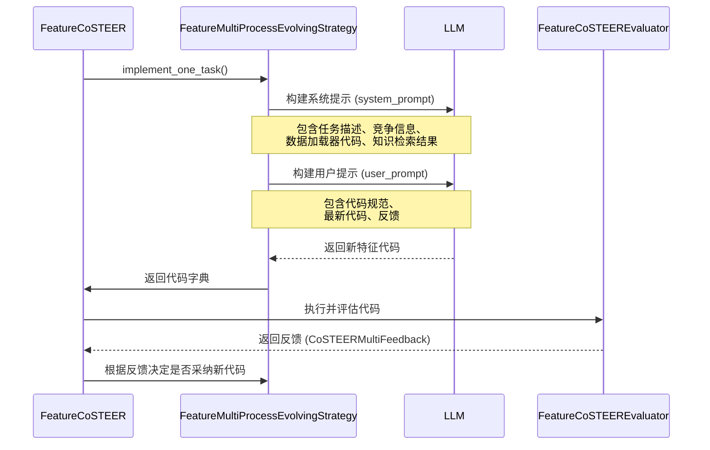
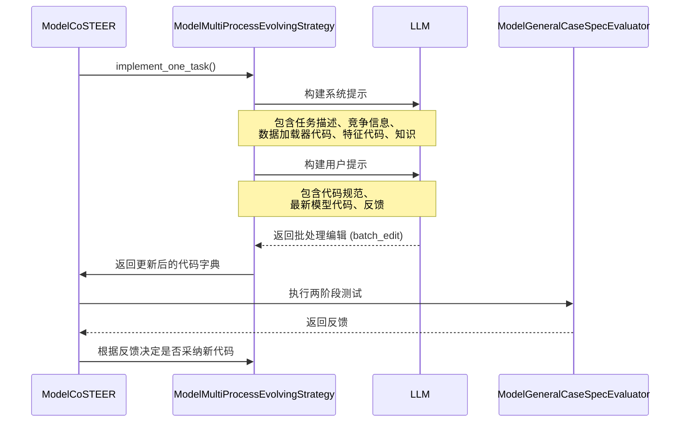
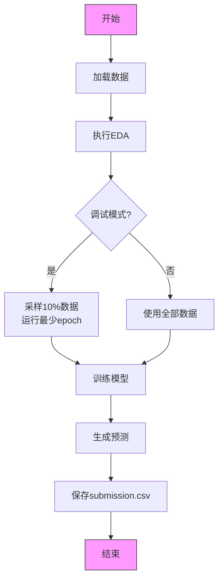
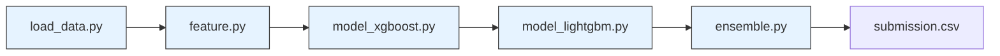
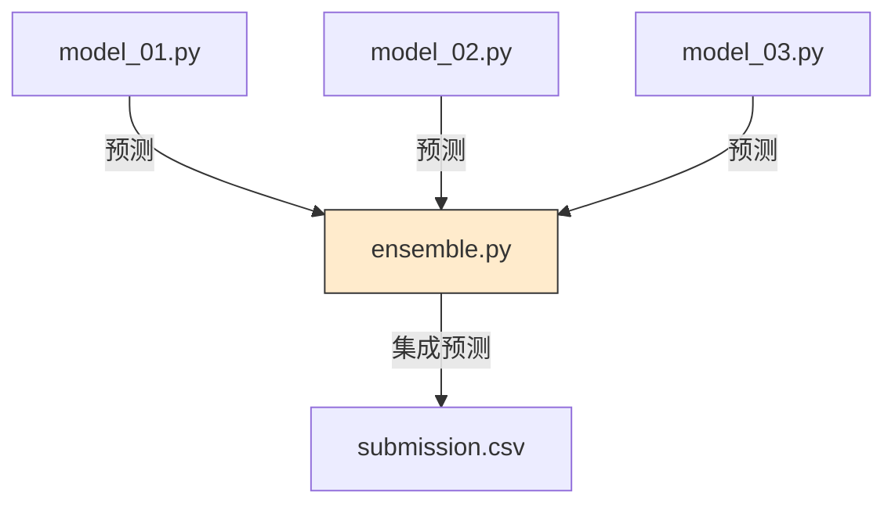
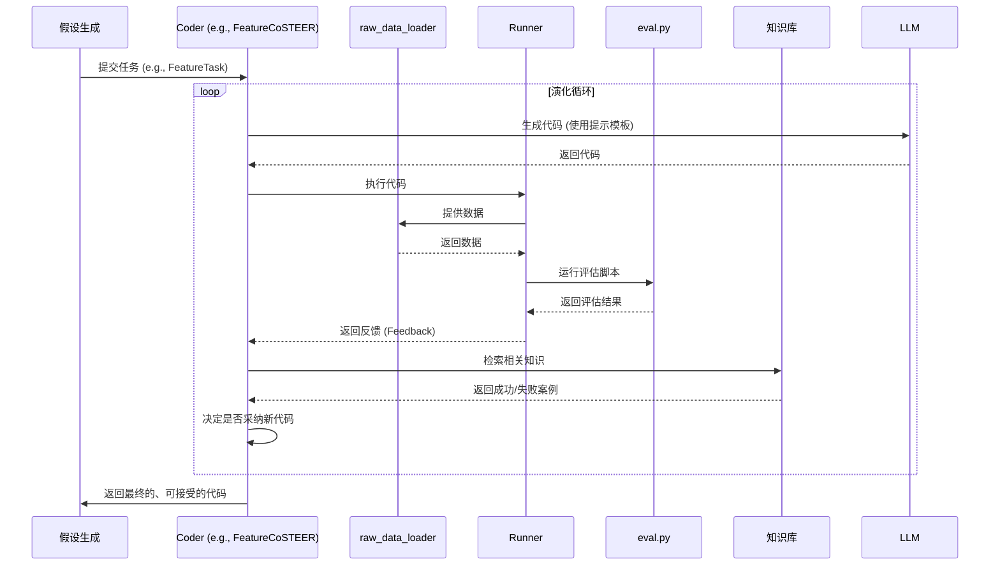

# 数据科学Coder

<cite>
**本文档中引用的文件**  
- [CoSTEER/__init__.py](file://rdagent/components/coder/CoSTEER/__init__.py)
- [data_science/conf.py](file://rdagent/components/coder/data_science/conf.py)
- [data_science/share/ds_costeer.py](file://rdagent/components/coder/data_science/share/ds_costeer.py)
- [data_science/feature/__init__.py](file://rdagent/components/coder/data_science/feature/__init__.py)
- [data_science/model/__init__.py](file://rdagent/components/coder/data_science/model/__init__.py)
- [data_science/pipeline/__init__.py](file://rdagent/components/coder/data_science/pipeline/__init__.py)
- [data_science/workflow/__init__.py](file://rdagent/components/coder/data_science/workflow/__init__.py)
- [data_science/ensemble/__init__.py](file://rdagent/components/coder/data_science/ensemble/__init__.py)
- [data_science/feature/prompts.yaml](file://rdagent/components/coder/data_science/feature/prompts.yaml)
- [data_science/model/prompts.yaml](file://rdagent/components/coder/data_science/model/prompts.yaml)
- [data_science/pipeline/prompts.yaml](file://rdagent/components/coder/data_science/pipeline/prompts.yaml)
- [data_science/workflow/prompts.yaml](file://rdagent/components/coder/data_science/workflow/prompts.yaml)
- [data_science/ensemble/prompts.yaml](file://rdagent/components/coder/data_science/ensemble/prompts.yaml)
- [data_science/feature/exp.py](file://rdagent/components/coder/data_science/feature/exp.py)
- [data_science/model/exp.py](file://rdagent/components/coder/data_science/model/exp.py)
- [data_science/pipeline/exp.py](file://rdagent/components/coder/data_science/pipeline/exp.py)
- [data_science/workflow/exp.py](file://rdagent/components/coder/data_science/workflow/exp.py)
- [data_science/ensemble/exp.py](file://rdagent/components/coder/data_science/ensemble/exp.py)
- [data_science/feature/eval.py](file://rdagent/components/coder/data_science/feature/eval.py)
- [data_science/model/eval.py](file://rdagent/components/coder/data_science/model/eval.py)
- [data_science/pipeline/eval.py](file://rdagent/components/coder/data_science/pipeline/eval.py)
- [data_science/workflow/eval.py](file://rdagent/components/coder/data_science/workflow/eval.py)
- [data_science/ensemble/eval.py](file://rdagent/components/coder/data_science/ensemble/eval.py)
- [app/data_science/conf.py](file://rdagent/app/data_science/conf.py)
</cite>

## 目录
1. [引言](#引言)
2. [核心框架：CoSTEER](#核心框架costeer)
3. [数据科学Coder特化](#数据科学coder特化)
4. [FeatureCoSTEER](#featurecosteer)
5. [ModelCoSTEER](#modelcosteer)
6. [PipelineCoSTEER](#pipelinecosteer)
7. [WorkflowCoSTEER](#workflowcosteer)
8. [EnsembleCoSTEER](#ensemblecosteer)
9. [配置与提示模板](#配置与提示模板)
10. [数据流与协同工作](#数据流与协同工作)
11. [总结](#总结)

## 引言

本文档旨在全面阐述RD-Agent框架中用于数据科学场景的各类Coder实现。这些Coder基于统一的CoSTEER框架，通过继承和特化，分别处理特征工程、模型架构、端到端流程、工作流编排和模型集成等不同任务。文档将详细说明它们各自的职责边界、应用场景、特有配置和提示模板设计，并通过分析其与数据加载器和评估器的协同工作方式，展示从数据科学假设到生成具体Python代码的完整转换过程。

## 核心框架：CoSTEER

CoSTEER框架是所有数据科学Coder的基类，提供了一个通用的代码生成、演化和评估流程。它继承自`Developer`类，负责管理整个开发周期。

**核心职责**：
- **演化循环**：通过`develop`方法执行多步演化循环，利用`RAGEvoAgent`进行迭代优化。
- **知识管理**：集成RAG（检索增强生成）策略（`CoSTEERRAGStrategyV1/V2`），从历史知识库中检索相关信息以指导代码生成。
- **反馈处理**：根据评估器返回的`CoSTEERMultiFeedback`反馈，决定是否采用新的演化结果。
- **超时与回退**：在达到最大时间限制或全局超时时，回退到之前可接受的解决方案。

**Diagram sources**
- [CoSTEER/__init__.py](file://rdagent/components/coder/CoSTEER/__init__.py#L1-L176)

**Section sources**
- [CoSTEER/__init__.py](file://rdagent/components/coder/CoSTEER/__init__.py#L1-L176)

## 数据科学Coder特化

为了适应数据科学领域的特定需求，CoSTEER框架被特化为`DSCoSTEER`，并进一步派生出五个具体的Coder类：`FeatureCoSTEER`、`ModelCoSTEER`、`PipelineCoSTEER`、`WorkflowCoSTEER`和`EnsembleCoSTEER`。它们共享一个共同的基类`DSCoSTEER`，该类定义了数据科学场景下的通用行为。

**Diagram sources**
- [data_science/share/ds_costeer.py](file://rdagent/components/coder/data_science/share/ds_costeer.py#L1-L9)
- [data_science/feature/__init__.py](file://rdagent/components/coder/data_science/feature/__init__.py#L1-L140)
- [data_science/model/__init__.py](file://rdagent/components/coder/data_science/model/__init__.py#L1-L173)
- [data_science/pipeline/__init__.py](file://rdagent/components/coder/data_science/pipeline/__init__.py#L1-L165)
- [data_science/workflow/__init__.py](file://rdagent/components/coder/data_science/workflow/__init__.py#L1-L132)
- [data_science/ensemble/__init__.py](file://rdagent/components/coder/data_science/ensemble/__init__.py#L1-L164)

**Section sources**
- [data_science/share/ds_costeer.py](file://rdagent/components/coder/data_science/share/ds_costeer.py#L1-L9)

## FeatureCoSTEER

`FeatureCoSTEER` 负责生成和优化特征工程代码，其核心是将原始数据转换为对模型训练更有价值的特征。

**职责边界与应用场景**：
- **输入**：原始数据加载器（`load_data.py`）的输出。
- **输出**：一个名为`feature.py`的Python文件，其中包含一个函数，该函数接收原始数据并返回处理后的特征数据。
- **应用场景**：当需要从原始数据中提取、转换或创建新特征时，例如处理缺失值、创建交互特征、进行特征缩放或降维等。

**特化实现**：
- **演化策略**：`FeatureMultiProcessEvolvingStrategy`实现了`implement_one_task`方法，该方法使用LLM根据任务描述、竞争信息、数据加载器代码和检索到的知识（成功案例和失败尝试）来生成新的特征代码。
- **提示模板**：使用`feature_coder.system`和`feature_coder.user`模板，引导LLM生成符合规范的特征工程代码，并避免重复之前的错误。
- **评估器**：`FeatureCoSTEEREvaluator`负责评估生成的特征代码，检查其执行情况、返回数据的正确性以及代码质量。

**Diagram sources**
- [data_science/feature/__init__.py](file://rdagent/components/coder/data_science/feature/__init__.py#L1-L140)
- [data_science/feature/prompts.yaml](file://rdagent/components/coder/data_science/feature/prompts.yaml#L1-L131)
- [data_science/feature/eval.py](file://rdagent/components/coder/data_science/feature/eval.py)

**Section sources**
- [data_science/feature/__init__.py](file://rdagent/components/coder/data_science/feature/__init__.py#L1-L140)
- [data_science/feature/exp.py](file://rdagent/components/coder/data_science/feature/exp.py#L1-L13)

## ModelCoSTEER

`ModelCoSTEER` 专注于生成和优化机器学习模型的定义和训练代码。

**职责边界与应用场景**：
- **输入**：特征工程代码（`feature.py`）的输出。
- **输出**：一个以`model_`为前缀的Python文件（如`model_xgboost.py`），其中包含模型的定义、训练和预测逻辑。
- **应用场景**：当需要实现特定的机器学习算法（如XGBoost、LightGBM、神经网络等）或对现有模型进行调优时。

**特化实现**：
- **演化策略**：`ModelMultiProcessEvolvingStrategy`的`implement_one_task`方法会生成一个批处理编辑（`PythonBatchEditOut`），允许同时修改多个模型文件。它会接收特征代码作为上下文。
- **提示模板**：`model_coder.system`模板明确要求LLM使用PyTorch而非TensorFlow以保证兼容性，并强调了超参数处理和缓存机制。
- **评估器**：`ModelGeneralCaseSpecEvaluator`会进行两阶段测试：首先用空超参数训练以验证模型能否成功运行并返回超参数，然后用返回的超参数重新训练以验证其正确性。

**Diagram sources**
- [data_science/model/__init__.py](file://rdagent/components/coder/data_science/model/__init__.py#L1-L173)
- [data_science/model/prompts.yaml](file://rdagent/components/coder/data_science/model/prompts.yaml#L1-L186)
- [data_science/model/eval.py](file://rdagent/components/coder/data_science/model/eval.py)

**Section sources**
- [data_science/model/__init__.py](file://rdagent/components/coder/data_science/model/__init__.py#L1-L173)
- [data_science/model/exp.py](file://rdagent/components/coder/data_science/model/exp.py#L1-L21)

## PipelineCoSTEER

`PipelineCoSTEER` 负责生成端到端的数据科学流水线代码，整合从数据加载到提交的完整流程。

**职责边界与应用场景**：
- **输入**：所有组件（数据加载、特征工程、模型、集成）的代码。
- **输出**：一个名为`main.py`的主程序文件，它按顺序调用所有组件并生成最终的提交文件（`submission.csv`）。
- **应用场景**：当需要将所有独立的组件组合成一个完整的、可执行的端到端解决方案时。

**特化实现**：
- **演化策略**：`PipelineMultiProcessEvolvingStrategy`生成`main.py`文件，其`implement_one_task`方法会接收整个运行时环境和包信息作为上下文。
- **提示模板**：`pipeline_coder.system`模板非常详细，强制要求代码包含探索性数据分析（EDA）、调试模式（`--debug`标志）、时间估算和严格的错误处理（仅在文件读取时允许try-except）。
- **评估器**：`PipelineCoSTEEREvaluator`会检查代码是否成功执行、是否符合比赛规则、在调试模式下是否合规，以及生成的提交文件格式是否正确。

**Diagram sources**
- [data_science/pipeline/__init__.py](file://rdagent/components/coder/data_science/pipeline/__init__.py#L1-L165)
- [data_science/pipeline/prompts.yaml](file://rdagent/components/coder/data_science/pipeline/prompts.yaml#L1-L347)
- [data_science/pipeline/eval.py](file://rdagent/components/coder/data_science/pipeline/eval.py)

**Section sources**
- [data_science/pipeline/__init__.py](file://rdagent/components/coder/data_science/pipeline/__init__.py#L1-L165)
- [data_science/pipeline/exp.py](file://rdagent/components/coder/data_science/pipeline/exp.py#L1-L8)

## WorkflowCoSTEER

`WorkflowCoSTEER` 专注于工作流的编排，即如何将独立的组件（数据加载、特征、模型、集成）连接起来。

**职责边界与应用场景**：
- **输入**：独立的`load_data.py`、`feature.py`、`model_*.py`和`ensemble.py`文件。
- **输出**：一个名为`main.py`的文件，它只负责导入这些组件并按正确的顺序调用它们的函数。
- **应用场景**：当需要一个轻量级的集成层，确保所有组件能协同工作，而无需修改组件内部逻辑时。

**特化实现**：
- **演化策略**：`WorkflowMultiProcessEvolvingStrategy`生成`main.py`，其`implement_one_task`方法会接收所有组件的代码作为上下文。
- **提示模板**：`workflow_coder.system`模板明确指示LLM“不要编辑或修改现有的Python文件”，只需进行集成。
- **评估器**：`WorkflowGeneralCaseSpecEvaluator`主要检查工作流是否成功执行并生成了格式正确的提交文件。

**Diagram sources**
- [data_science/workflow/__init__.py](file://rdagent/components/coder/data_science/workflow/__init__.py#L1-L132)
- [data_science/workflow/prompts.yaml](file://rdagent/components/coder/data_science/workflow/prompts.yaml#L1-L137)
- [data_science/workflow/eval.py](file://rdagent/components/coder/data_science/workflow/eval.py)

**Section sources**
- [data_science/workflow/__init__.py](file://rdagent/components/coder/data_science/workflow/__init__.py#L1-L132)
- [data_science/workflow/exp.py](file://rdagent/components/coder/data_science/workflow/exp.py#L1-L14)

## EnsembleCoSTEER

`EnsembleCoSTEER` 专门负责生成模型集成代码，通过组合多个模型的预测来提升最终性能。

**职责边界与应用场景**：
- **输入**：多个模型（`model_*.py`）的预测结果。
- **输出**：一个名为`ensemble.py`的文件，其中包含一个函数，该函数接收多个模型的预测并输出一个集成后的最终预测。
- **应用场景**：当单个模型的性能达到瓶颈，需要通过集成方法（如加权平均、堆叠、投票等）来进一步提升预测精度时。

**特化实现**：
- **演化策略**：`EnsembleMultiProcessEvolvingStrategy`生成`ensemble.py`，其`implement_one_task`方法会接收所有现有代码（`all_code`）作为上下文，以便LLM了解可用的模型。
- **提示模板**：`ensemble_coder.system`模板要求LLM实现指定的评分过程，并使用给定的度量标准（`metric_name`）。
- **评估器**：`EnsembleCoSTEEREvaluator`会检查集成代码的执行情况、返回结果的正确性以及代码质量。

**Diagram sources**
- [data_science/ensemble/__init__.py](file://rdagent/components/coder/data_science/ensemble/__init__.py#L1-L164)
- [data_science/ensemble/prompts.yaml](file://rdagent/components/coder/data_science/ensemble/prompts.yaml#L1-L124)
- [data_science/ensemble/eval.py](file://rdagent/components/coder/data_science/ensemble/eval.py)

**Section sources**
- [data_science/ensemble/__init__.py](file://rdagent/components/coder/data_science/ensemble/__init__.py#L1-L164)
- [data_science/ensemble/exp.py](file://rdagent/components/coder/data_science/ensemble/exp.py#L1-L13)

## 配置与提示模板

每个Coder都通过特定的配置选项（`conf.py`）和提示模板（`prompts.yaml`）来定义其行为。

**配置选项 (`conf.py`)**：
- **`DSCoderCoSTEERSettings`**：定义了所有数据科学Coder的通用设置，如`max_seconds_multiplier`（开发时间倍数）和`env_type`（运行环境，如docker）。
- **`get_ds_env`**：根据配置返回适当的环境实例（Docker或本地）。
- **`get_clear_ws_cmd`**：提供清理工作区的命令。

**提示模板 (`prompts.yaml`)**：
- **系统提示 (system)**：为LLM提供角色、任务描述、相关知识（成功案例和失败尝试）、编码指南和输出格式。
- **用户提示 (user)**：提供具体的代码规范（`code_spec`）、最新的代码和来自评估器的反馈，引导LLM进行迭代改进。
- **评估提示 (eval)**：指导评估器如何分析代码的执行输出，并生成结构化的反馈（`execution`, `return_checking`, `code`, `final_decision`）。

**Section sources**
- [data_science/conf.py](file://rdagent/components/coder/data_science/conf.py#L1-L87)
- [data_science/feature/prompts.yaml](file://rdagent/components/coder/data_science/feature/prompts.yaml#L1-L131)
- [data_science/model/prompts.yaml](file://rdagent/components/coder/data_science/model/prompts.yaml#L1-L186)
- [data_science/pipeline/prompts.yaml](file://rdagent/components/coder/data_science/pipeline/prompts.yaml#L1-L347)
- [data_science/workflow/prompts.yaml](file://rdagent/components/coder/data_science/workflow/prompts.yaml#L1-L137)
- [data_science/ensemble/prompts.yaml](file://rdagent/components/coder/data_science/ensemble/prompts.yaml#L1-L124)

## 数据流与协同工作

从一个数据科学假设（Hypothesis）到生成具体代码的完整流程如下：

1.  **假设生成**：由`HypothesisGen`模块生成一个实验假设。
2.  **任务分解**：假设被分解为一系列任务（`FeatureTask`, `ModelTask`, `PipelineTask`等）。
3.  **代码生成**：相应的Coder（如`FeatureCoSTEER`）被调用，根据任务和上下文生成代码。
4.  **执行与评估**：生成的代码在`raw_data_loader`提供的数据上执行，`eval.py`中的评估器对其进行评估。
5.  **反馈循环**：评估结果作为反馈返回给Coder，Coder利用此反馈和知识库中的信息进行下一轮演化。
6.  **迭代优化**：此过程在`max_loop`次内重复，直到找到一个可接受的解决方案。

**Diagram sources**
- [data_science/feature/__init__.py](file://rdagent/components/coder/data_science/feature/__init__.py#L1-L140)
- [data_science/feature/eval.py](file://rdagent/components/coder/data_science/feature/eval.py)
- [data_science/feature/exp.py](file://rdagent/components/coder/data_science/feature/exp.py#L1-L13)

## 总结

本文档详细阐述了RD-Agent中五种数据科学Coder的实现。它们都继承自`CoSTEER`框架，通过特化的`DSCoSTEER`基类，各自专注于数据科学流程中的一个关键环节。每个Coder都通过独特的演化策略、配置选项和提示模板来处理其特定的任务，并与`raw_data_loader`和`eval.py`紧密协作，形成一个闭环的自动化代码生成和优化系统。这种模块化的设计使得系统能够高效地探索和优化数据科学解决方案的各个层面。