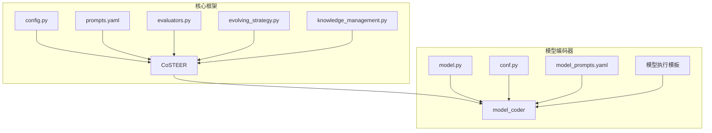
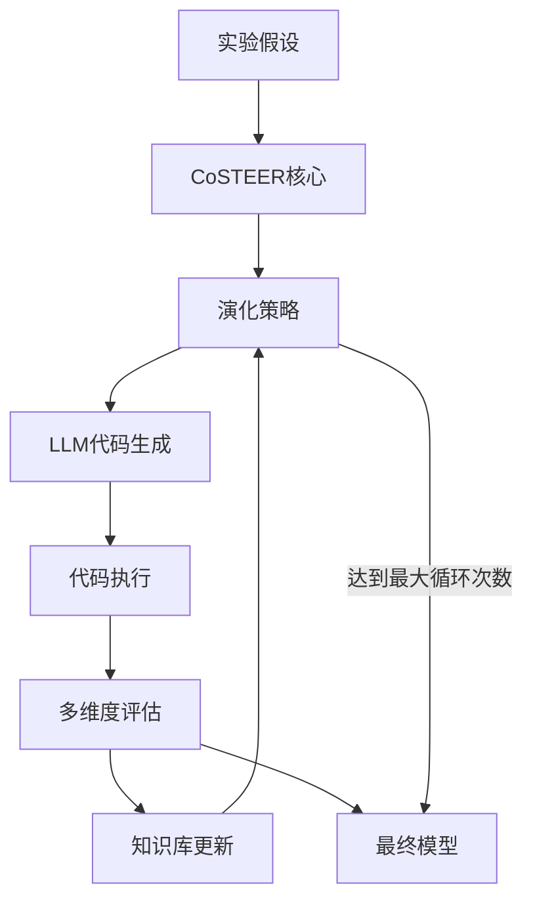
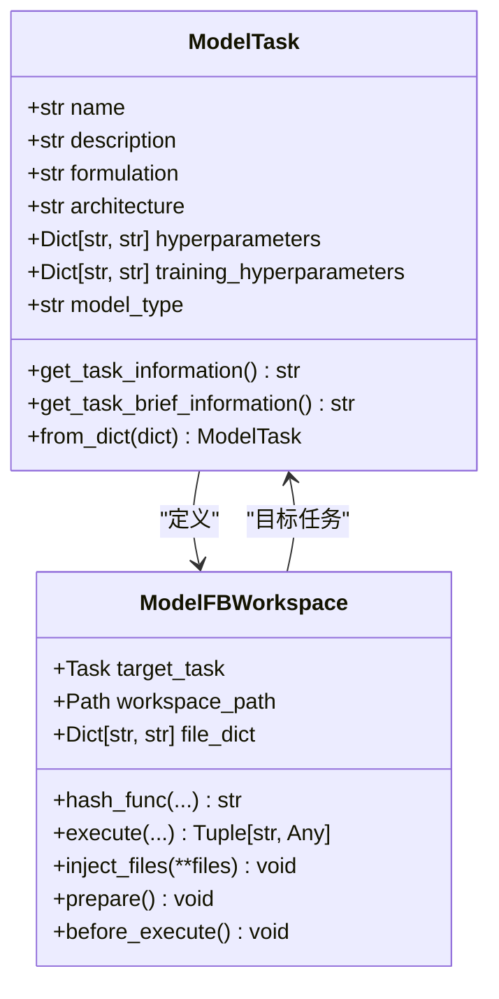
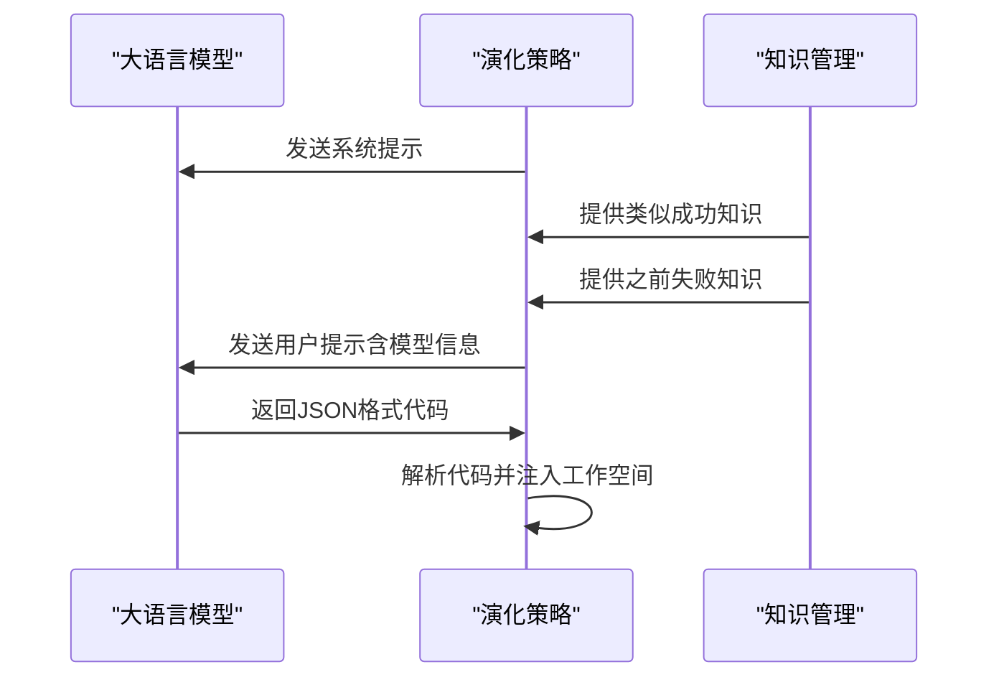
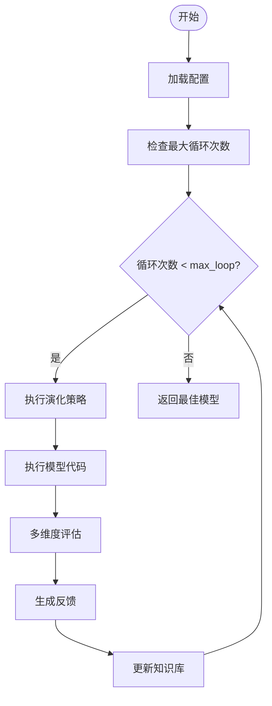
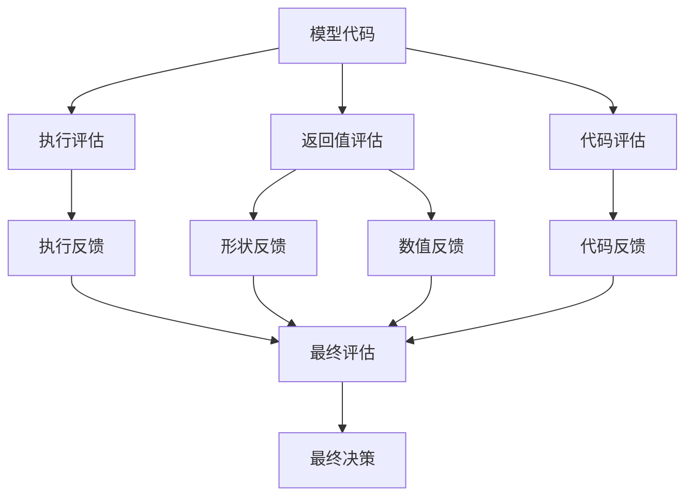
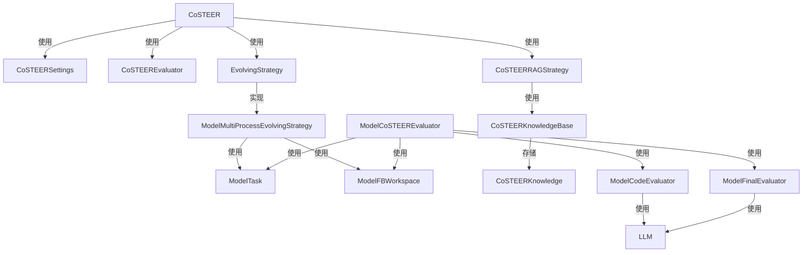

# 模型架构Coder

<cite>
**本文档引用的文件**
- [CoSTEER/__init__.py](file://rdagent/components/coder/CoSTEER/__init__.py)
- [CoSTEER/config.py](file://rdagent/components/coder/CoSTEER/config.py)
- [CoSTEER/prompts.yaml](file://rdagent/components/coder/CoSTEER/prompts.yaml)
- [model_coder/prompts.yaml](file://rdagent/components/coder/model_coder/prompts.yaml)
- [model_coder/model.py](file://rdagent/components/coder/model_coder/model.py)
- [model_coder/conf.py](file://rdagent/components/coder/model_coder/conf.py)
- [model_coder/evolving_strategy.py](file://rdagent/components/coder/model_coder/evolving_strategy.py)
- [model_coder/evaluators.py](file://rdagent/components/coder/model_coder/evaluators.py)
- [model_coder/model_execute_template_v1.txt](file://rdagent/components/coder/model_coder/model_execute_template_v1.txt)
- [model_coder/model_execute_template_v2.txt](file://rdagent/components/coder/model_coder/model_execute_template_v2.txt)
- [CoSTEER/knowledge_management.py](file://rdagent/components/coder/CoSTEER/knowledge_management.py)
- [model_coder/eva_utils.py](file://rdagent/components/coder/model_coder/eva_utils.py)
- [model_coder/one_shot/__init__.py](file://rdagent/components/coder/model_coder/one_shot/__init__.py)
</cite>

## 目录
1. [介绍](#介绍)
2. [项目结构](#项目结构)
3. [核心组件](#核心组件)
4. [架构概述](#架构概述)
5. [详细组件分析](#详细组件分析)
6. [依赖分析](#依赖分析)
7. [性能考虑](#性能考虑)
8. [故障排除指南](#故障排除指南)
9. [结论](#结论)

## 介绍
模型架构Coder（ModelCoSTEER）是一个基于实验假设生成机器学习或深度学习模型类的系统。该系统通过结合提示工程、知识管理和评估机制，实现从假设到完整模型类的自动化生成。本文档详细描述了ModelCoSTEER的实现细节，包括模型结构定义、超参数配置和训练逻辑。

## 项目结构
ModelCoSTEER的项目结构遵循模块化设计，主要包含以下几个核心目录：

- `components/coder/CoSTEER`: 核心框架，包含配置、评估、演化策略和知识管理
- `components/coder/model_coder`: 模型编码器专用组件，包含模型任务定义、执行模板和评估工具
- `components/coder/CoSTEER/prompts.yaml`: 提示工程配置文件，指导LLM生成符合规范的代码
- `components/coder/model_coder/prompts.yaml`: 模型编码器专用提示配置

该结构支持灵活的扩展，允许针对不同类型的编码任务（如因子编码、数据科学管道编码）实现专门的策略。

**图源**
- [CoSTEER/__init__.py](file://rdagent/components/coder/CoSTEER/__init__.py)
- [model_coder/model.py](file://rdagent/components/coder/model_coder/model.py)

## 核心组件
ModelCoSTEER的核心组件包括配置系统、演化策略、评估器和知识管理模块。这些组件协同工作，实现从实验假设到模型代码的完整生成流程。

**节源**
- [CoSTEER/__init__.py](file://rdagent/components/coder/CoSTEER/__init__.py)
- [CoSTEER/config.py](file://rdagent/components/coder/CoSTEER/config.py)

## 架构概述
ModelCoSTEER采用分层架构，包含以下主要组件：

1. **配置层**: 通过`CoSTEERSettings`和`ModelCoSTEERSettings`类管理所有配置参数
2. **核心引擎层**: `CoSTEER`类作为主要开发者，协调整个代码生成过程
3. **演化策略层**: `MultiProcessEvolvingStrategy`及其子类实现代码的迭代优化
4. **评估层**: `CoSTEEREvaluator`及其子类提供多维度的代码质量评估
5. **知识管理层**: `CoSTEERRAGStrategy`系列类实现知识的存储、检索和应用

该架构支持两种主要的模型执行环境：conda环境和Docker容器，通过`MODEL_COSTEER_SETTINGS.env_type`配置。

**图源**
- [CoSTEER/__init__.py](file://rdagent/components/coder/CoSTEER/__init__.py)
- [model_coder/evolving_strategy.py](file://rdagent/components/coder/model_coder/evolving_strategy.py)

## 详细组件分析

### 模型任务与工作空间分析
ModelCoSTEER通过`ModelTask`类定义模型任务，包含模型名称、描述、架构、超参数等关键信息。`ModelFBWorkspace`类作为工作空间，负责代码注入和执行。

`ModelTask`类的关键属性包括：
- `formulation`: 模型的数学公式表示
- `architecture`: 模型架构描述
- `hyperparameters`: 超参数配置
- `training_hyperparameters`: 训练超参数
- `model_type`: 模型类型（表格、时间序列、图或XGBoost）

`ModelFBWorkspace`通过`execute`方法在隔离环境中执行模型代码，支持两种接口版本：
- 版本1：适用于Qlib，通过导入`model_cls`进行初始化和验证
- 版本2：适用于Kaggle，通过调用`fit`和`predict`函数进行验证

**图源**
- [model_coder/model.py](file://rdagent/components/coder/model_coder/model.py)

**节源**
- [model_coder/model.py](file://rdagent/components/coder/model_coder/model.py)

### 提示工程分析
提示工程在ModelCoSTEER中起着关键作用，通过精心设计的提示模板指导LLM生成符合规范的模型代码。系统使用两个主要的提示配置文件：

1. `CoSTEER/prompts.yaml`: 包含组件分析的系统提示
2. `model_coder/prompts.yaml`: 包含模型生成、演化策略和评估的详细提示

`evolving_strategy_model_coder`提示模板是核心，它指导LLM基于以下信息生成代码：
- 目标模型信息（名称、描述、公式、架构等）
- 类似模型的正确代码示例
- 之前的失败代码及反馈
- 当前代码（如果存在）

该提示工程确保生成的代码与场景要求对齐，并且在90%以上与前一版本代码保持一致，只修改必要的部分。

**图源**
- [model_coder/prompts.yaml](file://rdagent/components/coder/model_coder/prompts.yaml)
- [model_coder/evolving_strategy.py](file://rdagent/components/coder/model_coder/evolving_strategy.py)

**节源**
- [model_coder/evolving_strategy.py](file://rdagent/components/coder/model_coder/evolving_strategy.py)

### 配置与约束分析
ModelCoSTEER通过`CoSTEERSettings`和`ModelCoSTEERSettings`类管理配置和约束。这些配置定义了模型搜索空间、框架支持和性能约束。

`CoSTEERSettings`包含以下关键配置：
- `max_loop`: 最大任务实现循环次数
- `fail_task_trial_limit`: 失败任务尝试限制
- `knowledge_base_path`: 知识库路径
- `new_knowledge_base_path`: 新知识库路径

`ModelCoSTEERSettings`扩展了基础配置，添加了模型专用设置：
- `env_type`: 执行环境类型（conda或docker）
- 各种查询限制和知识采样参数

这些配置共同定义了模型搜索空间，限制了可能的模型架构和超参数组合，确保生成的模型在性能和资源消耗方面符合要求。

**图源**
- [CoSTEER/config.py](file://rdagent/components/coder/CoSTEER/config.py)
- [model_coder/conf.py](file://rdagent/components/coder/model_coder/conf.py)

**节源**
- [CoSTEER/config.py](file://rdagent/components/coder/CoSTEER/config.py)

### 评估系统集成分析
ModelCoSTEER的评估系统采用多维度评估方法，通过`ModelCoSTEEREvaluator`类实现。评估过程包含四个主要方面：

1. **执行评估**: 检查代码是否能成功执行
2. **返回值评估**: 验证输出形状和数值是否正确
3. **代码评估**: 使用LLM分析代码质量
4. **最终决策评估**: 综合所有反馈做出最终决策

评估流程如下：
1. 使用固定输入（batch_size=8, num_features=30, num_timesteps=40）执行模型
2. 检查输出张量形状是否符合预期
3. 如果有真实模型，比较输出数值差异
4. 使用LLM分析代码是否符合模型描述和场景要求
5. 综合所有反馈做出最终决策

**图源**
- [model_coder/evaluators.py](file://rdagent/components/coder/model_coder/evaluators.py)
- [model_coder/eva_utils.py](file://rdagent/components/coder/model_coder/eva_utils.py)

**节源**
- [model_coder/evaluators.py](file://rdagent/components/coder/model_coder/evaluators.py)

## 依赖分析
ModelCoSTEER的组件之间存在复杂的依赖关系，形成了一个闭环的演化系统。

**图源**
- [CoSTEER/__init__.py](file://rdagent/components/coder/CoSTEER/__init__.py)
- [model_coder/evolving_strategy.py](file://rdagent/components/coder/model_coder/evolving_strategy.py)

**节源**
- [CoSTEER/__init__.py](file://rdagent/components/coder/CoSTEER/__init__.py)

## 性能考虑
ModelCoSTEER在设计时考虑了多个性能方面：

1. **并行处理**: 使用`multiprocessing_wrapper`实现多任务并行处理
2. **缓存机制**: 通过`cache_with_pickle`装饰器缓存执行结果
3. **超时控制**: 支持全局定时器和最大执行时间限制
4. **知识采样**: 通过`v2_knowledge_sampler`配置控制知识检索数量

系统还通过`max_seconds_multiplier`配置防止无限循环，并在达到最大时间限制时优雅地终止演化过程。

## 故障排除指南
当ModelCoSTEER遇到问题时，可以参考以下常见问题和解决方案：

1. **代码执行失败**: 检查`execution_feedback`中的错误信息，通常是语法错误或依赖缺失
2. **输出形状不匹配**: 验证模型架构是否正确实现，特别是输入输出维度
3. **数值差异过大**: 检查模型初始化和前向传播逻辑
4. **知识库加载失败**: 确保`knowledge_base_path`指向有效的知识库文件
5. **LLM响应格式错误**: 检查提示模板是否正确引导JSON输出

对于持续失败的任务，系统会在达到`fail_task_trial_limit`限制后自动跳过，避免无限循环。

**节源**
- [CoSTEER/__init__.py](file://rdagent/components/coder/CoSTEER/__init__.py)
- [model_coder/evaluators.py](file://rdagent/components/coder/model_coder/evaluators.py)

## 结论
ModelCoSTEER是一个完整的模型架构生成系统，通过结合提示工程、知识管理和多维度评估，实现了从实验假设到可执行模型代码的自动化转换。系统设计考虑了灵活性、可扩展性和性能，支持多种模型类型和执行环境。通过闭环的演化过程，ModelCoSTEER能够不断优化生成的模型，直到满足所有评估标准。