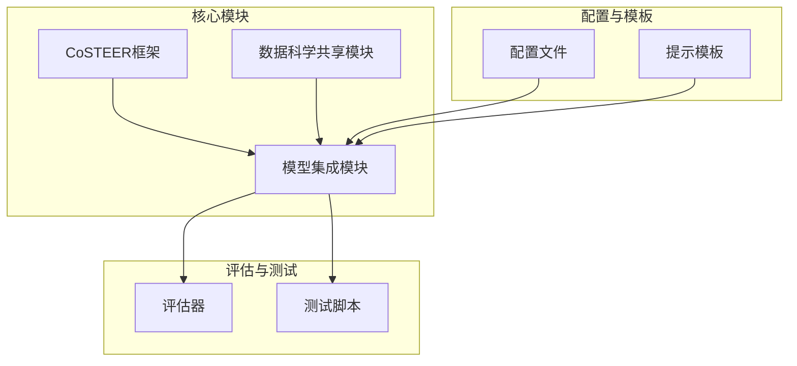
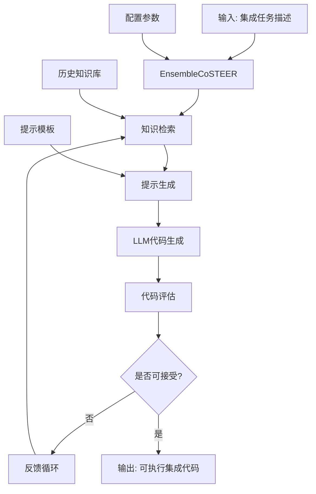
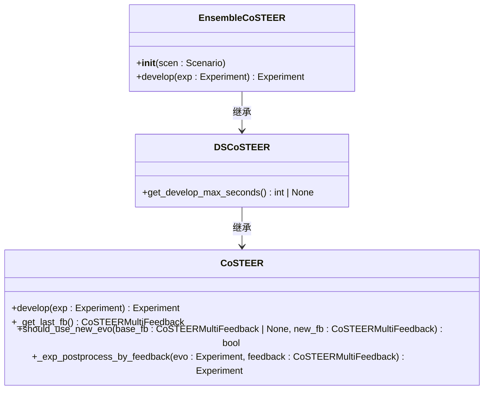
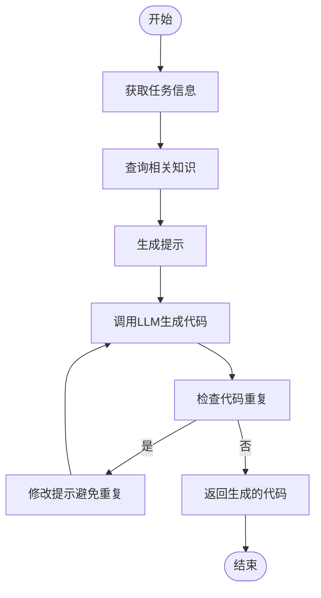
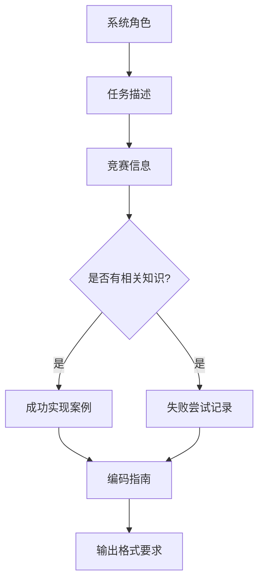
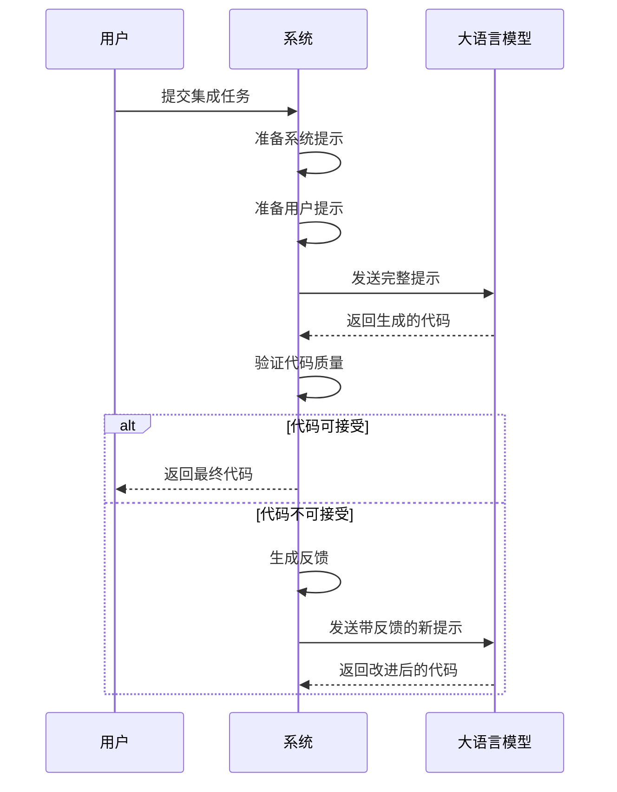
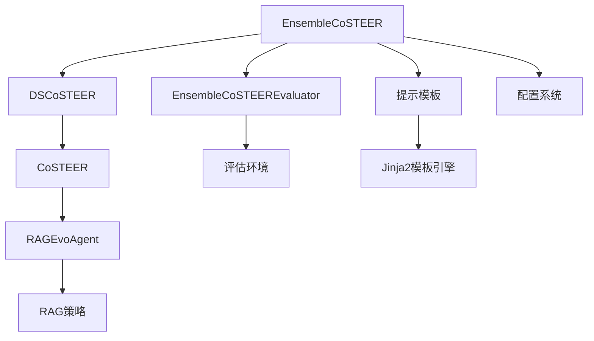

# 模型集成Coder

<cite>
**本文档中引用的文件**  
- [__init__.py](file://rdagent/components/coder/CoSTEER/__init__.py)
- [config.py](file://rdagent/components/coder/CoSTEER/config.py)
- [prompts.yaml](file://rdagent/components/coder/CoSTEER/prompts.yaml)
- [ensemble/__init__.py](file://rdagent/components/coder/data_science/ensemble/__init__.py)
- [ensemble/exp.py](file://rdagent/components/coder/data_science/ensemble/exp.py)
- [ensemble/eval.py](file://rdagent/components/coder/data_science/ensemble/eval.py)
- [ensemble/prompts.yaml](file://rdagent/components/coder/data_science/ensemble/prompts.yaml)
- [ensemble/test.py](file://rdagent/components/coder/data_science/ensemble/test.py)
- [ds_costeer.py](file://rdagent/components/coder/data_science/share/ds_costeer.py)
- [aerial-cactus-identification/ensemble.py](file://rdagent/scenarios/kaggle/tpl_ex/aerial-cactus-identification/ensemble.py)
- [aerial-cactus-identification/main.py](file://rdagent/scenarios/kaggle/tpl_ex/aerial-cactus-identification/main.py)
</cite>

## 目录
1. [简介](#简介)
2. [项目结构](#项目结构)
3. [核心组件](#核心组件)
4. [架构概述](#架构概述)
5. [详细组件分析](#详细组件分析)
6. [依赖分析](#依赖分析)
7. [性能考虑](#性能考虑)
8. [故障排除指南](#故障排除指南)
9. [结论](#结论)

## 简介
模型集成Coder（EnsembleCoSTEER）是RD-Agent框架中的一个关键组件，专门用于自动生成机器学习模型集成策略的代码。该系统通过结合大语言模型（LLM）与知识管理机制，能够智能地生成多种集成方法的实现代码，包括投票法、堆叠法和加权平均等。EnsembleCoSTEER利用提示模板引导LLM理解基础模型之间的兼容性与组合逻辑，并通过配置文件灵活设定集成方法选择、基模型管理、权重优化和性能监控等参数。整个流程从集成假设开始，经过多轮演化和评估，最终生成可执行的集成模型代码，并与评估系统形成闭环反馈机制，确保生成代码的质量和有效性。

## 项目结构
模型集成Coder的项目结构遵循模块化设计原则，将不同功能分离到独立的目录中。核心功能位于`rdagent/components/coder/data_science/ensemble`目录下，包含初始化脚本、配置文件、实验定义、评估器和提示模板等。系统通过继承CoSTEER框架的基础能力，实现了针对数据科学场景的特定功能扩展。配置和参数管理通过独立的配置文件实现，而提示模板则用于指导LLM生成符合要求的代码。测试文件提供了验证系统功能的示例，确保各组件按预期工作。

**图源**  
- [__init__.py](file://rdagent/components/coder/CoSTEER/__init__.py)
- [ensemble/__init__.py](file://rdagent/components/coder/data_science/ensemble/__init__.py)
- [config.py](file://rdagent/components/coder/CoSTEER/config.py)
- [prompts.yaml](file://rdagent/components/coder/data_science/ensemble/prompts.yaml)

**本节来源**  
- [__init__.py](file://rdagent/components/coder/CoSTEER/__init__.py)
- [ensemble/__init__.py](file://rdagent/components/coder/data_science/ensemble/__init__.py)

## 核心组件
模型集成Coder的核心组件包括EnsembleCoSTEER类、EnsembleTask类、EnsembleCoSTEEREvaluator类以及相关的提示模板系统。EnsembleCoSTEER作为主要的开发者类，负责协调整个代码生成过程，它继承自CoSTEER框架并针对数据科学场景进行了定制化。EnsembleTask类定义了集成任务的具体内容和要求，为代码生成提供了上下文信息。EnsembleCoSTEEREvaluator类负责对生成的代码进行多维度评估，包括执行结果、返回值检查和代码质量等方面。提示模板系统则通过精心设计的系统提示和用户提示，引导LLM生成符合规范的集成代码。

**本节来源**  
- [ensemble/__init__.py](file://rdagent/components/coder/data_science/ensemble/__init__.py)
- [ensemble/exp.py](file://rdagent/components/coder/data_science/ensemble/exp.py)
- [ensemble/eval.py](file://rdagent/components/coder/data_science/ensemble/eval.py)
- [ensemble/prompts.yaml](file://rdagent/components/coder/data_science/ensemble/prompts.yaml)

## 架构概述
模型集成Coder采用分层架构设计，底层是CoSTEER框架提供的通用代码生成能力，中层是针对数据科学场景的特定实现，顶层是具体的集成策略生成逻辑。系统通过RAGEvoAgent实现多步演化过程，每一步都结合知识检索（RAG）和反馈评估来优化生成的代码。知识管理机制允许系统从历史成功案例中学习，并避免重复过去的错误。整个架构支持灵活的配置选项，可以根据不同竞赛的需求调整行为参数。

**图源**  
- [__init__.py](file://rdagent/components/coder/CoSTEER/__init__.py)
- [ensemble/__init__.py](file://rdagent/components/coder/data_science/ensemble/__init__.py)
- [ensemble/eval.py](file://rdagent/components/coder/data_science/ensemble/eval.py)

## 详细组件分析

### EnsembleCoSTEER类分析
EnsembleCoSTEER类是模型集成Coder的核心实现，它通过继承DSCoSTEER类获得了基本的代码生成能力，并针对集成任务进行了专门的定制。该类在初始化时设置了特定的评估器（EnsembleCoSTEEREvaluator）和演化策略（EnsembleMultiProcessEvolvingStrategy），确保生成过程符合数据科学项目的特殊要求。

#### 类图

**图源**  
- [ensemble/__init__.py](file://rdagent/components/coder/data_science/ensemble/__init__.py)
- [ds_costeer.py](file://rdagent/components/coder/data_science/share/ds_costeer.py)
- [__init__.py](file://rdagent/components/coder/CoSTEER/__init__.py)

#### 演化策略分析
EnsembleMultiProcessEvolvingStrategy类实现了具体的代码生成逻辑，它通过以下步骤引导LLM生成高质量的集成代码：

**图源**  
- [ensemble/__init__.py](file://rdagent/components/coder/data_science/ensemble/__init__.py)

**本节来源**  
- [ensemble/__init__.py](file://rdagent/components/coder/data_science/ensemble/__init__.py)

### 提示模板系统分析
提示模板系统是引导LLM生成正确代码的关键机制，它通过结构化的系统提示和用户提示为LLM提供充分的上下文信息。

#### 系统提示结构

**图源**  
- [ensemble/prompts.yaml](file://rdagent/components/coder/data_science/ensemble/prompts.yaml)

#### 用户提示流程

**图源**  
- [ensemble/prompts.yaml](file://rdagent/components/coder/data_science/ensemble/prompts.yaml)

**本节来源**  
- [ensemble/prompts.yaml](file://rdagent/components/coder/data_science/ensemble/prompts.yaml)

## 依赖分析
模型集成Coder的依赖关系呈现出清晰的层次结构，底层是通用的CoSTEER框架，中层是数据科学共享模块，上层是具体的集成实现。这种设计实现了良好的关注点分离，使得各个组件可以独立开发和测试。系统依赖于外部的LLM服务进行代码生成，同时依赖于本地的执行环境来验证生成代码的正确性。

**图源**  
- [__init__.py](file://rdagent/components/coder/CoSTEER/__init__.py)
- [ensemble/__init__.py](file://rdagent/components/coder/data_science/ensemble/__init__.py)
- [ds_costeer.py](file://rdagent/components/coder/data_science/share/ds_costeer.py)

**本节来源**  
- [__init__.py](file://rdagent/components/coder/CoSTEER/__init__.py)
- [ensemble/__init__.py](file://rdagent/components/coder/data_science/ensemble/__init__.py)
- [ds_costeer.py](file://rdagent/components/coder/data_science/share/ds_costeer.py)

## 性能考虑
模型集成Coder在性能方面进行了多项优化设计。首先，系统通过知识缓存机制避免重复的计算和LLM调用，提高了整体效率。其次，配置中的`max_loop`参数限制了最大迭代次数，防止无限循环。此外，`max_seconds_multiplier`参数结合场景的调试超时设置，为代码生成过程提供了时间保障。系统还支持文件锁机制（通过`enable_filelock`参数控制），在多进程环境下保证数据一致性。

## 故障排除指南
当模型集成Coder遇到问题时，可以从以下几个方面进行排查：

1. **检查配置参数**：确认`max_loop`、`max_seconds_multiplier`等关键参数设置合理
2. **验证知识库路径**：确保`knowledge_base_path`和`new_knowledge_base_path`指向正确的目录
3. **审查提示模板**：检查`prompts.yaml`文件中的模板是否完整且语法正确
4. **查看日志输出**：通过系统日志了解代码生成过程中的详细信息
5. **测试基础环境**：确保LLM服务和代码执行环境正常工作

**本节来源**  
- [config.py](file://rdagent/components/coder/CoSTEER/config.py)
- [ensemble/__init__.py](file://rdagent/components/coder/data_science/ensemble/__init__.py)
- [__init__.py](file://rdagent/components/coder/CoSTEER/__init__.py)

## 结论
模型集成Coder（EnsembleCoSTEER）是一个功能强大且设计精巧的系统，它成功地将大语言模型的能力与结构化的软件工程实践相结合。通过分层架构设计、知识驱动的演化策略和闭环反馈机制，系统能够高效地生成高质量的模型集成代码。该系统不仅支持常见的集成方法如投票法和加权平均，还能根据具体任务需求灵活调整生成策略。未来的工作可以进一步扩展支持的集成算法种类，优化知识检索效率，并增强对复杂集成场景的支持能力。