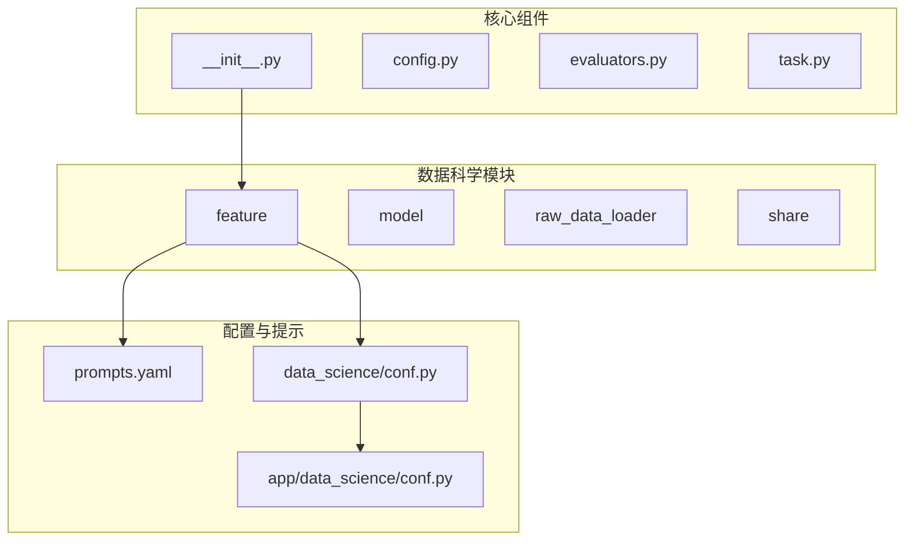
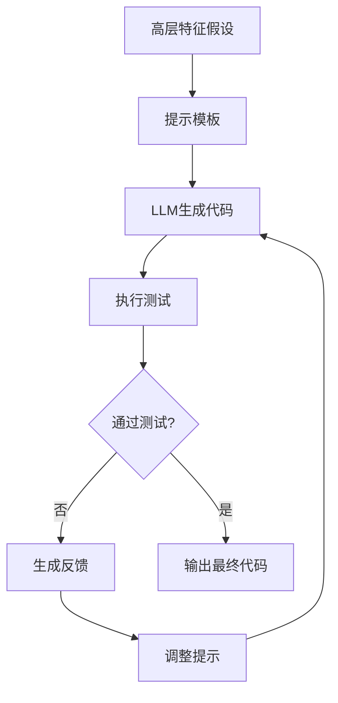
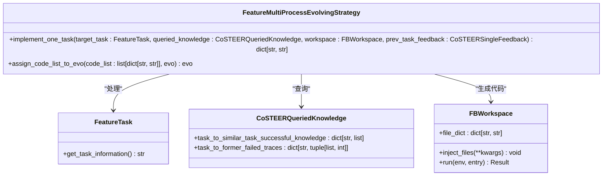
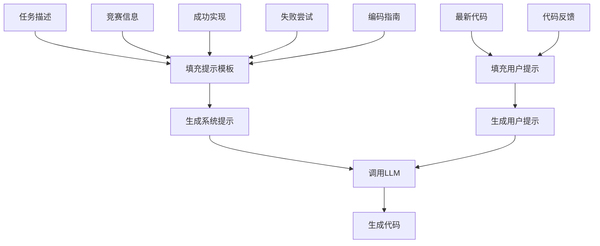
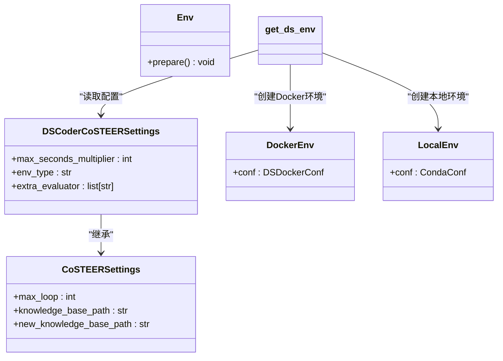
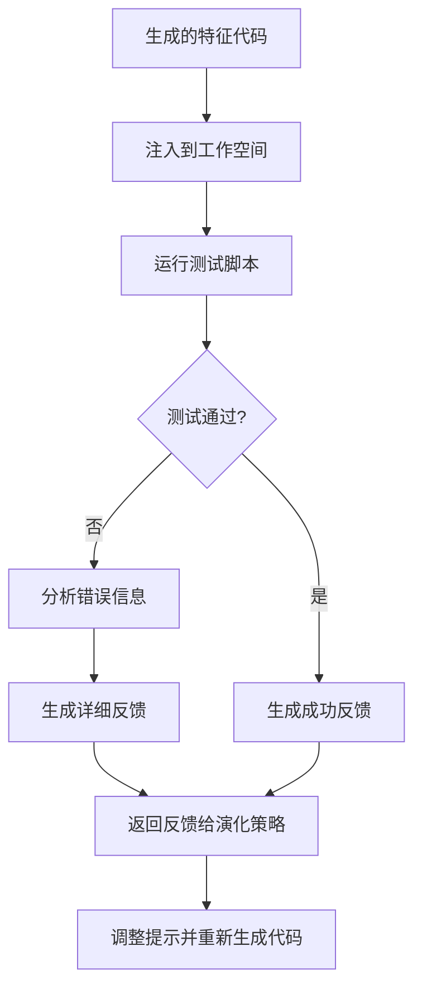
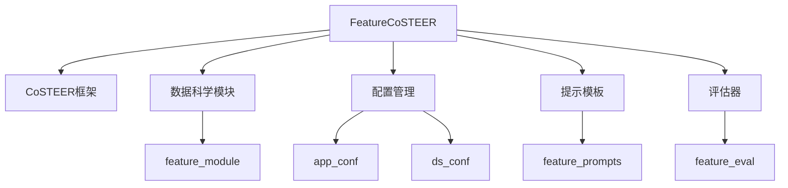

# 特征工程Coder

<cite>
**本文档中引用的文件**  
- [CoSTEER/__init__.py](file://rdagent\components\coder\CoSTEER\__init__.py)
- [CoSTEER/config.py](file://rdagent\components\coder\CoSTEER\config.py)
- [CoSTEER/prompts.yaml](file://rdagent\components\coder\CoSTEER\prompts.yaml)
- [CoSTEER/evaluators.py](file://rdagent\components\coder\CoSTEER\evaluators.py)
- [CoSTEER/task.py](file://rdagent\components\coder\CoSTEER\task.py)
- [data_science/share/ds_costeer.py](file://rdagent\components\coder\data_science\share\ds_costeer.py)
- [data_science/share/util.py](file://rdagent\components\coder\data_science\share\util.py)
- [data_science/feature/__init__.py](file://rdagent\components\coder\data_science\feature\__init__.py)
- [data_science/feature/prompts.yaml](file://rdagent\components\coder\data_science\feature\prompts.yaml)
- [data_science/feature/exp.py](file://rdagent\components\coder\data_science\feature\exp.py)
- [data_science/feature/eval.py](file://rdagent\components\coder\data_science\feature\eval.py)
- [data_science/feature/test.py](file://rdagent\components\coder\data_science\feature\test.py)
- [data_science/conf.py](file://rdagent\components\coder\data_science\conf.py)
- [app/data_science/conf.py](file://rdagent\app\data_science\conf.py)
- [data_science/feature/eval_tests/feature_test.txt](file://rdagent\components\coder\data_science\feature\eval_tests\feature_test.txt)
</cite>

## 目录
1. [引言](#引言)
2. [项目结构](#项目结构)
3. [核心组件](#核心组件)
4. [架构概述](#架构概述)
5. [详细组件分析](#详细组件分析)
6. [依赖分析](#依赖分析)
7. [性能考虑](#性能考虑)
8. [故障排除指南](#故障排除指南)
9. [结论](#结论)

## 引言
特征工程Coder（FeatureCoSTEER）是RD-Agent框架中的一个关键组件，专门负责将高层特征假设转化为具体的特征提取代码。该系统通过结合大语言模型（LLM）和自动化评估机制，实现了从特征假设到可执行代码的端到端自动化。本文档深入探讨了FeatureCoSTEER如何实现数值变换、类别编码、时间序列特征生成等特征工程任务，以及其特有的提示模板设计如何引导LLM生成高质量的特征代码。同时，文档还详细描述了配置文件中关于特征搜索空间、预处理规则和约束条件的设置，并通过实际代码示例展示了从假设到生成特征函数的完整流程。

## 项目结构
特征工程Coder的项目结构遵循模块化设计原则，主要分为核心组件、数据科学专用模块和配置管理三个部分。核心组件位于`rdagent/components/coder/CoSTEER`目录下，包含了CoSTEER框架的基础类和配置。数据科学专用模块位于`rdagent/components/coder/data_science`目录下，其中`feature`子模块专门处理特征工程任务。配置管理分散在多个文件中，包括`conf.py`和`prompts.yaml`，用于定义系统行为和提示模板。



**Diagram sources**
- [CoSTEER/__init__.py](file://rdagent\components\coder\CoSTEER\__init__.py)
- [data_science/feature/__init__.py](file://rdagent\components\coder\data_science\feature\__init__.py)
- [data_science/feature/prompts.yaml](file://rdagent\components\coder\data_science\feature\prompts.yaml)
- [data_science/conf.py](file://rdagent\components\coder\data_science\conf.py)
- [app/data_science/conf.py](file://rdagent\app\data_science\conf.py)

**Section sources**
- [CoSTEER/__init__.py](file://rdagent\components\coder\CoSTEER\__init__.py)
- [data_science/feature/__init__.py](file://rdagent\components\coder\data_science\feature\__init__.py)

## 核心组件
特征工程Coder的核心组件主要包括`CoSTEER`基类、`FeatureCoSTEER`子类、`FeatureTask`任务类和`FeatureCoSTEEREvaluator`评估器。`CoSTEER`基类定义了代码生成和演化的通用框架，而`FeatureCoSTEER`则继承并扩展了这一框架以适应特征工程的特定需求。`FeatureTask`类代表一个特征工程任务，包含了任务描述和相关信息。`FeatureCoSTEEREvaluator`负责评估生成的特征代码的质量，通过执行测试脚本并分析输出来提供反馈。

**Section sources**
- [CoSTEER/__init__.py](file://rdagent\components\coder\CoSTEER\__init__.py)
- [data_science/feature/__init__.py](file://rdagent\components\coder\data_science\feature\__init__.py)
- [data_science/feature/exp.py](file://rdagent\components\coder\data_science\feature\exp.py)
- [data_science/feature/eval.py](file://rdagent\components\coder\data_science\feature\eval.py)

## 架构概述
特征工程Coder的架构基于CoSTEER框架，采用了一种迭代演化的开发模式。系统首先接收一个高层特征假设，然后通过提示模板引导LLM生成初始的特征提取代码。生成的代码随后被提交到评估器进行测试，评估器会执行代码并分析其输出，提供详细的反馈。根据反馈，系统会调整提示并再次调用LLM生成改进后的代码，这一过程会重复进行，直到生成的代码通过所有测试或达到最大迭代次数。



**Diagram sources**
- [CoSTEER/__init__.py](file://rdagent\components\coder\CoSTEER\__init__.py)
- [data_science/feature/__init__.py](file://rdagent\components\coder\data_science\feature\__init__.py)
- [data_science/feature/eval.py](file://rdagent\components\coder\data_science\feature\eval.py)

## 详细组件分析

### 特征工程分析
特征工程Coder的核心功能是将高层特征假设转化为具体的特征提取代码。这包括数值变换（如标准化、归一化）、类别编码（如独热编码、标签编码）和时间序列特征生成（如滑动窗口统计、傅里叶变换）。系统通过`FeatureMultiProcessEvolvingStrategy`类实现这一过程，该类定义了如何根据任务描述、数据加载代码和先前的知识生成新的特征代码。



**Diagram sources**
- [data_science/feature/__init__.py](file://rdagent\components\coder\data_science\feature\__init__.py)
- [data_science/feature/exp.py](file://rdagent\components\coder\data_science\feature\exp.py)
- [CoSTEER/knowledge_management.py](file://rdagent\components\coder\CoSTEER\knowledge_management.py)
- [core/experiment.py](file://rdagent\core\experiment.py)

#### 提示模板设计
特征工程Coder使用`prompts.yaml`文件中的提示模板来引导LLM生成高质量的特征代码。提示模板包含了任务描述、竞赛信息、相关知识（包括成功的实现和先前的失败尝试）以及编码指南。系统会根据当前任务的具体情况动态填充这些模板，确保LLM能够获得足够的上下文信息来生成合适的代码。



**Diagram sources**
- [data_science/feature/prompts.yaml](file://rdagent\components\coder\data_science\feature\prompts.yaml)
- [data_science/feature/__init__.py](file://rdagent\components\coder\data_science\feature\__init__.py)

#### 配置文件设置
配置文件`conf.py`定义了特征工程Coder的行为和约束条件。`DSCoderCoSTEERSettings`类继承自`CoSTEERSettings`，并添加了数据科学特定的配置项，如环境类型、额外评估器和超时倍数。`get_ds_env`函数根据配置返回适当的环境实例，支持Docker和Conda两种环境类型。



**Diagram sources**
- [data_science/conf.py](file://rdagent\components\coder\data_science\conf.py)
- [CoSTEER/config.py](file://rdagent\components\coder\CoSTEER\config.py)
- [app/data_science/conf.py](file://rdagent\app\data_science\conf.py)

#### 从假设到代码的完整流程
从高层特征假设到生成特征函数的完整流程包括以下几个步骤：首先，系统创建一个`FeatureTask`实例，代表要解决的特征工程任务。然后，`FeatureCoSTEER`实例调用`develop`方法，启动代码生成和演化过程。在每次迭代中，`FeatureMultiProcessEvolvingStrategy`会根据当前任务和先前的知识生成一个新的提示，并调用LLM生成代码。生成的代码被注入到工作空间中，并由`FeatureCoSTEEREvaluator`进行评估。如果代码未能通过评估，系统会根据反馈调整提示并重复生成过程，直到生成的代码通过所有测试。

```mermaid
sequenceDiagram
participant 用户 as 用户
participant FeatureCoSTEER as FeatureCoSTEER
participant EvolvingStrategy as FeatureMultiProcessEvolvingStrategy
participant LLM as 大语言模型
participant Evaluator as FeatureCoSTEEREvaluator
用户->>FeatureCoSTEER : 创建FeatureTask
FeatureCoSTEER->>FeatureCoSTEER : 调用develop方法
loop 迭代演化
FeatureCoSTEER->>EvolvingStrategy : 调用implement_one_task
EvolvingStrategy->>EvolvingStrategy : 构建系统和用户提示
EvolvingStrategy->>LLM : 发送提示并获取代码
LLM-->>EvolvingStrategy : 返回生成的代码
EvolvingStrategy-->>FeatureCoSTEER : 返回代码
FeatureCoSTEER->>Evaluator : 调用evaluate进行评估
Evaluator->>Evaluator : 执行测试脚本
Evaluator->>Evaluator : 分析输出
Evaluator->>Evaluator : 生成反馈
Evaluator-->>FeatureCoSTEER : 返回反馈
alt 代码通过测试
FeatureCoSTEER->>用户 : 返回最终代码
break
else 代码未通过测试
FeatureCoSTEER->>EvolvingStrategy : 提供反馈并继续迭代
end
end
```

**Diagram sources**
- [data_science/feature/__init__.py](file://rdagent\components\coder\data_science\feature\__init__.py)
- [data_science/feature/eval.py](file://rdagent\components\coder\data_science\feature\eval.py)
- [CoSTEER/__init__.py](file://rdagent\components\coder\CoSTEER\__init__.py)

#### 与评估器的集成
特征工程Coder与评估器的集成是通过`FeatureCoSTEEREvaluator`类实现的。该类负责执行生成的特征代码，并根据测试结果提供反馈。评估过程包括运行一个预定义的测试脚本（`feature_test.txt`），该脚本会调用特征工程代码并验证其输出。评估器会捕获测试脚本的输出，并将其与预期结果进行比较。如果测试失败，评估器会分析错误信息，并生成详细的反馈，指导LLM如何改进代码。



**Diagram sources**
- [data_science/feature/eval.py](file://rdagent\components\coder\data_science\feature\eval.py)
- [data_science/feature/eval_tests/feature_test.txt](file://rdagent\components\coder\data_science\feature\eval_tests\feature_test.txt)

**Section sources**
- [data_science/feature/__init__.py](file://rdagent\components\coder\data_science\feature\__init__.py)
- [data_science/feature/prompts.yaml](file://rdagent\components\coder\data_science\feature\prompts.yaml)
- [data_science/feature/exp.py](file://rdagent\components\coder\data_science\feature\exp.py)
- [data_science/feature/eval.py](file://rdagent\components\coder\data_science\feature\eval.py)
- [data_science/feature/test.py](file://rdagent\components\coder\data_science\feature\test.py)
- [data_science/conf.py](file://rdagent\components\coder\data_science\conf.py)
- [app/data_science/conf.py](file://rdagent\app\data_science\conf.py)

## 依赖分析
特征工程Coder的依赖关系复杂，涉及多个模块和外部库。核心依赖包括CoSTEER框架、数据科学专用模块、配置管理、提示模板和评估器。CoSTEER框架提供了代码生成和演化的基础结构，数据科学专用模块实现了特征工程的具体功能，配置管理定义了系统行为，提示模板指导LLM生成代码，评估器验证代码的正确性。



**Diagram sources**
- [CoSTEER/__init__.py](file://rdagent\components\coder\CoSTEER\__init__.py)
- [data_science/feature/__init__.py](file://rdagent\components\coder\data_science\feature\__init__.py)
- [data_science/conf.py](file://rdagent\components\coder\data_science\conf.py)
- [app/data_science/conf.py](file://rdagent\app\data_science\conf.py)
- [data_science/feature/prompts.yaml](file://rdagent\components\coder\data_science\feature\prompts.yaml)
- [data_science/feature/eval.py](file://rdagent\components\coder\data_science\feature\eval.py)

## 性能考虑
特征工程Coder的性能主要受LLM调用次数、代码执行时间和内存使用的影响。为了优化性能，系统采用了多种策略，包括使用缓存避免重复的LLM调用、限制最大迭代次数以防止无限循环，以及使用多进程策略并行处理多个任务。此外，配置文件中的`max_seconds_multiplier`参数可以控制代码执行的超时时间，防止长时间运行的任务影响整体性能。

## 故障排除指南
在使用特征工程Coder时，可能会遇到各种问题，如LLM生成的代码无法通过测试、代码执行超时或环境配置错误。对于这些问题，可以采取以下措施进行排查：检查提示模板是否提供了足够的上下文信息，确保测试脚本能够正确验证代码的输出，调整超时时间以适应更复杂的任务，以及验证环境配置是否正确。此外，查看评估器生成的反馈可以帮助理解代码失败的原因，并指导如何改进提示或代码。

**Section sources**
- [data_science/feature/eval.py](file://rdagent\components\coder\data_science\feature\eval.py)
- [CoSTEER/config.py](file://rdagent\components\coder\CoSTEER\config.py)
- [app/data_science/conf.py](file://rdagent\app\data_science\conf.py)

## 结论
特征工程Coder（FeatureCoSTEER）是一个强大的自动化特征工程工具，它通过结合大语言模型和自动化评估机制，实现了从高层特征假设到具体特征提取代码的端到端自动化。系统的设计充分考虑了灵活性和可扩展性，允许用户通过配置文件和提示模板自定义其行为。通过深入理解其架构和工作流程，用户可以更有效地利用这一工具来加速数据科学项目的开发过程。