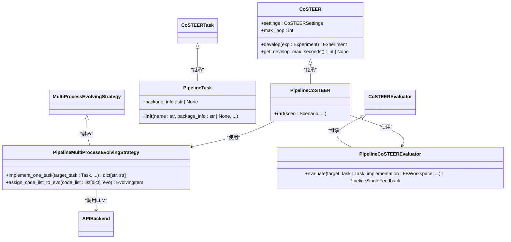
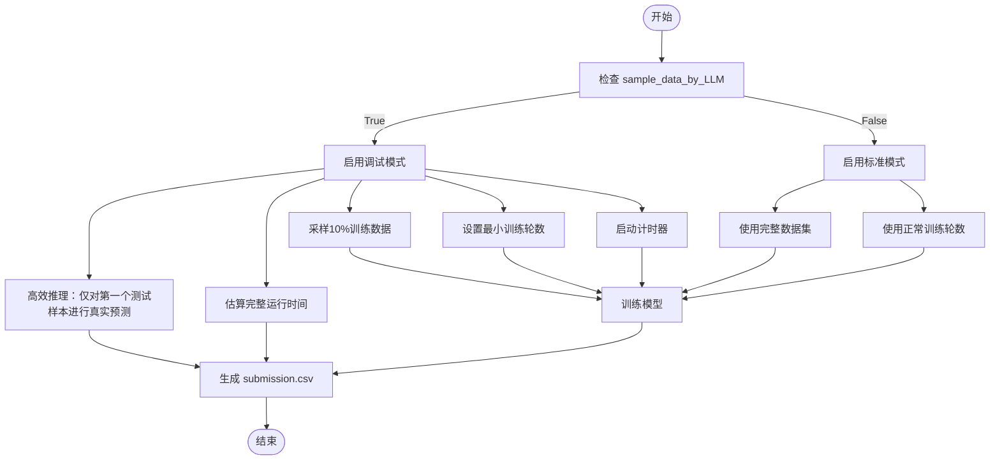
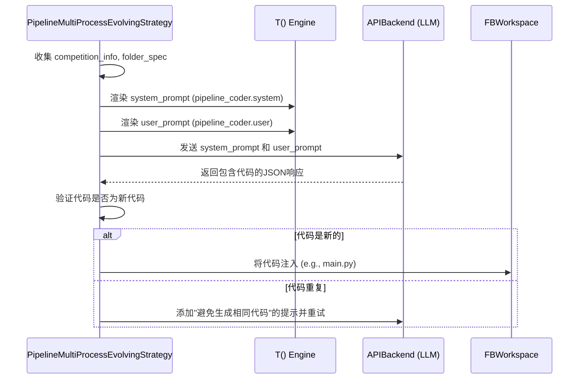
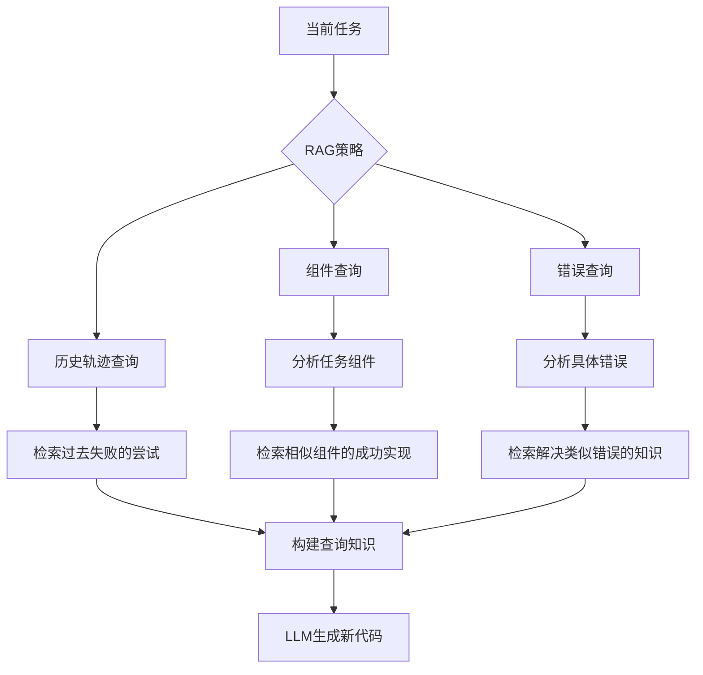
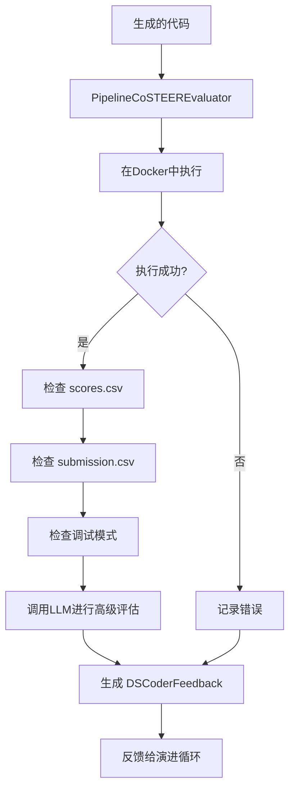
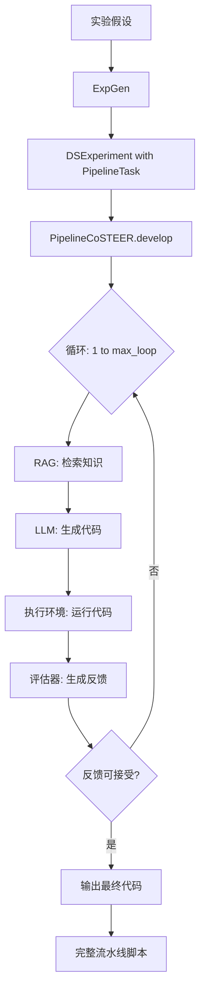

# 端到端流水线Coder

<cite>
**本文档中引用的文件**  
- [__init__.py](file://rdagent\components\coder\CoSTEER\__init__.py)
- [config.py](file://rdagent\components\coder\CoSTEER\config.py)
- [task.py](file://rdagent\components\coder\CoSTEER\task.py)
- [evolving_strategy.py](file://rdagent\components\coder\CoSTEER\evolving_strategy.py)
- [knowledge_management.py](file://rdagent\components\coder\CoSTEER\knowledge_management.py)
- [prompts.yaml](file://rdagent\components\coder\CoSTEER\prompts.yaml)
- [pipeline\__init__.py](file://rdagent\components\coder\data_science\pipeline\__init__.py)
- [pipeline\exp.py](file://rdagent\components\coder\data_science\pipeline\exp.py)
- [pipeline\prompts.yaml](file://rdagent\components\coder\data_science\pipeline\prompts.yaml)
- [pipeline\eval.py](file://rdagent\components\coder\data_science\pipeline\eval.py)
- [conf.py](file://rdagent\components\coder\data_science\conf.py)
- [ds_costeer.py](file://rdagent\components\coder\data_science\share\ds_costeer.py)
- [loop.py](file://rdagent\scenarios\data_science\loop.py)
</cite>

## 目录
1. [引言](#引言)
2. [核心架构与设计](#核心架构与设计)
3. [配置系统与执行模式](#配置系统与执行模式)
4. [提示模板与数据流](#提示模板与数据流)
5. [知识管理与RAG策略](#知识管理与rag策略)
6. [评估与反馈机制](#评估与反馈机制)
7. [端到端工作流](#端到端工作流)
8. [结论](#结论)

## 引言

端到端流水线Coder（PipelineCoSTEER）是RD-Agent框架中的一个核心组件，旨在自动化生成完整的机器学习流水线代码。它通过整合特征工程、模型训练和预测等环节，将实验假设转化为可执行的pipeline脚本。本文档将深入阐述其设计与实现，说明其如何通过特有的提示模板协调多个组件的调用顺序和数据流传递，并解释配置项对流水线阶段划分、依赖管理和执行模式的控制作用。

**Section sources**
- [__init__.py](file://rdagent\components\coder\CoSTEER\__init__.py#L1-L176)
- [pipeline\__init__.py](file://rdagent\components\coder\data_science\pipeline\__init__.py#L0-L165)

## 核心架构与设计

PipelineCoSTEER的设计基于CoSTEER框架，该框架提供了一个通用的代码生成和演进的基础设施。PipelineCoSTEER通过继承和扩展CoSTEER的核心类，实现了针对数据科学流水线的特定功能。

其核心架构由以下几个关键部分组成：
1.  **开发者（Developer）**: `CoSTEER`类是所有代码生成器的基类，它定义了`develop`方法，负责驱动整个代码生成和演进的循环。
2.  **任务（Task）**: `PipelineTask`类继承自`CoSTEERTask`，代表一个需要生成完整流水线的任务。它包含了任务的描述和可选的包信息。
3.  **演进策略（Evolving Strategy）**: `PipelineMultiProcessEvolvingStrategy`类继承自`MultiProcessEvolvingStrategy`，定义了如何实现单个`PipelineTask`。它负责调用大语言模型（LLM）生成代码，并将结果应用到工作空间。
4.  **评估器（Evaluator）**: `PipelineCoSTEEREvaluator`负责对生成的代码进行评估，检查其执行、输出和代码质量，并给出反馈。

**Diagram sources**
- [__init__.py](file://rdagent\components\coder\CoSTEER\__init__.py#L1-L176)
- [pipeline\__init__.py](file://rdagent\components\coder\data_science\pipeline\__init__.py#L0-L165)
- [pipeline\exp.py](file://rdagent\components\coder\data_science\pipeline\exp.py#L0-L8)
- [evolving_strategy.py](file://rdagent\components\coder\CoSTEER\evolving_strategy.py#L0-L134)
- [eval.py](file://rdagent\components\coder\data_science\pipeline\eval.py#L0-L348)

**Section sources**
- [__init__.py](file://rdagent\components\coder\CoSTEER\__init__.py#L1-L176)
- [pipeline\__init__.py](file://rdagent\components\coder\data_science\pipeline\__init__.py#L0-L165)
- [pipeline\exp.py](file://rdagent\components\coder\data_science\pipeline\exp.py#L0-L8)
- [evolving_strategy.py](file://rdagent\components\coder\CoSTEER\evolving_strategy.py#L0-L134)
- [eval.py](file://rdagent\components\coder\data_science\pipeline\eval.py#L0-L348)

## 配置系统与执行模式

PipelineCoSTEER的执行行为由一个分层的配置系统精确控制。这个系统允许用户和框架本身对流水线的各个方面进行微调。

### 配置项

核心配置由`CoSTEERSettings`和`DSCoderCoSTEERSettings`两个类定义，它们通过环境变量前缀（如`CoSTEER_`和`DS_Coder_CoSTEER_`）从外部加载配置。

关键配置项包括：
- **`max_loop`**: 定义了代码生成和演进的最大循环次数，防止无限循环。
- **`env_type`**: 指定执行环境的类型，如`docker`或`conda`，确保代码在隔离且一致的环境中运行。
- **`enable_model_dump` 和 `sample_data_by_LLM`**: 这两个布尔标志控制着执行模式。`enable_model_dump`启用模型持久化，而`sample_data_by_LLM`则启用调试模式。
- **`max_seconds_multiplier`**: 用于计算开发阶段的最大超时时间，是场景调试超时时间的倍数。

### 执行模式

PipelineCoSTEER支持两种主要的执行模式：

1.  **标准模式**: 在此模式下，代码使用完整的数据集进行训练和评估。这是最终提交代码的运行方式。
2.  **调试模式**: 当`sample_data_by_LLM`为`True`时启用。在此模式下，代码会：
    *   仅使用10%的训练数据进行采样。
    *   将训练轮数（epochs）设置为最小值。
    *   测量调试运行时间，并估算完整运行所需的时间。
    *   仅对测试集的第一个样本进行真实推理，其余样本使用占位符填充，以快速验证`submission.csv`的格式。

这种模式极大地加速了代码的迭代和调试过程，同时通过估算时间确保了代码在完整数据集上的可行性。

**Diagram sources**
- [config.py](file://rdagent\components\coder\CoSTEER\config.py#L0-L42)
- [conf.py](file://rdagent\components\coder\data_science\conf.py#L0-L87)
- [pipeline\__init__.py](file://rdagent\components\coder\data_science\pipeline\__init__.py#L69-L98)
- [pipeline\eval.py](file://rdagent\components\coder\data_science\pipeline\eval.py#L200-L250)

**Section sources**
- [config.py](file://rdagent\components\coder\CoSTEER\config.py#L0-L42)
- [conf.py](file://rdagent\components\coder\data_science\conf.py#L0-L87)

## 提示模板与数据流

PipelineCoSTEER的核心智能体现在其精心设计的提示模板（prompts）中。这些模板指导LLM生成符合严格规范的代码，并协调了从任务描述到最终代码的整个数据流。

### 提示模板结构

`pipeline_coder.system`提示模板是生成代码的核心，它包含以下关键部分：

1.  **任务描述 (`task_desc`)**: 明确说明需要解决的问题。
2.  **运行时环境 (`runtime_environment`)**: 告知LLM代码将在何种环境中执行。
3.  **包信息 (`package_info`)**: 提供环境中可用的包及其版本，确保生成的代码API调用是正确的。
4.  **规范 (`spec`)**: 通过模板包含，定义了代码必须遵循的详细结构和要求，例如必须包含探索性数据分析（EDA）部分。
5.  **先前失败的尝试 (`queried_former_failed_knowledge`)**: 向LLM展示过去失败的代码和反馈，避免重复错误。
6.  **工作流概述**: 强制要求代码按特定顺序执行，包括数据加载、EDA、模型训练和预测。

### 数据流与调用顺序

提示模板通过以下方式协调数据流和调用顺序：

1.  **输入聚合**: `PipelineMultiProcessEvolvingStrategy.implement_one_task`方法会从`Scenario`和`Task`中收集所有必要的信息（如`competition_info`, `folder_spec`）。
2.  **模板渲染**: 使用`T()`模板引擎，将收集到的信息填充到`pipeline_coder.system`和`pipeline_coder.user`模板中。
3.  **LLM调用**: 将渲染后的系统提示和用户提示发送给LLM（通过`APIBackend`）。
4.  **代码生成与验证**: LLM返回JSON格式的代码。系统会检查新生成的代码是否与之前的不同，以避免循环。
5.  **输出应用**: 将生成的代码（通常为`main.py`）注入到`FBWorkspace`中，完成一次演进。

这个过程确保了LLM在生成代码时，拥有完成任务所需的所有上下文信息，并且生成的代码能够无缝地集成到后续的评估和执行流程中。

**Diagram sources**
- [pipeline\__init__.py](file://rdagent\components\coder\data_science\pipeline\__init__.py#L69-L98)
- [pipeline\prompts.yaml](file://rdagent\components\coder\data_science\pipeline\prompts.yaml#L0-L347)
- [ds_costeer.py](file://rdagent\components\coder\data_science\share\ds_costeer.py#L0-L9)

**Section sources**
- [pipeline\__init__.py](file://rdagent\components\coder\data_science\pipeline\__init__.py#L69-L98)
- [pipeline\prompts.yaml](file://rdagent\components\coder\data_science\pipeline\prompts.yaml#L0-L347)

## 知识管理与RAG策略

PipelineCoSTEER通过一个先进的知识管理（Knowledge Management）系统来实现持续学习和自我改进。该系统基于检索增强生成（RAG）策略，将过去的经验（成功和失败）作为知识存储起来，并在生成新代码时进行检索和利用。

### 知识库结构

知识库的核心是`CoSTEERKnowledgeBaseV2`，它维护着一个图结构（`UndirectedGraph`）来组织知识。关键数据结构包括：
- **`working_trace_knowledge`**: 记录当前任务所有演进步骤的代码和反馈。
- **`success_task_to_knowledge_dict`**: 存储所有成功任务的最终知识。
- **`working_trace_error_analysis`**: 记录每次失败的详细错误分析。

### RAG策略

`CoSTEERRAGStrategyV2`是核心的RAG策略，它在`query`方法中执行三种类型的检索：

1.  **历史轨迹查询 (`former_trace_query`)**: 检索同一任务过去失败的尝试，让LLM学习避免过去的错误。
2.  **组件查询 (`component_query`)**: 分析当前任务的描述，识别其涉及的组件（如特征、模型），然后检索在相似组件上成功的实现。
3.  **错误查询 (`error_query`)**: 分析最近一次失败的具体错误（如异常类型、错误行），然后检索那些曾经遇到并成功解决类似错误的知识。

通过这三种查询，系统能够为LLM提供高度相关且多样化的上下文，极大地提高了生成高质量代码的可能性。

**Diagram sources**
- [knowledge_management.py](file://rdagent\components\coder\CoSTEER\knowledge_management.py#L0-L799)
- [evolving_strategy.py](file://rdagent\components\coder\CoSTEER\evolving_strategy.py#L0-L134)

**Section sources**
- [knowledge_management.py](file://rdagent\components\coder\CoSTEER\knowledge_management.py#L0-L799)

## 评估与反馈机制

评估是PipelineCoSTEER演进循环中的关键环节。`PipelineCoSTEEREvaluator`负责对生成的代码进行全面的评估，并生成结构化的反馈，指导后续的改进。

### 评估流程

1.  **环境准备**: 使用`get_ds_env`创建一个隔离的执行环境（通常是Docker容器）。
2.  **代码执行**: 在环境中运行生成的代码，捕获其标准输出（stdout）和退出码。
3.  **多维度检查**: 评估器会进行一系列检查：
    *   **执行成功**: 检查代码是否无错误地运行。
    *   **输出检查**: 验证是否生成了必需的文件，如`scores.csv`和`submission.csv`。
    *   **格式检查**: 确保`submission.csv`的格式正确，且代码没有非法地打开样本提交文件。
    *   **调试模式合规性**: 检查调试模式下的时间估算是否合理。
4.  **LLM辅助评估**: 将代码、执行输出和任务描述发送给另一个LLM（通过`pipeline_eval`提示），由其进行更高级的代码分析和决策。
5.  **文档检索（可选）**: 如果评估器认为问题可能源于API使用不当，它会触发`Context7`服务进行官方文档检索，并将结果作为反馈的一部分。

### 反馈结构

反馈由`DSCoderFeedback`类表示，它是一个结构化的数据类，包含：
- `execution`: 执行结果的详细描述。
- `return_checking`: 对返回值和生成文件的检查结果。
- `code`: 对代码质量的分析。
- `final_decision`: 最终决策（True/False），决定该实现是否可接受。
- `requires_documentation_search` 和 `error_message`: 用于触发和记录文档检索。

这个反馈会被`CoSTEERMultiFeedback`聚合，并作为下一轮演进的输入，形成一个闭环的自我改进系统。

**Diagram sources**
- [eval.py](file://rdagent\components\coder\data_science\pipeline\eval.py#L0-L348)
- [pipeline\prompts.yaml](file://rdagent\components\coder\data_science\pipeline\prompts.yaml#L170-L347)

**Section sources**
- [eval.py](file://rdagent\components\coder\data_science\pipeline\eval.py#L0-L348)

## 端到端工作流

从一个实验假设到生成一个完整的、可执行的pipeline脚本，PipelineCoSTEER遵循一个清晰的端到端工作流。

1.  **实验生成 (ExpGen)**: 上游的`ExpGen`组件（如`NaiveExpGen`）根据历史轨迹和场景描述，生成一个`DSExperiment`，其中包含一个`PipelineTask`。
2.  **代码开发 (Develop)**: `PipelineCoSTEER`的`develop`方法被调用。它初始化一个`RAGEvoAgent`，并进入一个最多`max_loop`次的演进循环。
3.  **演进循环**:
    *   **检索知识 (Query)**: `CoSTEERRAGStrategyV2`根据当前任务检索相关的成功和失败知识。
    *   **生成代码 (Implement)**: `PipelineMultiProcessEvolvingStrategy`使用提示模板和检索到的知识，调用LLM生成新的代码。
    *   **评估代码 (Evaluate)**: `PipelineCoSTEEREvaluator`对新代码进行评估，生成反馈。
    *   **决策与循环**: 如果反馈为可接受，则循环结束；否则，反馈被记录，用于下一轮的检索和改进。
4.  **结果输出**: 循环结束后，最终的代码被注入到实验的工作空间中，形成一个完整的、经过验证的机器学习流水线。

这个工作流通过`scenarios\data_science\loop.py`中的`DataScienceRDLoop`进行协调，确保了从假设生成、代码开发、运行到反馈的整个研发流程的自动化。

**Diagram sources**
- [__init__.py](file://rdagent\components\coder\CoSTEER\__init__.py#L1-L176)
- [pipeline\__init__.py](file://rdagent\components\coder\data_science\pipeline\__init__.py#L0-L165)
- [loop.py](file://rdagent\scenarios\data_science\loop.py#L0-L24)

**Section sources**
- [__init__.py](file://rdagent\components\coder\CoSTEER\__init__.py#L1-L176)
- [loop.py](file://rdagent\scenarios\data_science\loop.py#L158-L187)

## 结论

端到端流水线Coder（PipelineCoSTEER）是一个高度复杂且精巧的系统，它将大语言模型的强大生成能力与严格的工程化流程相结合。通过其模块化的架构、灵活的配置系统、精心设计的提示模板、先进的知识管理RAG策略以及闭环的评估反馈机制，PipelineCoSTEER能够有效地将模糊的实验假设转化为健壮、可执行的机器学习流水线代码。

其核心创新在于将“学习”和“生成”过程解耦：通过RAG策略从历史经验中学习，通过提示模板指导生成，再通过自动化评估进行验证。这种设计不仅提高了代码生成的质量和成功率，还使得整个系统具备了持续自我改进的能力。与实验框架的协同机制确保了从假设到代码的无缝转换，为自动化机器学习研究提供了一个强大的工具。