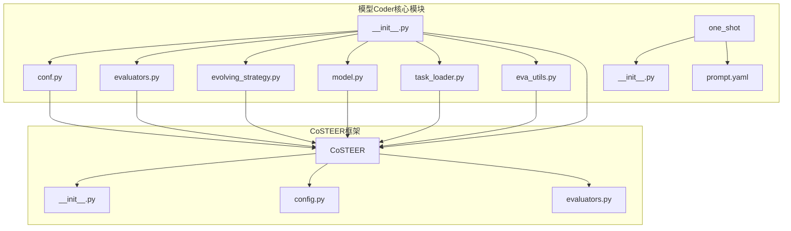
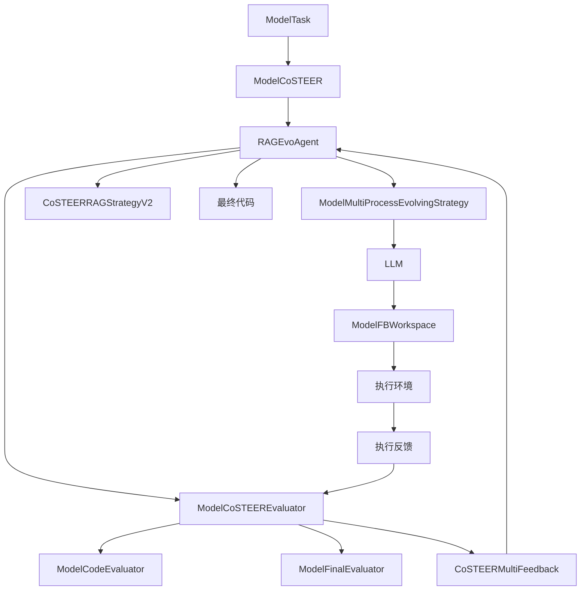
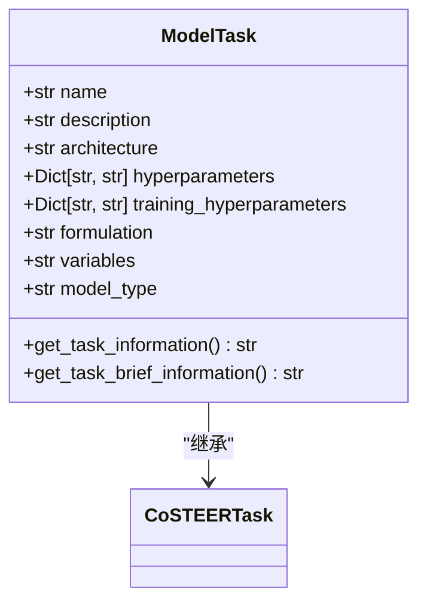
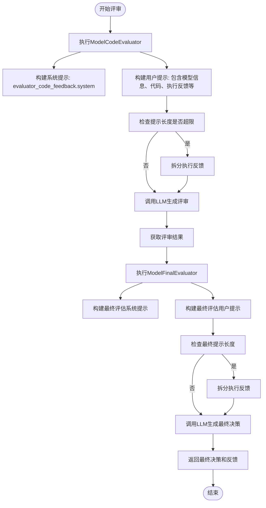
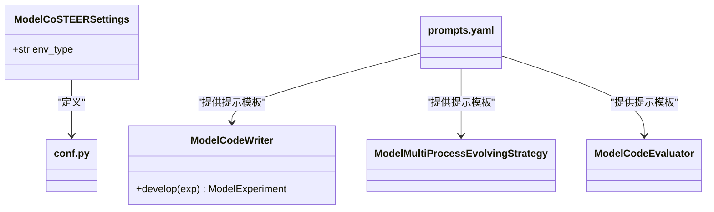
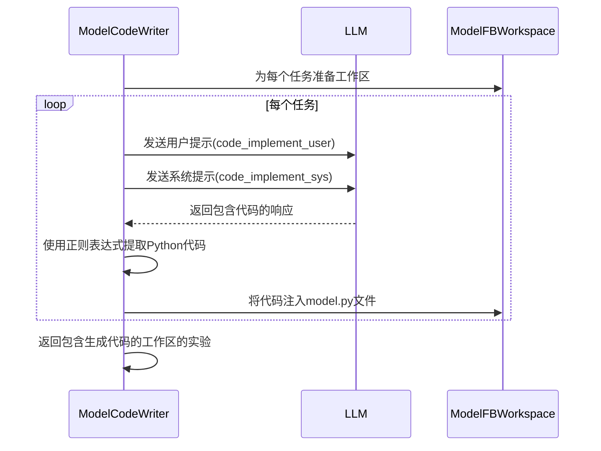
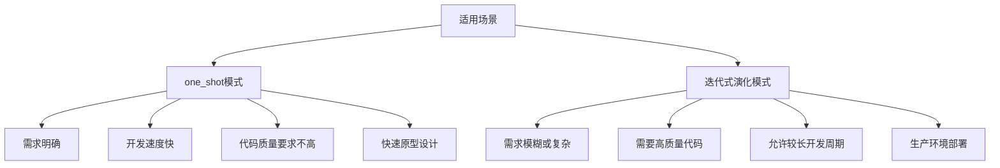
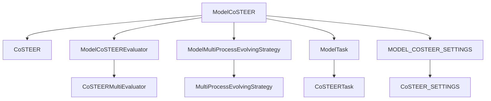

# 模型Coder

<cite>
**本文档引用的文件**
- [__init__.py](file://rdagent/components/coder/model_coder/__init__.py)
- [conf.py](file://rdagent/components/coder/model_coder/conf.py)
- [prompts.yaml](file://rdagent/components/coder/model_coder/prompts.yaml)
- [model.py](file://rdagent/components/coder/model_coder/model.py)
- [evaluators.py](file://rdagent/components/coder/model_coder/evaluators.py)
- [evolving_strategy.py](file://rdagent/components/coder/model_coder/evolving_strategy.py)
- [eva_utils.py](file://rdagent/components/coder/model_coder/eva_utils.py)
- [task_loader.py](file://rdagent/components/coder/model_coder/task_loader.py)
- [one_shot/__init__.py](file://rdagent/components/coder/model_coder/one_shot/__init__.py)
- [one_shot/prompt.yaml](file://rdagent/components/coder/model_coder/one_shot/prompt.yaml)
- [CoSTEER/__init__.py](file://rdagent/components/coder/CoSTEER/__init__.py)
- [CoSTEER/config.py](file://rdagent/components/coder/CoSTEER/config.py)
- [CoSTEER/evaluators.py](file://rdagent/components/coder/CoSTEER/evaluators.py)
</cite>

## 目录
1. [引言](#引言)
2. [项目结构](#项目结构)
3. [核心组件](#核心组件)
4. [架构概述](#架构概述)
5. [详细组件分析](#详细组件分析)
6. [依赖分析](#依赖分析)
7. [性能考虑](#性能考虑)
8. [故障排除指南](#故障排除指南)
9. [结论](#结论)

## 引言
本文档全面文档化模型Coder（ModelCoSTEER）的设计与实现，专注于自动化生成机器学习/深度学习模型代码。该系统基于CoSTEER框架，通过迭代式演化和知识管理机制，实现高质量的模型代码生成。文档将详细解释其处理ModelTask任务的流程，包括模型类型识别和适配，分析ModelCodeEvaluator如何结合多维度反馈进行评审，并描述其配置体系和提示工程如何支持不同模型架构的生成。

## 项目结构
模型Coder项目位于`rdagent/components/coder/model_coder/`目录下，是CoSTEER框架的一个具体实现。其结构围绕模型代码的生成、评估和演化展开。

**图示来源**
- [__init__.py](file://rdagent/components/coder/model_coder/__init__.py)
- [CoSTEER/__init__.py](file://rdagent/components/coder/CoSTEER/__init__.py)

**本节来源**
- [__init__.py](file://rdagent/components/coder/model_coder/__init__.py)

## 核心组件
模型Coder的核心组件包括ModelCoSTEER主类、ModelTask任务定义、ModelFBWorkspace工作区、ModelCodeEvaluator评估器和ModelMultiProcessEvolvingStrategy演化策略。这些组件协同工作，实现了从任务定义到代码生成、执行和评估的完整闭环。

**本节来源**
- [__init__.py](file://rdagent/components/coder/model_coder/__init__.py)
- [model.py](file://rdagent/components/coder/model_coder/model.py)
- [evaluators.py](file://rdagent/components/coder/model_coder/evaluators.py)

## 架构概述
模型Coder的架构基于CoSTEER框架，采用模块化设计，各组件职责分明。其核心流程是通过`develop`方法驱动一个迭代演化过程，该过程由`RAGEvoAgent`协调，结合知识检索（RAG）、代码生成、执行和多维度评估。

**图示来源**
- [CoSTEER/__init__.py](file://rdagent/components/coder/CoSTEER/__init__.py)
- [__init__.py](file://rdagent/components/coder/model_coder/__init__.py)
- [evolving_strategy.py](file://rdagent/components/coder/model_coder/evolving_strategy.py)

## 详细组件分析

### ModelTask任务处理流程
ModelTask类定义了模型生成任务的核心信息，包括模型名称、描述、架构、超参数和模型类型等。系统通过`get_task_information`方法将这些信息格式化，供后续的代码生成和评估使用。

**图示来源**
- [model.py](file://rdagent/components/coder/model_coder/model.py#L20-L100)

**本节来源**
- [model.py](file://rdagent/components/coder/model_coder/model.py)

### ModelCodeEvaluator多维度评审机制
ModelCodeEvaluator是模型代码评审的核心，它结合了执行反馈、代码反馈和价值反馈，利用LLM进行多维度综合评估。其工作流程如下：

**图示来源**
- [evaluators.py](file://rdagent/components/coder/model_coder/evaluators.py#L20-L100)
- [eva_utils.py](file://rdagent/components/coder/model_coder/eva_utils.py#L50-L150)

**本节来源**
- [evaluators.py](file://rdagent/components/coder/model_coder/evaluators.py)
- [eva_utils.py](file://rdagent/components/coder/model_coder/eva_utils.py)

### 配置体系与提示工程
模型Coder的配置体系通过`conf.py`和`prompts.yaml`文件实现。`conf.py`定义了运行环境（conda或docker）等配置，而`prompts.yaml`则包含了所有与LLM交互的提示模板。

**图示来源**
- [conf.py](file://rdagent/components/coder/model_coder/conf.py)
- [prompts.yaml](file://rdagent/components/coder/model_coder/prompts.yaml)

**本节来源**
- [conf.py](file://rdagent/components/coder/model_coder/conf.py)
- [prompts.yaml](file://rdagent/components/coder/model_coder/prompts.yaml)

### one_shot模式实现
one_shot模式是一种直接生成代码的简化路径，用于快速原型设计。`ModelCodeWriter`类实现了此模式，它不经过迭代演化，而是直接调用LLM生成代码。

**图示来源**
- [one_shot/__init__.py](file://rdagent/components/coder/model_coder/one_shot/__init__.py#L10-L30)
- [one_shot/prompt.yaml](file://rdagent/components/coder/model_coder/one_shot/prompt.yaml)

**本节来源**
- [one_shot/__init__.py](file://rdagent/components/coder/model_coder/one_shot/__init__.py)
- [one_shot/prompt.yaml](file://rdagent/components/coder/model_coder/one_shot/prompt.yaml)

### 迭代式演化模式对比分析
one_shot模式与基于CoSTEER的迭代式演化模式在适用场景上有显著区别。one_shot模式适用于需求明确、复杂度低的快速原型开发，而迭代式演化模式则适用于复杂、需要持续优化的生产级代码生成。

**本节来源**
- [__init__.py](file://rdagent/components/coder/model_coder/__init__.py)
- [one_shot/__init__.py](file://rdagent/components/coder/model_coder/one_shot/__init__.py)

## 依赖分析
模型Coder的依赖关系清晰，它依赖于CoSTEER框架的核心组件，并通过配置和提示文件与LLM进行交互。

**图示来源**
- [__init__.py](file://rdagent/components/coder/model_coder/__init__.py)
- [CoSTEER/__init__.py](file://rdagent/components/coder/CoSTEER/__init__.py)

**本节来源**
- [__init__.py](file://rdagent/components/coder/model_coder/__init__.py)
- [CoSTEER/__init__.py](file://rdagent/components/coder/CoSTEER/__init__.py)

## 性能考虑
模型Coder的性能主要受LLM调用次数、代码执行时间和知识检索效率的影响。迭代式演化模式由于可能进行多次循环，其总耗时通常远高于one_shot模式。系统通过`max_loop`配置项和全局定时器来控制最大执行时间，防止无限循环。

## 故障排除指南
当模型代码生成失败时，应首先检查`ModelFBWorkspace.execute`方法返回的执行反馈。如果执行失败，检查错误日志；如果执行成功但评估失败，检查`ModelCodeEvaluator`生成的代码反馈和`ModelFinalEvaluator`的最终决策。

**本节来源**
- [model.py](file://rdagent/components/coder/model_coder/model.py#L100-L160)
- [evaluators.py](file://rdagent/components/coder/model_coder/evaluators.py)

## 结论
模型Coder（ModelCoSTEER）是一个功能强大的自动化模型代码生成系统。它通过CoSTEER框架实现了迭代式代码演化，结合多维度评估和知识管理，能够生成高质量的机器学习/深度学习模型代码。同时，它也提供了one_shot模式以满足快速原型设计的需求。两种模式各有优势，开发者可根据具体场景选择合适的模式。