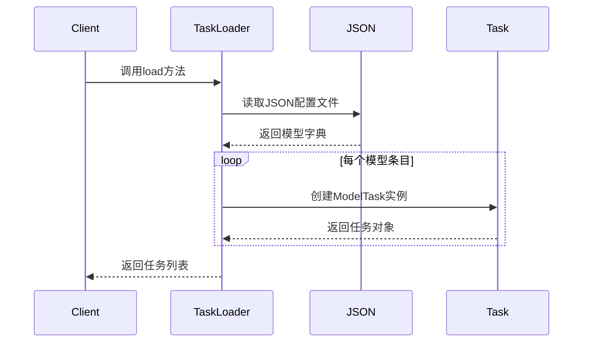
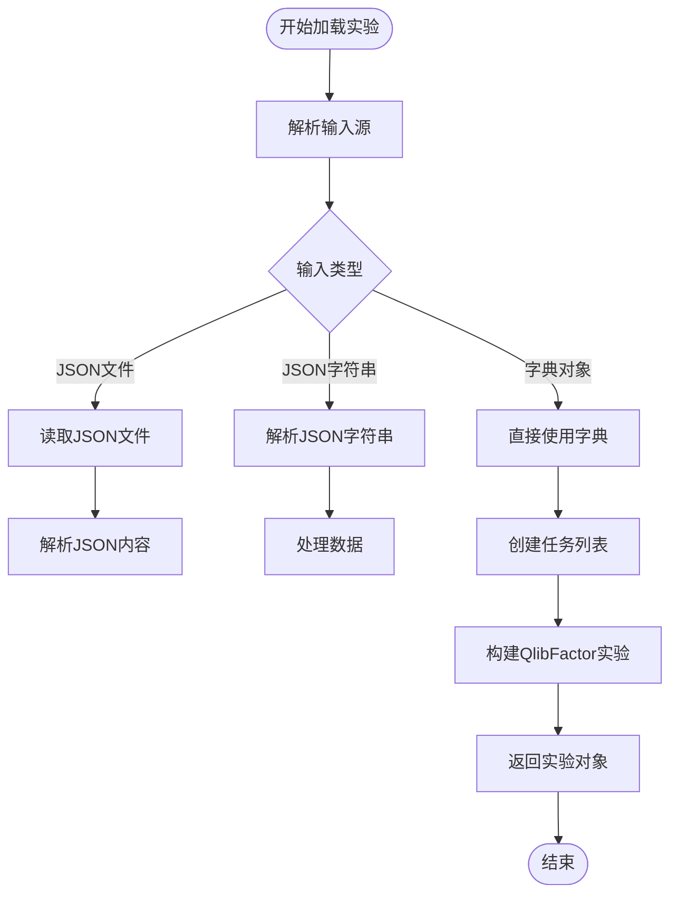
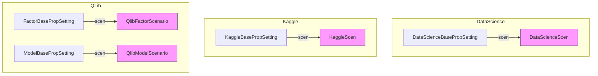
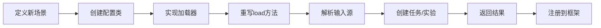

# Loader组件

<cite>
**本文档引用的文件**
- [task_loader.py](file://rdagent/components/loader/task_loader.py)
- [experiment_loader.py](file://rdagent/components/loader/experiment_loader.py)
- [experiment.py](file://rdagent/core/experiment.py)
- [conf.py](file://rdagent/app/data_science/conf.py)
- [conf.py](file://rdagent/app/kaggle/conf.py)
- [conf.py](file://rdagent/app/qlib_rd_loop/conf.py)
</cite>

## 目录
1. [引言](#引言)
2. [Loader抽象基类设计](#loader抽象基类设计)
3. [任务加载机制](#任务加载机制)
4. [实验加载机制](#实验加载机制)
5. [具体场景实现差异](#具体场景实现差异)
6. [扩展指南](#扩展指南)

## 引言
Loader组件是RD-Agent框架中的核心工厂模式实现，负责在不同应用场景下初始化任务或实验对象。该组件通过抽象基类定义了统一的加载契约，并为data_science、kaggle、qlib等具体场景提供了定制化的加载逻辑。本文档详细说明了Loader组件的任务与实验加载机制，分析其设计原理和实现细节。

## Loader抽象基类设计

```mermaid
classDiagram
class Loader {
<<abstract>>
+load(*args, **kwargs) TaskOrExperiment
}
class WsLoader {
<<abstract>>
+load(task) Workspace
}
Loader <|-- FactorTaskLoader
Loader <|-- ModelTaskLoader
Loader <|-- FactorExperimentLoader
Loader <|-- ModelExperimentLoader
WsLoader <|-- ModelWsLoader
note right of Loader : 泛型基类，支持Task和Experiment两种类型
```

**图示来源**
- [experiment.py](file://rdagent/core/experiment.py#L445-L481)

**本节来源**
- [experiment.py](file://rdagent/core/experiment.py#L445-L481)

Loader组件基于抽象基类`Loader[TaskOrExperiment]`实现，采用泛型设计支持任务和实验两种类型的加载。该基类定义了`load`方法的抽象契约，要求所有子类必须实现具体的加载逻辑。`TaskOrExperiment`类型变量约束了泛型参数只能是`Task`或`Experiment`类型，确保类型安全。

## 任务加载机制



**图示来源**
- [task_loader.py](file://rdagent/components/loader/task_loader.py#L30-L96)

**本节来源**
- [task_loader.py](file://rdagent/components/loader/task_loader.py#L30-L96)

`task_loader.py`文件实现了任务加载的核心逻辑，主要包含以下组件：
- `ModelTaskLoaderJson`：从JSON文件解析配置并构建任务列表
- `ModelWsLoader`：从指定路径加载工作空间代码
- `FactorTaskLoader`：因子任务加载器基类

`ModelTaskLoaderJson`类通过读取JSON格式的配置文件来初始化模型任务，配置文件需包含模型名称、描述、公式、变量等信息。加载过程会为每个模型条目创建对应的`ModelTask`实例，并返回任务列表。

## 实验加载机制



**图示来源**
- [experiment_loader.py](file://rdagent/components/loader/experiment_loader.py#L0-L9)
- [json_loader.py](file://rdagent/scenarios/qlib/factor_experiment_loader/json_loader.py#L0-L36)

**本节来源**
- [experiment_loader.py](file://rdagent/components/loader/experiment_loader.py#L0-L9)
- [json_loader.py](file://rdagent/scenarios/qlib/factor_experiment_loader/json_loader.py#L0-L36)

`experiment_loader.py`文件定义了实验加载的基础架构，具体实现分布在不同场景模块中：
- `FactorExperimentLoader`：因子实验加载器基类
- `ModelExperimentLoader`：模型实验加载器（当前实现有误，应为`ModelExperiment`类型）

在QLib场景中，提供了多种具体的实验加载实现：
- `FactorExperimentLoaderFromDict`：从字典对象加载因子实验
- `FactorExperimentLoaderFromJsonFile`：从JSON文件加载因子实验
- `FactorExperimentLoaderFromJsonString`：从JSON字符串加载因子实验

这些加载器共同实现了从持久化存储或模板中恢复实验状态的功能。

## 具体场景实现差异



**图示来源**
- [conf.py](file://rdagent/app/data_science/conf.py#L0-L207)
- [conf.py](file://rdagent/app/kaggle/conf.py#L0-L97)
- [conf.py](file://rdagent/app/qlib_rd_loop/conf.py#L0-L121)

**本节来源**
- [conf.py](file://rdagent/app/data_science/conf.py#L0-L207)
- [conf.py](file://rdagent/app/kaggle/conf.py#L0-L97)
- [conf.py](file://rdagent/app/qlib_rd_loop/conf.py#L0-L121)

不同应用场景下的Loader实现存在显著差异：

**data_science场景**
- 使用`DataScienceBasePropSetting`配置类
- 场景类为`DataScienceScen`
- 支持多轨迹调度和自动合并

**kaggle场景**
- 使用`KaggleBasePropSetting`配置类
- 场景类为`KGScenario`
- 支持Kaggle竞赛自动提交功能

**qlib场景**
- 使用`FactorBasePropSetting`和`ModelBasePropSetting`配置类
- 分别对应因子和模型场景
- 支持从研究报告提取因子的特殊场景

## 扩展指南

要为新应用场景定制加载逻辑，需遵循以下步骤：

1. **定义场景配置类**：继承基础配置类，设置特定的场景参数
2. **实现加载器类**：继承`Loader`基类，实现`load`方法
3. **注册配置**：在应用配置中注册新的场景和加载器



**本节来源**
- [task_loader.py](file://rdagent/components/loader/task_loader.py#L30-L96)
- [experiment_loader.py](file://rdagent/components/loader/experiment_loader.py#L0-L9)

通过遵循工厂模式的设计原则，新场景的加载器可以无缝集成到核心框架中，确保代码的可扩展性和维护性。关键是要保持`load`方法的契约一致性，同时根据具体需求实现差异化的解析逻辑。