# Proposal组件：创意生成系统深度解析

<cite>
**本文档引用的文件**
- [rdagent/components/proposal/prompts.yaml](file://rdagent/components/proposal/prompts.yaml)
- [rdagent/components/proposal/__init__.py](file://rdagent/components/proposal/__init__.py)
- [rdagent/core/proposal.py](file://rdagent/core/proposal.py)
- [rdagent/scenarios/data_science/proposal/exp_gen/base.py](file://rdagent/scenarios/data_science/proposal/exp_gen/base.py)
- [rdagent/scenarios/qlib/proposal/factor_proposal.py](file://rdagent/scenarios/qlib/proposal/factor_proposal.py)
- [rdagent/app/data_science/conf.py](file://rdagent/app/data_science/conf.py)
- [rdagent/scenarios/data_science/proposal/exp_gen/diversity_strategy.py](file://rdagent/scenarios/data_science/proposal/exp_gen/diversity_strategy.py)
</cite>

## 目录
1. [引言](#引言)
2. [系统架构概览](#系统架构概览)
3. [LLMHypothesisGen核心组件](#llmhypothesisgen核心组件)
4. [Hypothesis2Experiment转换器](#hypothesis2experiment转换器)
5. [提示模板设计逻辑](#提示模板设计逻辑)
6. [场景特定实现](#场景特定实现)
7. [知识管理系统协同](#知识管理系统协同)
8. [多样性策略与创新机制](#多样性策略与创新机制)
9. [性能优化与错误处理](#性能优化与错误处理)
10. [总结](#总结)

## 引言

Proposal组件是RD-Agent系统中的核心创意生成引擎，负责利用大语言模型（LLM）生成研究假设，并将其转化为可执行的实验计划。该系统通过多层次的抽象设计，实现了从概念性想法到具体实验方案的完整转化流程，特别针对数据科学和量化投资场景进行了深度优化。

系统的核心价值在于：
- **智能假设生成**：基于历史反馈、SOTA结果和RAG检索信息生成创新假设
- **场景化适配**：为不同领域（数据科学、量化投资）提供专门化的假设生成策略
- **知识驱动创新**：与知识管理系统深度集成，实现基于经验的学习和改进
- **多样性保障**：通过多种策略确保创意的多样性和创新性

## 系统架构概览

Proposal组件采用分层架构设计，包含抽象基类、具体实现类和场景适配器三个层次：

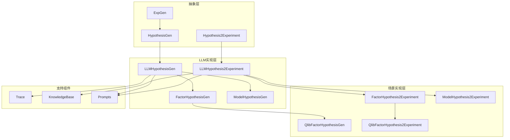

**图表来源**
- [rdagent/core/proposal.py](file://rdagent/core/proposal.py#L323-L389)
- [rdagent/components/proposal/__init__.py](file://rdagent/components/proposal/__init__.py#L15-L138)

**章节来源**
- [rdagent/core/proposal.py](file://rdagent/core/proposal.py#L1-L390)
- [rdagent/components/proposal/__init__.py](file://rdagent/components/proposal/__init__.py#L1-L139)

## LLMHypothesisGen核心组件

### 核心设计理念

LLMHypothesisGen是假设生成的核心抽象类，定义了基于大语言模型的假设生成框架。它通过两个关键的抽象方法实现了场景无关的通用接口：

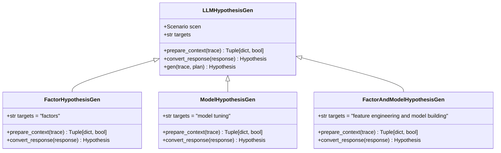

**图表来源**
- [rdagent/components/proposal/__init__.py](file://rdagent/components/proposal/__init__.py#L15-L74)

### prepare_context抽象方法实现

prepare_context方法负责准备假设生成所需的上下文信息，其具体实现因场景而异：

#### 基础上下文结构
```python
# 标准上下文字典结构
context_dict = {
    "hypothesis_and_feedback": "历史假设和反馈信息",
    "last_hypothesis_and_feedback": "最新假设和反馈",
    "sota_hypothesis_and_feedback": "SOTA假设和反馈",
    "RAG": "检索增强生成内容",
    "hypothesis_output_format": "输出格式规范",
    "hypothesis_specification": "额外规格说明"
}
```

#### 场景特定上下文准备
不同场景的prepare_context实现具有以下特点：

1. **数据科学场景**：重点关注特征工程和模型构建的历史经验
2. **量化投资场景**：强调因子开发和模型调优的成功模式
3. **Kaggle竞赛场景**：结合竞赛特定的知识和历史解决方案

### convert_response抽象方法实现

convert_response方法将LLM的原始响应转换为标准化的Hypothesis对象：

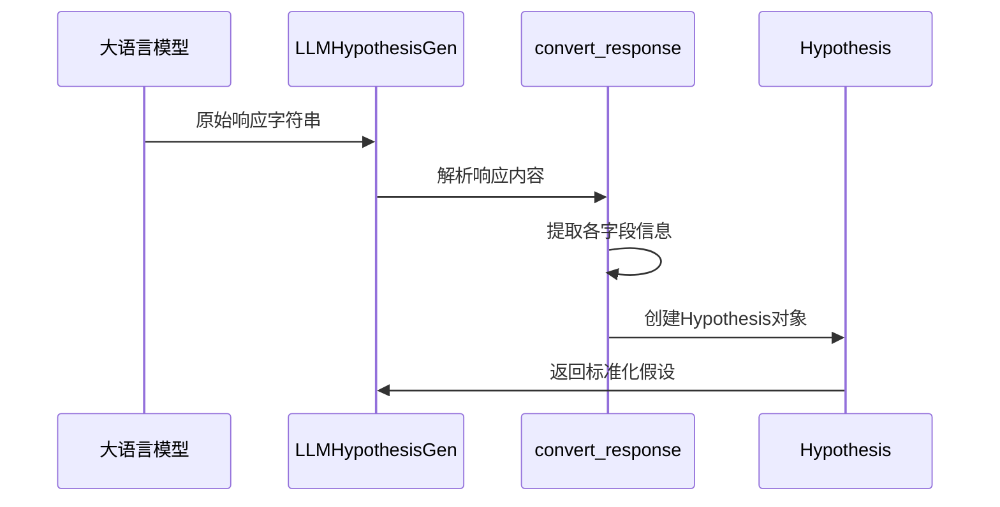

**图表来源**
- [rdagent/components/proposal/__init__.py](file://rdagent/components/proposal/__init__.py#L40-L74)

**章节来源**
- [rdagent/components/proposal/__init__.py](file://rdagent/components/proposal/__init__.py#L15-L74)

## Hypothesis2Experiment转换器

### 转换器架构设计

Hypothesis2Experiment系列转换器负责将抽象的研究假设转化为具体的实验计划，实现从概念到实践的桥梁作用：

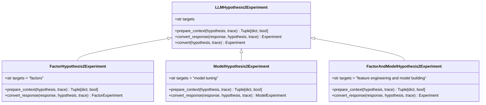

**图表来源**
- [rdagent/components/proposal/__init__.py](file://rdagent/components/proposal/__init__.py#L76-L138)

### FactorHypothesis2Experiment具体行为

FactorHypothesis2Experiment专门处理因子开发场景，其转换过程包含以下关键步骤：

#### 上下文准备策略
1. **场景描述提取**：根据当前量化场景获取详细的背景信息
2. **历史反馈整合**：收集相关的因子开发历史和成功案例
3. **目标列表构建**：基于现有实验结果确定待开发因子列表

#### 因子任务生成
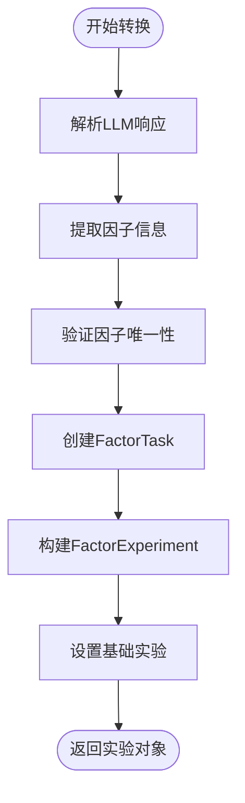

**图表来源**
- [rdagent/scenarios/qlib/proposal/factor_proposal.py](file://rdagent/scenarios/qlib/proposal/factor_proposal.py#L50-L132)

### ModelHypothesis2Experiment具体行为

ModelHypothesis2Experiment专注于模型调优场景，其转换特点包括：

1. **模型架构建议**：基于假设生成合适的模型架构
2. **超参数配置**：制定详细的超参数调优计划
3. **训练策略设计**：规划模型训练和验证流程

**章节来源**
- [rdagent/components/proposal/__init__.py](file://rdagent/components/proposal/__init__.py#L76-L138)
- [rdagent/scenarios/qlib/proposal/factor_proposal.py](file://rdagent/scenarios/qlib/proposal/factor_proposal.py#L1-L133)

## 提示模板设计逻辑

### prompts.yaml结构分析

系统使用统一的提示模板管理机制，通过YAML文件组织各种提示模板：

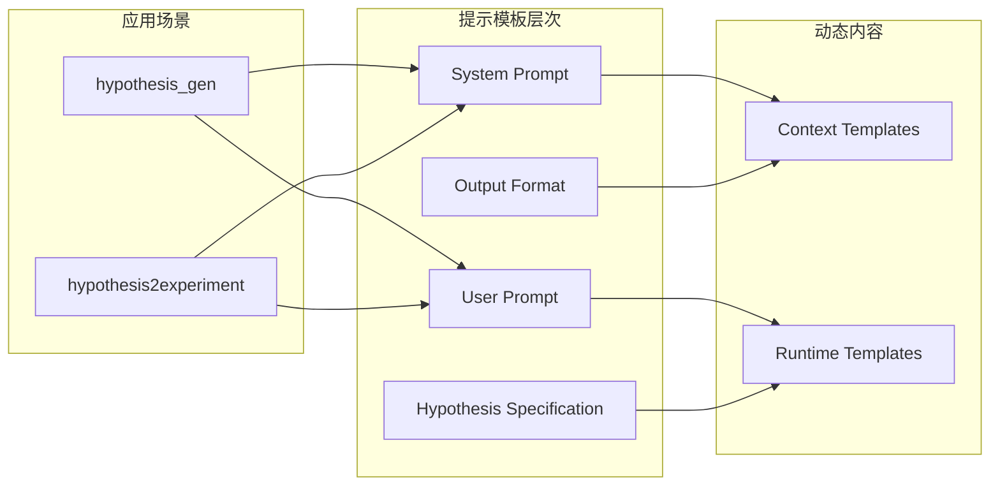

**图表来源**
- [rdagent/components/proposal/prompts.yaml](file://rdagent/components/proposal/prompts.yaml#L1-L65)

### system_prompt设计原则

system_prompt遵循以下设计原则：

#### 1. 场景适应性
```yaml
# 数据科学场景
"The user is working on generating new hypotheses for the {{ targets }} in a data-driven research and development process."

# 量化投资场景  
"The {{ targets }} are used in the following scenario: {{ scenario }}"
```

#### 2. 历史反馈整合
- **Previous Experiments**：分析历史实验的成功与失败原因
- **Decision Reflection**：反思每个实验的决策过程
- **改进方向**：基于反馈提出进一步优化建议

#### 3. 指导原则明确
- **创新导向**：鼓励探索新的研究方向
- **质量保证**：确保假设的可行性和价值
- **格式规范**：提供清晰的输出格式要求

### user_prompt动态构建

user_prompt根据当前状态动态构建，包含以下信息块：

#### 1. 初始生成阶段
```yaml

It is the first round of hypothesis generation. The user has no hypothesis on this scenario yet.

The former hypothesis and the corresponding feedbacks are as follows:
{{ hypothesis_and_feedback }}

```

#### 2. 迭代优化阶段
```yaml

Here is the last trial's hypothesis and the corresponding feedback:
{{ last_hypothesis_and_feedback }}

```

#### 3. SOTA参考阶段
```yaml

Here is the SOTA trail's hypothesis and the corresponding feedback:
{{ sota_hypothesis_and_feedback }}

```

#### 4. RAG增强阶段
```yaml

To assist you in generating new {{ targets }}, we have provided the following information: {{ RAG }}.

```

**章节来源**
- [rdagent/components/proposal/prompts.yaml](file://rdagent/components/proposal/prompts.yaml#L1-L65)

## 场景特定实现

### data_science场景提案

data_science场景的提案实现体现了对数据科学工作流的深度理解：

#### 组件化假设生成
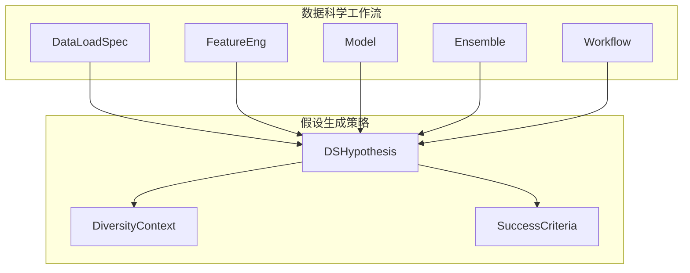

**图表来源**
- [rdagent/scenarios/data_science/proposal/exp_gen/base.py](file://rdagent/scenarios/data_science/proposal/exp_gen/base.py#L15-L50)

#### DSTrace追踪机制
DSTrace类扩展了基础Trace功能，专门处理数据科学场景的复杂需求：

1. **组件完成度检查**：跟踪各个工作流组件的完成状态
2. **SOTA实验选择**：智能选择表现最佳的实验方案
3. **多样性注入控制**：在适当时机注入跨轨迹的多样性信息

### qlib场景提案

qlib场景的实现针对量化投资领域的特殊需求：

#### 因子开发假设生成
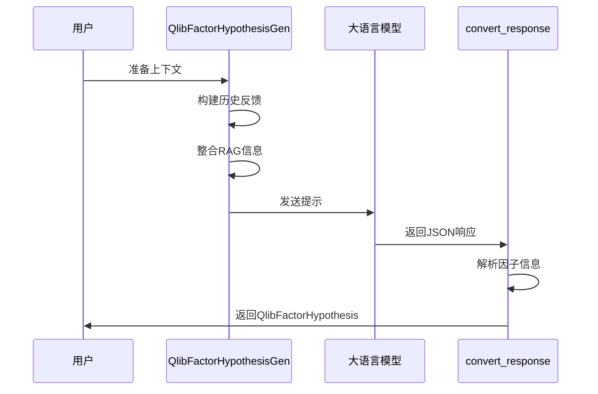

**图表来源**
- [rdagent/scenarios/qlib/proposal/factor_proposal.py](file://rdagent/scenarios/qlib/proposal/factor_proposal.py#L15-L50)

#### RAG检索策略
系统根据实验轮次动态调整RAG检索策略：

1. **早期阶段**：优先尝试简单快速的因子
2. **中期阶段**：平衡探索与效率
3. **后期阶段**：专注于高信息增益的因子

**章节来源**
- [rdagent/scenarios/data_science/proposal/exp_gen/base.py](file://rdagent/scenarios/data_science/proposal/exp_gen/base.py#L1-L349)
- [rdagent/scenarios/qlib/proposal/factor_proposal.py](file://rdagent/scenarios/qlib/proposal/factor_proposal.py#L1-L133)

## 知识管理系统协同

### RAG检索机制

系统与知识管理系统深度集成，实现基于经验的学习和创新：

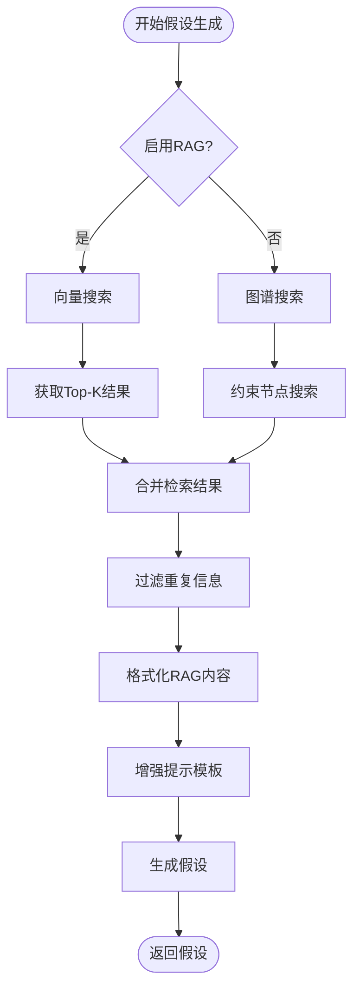

### 知识存储与检索

#### 向量基存储
- **嵌入表示**：将知识片段转换为向量表示
- **相似度计算**：基于余弦相似度进行检索
- **多模态融合**：支持文本、代码等多种类型的知识

#### 图谱基存储
- **实体关系**：构建知识图谱表示
- **路径推理**：通过图谱路径发现相关知识
- **层次结构**：维护知识的层次化组织

### 知识更新机制

系统支持动态的知识更新和学习：

1. **实验反馈学习**：从实验结果中提取新的知识
2. **成功模式识别**：自动识别和记录成功的实验模式
3. **失败教训总结**：分析失败原因并形成改进建议

**章节来源**
- [rdagent/scenarios/kaggle/proposal/proposal.py](file://rdagent/scenarios/kaggle/proposal/proposal.py#L159-L191)

## 多样性策略与创新机制

### 多样性注入策略

系统实现了多种多样性注入策略，确保创意的广泛性和创新性：

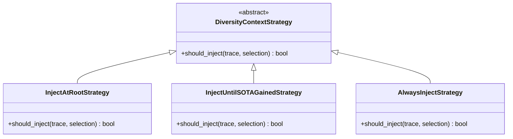

**图表来源**
- [rdagent/scenarios/data_science/proposal/exp_gen/diversity_strategy.py](file://rdagent/scenarios/data_science/proposal/exp_gen/diversity_strategy.py#L8-L67)

### 策略对比分析

#### 1. Root节点注入策略
- **触发条件**：当开始新的子轨迹时
- **适用场景**：避免重复探索相同的方向
- **效果评估**：确保初始阶段的多样性

#### 2. SOTA获得前注入策略
- **触发条件**：在当前子轨迹中尚未获得SOTA实验
- **适用场景**：激励持续创新直到达到基准水平
- **效果评估**：平衡探索与利用

#### 3. 永久注入策略
- **触发条件**：始终注入多样性上下文
- **适用场景**：追求最大创新性的场景
- **效果评估**：可能增加实验失败风险

### 跨轨迹多样性机制

系统支持跨轨迹的知识共享和多样性注入：

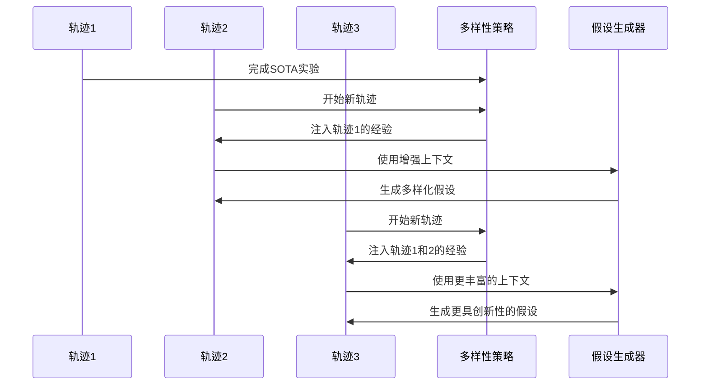

**图表来源**
- [rdagent/scenarios/data_science/proposal/exp_gen/diversity_strategy.py](file://rdagent/scenarios/data_science/proposal/exp_gen/diversity_strategy.py#L37-L67)

**章节来源**
- [rdagent/scenarios/data_science/proposal/exp_gen/diversity_strategy.py](file://rdagent/scenarios/data_science/proposal/exp_gen/diversity_strategy.py#L1-L67)

## 性能优化与错误处理

### 重试机制与容错设计

系统实现了完善的错误处理和重试机制：

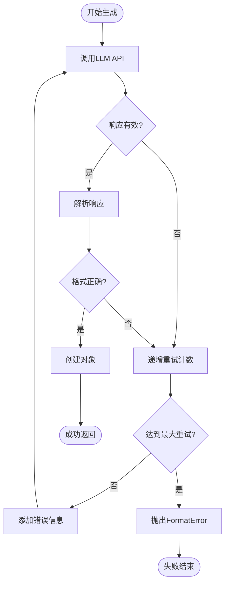

### 并发控制与资源管理

#### 并发限制机制
- **最大并行数控制**：通过RD_AGENT_SETTINGS.get_max_parallel()限制并发请求数
- **循环等待机制**：使用asyncio.sleep(1)实现优雅的资源等待
- **负载均衡**：动态调整生成速率以避免API限流

#### 内存管理优化
- **上下文截断**：对长历史记录进行智能截断
- **缓存策略**：缓存频繁使用的提示模板
- **垃圾回收**：及时释放不再需要的对象引用

### 错误恢复策略

系统提供了多层次的错误恢复机制：

1. **语法错误恢复**：自动修正JSON格式错误
2. **语义错误检测**：验证生成内容的合理性
3. **降级策略**：在严重错误时提供备用方案

**章节来源**
- [rdagent/utils/agent/workflow.py](file://rdagent/utils/agent/workflow.py#L1-L55)

## 总结

Proposal组件作为RD-Agent系统的核心创意生成引擎，展现了现代AI辅助研发系统的先进设计理念。通过LLMHypothesisGen及其子类的层次化设计，系统实现了从通用框架到具体场景的无缝适配；通过Hypothesis2Experiment转换器，建立了假设到实验的可靠桥梁；通过完善的提示模板系统，确保了生成质量的一致性；通过与知识管理系统的深度集成，实现了基于经验的学习和创新。

系统的主要优势包括：

1. **场景适应性强**：支持数据科学、量化投资、Kaggle竞赛等多种场景
2. **知识驱动创新**：通过RAG检索和知识积累实现持续改进
3. **多样性保障**：多种策略确保创意的广泛性和创新性
4. **容错能力强**：完善的错误处理和重试机制保证系统稳定性
5. **性能优化充分**：并发控制和资源管理确保高效运行

该系统为AI辅助的研发工作提供了强有力的工具支撑，显著提升了研发效率和创新能力，是现代AI研发平台的重要组成部分。