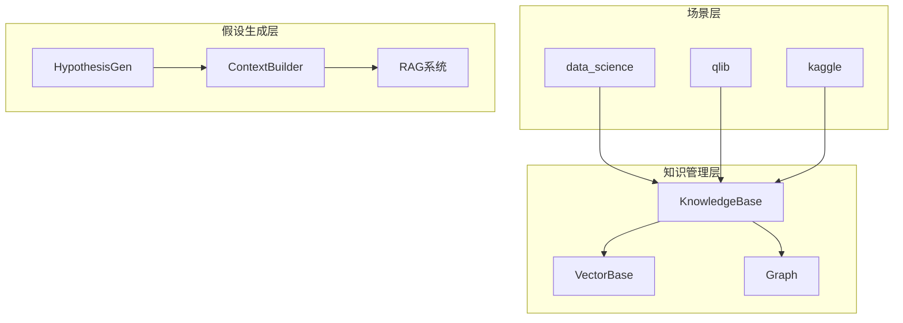
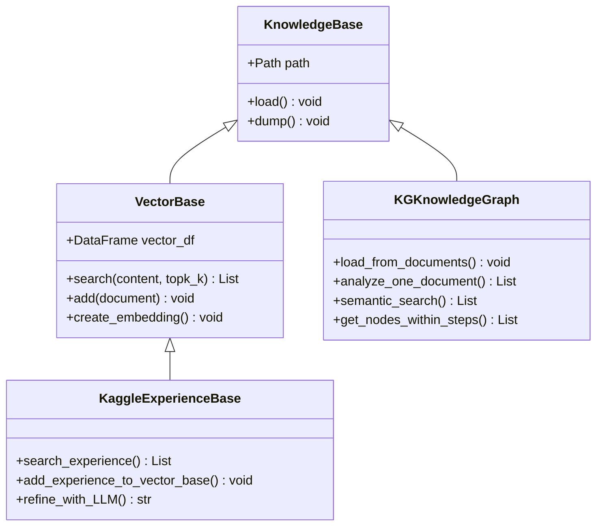
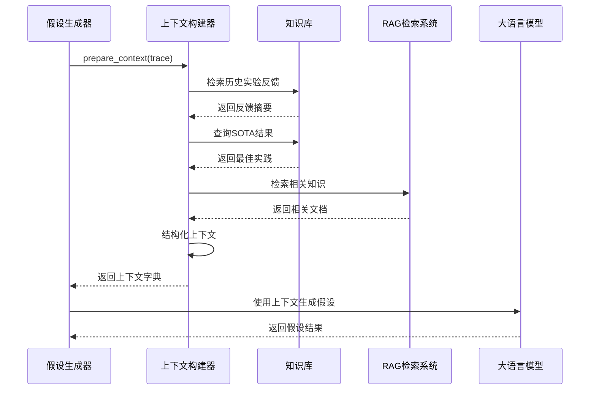
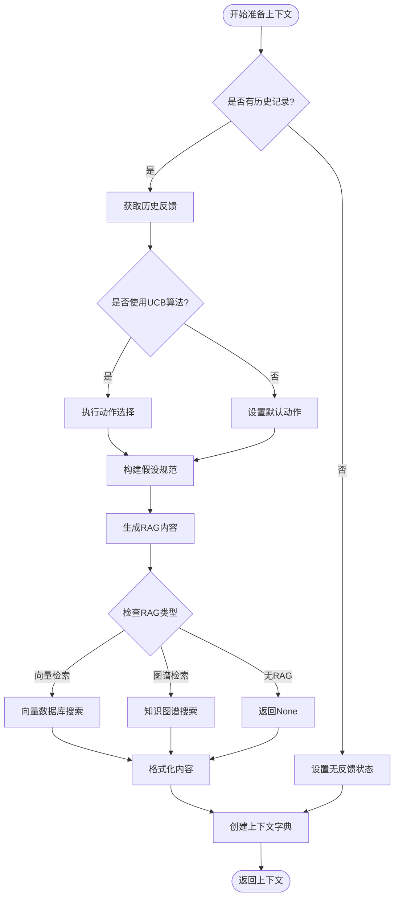
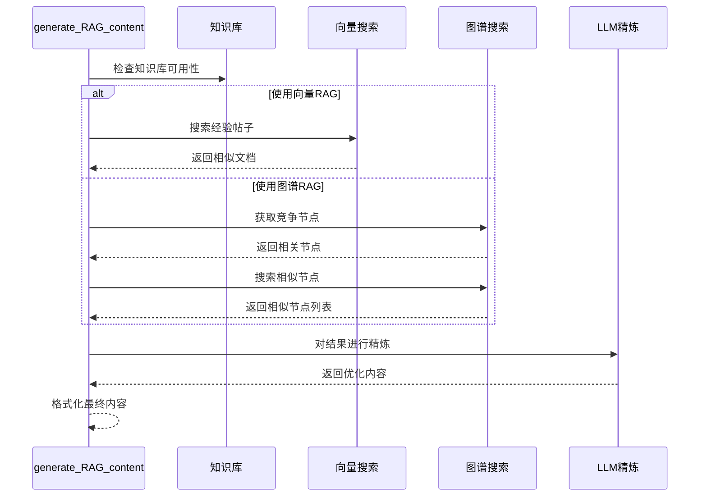
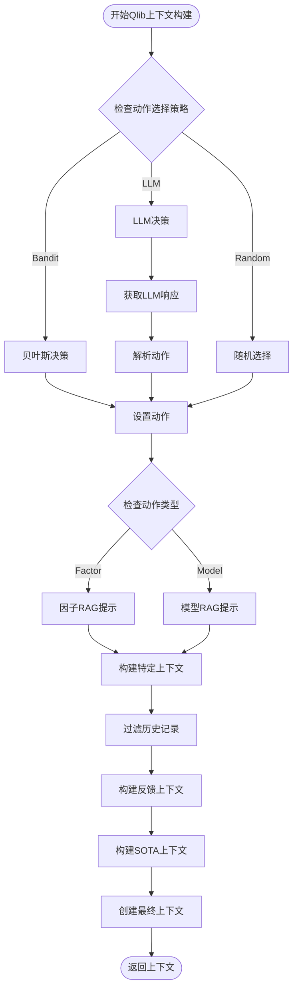
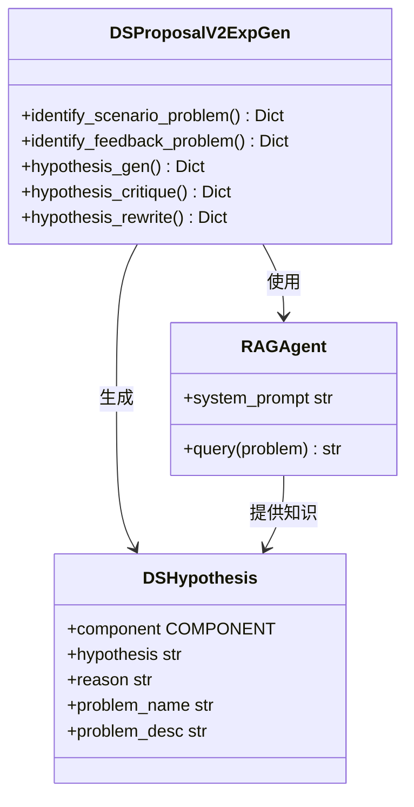
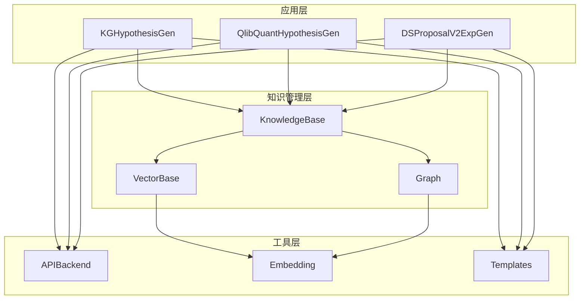
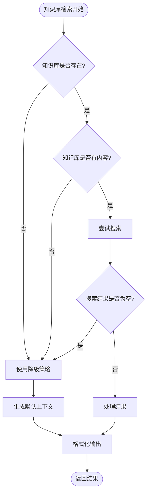

# 上下文构建

<cite>
**本文档引用的文件**
- [proposal.py](file://rdagent\scenarios\kaggle\proposal\proposal.py)
- [quant_proposal.py](file://rdagent\scenarios\qlib\proposal\quant_proposal.py)
- [vector_base.py](file://rdagent\scenarios\kaggle\knowledge_management\vector_base.py)
- [graph.py](file://rdagent\scenarios\kaggle\knowledge_management\graph.py)
- [knowledge_management.py](file://rdagent\components\coder\CoSTEER\knowledge_management.py)
- [proposal.py](file://rdagent\scenarios\data_science\proposal\exp_gen\proposal.py)
- [knowledge_base.py](file://rdagent\core\knowledge_base.py)
</cite>

## 目录
1. [引言](#引言)
2. [项目结构概览](#项目结构概览)
3. [核心组件分析](#核心组件分析)
4. [架构概览](#架构概览)
5. [详细组件分析](#详细组件分析)
6. [依赖关系分析](#依赖关系分析)
7. [性能考虑](#性能考虑)
8. [故障排除指南](#故障排除指南)
9. [结论](#结论)

## 引言

假设生成中的上下文构建是RD-Agent系统的核心机制，它负责整合多源信息以生成高质量的假设。本文档深入分析prepare_context方法如何从知识库中检索历史实验反馈、SOTA结果和RAG检索到的相关知识，并将其结构化为LLM可理解的上下文。

上下文构建机制在不同场景（数据科学、qlib）中展现出不同的实现策略，但都遵循统一的设计原则：多源信息融合、智能检索排序和上下文长度控制。

## 项目结构概览

RD-Agent采用模块化架构，支持多种场景的假设生成：

**图表来源**
- [proposal.py](file://rdagent\scenarios\kaggle\proposal\proposal.py#L1-L50)
- [knowledge_management.py](file://rdagent\components\coder\CoSTEER\knowledge_management.py#L1-L50)

## 核心组件分析

### 知识库系统

知识库系统是上下文构建的基础，提供多维度的知识存储和检索能力：

**图表来源**
- [knowledge_base.py](file://rdagent\core\knowledge_base.py#L1-L28)
- [vector_base.py](file://rdagent\scenarios\kaggle\knowledge_management\vector_base.py#L1-L50)
- [graph.py](file://rdagent\scenarios\kaggle\knowledge_management\graph.py#L1-L50)

**章节来源**
- [knowledge_base.py](file://rdagent\core\knowledge_base.py#L1-L28)
- [vector_base.py](file://rdagent\scenarios\kaggle\knowledge_management\vector_base.py#L1-L100)
- [graph.py](file://rdagent\scenarios\kaggle\knowledge_management\graph.py#L1-L50)

## 架构概览

上下文构建系统采用分层架构，从底层知识存储到高层假设生成：

**图表来源**
- [proposal.py](file://rdagent\scenarios\kaggle\proposal\proposal.py#L249-L288)
- [quant_proposal.py](file://rdagent\scenarios\qlib\proposal\quant_proposal.py#L49-L165)

## 详细组件分析

### Kaggle场景的上下文构建

Kaggle场景的上下文构建通过KGHypothesisGen类实现，其prepare_context方法展示了完整的知识整合流程：

**图表来源**
- [proposal.py](file://rdagent\scenarios\kaggle\proposal\proposal.py#L249-L288)

#### RAG内容生成机制

generate_RAG_content函数实现了智能的知识检索和整合：

**图表来源**
- [proposal.py](file://rdagent\scenarios\kaggle\proposal\proposal.py#L57-L181)

**章节来源**
- [proposal.py](file://rdagent\scenarios\kaggle\proposal\proposal.py#L57-L181)

### Qlib场景的上下文构建

Qlib场景的上下文构建更加复杂，支持多种动作选择策略：

**图表来源**
- [quant_proposal.py](file://rdagent\scenarios\qlib\proposal\quant_proposal.py#L49-L165)

**章节来源**
- [quant_proposal.py](file://rdagent\scenarios\qlib\proposal\quant_proposal.py#L49-L165)

### 数据科学场景的上下文构建

数据科学场景的上下文构建更加灵活，支持管道式和组件式两种模式：

**图表来源**
- [proposal.py](file://rdagent\scenarios\data_science\proposal\exp_gen\proposal.py#L600-L700)

**章节来源**
- [proposal.py](file://rdagent\scenarios\data_science\proposal\exp_gen\proposal.py#L600-L700)

## 依赖关系分析

上下文构建系统的依赖关系展现了清晰的分层架构：

**图表来源**
- [proposal.py](file://rdagent\scenarios\kaggle\proposal\proposal.py#L1-L50)
- [knowledge_management.py](file://rdagent\components\coder\CoSTEER\knowledge_management.py#L1-L50)

**章节来源**
- [proposal.py](file://rdagent\scenarios\kaggle\proposal\proposal.py#L1-L50)
- [knowledge_management.py](file://rdagent\components\coder\CoSTEER\knowledge_management.py#L1-L50)

## 性能考虑

### 上下文长度控制

系统实现了多层次的上下文长度控制机制：

1. **令牌限制检查**：自动检测输入文本是否超过模型的最大令牌数
2. **渐进式截断**：当文本过长时，采用编码解码方式进行精确截断
3. **智能压缩**：对中间部分进行隐藏式压缩，保留首尾关键信息

### 检索效率优化

1. **相似度阈值过滤**：只保留高于阈值的相关结果
2. **Top-K限制**：限制返回结果数量，提高响应速度
3. **缓存机制**：对频繁查询的结果进行缓存

### 内存管理

1. **增量加载**：知识库采用增量加载策略，避免内存溢出
2. **懒加载**：按需加载知识库内容
3. **垃圾回收**：定期清理无用的临时对象

## 故障排除指南

### 知识库为空处理

当知识库为空或检索失败时，系统采用以下降级策略：

**图表来源**
- [vector_base.py](file://rdagent\scenarios\kaggle\knowledge_management\vector_base.py#L250-L289)

### 异常处理机制

系统实现了完善的异常处理机制：

1. **嵌入失败处理**：当文本过长导致嵌入失败时，自动进行截断重试
2. **网络超时处理**：对API调用设置合理的超时时间
3. **数据格式验证**：严格验证输入数据的格式和完整性

**章节来源**
- [vector_base.py](file://rdagent\scenarios\kaggle\knowledge_management\vector_base.py#L250-L289)

## 结论

RD-Agent的上下文构建机制展现了现代AI系统设计的最佳实践。通过多源信息融合、智能检索排序和严格的性能控制，系统能够为假设生成提供高质量的上下文支持。

主要特点包括：

1. **模块化设计**：清晰的分层架构便于维护和扩展
2. **多模态检索**：同时支持向量和图谱两种检索方式
3. **智能降级**：在资源受限时提供合理的降级策略
4. **性能优化**：多层次的优化措施确保系统高效运行
5. **异常处理**：完善的错误处理机制保证系统稳定性

这种设计不仅满足了当前的需求，也为未来的功能扩展奠定了坚实的基础。