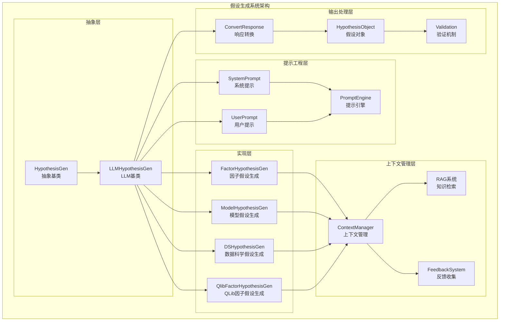
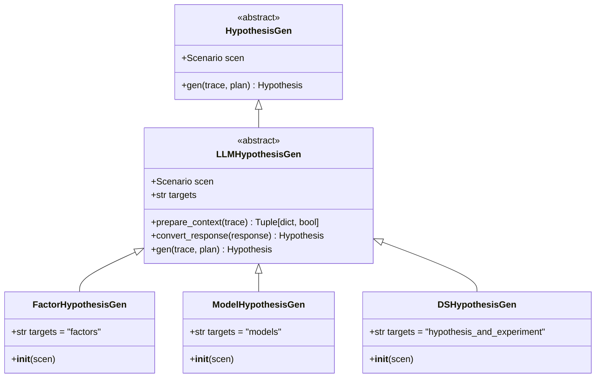
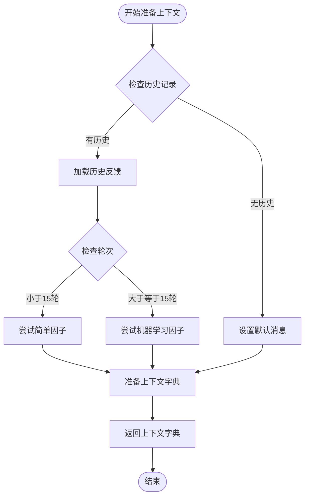
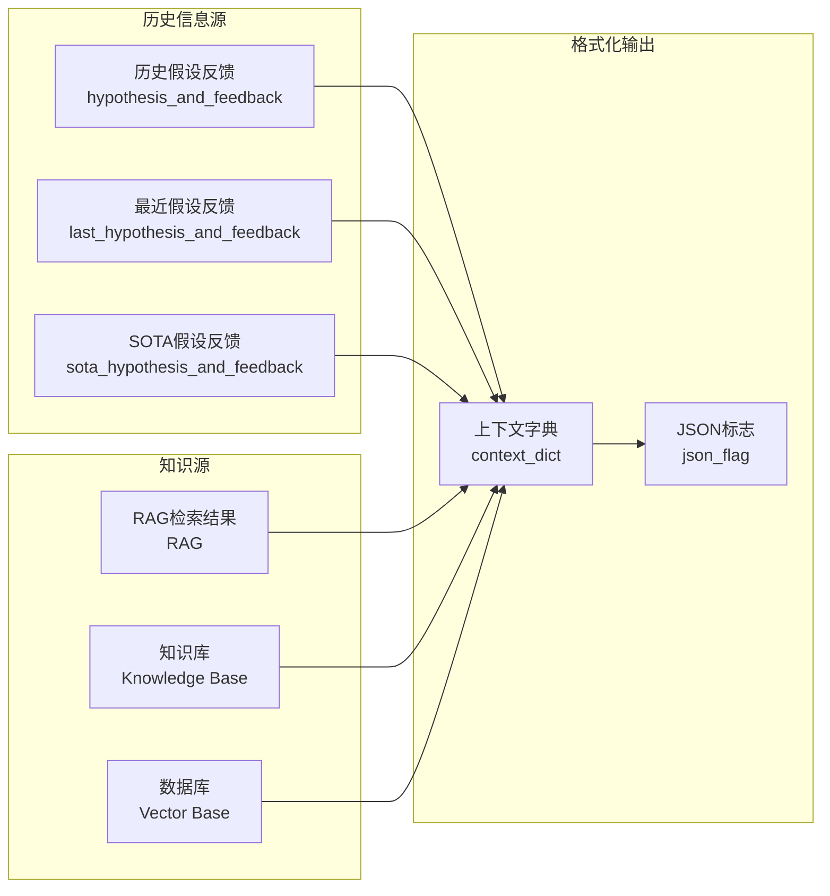
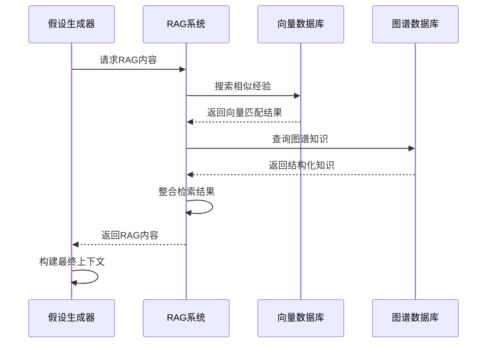
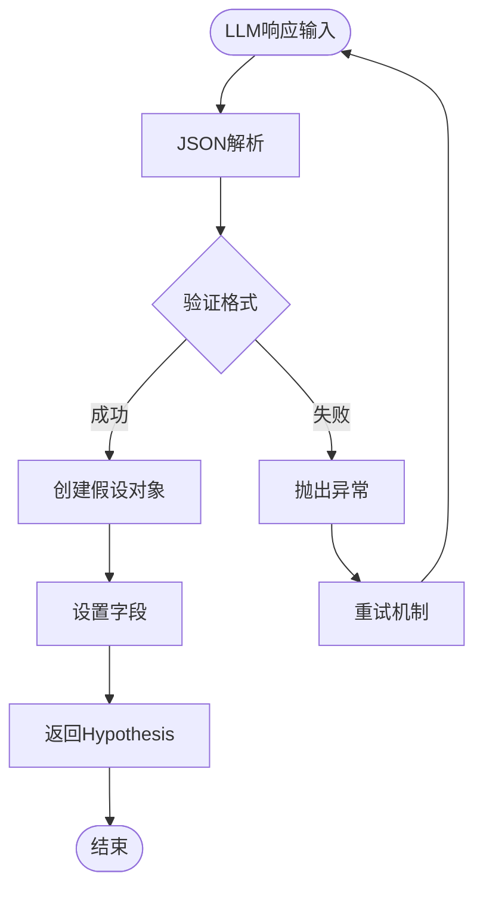
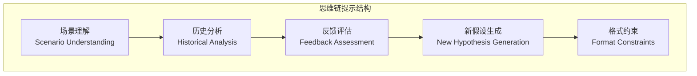
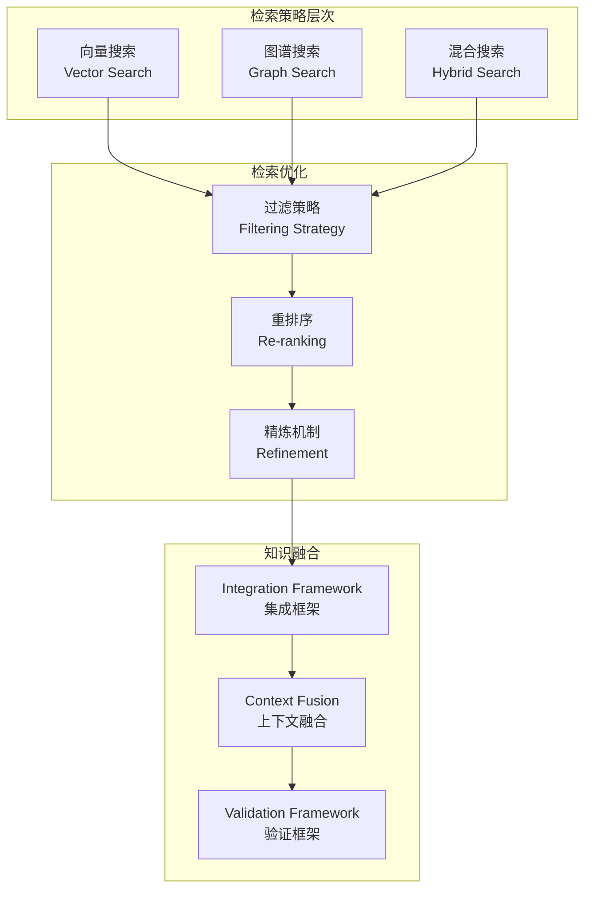
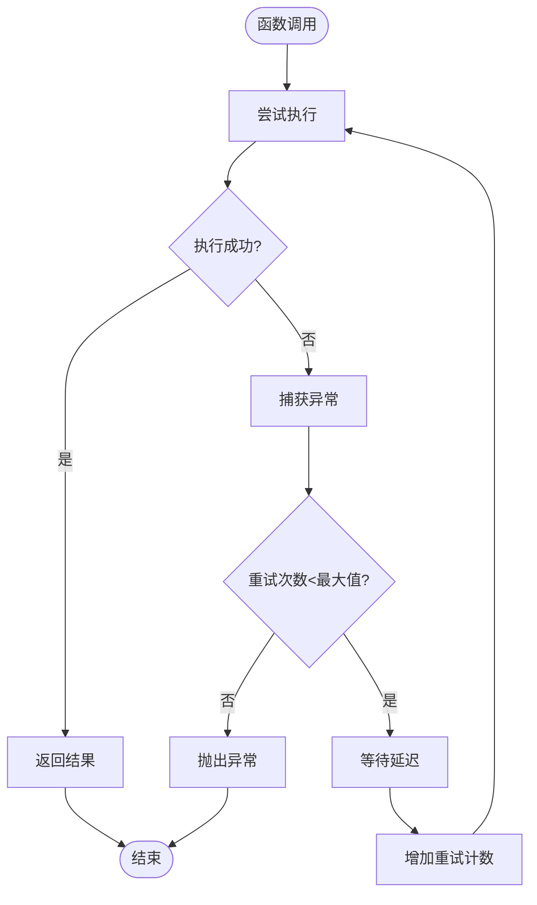
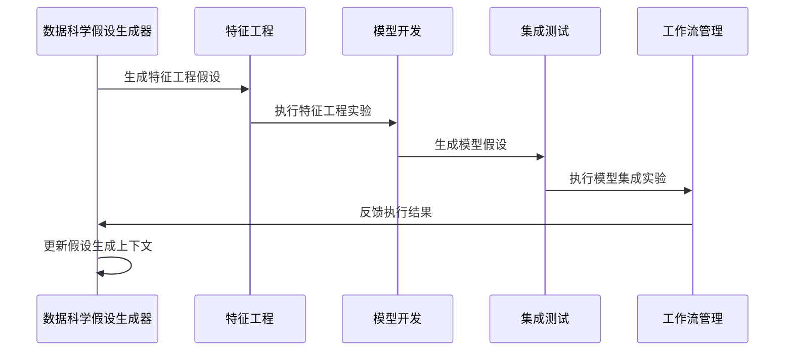

# 假设生成机制深度解析

<cite>
**本文档引用的文件**
- [rdagent/components/proposal/__init__.py](file://rdagent/components/proposal/__init__.py)
- [rdagent/components/proposal/prompts.yaml](file://rdagent/components/proposal/prompts.yaml)
- [rdagent/scenarios/data_science/proposal/exp_gen/base.py](file://rdagent/scenarios/data_science/proposal/exp_gen/base.py)
- [rdagent/scenarios/data_science/proposal/exp_gen/proposal.py](file://rdagent/scenarios/data_science/proposal/exp_gen/proposal.py)
- [rdagent/scenarios/qlib/proposal/factor_proposal.py](file://rdagent/scenarios/qlib/proposal/factor_proposal.py)
- [rdagent/utils/workflow/misc.py](file://rdagent/utils/workflow/misc.py)
- [rdagent/scenarios/kaggle/proposal/proposal.py](file://rdagent/scenarios/kaggle/proposal/proposal.py)
- [rdagent/scenarios/kaggle/knowledge_management/vector_base.py](file://rdagent/scenarios/kaggle/knowledge_management/vector_base.py)
- [rdagent/scenarios/kaggle/knowledge_management/graph.py](file://rdagent/scenarios/kaggle/knowledge_management/graph.py)
</cite>

## 目录
1. [引言](#引言)
2. [系统架构概览](#系统架构概览)
3. [LLMHypothesisGen基类设计](#llmhypothesisgen基类设计)
4. [具体实现类分析](#具体实现类分析)
5. [上下文准备机制](#上下文准备机制)
6. [响应解析与结构化](#响应解析与结构化)
7. [提示工程设计](#提示工程设计)
8. [知识检索与集成](#知识检索与集成)
9. [异常处理与重试机制](#异常处理与重试机制)
10. [实际应用场景](#实际应用场景)
11. [性能优化策略](#性能优化策略)
12. [总结](#总结)

## 引言

假设生成是RD-Agent系统中的核心功能模块，负责基于历史实验反馈、最优实践（SOTA）和知识检索结果生成新的研究假设。该机制通过LLM驱动的方式，实现了从问题识别到假设生成的完整闭环，支持数据科学和量化投资等多个专业领域的假设生成需求。

## 系统架构概览

假设生成系统采用分层架构设计，包含抽象基类、具体实现类、上下文管理器和知识检索引擎等核心组件。

**图表来源**
- [rdagent/components/proposal/__init__.py](file://rdagent/components/proposal/__init__.py#L15-L41)
- [rdagent/scenarios/data_science/proposal/exp_gen/base.py](file://rdagent/scenarios/data_science/proposal/exp_gen/base.py#L1-L50)

## LLMHypothesisGen基类设计

LLMHypothesisGen作为假设生成的核心抽象基类，定义了统一的接口规范和通用的工作流程。

### 核心接口设计

**图表来源**
- [rdagent/components/proposal/__init__.py](file://rdagent/components/proposal/__init__.py#L15-L74)

### 工作流程机制

LLMHypothesisGen的gen方法实现了标准化的假设生成工作流程：

1. **上下文准备阶段**：调用子类的prepare_context方法构建提示上下文
2. **LLM交互阶段**：使用APIBackend与大语言模型进行交互
3. **响应解析阶段**：调用子类的convert_response方法解析LLM输出
4. **假设对象生成**：返回结构化的Hypothesis对象

**章节来源**
- [rdagent/components/proposal/__init__.py](file://rdagent/components/proposal/__init__.py#L32-L74)

## 具体实现类分析

### FactorHypothesisGen实现

FactorHypothesisGen专门用于因子假设的生成，适用于量化投资领域。

#### 特性设计
- **目标定位**：专注于因子（Factor）相关的假设生成
- **场景适配**：针对量化投资场景的特殊需求
- **输出格式**：生成结构化的因子假设描述

#### 实现特点
该实现继承自LLMHypothesisGen，主要通过targets属性标识其特定的应用场景。

**章节来源**
- [rdagent/components/proposal/__init__.py](file://rdagent/components/proposal/__init__.py#L58-L62)

### ModelHypothesisGen实现

ModelHypothesisGen专门用于模型假设的生成，适用于机器学习和深度学习场景。

#### 设计考量
- **灵活性**：不指定具体的targets，适应多种模型类型
- **通用性**：支持各种机器学习模型的假设生成
- **扩展性**：便于扩展到不同的模型架构

**章节来源**
- [rdagent/components/proposal/__init__.py](file://rdagent/components/proposal/__init__.py#L64-L68)

### QlibFactorHypothesisGen实现

QlibFactorHypothesisGen是针对QLib框架的专门实现，体现了领域特定的优化。

#### 上下文准备策略

**图表来源**
- [rdagent/scenarios/qlib/proposal/factor_proposal.py](file://rdagent/scenarios/qlib/proposal/factor_proposal.py#L15-L40)

#### 响应解析机制
该实现通过JSON解析将LLM输出转换为QlibFactorHypothesis对象，确保输出格式的一致性和可解析性。

**章节来源**
- [rdagent/scenarios/qlib/proposal/factor_proposal.py](file://rdagent/scenarios/qlib/proposal/factor_proposal.py#L42-L55)

## 上下文准备机制

prepare_context方法是假设生成系统的核心组件，负责整合多源信息构建丰富的提示上下文。

### 多源信息融合

**图表来源**
- [rdagent/components/proposal/prompts.yaml](file://rdagent/components/proposal/prompts.yaml#L1-L65)

### 上下文构建策略

#### 1. 历史反馈整合
系统通过多层次的历史反馈信息构建上下文：
- **当前轮次反馈**：最新的假设执行结果和反馈
- **最近轮次反馈**：上一轮的假设和对应的评估结果
- **SOTA反馈**：最优实践的假设和执行情况

#### 2. RAG检索集成
通过generate_RAG_content函数实现知识检索与上下文的无缝集成：

**图表来源**
- [rdagent/scenarios/kaggle/proposal/proposal.py](file://rdagent/scenarios/kaggle/proposal/proposal.py#L45-L73)

#### 3. 动态上下文调整
系统根据实验轮次动态调整上下文内容：
- **早期阶段**：强调基础概念和简单假设
- **中期阶段**：引入复杂方法和创新思路
- **后期阶段**：聚焦于高级技术和优化策略

**章节来源**
- [rdagent/scenarios/qlib/proposal/factor_proposal.py](file://rdagent/scenarios/qlib/proposal/factor_proposal.py#L15-L40)

## 响应解析与结构化

convert_response方法负责将LLM的非结构化输出转换为标准化的Hypothesis对象。

### 解析流程设计

**图表来源**
- [rdagent/scenarios/qlib/proposal/factor_proposal.py](file://rdagent/scenarios/qlib/proposal/factor_proposal.py#L42-L55)

### 结构化输出规范

不同实现类采用不同的响应解析策略：

#### QlibFactorHypothesisGen解析
- **JSON模式**：启用严格的JSON模式解析
- **字段映射**：将响应字段映射到假设对象属性
- **错误处理**：提供详细的解析错误信息

#### 数据科学场景解析
- **灵活模式**：支持多种输出格式
- **字段验证**：确保关键字段的存在性
- **类型转换**：自动进行数据类型转换

**章节来源**
- [rdagent/scenarios/data_science/proposal/exp_gen/proposal.py](file://rdagent/scenarios/data_science/proposal/exp_gen/proposal.py#L815-L845)

## 提示工程设计

prompts.yaml文件定义了系统的核心提示模板，包含system_prompt和user_prompt两个主要部分。

### System Prompt设计逻辑

#### 思维链（CoT）提示策略
System Prompt采用思维链提示策略，引导LLM进行结构化思考：

**图表来源**
- [rdagent/components/proposal/prompts.yaml](file://rdagent/components/proposal/prompts.yaml#L1-L15)

#### 多样性控制策略
提示设计中融入了多样性控制机制：
- **视角切换**：要求从不同角度审视问题
- **方法对比**：比较不同解决方案的优劣
- **风险评估**：考虑潜在的风险和挑战

#### 格式约束设计
通过明确的输出格式要求确保响应的可解析性：
- **Markdown结构**：强制使用Markdown格式
- **层次化组织**：要求逻辑清晰的层级结构
- **字段完整性**：确保关键信息的完整性

**章节来源**
- [rdagent/components/proposal/prompts.yaml](file://rdagent/components/proposal/prompts.yaml#L1-L65)

### User Prompt设计逻辑

User Prompt根据具体场景动态构建，包含以下核心元素：

#### 场景信息注入
- **目标标识**：明确假设生成的目标类型
- **背景描述**：提供完整的场景背景信息
- **限制条件**：说明可用资源和约束条件

#### 历史信息整合
- **反馈循环**：建立假设-执行-反馈的闭环
- **进度跟踪**：反映实验进展和状态
- **经验传承**：利用历史成功的经验和失败的教训

#### 知识检索结果
- **相关性排序**：按相关性优先级组织检索结果
- **来源标注**：标明知识来源和可信度
- **适用性评估**：评估知识在当前场景中的适用性

**章节来源**
- [rdagent/components/proposal/prompts.yaml](file://rdagent/components/proposal/prompts.yaml#L17-L65)

## 知识检索与集成

RAG（Retrieval-Augmented Generation）系统是假设生成的重要支撑组件，实现了从知识库中检索相关信息并集成到生成过程的功能。

### 检索策略设计

**图表来源**
- [rdagent/scenarios/kaggle/knowledge_management/vector_base.py](file://rdagent/scenarios/kaggle/knowledge_management/vector_base.py#L216-L289)
- [rdagent/scenarios/kaggle/knowledge_management/graph.py](file://rdagent/scenarios/kaggle/knowledge_management/graph.py#L0-L92)

### 向量搜索机制

向量搜索采用语义相似性匹配，能够捕捉概念间的深层关联：

#### 搜索流程
1. **查询预处理**：对目标和查询进行语义编码
2. **相似性计算**：使用余弦相似度等指标
3. **结果筛选**：基于阈值和数量限制筛选结果
4. **精炼优化**：通过LLM进一步优化检索结果

#### 智能精炼
系统实现了基于LLM的检索结果精炼机制，通过额外的LLM调用来提升检索质量。

**章节来源**
- [rdagent/scenarios/kaggle/knowledge_management/vector_base.py](file://rdagent/scenarios/kaggle/knowledge_management/vector_base.py#L250-L289)

### 图谱搜索机制

图谱搜索利用结构化知识表示，提供更精确的相关性匹配：

#### 知识图谱构建
- **节点实体化**：将知识点表示为图谱节点
- **关系建模**：定义节点间的关系类型
- **属性丰富**：为节点添加丰富的元数据属性

#### 搜索算法
- **路径查找**：寻找从查询到相关知识点的最短路径
- **权重计算**：基于关系强度和路径长度计算权重
- **结果聚合**：合并多个搜索路径的结果

**章节来源**
- [rdagent/scenarios/kaggle/knowledge_management/graph.py](file://rdagent/scenarios/kaggle/knowledge_management/graph.py#L33-L92)

### 混合检索策略

系统采用混合检索策略，结合向量搜索和图谱搜索的优势：

#### 协作机制
- **互补优势**：向量搜索发现语义相似性，图谱搜索发现结构关联
- **结果融合**：通过加权融合算法整合两种搜索结果
- **质量保证**：确保检索结果的质量和相关性

#### 动态调整
- **场景感知**：根据具体场景选择合适的检索策略
- **性能优化**：平衡检索质量和响应速度
- **效果监控**：持续监控和优化检索效果

## 异常处理与重试机制

系统实现了完善的异常处理和重试机制，确保假设生成过程的稳定性和可靠性。

### 重试装饰器设计

**图表来源**
- [rdagent/utils/workflow/misc.py](file://rdagent/utils/workflow/misc.py#L0-L40)

### 异常分类处理

系统对不同类型的异常采用差异化的处理策略：

#### 网络异常
- **连接超时**：自动重试，指数退避策略
- **服务不可用**：降级处理，使用缓存结果
- **认证失败**：重新认证，更新凭据

#### LLM响应异常
- **格式错误**：解析失败时的回退机制
- **内容质量问题**：质量评估和重新生成
- **Token限制**：分段处理和上下文压缩

#### 数据异常
- **格式不匹配**：数据清洗和标准化
- **缺失值处理**：插值和默认值填充
- **类型转换**：自动类型推断和转换

### 重试策略优化

#### 指数退避策略
- **基础延迟**：初始重试延迟时间
- **退避因子**：每次重试的延迟增长倍数
- **最大延迟**：防止无限增长的延迟上限

#### 智能终止条件
- **成功率阈值**：达到一定成功率后停止重试
- **时间限制**：总重试时间不超过设定上限
- **资源限制**：避免过度消耗系统资源

**章节来源**
- [rdagent/utils/workflow/misc.py](file://rdagent/utils/workflow/misc.py#L0-L40)

## 实际应用场景

### 数据科学场景应用

在数据科学场景中，假设生成系统展现了强大的跨组件协同能力：

#### 组件间协作机制

**图表来源**
- [rdagent/scenarios/data_science/proposal/exp_gen/base.py](file://rdagent/scenarios/data_science/proposal/exp_gen/base.py#L80-L120)

#### 跨领域知识迁移
- **领域知识**：将一个领域的成功经验迁移到新领域
- **方法论**：借鉴其他领域的研究方法和工具
- **最佳实践**：推广经过验证的成功模式

### 量化投资场景应用

在量化投资领域，假设生成系统针对因子开发进行了专门优化：

#### 因子假设生成流程
1. **市场分析**：分析当前市场环境和趋势
2. **历史回顾**：回顾历史成功的因子策略
3. **技术评估**：评估不同技术方法的适用性
4. **风险控制**：考虑因子的风险特征和稳定性

#### SOTA集成机制
- **基准对比**：与当前最优因子进行对比分析
- **差距识别**：识别现有因子的不足之处
- **改进方向**：提出针对性的改进方案

**章节来源**
- [rdagent/scenarios/qlib/proposal/factor_proposal.py](file://rdagent/scenarios/qlib/proposal/factor_proposal.py#L15-L55)

## 性能优化策略

### 并行处理优化

系统采用多种并行处理策略提升性能：

#### 批量处理
- **批量请求**：将多个假设生成请求合并处理
- **流水线并行**：不同阶段的处理并行执行
- **资源池化**：共享计算资源和模型实例

#### 缓存机制
- **响应缓存**：缓存相似查询的响应结果
- **上下文缓存**：缓存常用的上下文信息
- **知识缓存**：缓存频繁访问的知识条目

### 内存优化

#### 流式处理
- **增量加载**：按需加载大型知识库
- **内存映射**：使用内存映射文件减少内存占用
- **垃圾回收**：及时释放不再使用的资源

#### 数据压缩
- **序列化优化**：使用高效的序列化格式
- **压缩存储**：对静态数据进行压缩存储
- **懒加载**：延迟加载非关键数据

### 网络优化

#### 连接池管理
- **连接复用**：复用HTTP连接减少开销
- **负载均衡**：在多个服务实例间分配请求
- **故障转移**：自动切换到备用服务

#### 请求优化
- **请求合并**：合并小的请求减少网络开销
- **压缩传输**：启用数据压缩减少传输时间
- **超时控制**：合理设置超时参数

## 总结

假设生成机制作为RD-Agent系统的核心组件，通过LLMHypothesisGen基类提供了统一的抽象接口，同时通过具体的实现类满足不同场景的特殊需求。系统采用了多层次的上下文准备机制，整合历史实验反馈、SOTA结果和RAG检索到的知识，构建了丰富的提示上下文。

提示工程设计遵循思维链（CoT）策略，通过system_prompt和user_prompt的精心设计，引导LLM进行结构化思考和创造性假设生成。异常处理与重试机制确保了系统的稳定性和可靠性，而知识检索与集成机制则为假设生成提供了强大的知识支撑。

在实际应用中，假设生成机制展现了良好的跨领域适应性和强大的协同能力，特别是在数据科学和量化投资等专业领域取得了显著成效。通过持续的性能优化和功能增强，该系统为自动化研究和开发提供了强有力的支持。

未来的发展方向包括进一步优化提示工程策略、扩展知识库覆盖范围、提升多语言支持能力，以及探索更先进的LLM模型和算法，以不断提升假设生成的质量和效率。