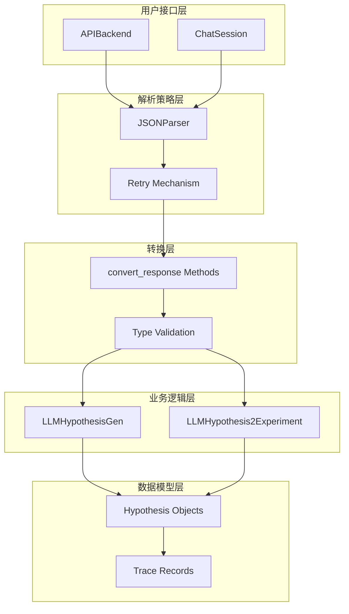
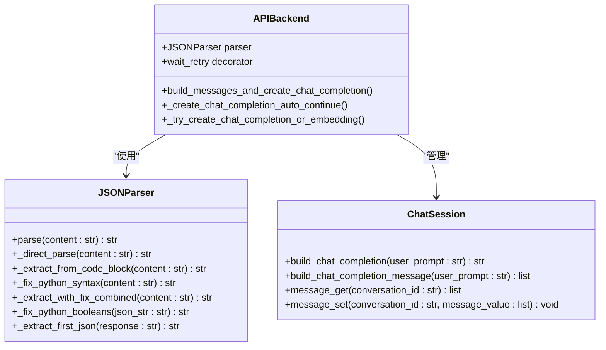
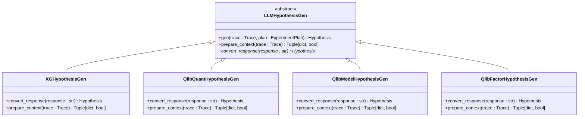
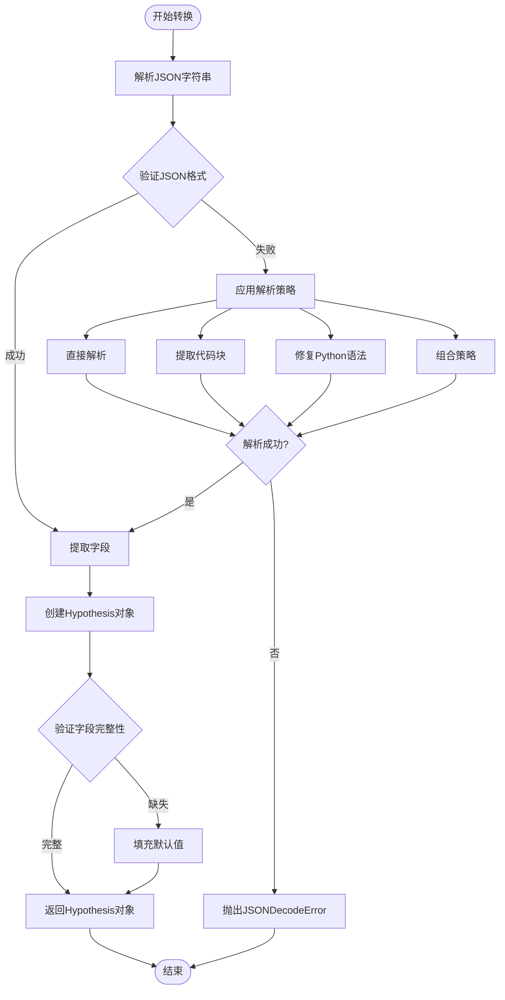
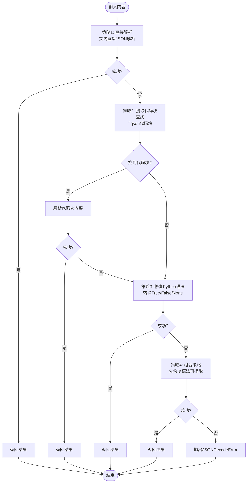
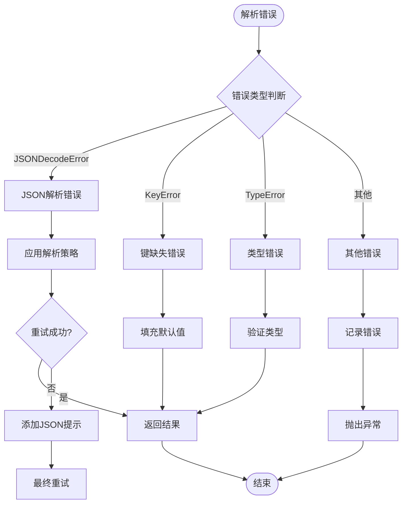
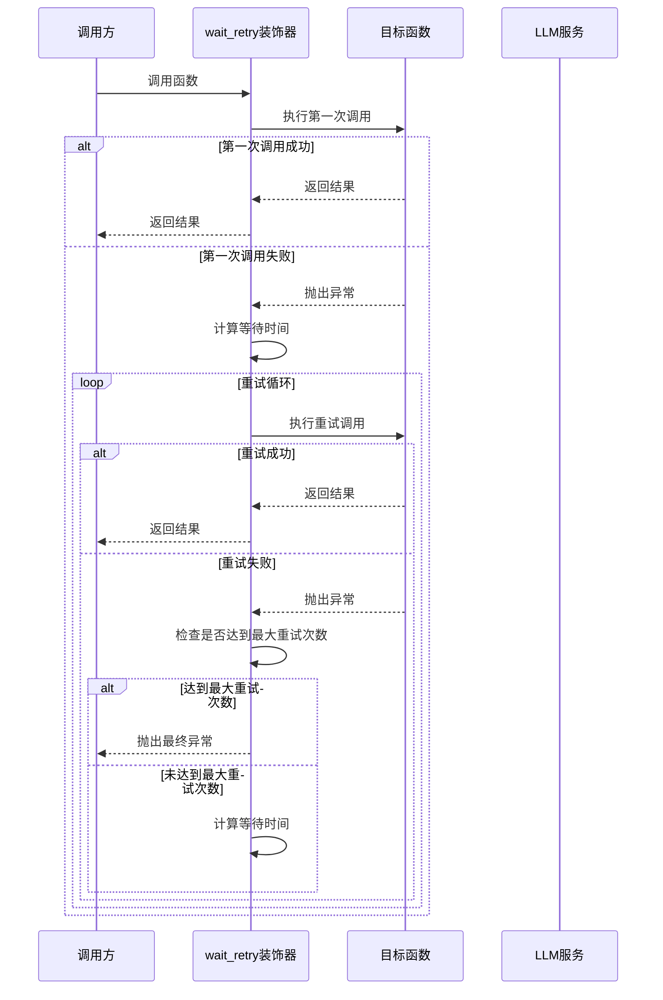

# 响应解析

<cite>
**本文档中引用的文件**
- [base.py](file://rdagent/oai/backend/base.py)
- [__init__.py](file://rdagent/components/proposal/__init__.py)
- [proposal.py](file://rdagent/scenarios/kaggle/proposal/proposal.py)
- [quant_proposal.py](file://rdagent/scenarios/qlib/proposal/quant_proposal.py)
- [model_proposal.py](file://rdagent/scenarios/qlib/proposal/model_proposal.py)
- [factor_proposal.py](file://rdagent/scenarios/qlib/proposal/factor_proposal.py)
- [misc.py](file://rdagent/utils/workflow/misc.py)
- [proposal.py](file://rdagent/core/proposal.py)
</cite>

## 目录
1. [简介](#简介)
2. [系统架构概览](#系统架构概览)
3. [核心组件分析](#核心组件分析)
4. [convert_response方法详解](#convert_response方法详解)
5. [JSON解析策略](#json解析策略)
6. [正则表达式处理](#正则表达式处理)
7. [容错机制设计](#容错机制设计)
8. [重试机制分析](#重试机制分析)
9. [性能与准确性权衡](#性能与准确性权衡)
10. [故障排除指南](#故障排除指南)
11. [总结](#总结)

## 简介

LLM响应解析是RD-Agent系统中的关键组件，负责将非结构化的LLM输出转换为结构化的Hypothesis对象。该过程涉及复杂的JSON解析、正则表达式匹配、容错处理和重试机制，确保即使在面对格式错误或不完整的响应时也能保持系统的稳定性和准确性。

本文档深入分析convert_response方法的工作原理，展示从原始文本到Hypothesis对象的完整转换流程，并探讨各种解析策略的协同工作机制。

## 系统架构概览

RD-Agent的响应解析系统采用分层架构设计，主要包含以下层次：



**图表来源**
- [base.py](file://rdagent/oai/backend/base.py#L44-L141)
- [__init__.py](file://rdagent/components/proposal/__init__.py#L17-L119)

## 核心组件分析

### APIBackend类

APIBackend是整个响应解析系统的核心入口点，负责管理与LLM服务的交互并提供多种解析策略。



**图表来源**
- [base.py](file://rdagent/oai/backend/base.py#L44-L141)
- [base.py](file://rdagent/oai/backend/base.py#L280-L320)

**章节来源**
- [base.py](file://rdagent/oai/backend/base.py#L44-L710)

### LLMHypothesisGen基类

LLMHypothesisGen定义了Hypothesis生成的标准流程，其中convert_response方法是核心的转换函数。



**图表来源**
- [__init__.py](file://rdagent/components/proposal/__init__.py#L17-L63)
- [proposal.py](file://rdagent/scenarios/kaggle/proposal/proposal.py#L184-L303)
- [quant_proposal.py](file://rdagent/scenarios/qlib/proposal/quant_proposal.py#L45-L178)

**章节来源**
- [__init__.py](file://rdagent/components/proposal/__init__.py#L17-L119)

## convert_response方法详解

convert_response方法是响应解析的核心，负责将LLM返回的JSON字符串转换为具体的Hypothesis对象。不同场景下的实现展示了灵活的转换策略。

### 基础转换流程



**图表来源**
- [base.py](file://rdagent/oai/backend/base.py#L54-L77)
- [proposal.py](file://rdagent/scenarios/kaggle/proposal/proposal.py#L290-L303)

### 具体实现分析

#### Kaggle场景的convert_response实现

Kaggle场景的实现展示了标准的JSON解析和字段映射过程：

**章节来源**
- [proposal.py](file://rdagent/scenarios/kaggle/proposal/proposal.py#L290-L303)

#### Qlib量化场景的convert_response实现

Qlib量化场景的实现包含了额外的action字段处理：

**章节来源**
- [quant_proposal.py](file://rdagent/scenarios/qlib/proposal/quant_proposal.py#L167-L178)

#### Qlib模型场景的convert_response实现

Qlib模型场景专注于模型相关的字段提取：

**章节来源**
- [model_proposal.py](file://rdagent/scenarios/qlib/proposal/model_proposal.py#L59-L69)

### 字段提取与类型验证

不同场景下的Hypothesis对象具有不同的字段结构，但都遵循统一的提取模式：

| 场景 | 主要字段 | 类型验证 | 默认值处理 |
|------|----------|----------|------------|
| Kaggle | hypothesis, reason, action | 字符串类型检查 | "未提供" |
| Qlib量化 | hypothesis, reason, action, action | 完整性验证 | 自动填充 |
| Qlib模型 | hypothesis, reason, concise_reason | 字段存在性检查 | 空字符串 |
| Qlib因子 | hypothesis, reason, concise_reason | 结构化验证 | 默认描述 |

## JSON解析策略

JSONParser类实现了多策略的JSON解析机制，能够处理各种格式错误和不规范的LLM输出。

### 解析策略层次



**图表来源**
- [base.py](file://rdagent/oai/backend/base.py#L54-L107)

### 策略实现细节

#### 策略1：直接解析

直接尝试JSON解析，处理可能的"多余数据"错误：

**章节来源**
- [base.py](file://rdagent/oai/backend/base.py#L75-L85)

#### 策略2：提取代码块

使用正则表达式从代码块中提取JSON内容：

**章节来源**
- [base.py](file://rdagent/oai/backend/base.py#L87-L95)

#### 策略3：修复Python语法

将Python风格的布尔值和None值转换为JSON标准格式：

**章节来源**
- [base.py](file://rdagent/oai/backend/base.py#L97-L141)

#### 策略4：组合策略

结合语法修复和代码块提取的综合策略：

**章节来源**
- [base.py](file://rdagent/oai/backend/base.py#L97-L107)

## 正则表达式处理

虽然当前实现主要依赖于JSONParser的内置策略，但在某些情况下仍会使用正则表达式进行辅助处理。

### 代码块提取模式

正则表达式用于识别和提取嵌入在代码块中的JSON内容：

```python
# 模式匹配示例
pattern = r"```json\s*(.*?)\s*```"
match = re.search(pattern, content, re.DOTALL)
```

### 思维链处理

对于支持思维链推理的模型，系统会移除思考过程中的标记：

**章节来源**
- [base.py](file://rdagent/oai/backend/base.py#L370-L380)

## 容错机制设计

容错机制确保系统在面对各种异常情况时仍能正常运行。

### 错误分类与处理



**图表来源**
- [base.py](file://rdagent/oai/backend/base.py#L440-L480)

### 缓存机制

系统实现了智能缓存机制来提高性能和可靠性：

**章节来源**
- [base.py](file://rdagent/oai/backend/base.py#L143-L180)

## 重试机制分析

重试机制通过wait_retry装饰器实现，提供了灵活的错误恢复能力。

### 重试配置参数

| 参数 | 默认值 | 说明 |
|------|--------|------|
| retry_n | 5 | 最大重试次数 |
| sleep_time | 1秒 | 重试间隔时间 |
| transform_args_fn | None | 参数转换函数 |

### 重试流程



**图表来源**
- [misc.py](file://rdagent/utils/workflow/misc.py#L8-L53)

**章节来源**
- [misc.py](file://rdagent/utils/workflow/misc.py#L0-L53)

### 动态参数调整

重试机制支持动态调整参数以应对不同的错误情况：

**章节来源**
- [misc.py](file://rdagent/utils/workflow/misc.py#L38-L53)

## 性能与准确性权衡

系统在性能和准确性之间进行了精心的平衡设计。

### 性能优化策略

1. **缓存机制**: 避免重复的LLM调用
2. **并发控制**: 限制同时进行的请求数量
3. **智能重试**: 根据错误类型决定是否重试
4. **超时管理**: 设置合理的超时时间

### 准确性保证措施

1. **多策略解析**: 多种解析策略确保兼容性
2. **类型验证**: 严格的字段类型检查
3. **默认值填充**: 保证字段完整性
4. **错误日志**: 详细的错误记录便于调试

### 性能监控指标

| 指标 | 目标值 | 监控方式 |
|------|--------|----------|
| 平均响应时间 | <2秒 | 时间戳记录 |
| 成功率 | >95% | 成功/总调用比例 |
| 缓存命中率 | >80% | 缓存统计 |
| 重试成功率 | >90% | 重试成功/失败比例 |

## 故障排除指南

### 常见问题及解决方案

#### JSON解析失败

**症状**: 抛出JSONDecodeError异常
**原因**: LLM输出格式不正确
**解决方案**:
1. 检查提示词是否要求JSON格式
2. 启用add_json_in_prompt选项
3. 使用更严格的JSON解析策略

#### 字段缺失

**症状**: KeyError异常或字段为空
**原因**: LLM未生成预期字段
**解决方案**:
1. 检查提示词中的字段定义
2. 添加字段默认值处理
3. 增强字段验证逻辑

#### 类型错误

**症状**: TypeError异常
**原因**: 字段类型不符合预期
**解决方案**:
1. 明确指定字段类型
2. 添加类型转换逻辑
3. 实现类型验证机制

### 调试技巧

1. **启用详细日志**: 设置DEBUG级别日志
2. **检查中间结果**: 输出解析前后的数据
3. **测试边界情况**: 验证极端输入的处理
4. **监控性能指标**: 关注响应时间和成功率

**章节来源**
- [base.py](file://rdagent/oai/backend/base.py#L440-L520)

## 总结

RD-Agent的响应解析机制通过多层次的设计实现了高可靠性和灵活性。convert_response方法作为核心转换器，结合JSONParser的多策略解析、完善的容错机制和智能重试系统，确保了即使在面对各种格式错误和不完整响应时也能保持系统的稳定运行。

系统的主要优势包括：

1. **鲁棒性强**: 多种解析策略确保兼容各种LLM输出格式
2. **容错性好**: 完善的错误处理和恢复机制
3. **可扩展性佳**: 模块化设计便于添加新的解析策略
4. **性能优异**: 缓存机制和智能重试优化性能

通过持续的优化和改进，该响应解析机制为RD-Agent提供了坚实的基础，支撑了复杂的人工智能实验生成和优化任务。