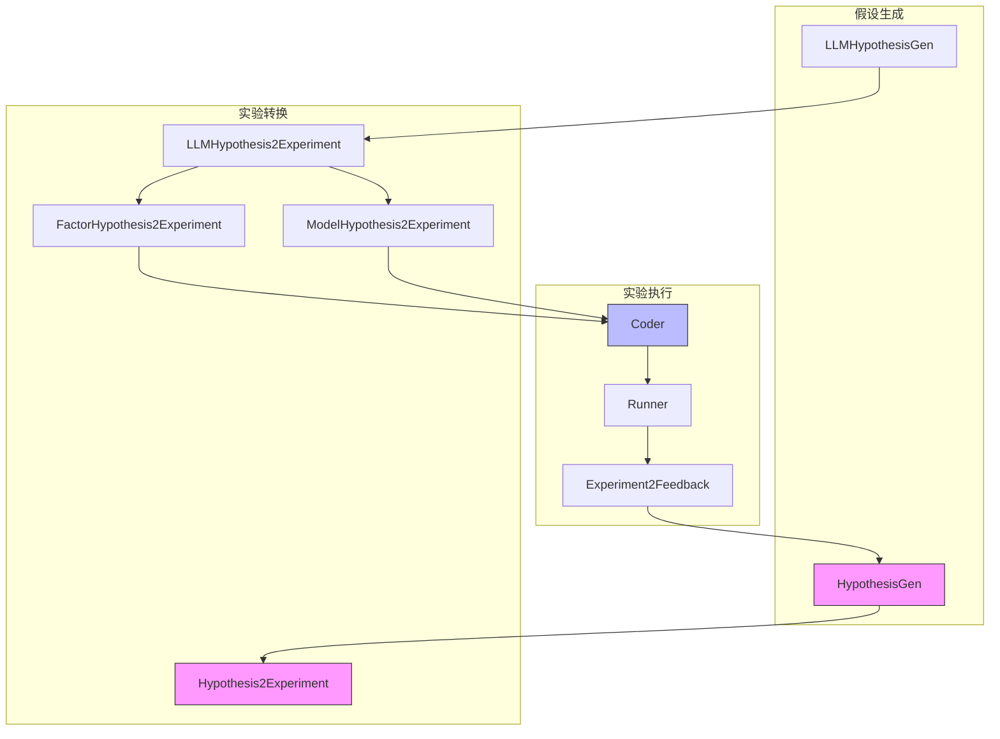
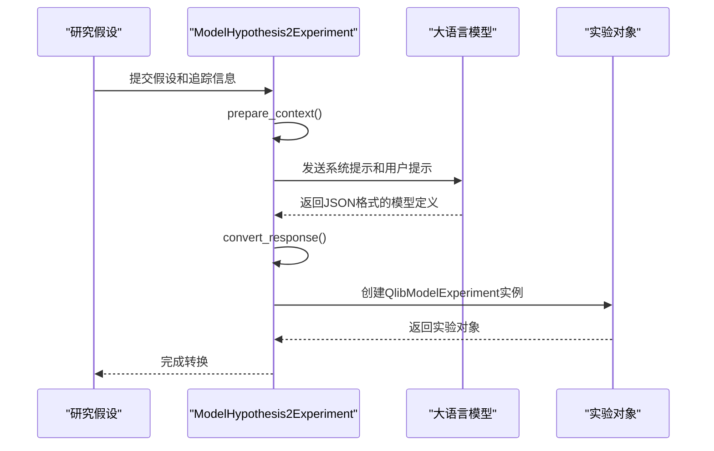
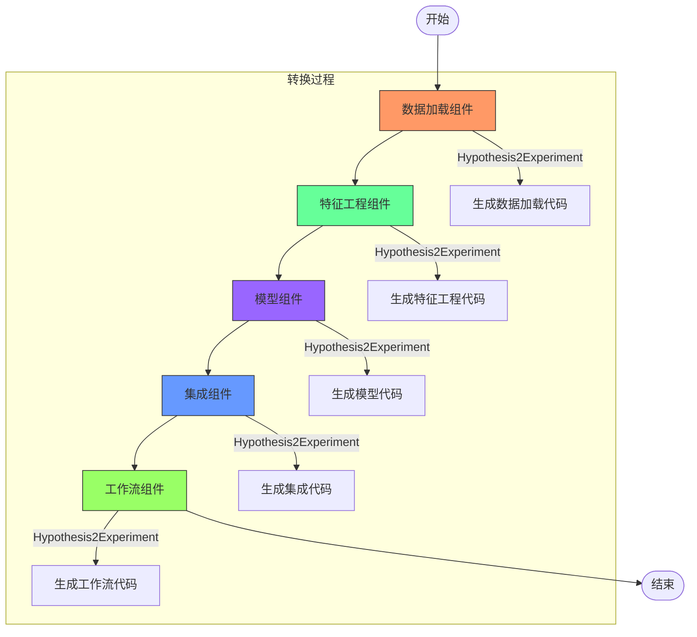
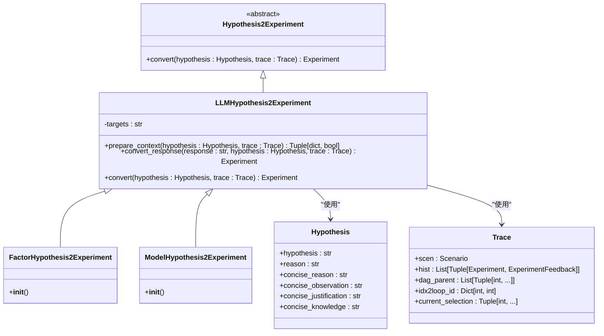

# 实验转换

<cite>
**本文档引用的文件**  
- [hypothesis.py](file://rdagent\core\proposal.py)
- [hypothesis2experiment.py](file://rdagent\components\proposal\__init__.py)
- [factor_proposal.py](file://rdagent\scenarios\qlib\proposal\factor_proposal.py)
- [model_proposal.py](file://rdagent\scenarios\qlib\proposal\model_proposal.py)
- [kaggle_experiment.py](file://rdagent\scenarios\kaggle\experiment\kaggle_experiment.py)
- [scenario.py](file://rdagent\scenarios\data_science\proposal\exp_gen\base.py)
- [prompts.yaml](file://rdagent\components\proposal\prompts.yaml)
- [factor_experiment.py](file://rdagent\scenarios\qlib\experiment\factor_experiment.py)
- [model_experiment.py](file://rdagent\scenarios\qlib\experiment\model_experiment.py)
- [kaggle_scenario.py](file://rdagent\scenarios\kaggle\experiment\scenario.py)
</cite>

## 目录
1. [引言](#引言)
2. [核心组件](#核心组件)
3. [架构概述](#架构概述)
4. [详细组件分析](#详细组件分析)
5. [依赖分析](#依赖分析)
6. [性能考虑](#性能考虑)
7. [故障排除指南](#故障排除指南)
8. [结论](#结论)

## 引言
本文档详细阐述了Hypothesis2Experiment转换器的设计与实现，重点分析其如何将抽象的研究假设转化为具体的、可执行的实验计划。该系统通过FactorHypothesis2Experiment和ModelHypothesis2Experiment两个核心组件，在不同领域场景下实现假设到实验的转换逻辑。文档将说明特征工程代码生成、模型架构定义和训练流程配置的具体实现机制，并描述转换过程中对假设可行性的验证方法以及与Coder组件的协同工作方式。通过data_science场景中的pipeline构建和qlib场景中的因子/模型实验模板，展示从Hypothesis对象到Experiment对象的完整映射过程，同时说明错误处理与默认策略。

## 核心组件

Hypothesis2Experiment转换器的核心组件包括抽象基类Hypothesis2Experiment及其具体实现类FactorHypothesis2Experiment和ModelHypothesis2Experiment。这些组件负责将高层次的研究假设转换为具体的实验计划。转换过程包括准备上下文、调用LLM生成响应和将响应转换为实验对象三个主要步骤。系统通过Trace对象维护实验历史和依赖关系，确保实验的可追溯性和可重复性。

**中文转换规则**
- 所有标题、标签、引用注释、图表注释和其他元素必须完全转换为中文
- 文件引用标题（markdown中的**内容**）应显示为中文
- 必须使用对应的中文输出以下字符串：Table of Contents, Section sources, Diagram sources

**本节来源**
- [hypothesis.py](file://rdagent\core\proposal.py#L359-L367)
- [hypothesis2experiment.py](file://rdagent\components\proposal\__init__.py#L122-L131)

## 架构概述

**图表来源**
- [hypothesis.py](file://rdagent\core\proposal.py)
- [hypothesis2experiment.py](file://rdagent\components\proposal\__init__.py)

## 详细组件分析

### FactorHypothesis2Experiment分析

FactorHypothesis2Experiment是专门用于因子假设到实验转换的组件。它继承自LLMHypothesis2Experiment，通过prepare_context方法准备转换所需的上下文信息，包括目标假设、场景描述、历史反馈和RAG（检索增强生成）内容。convert_response方法负责将LLM生成的JSON响应解析为具体的QlibFactorExperiment对象。

**图表来源**
- [factor_proposal.py](file://rdagent\scenarios\qlib\proposal\factor_proposal.py#L54-L81)
- [factor_experiment.py](file://rdagent\scenarios\qlib\experiment\factor_experiment.py#L0-L90)

### ModelHypothesis2Experiment分析

ModelHypothesis2Experiment组件负责将模型相关的研究假设转换为具体的实验计划。与因子转换器类似，它也实现了prepare_context和convert_response两个核心方法。在prepare_context中，系统会根据场景类型获取相应的描述信息，并构建包含目标假设、历史反馈和SOTA（当前最佳）结果的上下文。

**图表来源**
- [model_proposal.py](file://rdagent\scenarios\qlib\proposal\model_proposal.py#L66-L94)
- [model_experiment.py](file://rdagent\scenarios\qlib\experiment\model_experiment.py#L0-L82)

### 数据科学场景中的Pipeline构建

在data_science场景中，Hypothesis2Experiment转换器与Coder组件协同工作，构建完整的机器学习pipeline。系统通过DSTrace对象管理实验的完整生命周期，从数据加载、特征工程到模型训练和集成。每个组件的转换都遵循严格的顺序，确保pipeline的完整性和可执行性。

**图表来源**
- [scenario.py](file://rdagent\scenarios\data_science\proposal\exp_gen\base.py#L0-L348)
- [kaggle_experiment.py](file://rdagent\scenarios\kaggle\experiment\kaggle_experiment.py)

**本节来源**
- [scenario.py](file://rdagent\scenarios\data_science\proposal\exp_gen\base.py)
- [kaggle_experiment.py](file://rdagent\scenarios\kaggle\experiment\kaggle_experiment.py)

## 依赖分析

**图表来源**
- [hypothesis.py](file://rdagent\core\proposal.py)
- [hypothesis2experiment.py](file://rdagent\components\proposal\__init__.py)

**本节来源**
- [hypothesis.py](file://rdagent\core\proposal.py)
- [hypothesis2experiment.py](file://rdagent\components\proposal\__init__.py)

## 性能考虑

Hypothesis2Experiment转换器在设计时考虑了多个性能优化方面。首先，系统通过wait_retry装饰器实现了重试机制，确保在LLM调用失败时能够自动重试最多5次，提高了系统的鲁棒性。其次，转换过程中的上下文准备和响应解析都经过优化，减少了不必要的计算开销。

在大规模实验场景中，系统通过Trace对象的有效管理，避免了重复计算和资源浪费。同时，通过将复杂的转换逻辑分解为prepare_context和convert_response两个独立的方法，实现了关注点分离，提高了代码的可维护性和可测试性。

**本节来源**
- [hypothesis2experiment.py](file://rdagent\components\proposal\__init__.py#L102-L137)
- [prompts.yaml](file://rdagent\components\proposal\prompts.yaml)

## 故障排除指南

当Hypothesis2Experiment转换器遇到问题时，可以按照以下步骤进行排查：

1. **检查假设格式**：确保输入的Hypothesis对象包含所有必需的字段，包括hypothesis、reason、concise_reason等。

2. **验证上下文准备**：检查prepare_context方法的返回值，确保上下文字典包含所有必需的键，如target_hypothesis、scenario、experiment_output_format等。

3. **分析LLM响应**：如果转换失败，检查LLM返回的原始响应，确认其是否符合预期的JSON格式。

4. **检查依赖关系**：确保Trace对象中的历史记录和依赖关系正确无误，特别是dag_parent和hist列表的同步。

5. **查看错误日志**：系统会记录详细的错误信息，包括异常堆栈跟踪，帮助定位问题根源。

**本节来源**
- [hypothesis.py](file://rdagent\core\proposal.py)
- [hypothesis2experiment.py](file://rdagent\components\proposal\__init__.py)

## 结论

Hypothesis2Experiment转换器是RD-Agent系统中的关键组件，它实现了从抽象研究假设到具体可执行实验的自动化转换。通过FactorHypothesis2Experiment和ModelHypothesis2Experiment两个专用转换器，系统能够在不同领域场景下有效地将假设转化为实验计划。

转换器的设计体现了模块化和可扩展性的原则，通过抽象基类定义通用接口，具体实现类处理特定领域的转换逻辑。与Coder组件的紧密集成确保了生成的实验代码能够被正确执行和评估。

未来的工作可以集中在优化LLM提示工程、增强错误恢复机制和扩展支持更多的实验类型上，进一步提升系统的智能化水平和实用性。