# Runner组件

<cite>
**本文档中引用的文件**
- [rdagent/components/runner/__init__.py](file://rdagent/components/runner/__init__.py)
- [rdagent/scenarios/kaggle/developer/runner.py](file://rdagent/scenarios/kaggle/developer/runner.py)
- [rdagent/scenarios/qlib/developer/model_runner.py](file://rdagent/scenarios/qlib/developer/model_runner.py)
- [rdagent/scenarios/qlib/developer/factor_runner.py](file://rdagent/scenarios/qlib/developer/factor_runner.py)
- [rdagent/core/developer.py](file://rdagent/core/developer.py)
- [rdagent/core/experiment.py](file://rdagent/core/experiment.py)
- [rdagent/utils/env.py](file://rdagent/utils/env.py)
- [rdagent/scenarios/kaggle/experiment/workspace.py](file://rdagent/scenarios/kaggle/experiment/workspace.py)
</cite>

## 目录
1. [简介](#简介)
2. [项目结构](#项目结构)
3. [核心组件](#核心组件)
4. [架构概览](#架构概览)
5. [详细组件分析](#详细组件分析)
6. [依赖关系分析](#依赖关系分析)
7. [性能考虑](#性能考虑)
8. [故障排除指南](#故障排除指南)
9. [结论](#结论)

## 简介

Runner组件是R&D-Agent框架中的核心执行引擎，负责在沙箱环境中安全地执行生成的实验代码。该组件通过CachedRunner基类实现了智能缓存机制，支持结果复用和实验状态管理。Runner组件与具体的场景实验类（如KaggleExperiment、QuantExperiment）紧密集成，能够在Docker容器或隔离环境中安全执行代码，确保实验的可重现性和安全性。

Runner组件在R&D闭环中扮演着执行者的角色，接收Coder输出的实验对象，执行代码并返回执行结果，同时与评估系统进行数据交互。该组件的设计充分考虑了实验环境的安全性、可扩展性和性能优化。

## 项目结构

Runner组件的文件组织结构如下：

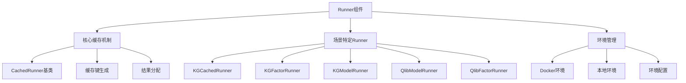

**图表来源**
- [rdagent/components/runner/__init__.py](file://rdagent/components/runner/__init__.py#L5-L19)
- [rdagent/scenarios/kaggle/developer/runner.py](file://rdagent/scenarios/kaggle/developer/runner.py#L15-L30)

**章节来源**
- [rdagent/components/runner/__init__.py](file://rdagent/components/runner/__init__.py#L1-L21)
- [rdagent/scenarios/kaggle/developer/runner.py](file://rdagent/scenarios/kaggle/developer/runner.py#L1-L132)

## 核心组件

### CachedRunner基类

CachedRunner是所有Runner组件的基础类，提供了缓存机制的核心功能：

#### 缓存键生成机制

CachedRunner通过`get_cache_key`方法实现智能缓存键生成，该方法基于实验任务信息生成MD5哈希值：

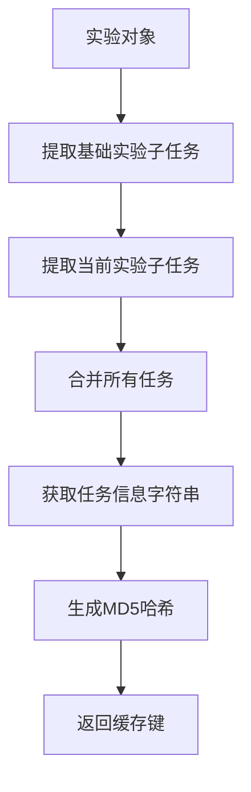

**图表来源**
- [rdagent/components/runner/__init__.py](file://rdagent/components/runner/__init__.py#L7-L13)

#### 结果分配机制

`assign_cached_result`方法负责将缓存的实验结果正确分配到新的实验对象中：

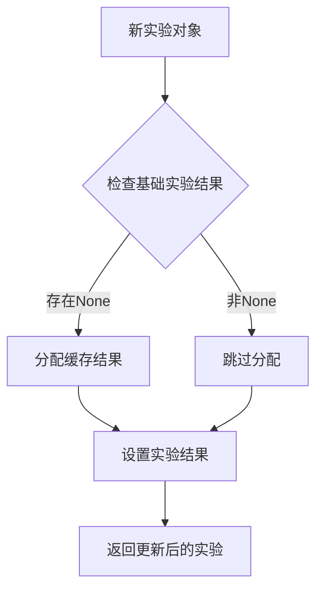

**图表来源**
- [rdagent/components/runner/__init__.py](file://rdagent/components/runner/__init__.py#L15-L19)

**章节来源**
- [rdagent/components/runner/__init__.py](file://rdagent/components/runner/__init__.py#L5-L19)

## 架构概览

Runner组件的整体架构体现了分层设计和职责分离的原则：

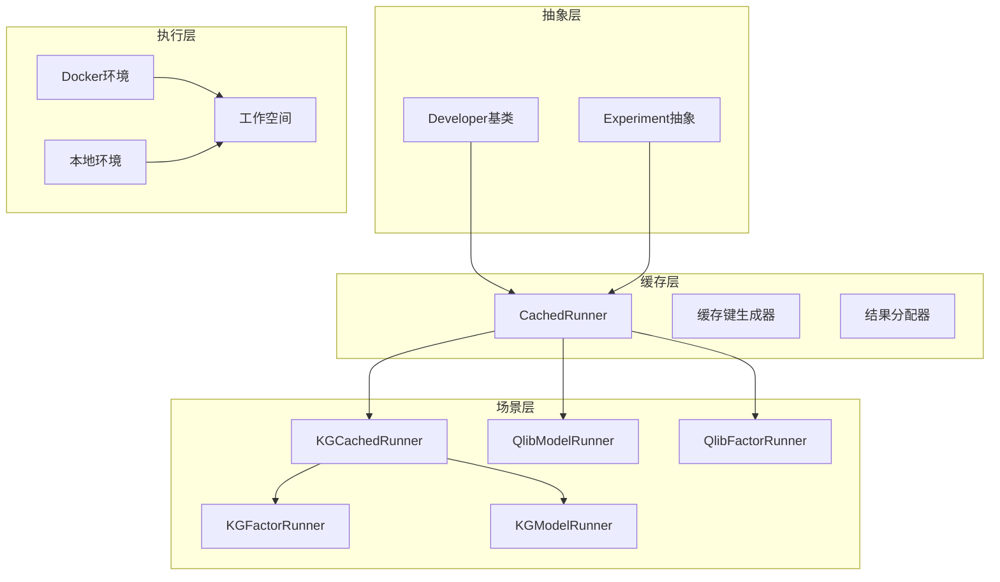

**图表来源**
- [rdagent/core/developer.py](file://rdagent/core/developer.py#L12-L34)
- [rdagent/core/experiment.py](file://rdagent/core/experiment.py#L280-L350)

## 详细组件分析

### Kaggle场景Runner

#### KGCachedRunner

KGCachedRunner专门针对Kaggle竞赛场景进行了优化，提供了更精细的缓存控制：

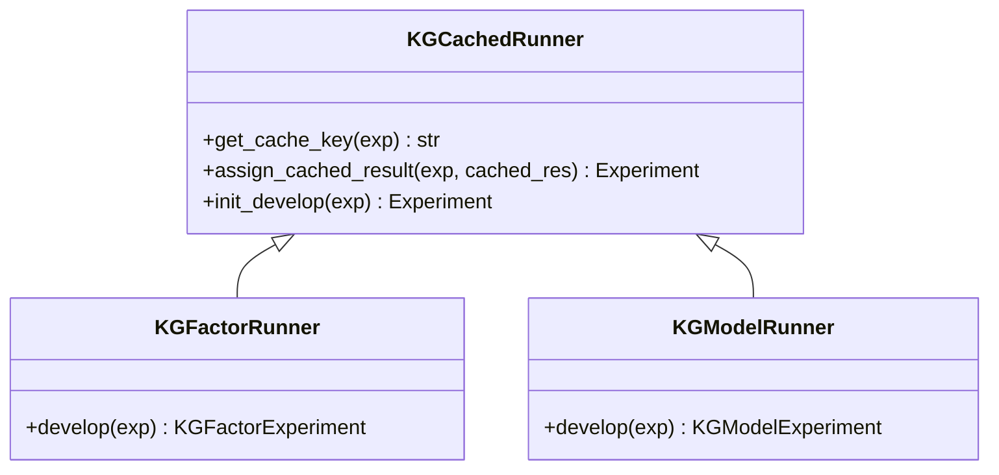

**图表来源**
- [rdagent/scenarios/kaggle/developer/runner.py](file://rdagent/scenarios/kaggle/developer/runner.py#L15-L30)
- [rdagent/scenarios/kaggle/developer/runner.py](file://rdagent/scenarios/kaggle/developer/runner.py#L55-L132)

#### 缓存键生成策略

KGCachedRunner的缓存键生成策略更加复杂，不仅包含任务信息，还包含了实际的代码内容：

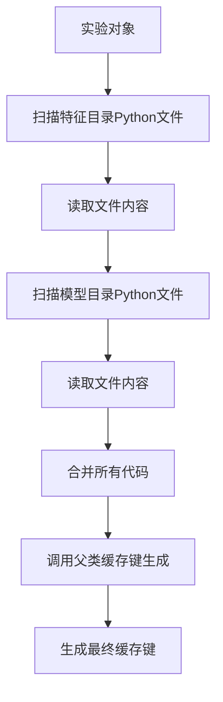

**图表来源**
- [rdagent/scenarios/kaggle/developer/runner.py](file://rdagent/scenarios/kaggle/developer/runner.py#L17-L26)

#### 结果复制机制

KGCachedRunner实现了复杂的实验结果复制逻辑，确保实验状态的一致性：

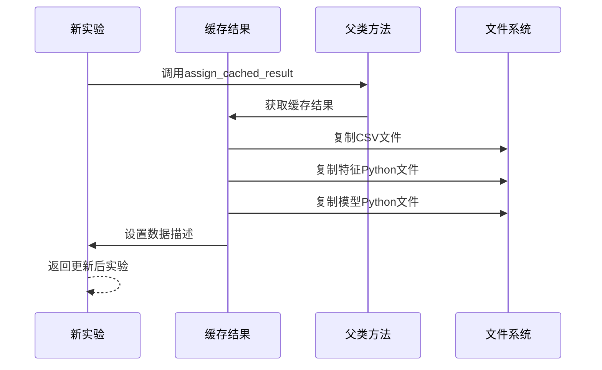

**图表来源**
- [rdagent/scenarios/kaggle/developer/runner.py](file://rdagent/scenarios/kaggle/developer/runner.py#L28-L38)

**章节来源**
- [rdagent/scenarios/kaggle/developer/runner.py](file://rdagent/scenarios/kaggle/developer/runner.py#L15-L132)

### 量化场景Runner

#### QlibModelRunner

QlibModelRunner负责量化投资领域的模型训练和评估：

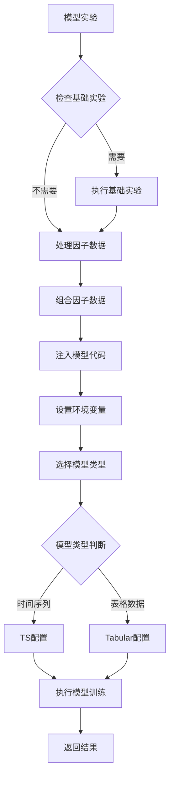

**图表来源**
- [rdagent/scenarios/qlib/developer/model_runner.py](file://rdagent/scenarios/qlib/developer/model_runner.py#L25-L108)

#### QlibFactorRunner

QlibFactorRunner专注于因子工程和因子去重：

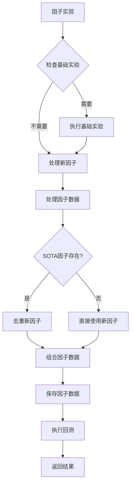

**图表来源**
- [rdagent/scenarios/qlib/developer/factor_runner.py](file://rdagent/scenarios/qlib/developer/factor_runner.py#L60-L185)

**章节来源**
- [rdagent/scenarios/qlib/developer/model_runner.py](file://rdagent/scenarios/qlib/developer/model_runner.py#L1-L109)
- [rdagent/scenarios/qlib/developer/factor_runner.py](file://rdagent/scenarios/qlib/developer/factor_runner.py#L1-L186)

### 环境管理系统

#### Docker环境集成

Runner组件通过Docker环境实现代码的安全执行：

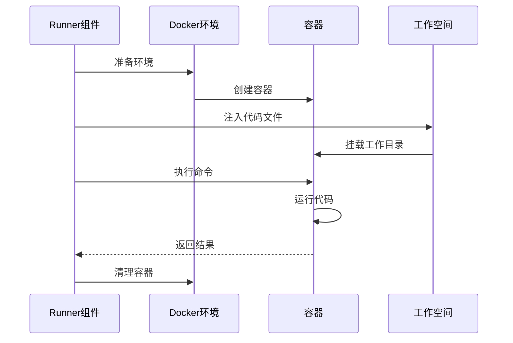

**图表来源**
- [rdagent/utils/env.py](file://rdagent/utils/env.py#L896-L944)

#### 环境配置管理

环境管理系统提供了灵活的配置选项：

| 配置项 | 类型 | 默认值 | 描述 |
|--------|------|--------|------|
| running_timeout_period | int | 3600 | 运行超时时间（秒） |
| enable_cache | bool | True | 是否启用缓存 |
| retry_count | int | 5 | 重试次数 |
| mem_limit | str | None | 内存限制 |
| cpu_count | int | None | CPU数量限制 |
| shm_size | str | None | 共享内存大小 |

**章节来源**
- [rdagent/utils/env.py](file://rdagent/utils/env.py#L104-L120)

## 依赖关系分析

Runner组件的依赖关系体现了清晰的分层架构：

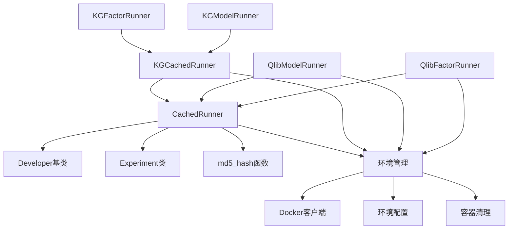

**图表来源**
- [rdagent/components/runner/__init__.py](file://rdagent/components/runner/__init__.py#L1-L4)
- [rdagent/scenarios/kaggle/developer/runner.py](file://rdagent/scenarios/kaggle/developer/runner.py#L1-L12)

**章节来源**
- [rdagent/components/runner/__init__.py](file://rdagent/components/runner/__init__.py#L1-L21)
- [rdagent/scenarios/kaggle/developer/runner.py](file://rdagent/scenarios/kaggle/developer/runner.py#L1-L132)

## 性能考虑

Runner组件在设计时充分考虑了性能优化：

### 缓存策略
- 基于MD5哈希的智能缓存键生成
- 支持pickle序列化的结果缓存
- 实验结果的增量更新机制

### 并发处理
- 支持多进程因子数据处理
- Docker容器的并发执行
- 工作空间的快照和恢复机制

### 资源管理
- 内存和CPU使用限制
- 容器生命周期管理
- 自动清理机制

## 故障排除指南

### 常见问题及解决方案

#### Docker相关问题
- **权限错误**: 确保用户加入docker组
- **镜像拉取失败**: 检查网络连接和镜像名称
- **容器启动失败**: 检查资源限制设置

#### 缓存相关问题
- **缓存失效**: 清理缓存目录重新生成
- **结果不一致**: 检查缓存键生成逻辑
- **内存溢出**: 调整缓存大小限制

#### 实验执行问题
- **超时错误**: 增加运行超时时间
- **代码执行失败**: 检查代码语法和依赖
- **结果为空**: 验证输入数据和实验配置

**章节来源**
- [rdagent/utils/env.py](file://rdagent/utils/env.py#L41-L72)

## 结论

Runner组件作为R&D-Agent框架的核心执行引擎，成功实现了以下目标：

1. **安全性**: 通过Docker沙箱环境确保代码执行的安全性
2. **可重现性**: 通过智能缓存机制保证实验结果的可重现性
3. **可扩展性**: 通过分层架构支持多种实验场景
4. **性能优化**: 通过缓存和并发处理提升执行效率

该组件的设计充分体现了现代软件架构的最佳实践，为自动化实验研究提供了可靠的技术基础。在未来的版本中，可以进一步优化缓存策略，增强监控能力，并扩展对更多实验场景的支持。