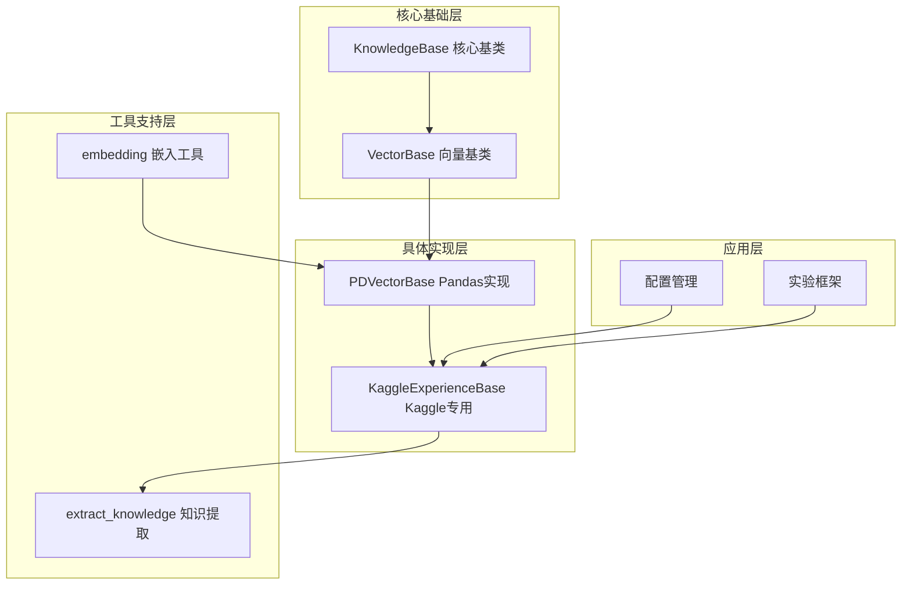
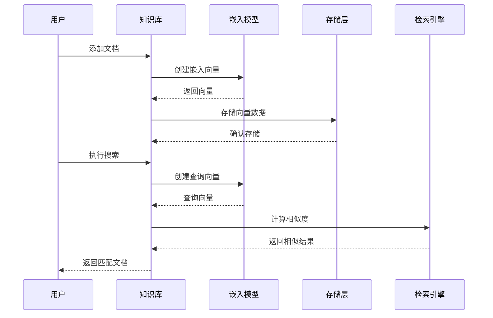
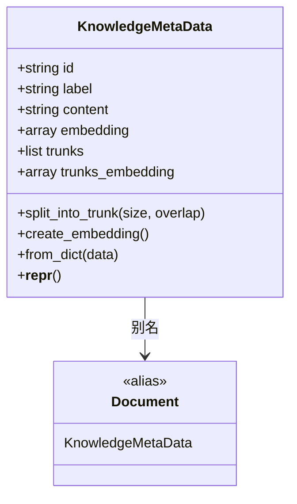
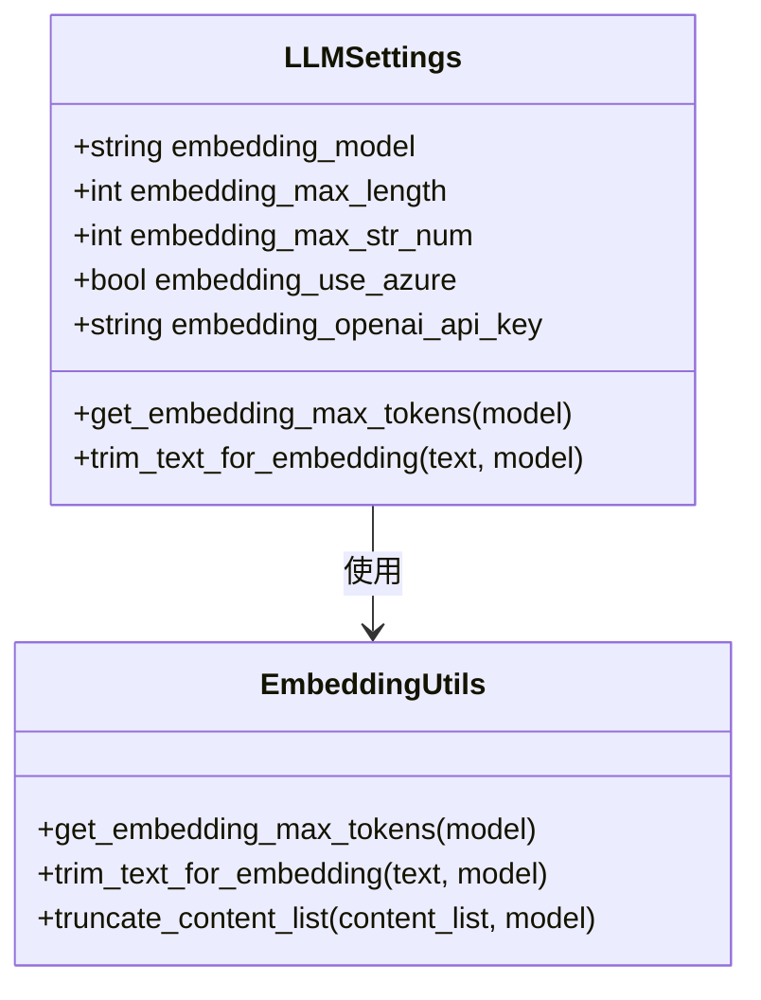
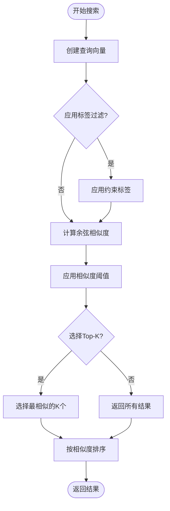
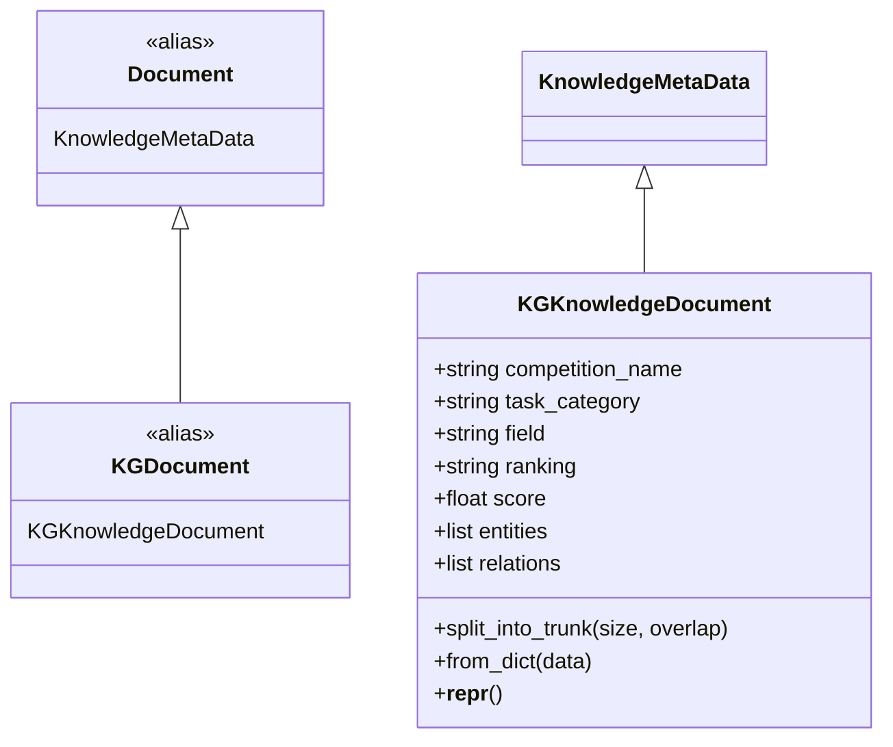
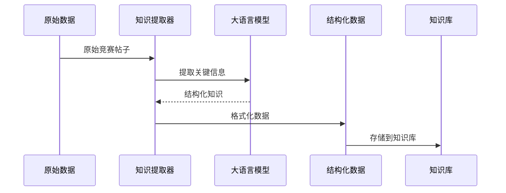
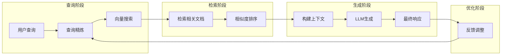
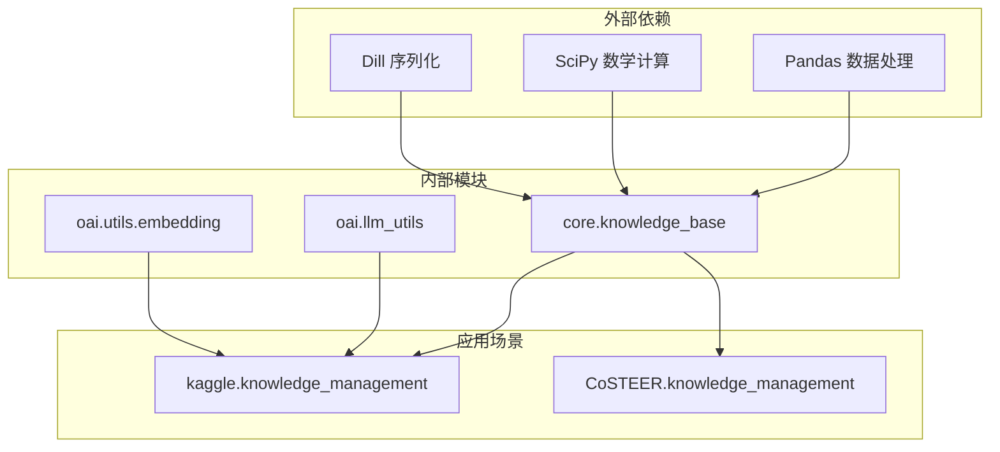

# 向量知识库

<cite>
**本文档引用的文件**
- [vector_base.py](file://rdagent/components/knowledge_management/vector_base.py)
- [knowledge_base.py](file://rdagent/core/knowledge_base.py)
- [embedding.py](file://rdagent/oai/utils/embedding.py)
- [kaggle_vector_base.py](file://rdagent/scenarios/kaggle/knowledge_management/vector_base.py)
- [extract_knowledge.py](file://rdagent/scenarios/kaggle/knowledge_management/extract_knowledge.py)
- [llm_conf.py](file://rdagent/oai/llm_conf.py)
- [kaggle_conf.py](file://rdagent/app/kaggle/conf.py)
- [kaggle_experiment.py](file://rdagent/scenarios/kaggle/experiment/kaggle_experiment.py)
</cite>

## 目录
1. [简介](#简介)
2. [项目结构](#项目结构)
3. [核心组件](#核心组件)
4. [架构概览](#架构概览)
5. [详细组件分析](#详细组件分析)
6. [依赖关系分析](#依赖关系分析)
7. [性能考虑](#性能考虑)
8. [故障排除指南](#故障排除指南)
9. [结论](#结论)

## 简介

向量知识库是RD-Agent系统中一个关键的语义检索组件，专门设计用于处理非结构化文本数据（如实验报告、用户反馈）并将其转换为高维向量表示。该系统通过嵌入模型实现语义理解，建立高效的向量索引以支持相似性搜索，在RAG（检索增强生成）架构中发挥着核心作用。

在Kaggle竞赛场景中，向量知识库能够从历史解决方案中检索相似的问题模式，显著加速新竞赛的求解过程。它不仅为大型语言模型（LLM）提供相关上下文信息以生成更准确的代码和提案，还通过智能的知识管理策略提升整体系统的智能化水平。

## 项目结构

向量知识库的实现分布在多个模块中，形成了层次化的架构设计：

**图表来源**
- [knowledge_base.py](file://rdagent/core/knowledge_base.py#L1-L28)
- [vector_base.py](file://rdagent/components/knowledge_management/vector_base.py#L85-L95)
- [kaggle_vector_base.py](file://rdagent/scenarios/kaggle/knowledge_management/vector_base.py#L100-L120)

**章节来源**
- [knowledge_base.py](file://rdagent/core/knowledge_base.py#L1-L28)
- [vector_base.py](file://rdagent/components/knowledge_management/vector_base.py#L1-L209)

## 核心组件

### KnowledgeBase 基础类

KnowledgeBase是整个向量知识库系统的基础抽象类，提供了持久化存储的核心功能：

- **序列化机制**：使用dill库实现对象的完整序列化和反序列化
- **路径管理**：支持可选的文件路径配置，控制知识库的持久化位置
- **加载策略**：自动检测并加载已存在的知识库数据

### VectorBase 抽象接口

VectorBase定义了向量存储和查询的基本接口规范：

- **添加操作**：支持单个或批量文档的向量添加
- **搜索功能**：基于语义相似性的向量检索
- **约束机制**：支持标签过滤和相似度阈值控制

### PDVectorBase 具体实现

PDVectorBase是基于Pandas的数据结构实现，提供了高效的向量存储和检索功能：

- **DataFrame存储**：使用Pandas DataFrame作为底层存储结构
- **分块处理**：支持大文本内容的分块嵌入处理
- **相似度计算**：采用余弦相似度进行语义匹配

**章节来源**
- [knowledge_base.py](file://rdagent/core/knowledge_base.py#L8-L28)
- [vector_base.py](file://rdagent/components/knowledge_management/vector_base.py#L85-L209)

## 架构概览

向量知识库采用分层架构设计，实现了从数据输入到语义检索的完整流程：

**图表来源**
- [vector_base.py](file://rdagent/components/knowledge_management/vector_base.py#L100-L130)
- [kaggle_vector_base.py](file://rdagent/scenarios/kaggle/knowledge_management/vector_base.py#L150-L200)

## 详细组件分析

### 文档处理与向量化

#### KnowledgeMetaData 类

KnowledgeMetaData是向量知识库中的核心数据结构，负责管理单个文档的所有元数据和向量表示：

**图表来源**
- [vector_base.py](file://rdagent/components/knowledge_management/vector_base.py#L10-L50)

#### 分块处理机制

为了处理长文本内容，系统实现了智能的分块处理机制：

- **固定大小分块**：默认1000字符的块大小
- **重叠策略**：支持块间重叠以保持上下文连续性
- **批量嵌入**：将多个分块合并为批次进行嵌入计算

**章节来源**
- [vector_base.py](file://rdagent/components/knowledge_management/vector_base.py#L15-L45)

### 嵌入模型集成

#### 配置管理

系统通过LLMSettings类统一管理嵌入模型配置：

**图表来源**
- [llm_conf.py](file://rdagent/oai/llm_conf.py#L60-L80)
- [embedding.py](file://rdagent/oai/utils/embedding.py#L15-L50)

#### 模型选择指南

系统支持多种嵌入模型，每种模型都有其特定的应用场景：

| 模型名称 | 最大长度 | 推荐用途 | 性能特点 |
|---------|---------|---------|---------|
| text-embedding-3-small | 8191 | 通用场景 | 平衡性能与准确性 |
| text-embedding-3-large | 8191 | 高精度需求 | 更高的语义理解能力 |
| Qwen3-Embedding-8B | 32000 | 大文本处理 | 支持超长文本 |
| bge-m3 | 8191 | 中文优化 | 特别适合中文语料 |

**章节来源**
- [embedding.py](file://rdagent/oai/utils/embedding.py#L15-L35)

### 检索算法与优化

#### 相似度计算

系统采用余弦相似度作为主要的相似度度量方法：

**图表来源**
- [vector_base.py](file://rdagent/components/knowledge_management/vector_base.py#L175-L207)

#### 性能优化策略

系统实现了多层次的性能优化机制：

- **缓存机制**：启用嵌入向量缓存减少重复计算
- **批处理优化**：将多个请求合并为批量处理
- **内存管理**：定期清理未使用的向量数据
- **索引优化**：使用Pandas的高效数据结构

**章节来源**
- [vector_base.py](file://rdagent/components/knowledge_management/vector_base.py#L175-L207)

### Kaggle专用扩展

#### KGKnowledgeDocument 类

KaggleExperienceBase扩展了基础的向量知识库，专门针对Kaggle竞赛场景进行了优化：

**图表来源**
- [kaggle_vector_base.py](file://rdagent/scenarios/kaggle/knowledge_management/vector_base.py#L15-L80)

#### 知识提取流程

系统实现了自动化的知识提取流程，从Kaggle竞赛经验中提取有价值的信息：

**图表来源**
- [extract_knowledge.py](file://rdagent/scenarios/kaggle/knowledge_management/extract_knowledge.py#L10-L30)

**章节来源**
- [kaggle_vector_base.py](file://rdagent/scenarios/kaggle/knowledge_management/vector_base.py#L15-L312)
- [extract_knowledge.py](file://rdagent/scenarios/kaggle/knowledge_management/extract_knowledge.py#L1-L65)

### RAG集成机制

#### 检索增强生成流程

向量知识库与RAG系统深度集成，为LLM提供上下文相关的检索结果：

**图表来源**
- [kaggle_vector_base.py](file://rdagent/scenarios/kaggle/knowledge_management/vector_base.py#L216-L250)

#### 配置参数调优

系统提供了丰富的配置选项来优化检索性能：

| 参数名称 | 默认值 | 说明 | 调优建议 |
|---------|--------|------|---------|
| similarity_threshold | 0.1 | 相似度阈值 | 根据数据质量调整 |
| topk_k | 5 | 返回结果数量 | 平衡质量和性能 |
| chunk_size | 1000 | 分块大小 | 根据内容类型调整 |
| overlap | 0 | 重叠长度 | 保持上下文连续性 |

**章节来源**
- [kaggle_conf.py](file://rdagent/app/kaggle/conf.py#L65-L75)

## 依赖关系分析

向量知识库系统具有清晰的依赖层次结构：

**图表来源**
- [knowledge_base.py](file://rdagent/core/knowledge_base.py#L1-L5)
- [vector_base.py](file://rdagent/components/knowledge_management/vector_base.py#L1-L10)

**章节来源**
- [knowledge_base.py](file://rdagent/core/knowledge_base.py#L1-L28)
- [vector_base.py](file://rdagent/components/knowledge_management/vector_base.py#L1-L10)

## 性能考虑

### 内存优化策略

- **分批处理**：避免一次性加载大量数据到内存
- **延迟加载**：仅在需要时加载向量数据
- **缓存管理**：合理设置缓存大小和过期策略

### 计算效率优化

- **向量化运算**：利用Pandas的向量化操作提高性能
- **并行处理**：支持多线程的嵌入计算
- **索引优化**：使用适当的索引策略加速查询

### 存储空间优化

- **压缩存储**：使用Pickle的压缩功能减少存储空间
- **增量更新**：支持知识库的增量更新而非全量重建
- **版本控制**：提供知识库版本管理和回滚机制

## 故障排除指南

### 常见问题及解决方案

#### 嵌入向量创建失败

**问题症状**：API调用失败或返回空向量

**可能原因**：
- API密钥配置错误
- 文本长度超出限制
- 网络连接问题

**解决步骤**：
1. 检查API密钥配置
2. 使用文本截断工具处理超长文本
3. 验证网络连接状态

#### 检索结果不准确

**问题症状**：返回的相关性较低的结果

**可能原因**：
- 相似度阈值设置过高
- 嵌入模型不适合当前任务
- 文本预处理不当

**解决步骤**：
1. 调整相似度阈值参数
2. 尝试不同的嵌入模型
3. 优化文本清洗和标准化流程

#### 性能瓶颈

**问题症状**：检索速度过慢

**可能原因**：
- 向量库规模过大
- 内存不足
- 索引策略不当

**解决步骤**：
1. 实施分片存储策略
2. 增加系统内存配置
3. 优化索引和查询算法

**章节来源**
- [embedding.py](file://rdagent/oai/utils/embedding.py#L50-L135)
- [vector_base.py](file://rdagent/components/knowledge_management/vector_base.py#L175-L207)

## 结论

向量知识库作为RD-Agent系统的核心组件，成功地将语义检索技术应用于实际的机器学习竞赛场景。通过精心设计的架构和优化策略，系统实现了：

- **高效的语义理解**：通过先进的嵌入模型实现准确的语义表示
- **灵活的检索机制**：支持多种查询模式和优化策略
- **强大的扩展能力**：可适应不同领域的知识管理需求
- **优秀的性能表现**：在保证准确性的同时维持良好的响应速度

该系统不仅为Kaggle竞赛提供了强有力的知识支撑，也为其他需要语义检索的应用场景提供了可借鉴的解决方案。随着技术的不断发展，向量知识库将继续演进，为人工智能系统提供更加智能和高效的知识管理服务。