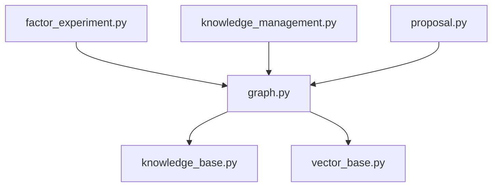
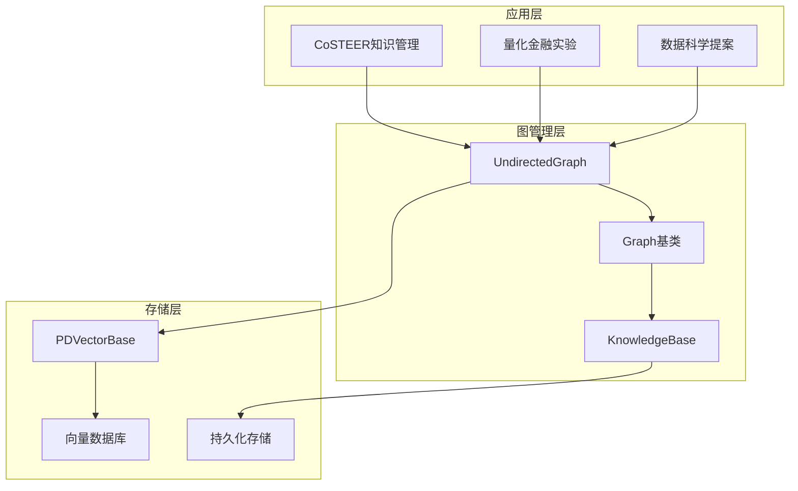
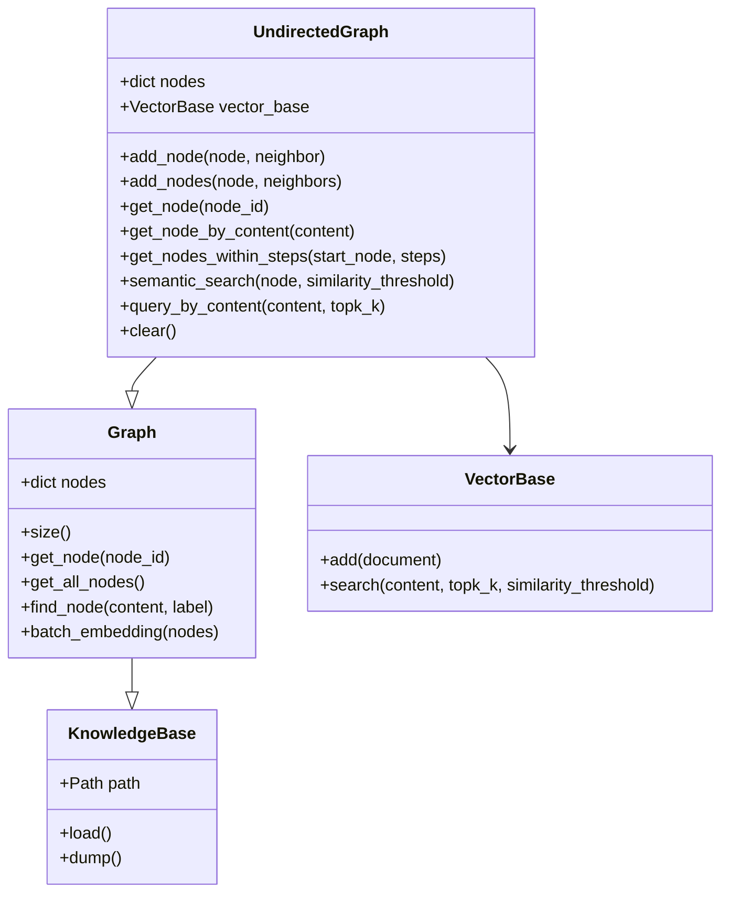
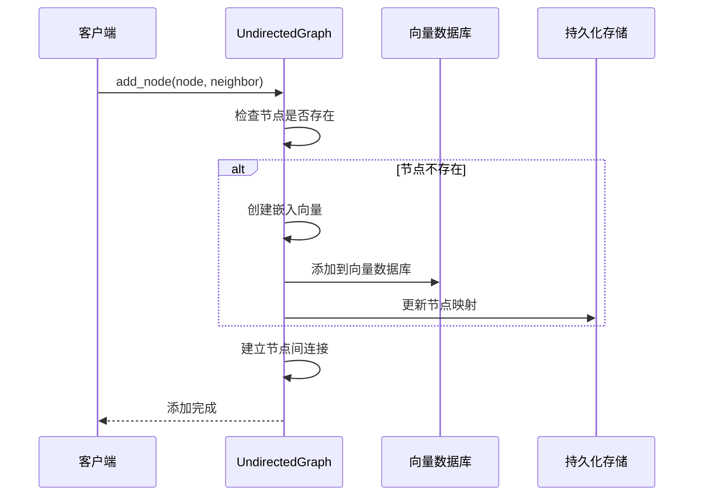
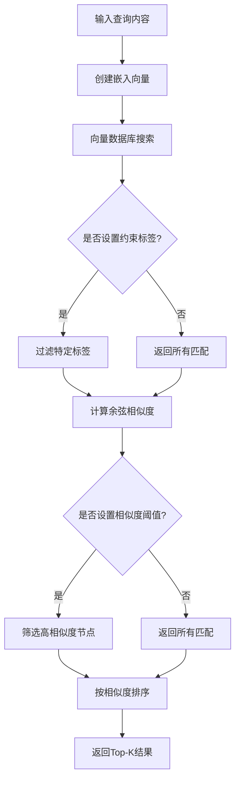
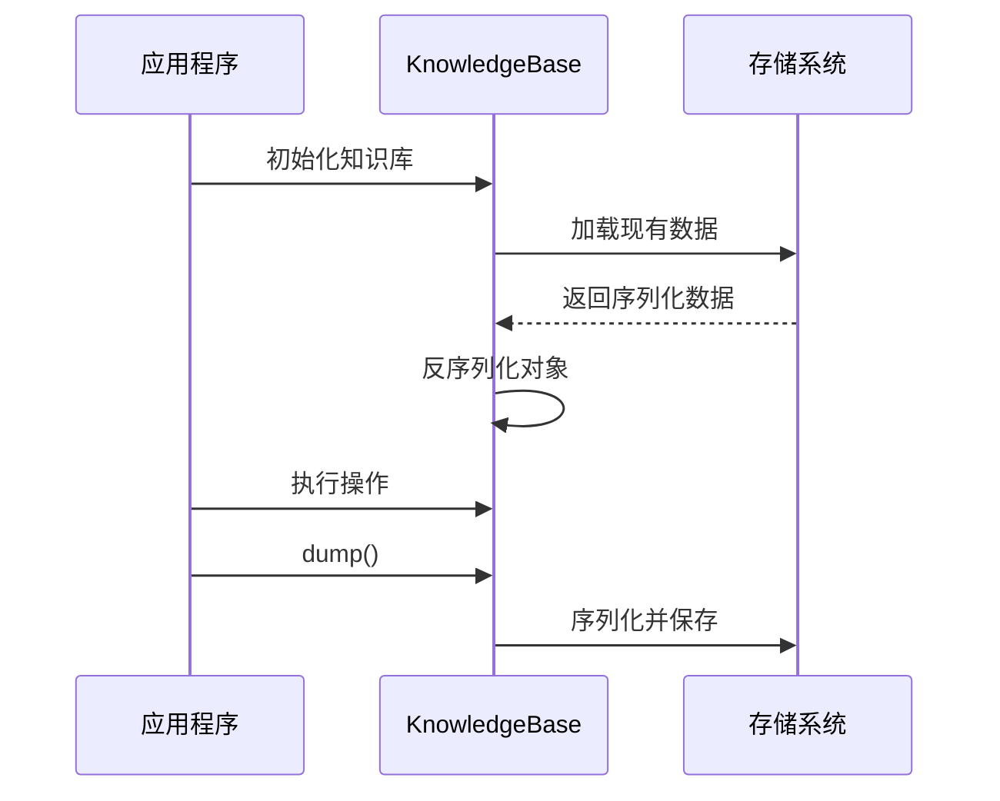
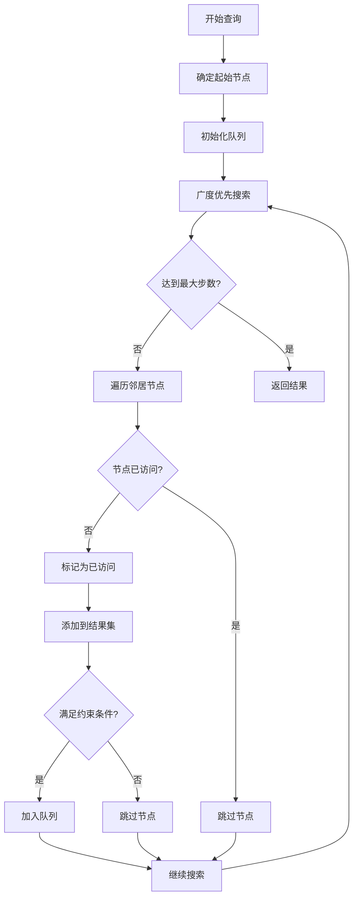
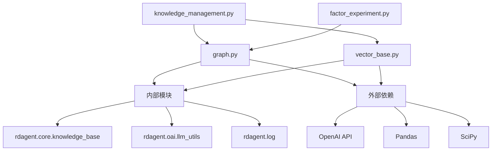

# 图知识管理

<cite>
**本文档中引用的文件**
- [graph.py](file://rdagent/components/knowledge_management/graph.py)
- [knowledge_base.py](file://rdagent/core/knowledge_base.py)
- [vector_base.py](file://rdagent/components/knowledge_management/vector_base.py)
- [proposal.py](file://rdagent/core/proposal.py)
- [factor_experiment.py](file://rdagent/scenarios/qlib/experiment/factor_experiment.py)
- [knowledge_management.py](file://rdagent/components/coder/CoSTEER/knowledge_management.py)
</cite>

## 目录
1. [简介](#简介)
2. [项目结构](#项目结构)
3. [核心组件](#核心组件)
4. [架构概览](#架构概览)
5. [详细组件分析](#详细组件分析)
6. [依赖关系分析](#依赖关系分析)
7. [性能考虑](#性能考虑)
8. [故障排除指南](#故障排除指南)
9. [结论](#结论)

## 简介

图知识管理模块是RD-Agent系统中的核心知识管理系统，专门用于在研究开发过程中构建和维护知识图谱。该模块通过图数据库技术实现了对实验、假设、反馈等研究元素的结构化存储和智能查询，为量化金融领域的因子优化提供了强大的知识支撑。

该系统的主要特点包括：
- 基于无向图的数据结构，支持复杂的节点间关系
- 集成向量数据库实现语义相似性搜索
- 提供多层次的知识检索和推理能力
- 支持事务管理和数据一致性保障
- 针对量化金融场景优化的因子组合模式识别

## 项目结构

图知识管理模块采用分层架构设计，主要包含以下核心文件：



**图表来源**
- [graph.py](file://rdagent/components/knowledge_management/graph.py#L1-L50)
- [knowledge_base.py](file://rdagent/core/knowledge_base.py#L1-L28)

**章节来源**
- [graph.py](file://rdagent/components/knowledge_management/graph.py#L1-L498)
- [knowledge_base.py](file://rdagent/core/knowledge_base.py#L1-L28)

## 核心组件

### 节点类型定义

图知识管理模块定义了三种核心节点类型，每种类型对应不同的研究阶段和知识内容：

#### Experiment节点
实验节点代表具体的研究实验，包含实验的设计、执行过程和结果信息。每个实验节点都具有唯一标识符和详细的实验描述。

#### Hypothesis节点  
假设节点记录研究过程中的各种假设和理论预测，这些假设指导着后续的实验设计和验证。

#### Feedback节点
反馈节点收集实验结果和专家评估，为知识图谱提供质量控制和迭代改进的基础。

### 关系类型定义

系统定义了多种关系类型来描述节点间的复杂关联：

#### leads_to关系
表示因果关系，一个实验的结果直接导致新的假设产生或实验设计的调整。

#### improves关系
表示改进关系，当前实验在前序实验基础上进行了优化和提升。

#### references关系
表示引用关系，当前实验参考了其他实验的设计思路或方法论。

**章节来源**
- [proposal.py](file://rdagent/core/proposal.py#L121-L150)

## 架构概览

图知识管理模块采用多层架构设计，确保系统的可扩展性和高性能：



**图表来源**
- [graph.py](file://rdagent/components/knowledge_management/graph.py#L50-L100)
- [knowledge_base.py](file://rdagent/core/knowledge_base.py#L10-L28)

## 详细组件分析

### UndirectedGraph类分析

UndirectedGraph类是图知识管理的核心实现，继承自Graph基类并集成了向量数据库功能：



**图表来源**
- [graph.py](file://rdagent/components/knowledge_management/graph.py#L50-L150)
- [knowledge_base.py](file://rdagent/core/knowledge_base.py#L10-L28)

#### 节点添加机制

UndirectedGraph提供了灵活的节点添加机制，支持单个节点添加和批量邻居节点添加：



**图表来源**
- [graph.py](file://rdagent/components/knowledge_management/graph.py#L150-L200)

#### 语义搜索功能

系统集成了基于向量相似性的语义搜索功能，能够根据内容相似度查找相关节点：



**图表来源**
- [graph.py](file://rdagent/components/knowledge_management/graph.py#L250-L300)
- [vector_base.py](file://rdagent/components/knowledge_management/vector_base.py#L150-L208)

**章节来源**
- [graph.py](file://rdagent/components/knowledge_management/graph.py#L150-L350)

### 知识库集成机制

图知识管理模块与核心KnowledgeBase类深度集成，提供了完整的事务管理和数据一致性保障：

#### 事务管理

系统通过KnowledgeBase基类提供的load/dump机制实现事务管理：



**图表来源**
- [knowledge_base.py](file://rdagent/core/knowledge_base.py#L10-L28)

#### 数据一致性保障

系统通过以下机制确保数据一致性：

1. **原子性操作**：每个节点添加操作都是原子的，要么完全成功要么完全失败
2. **一致性检查**：在添加节点时自动检查重复内容和标签冲突
3. **隔离性保证**：并发访问时通过锁机制防止数据竞争
4. **持久化保障**：定期将内存中的图结构持久化到磁盘

**章节来源**
- [knowledge_base.py](file://rdagent/core/knowledge_base.py#L10-L28)

### 查询优化策略

系统实现了多种查询优化策略以提高性能：

#### 分层查询算法



**图表来源**
- [graph.py](file://rdagent/components/knowledge_management/graph.py#L200-L250)

#### 缓存机制

系统实现了多级缓存机制：

1. **内存缓存**：将频繁访问的节点保持在内存中
2. **向量缓存**：缓存常用的嵌入向量避免重复计算
3. **查询结果缓存**：缓存复杂的查询结果

**章节来源**
- [graph.py](file://rdagent/components/knowledge_management/graph.py#L200-L450)

## 依赖关系分析

图知识管理模块的依赖关系体现了清晰的分层架构：



**图表来源**
- [graph.py](file://rdagent/components/knowledge_management/graph.py#L1-L20)
- [vector_base.py](file://rdagent/components/knowledge_management/vector_base.py#L1-L15)

**章节来源**
- [graph.py](file://rdagent/components/knowledge_management/graph.py#L1-L20)
- [vector_base.py](file://rdagent/components/knowledge_management/vector_base.py#L1-L15)

## 性能考虑

### 批量嵌入处理

系统针对大规模文本处理进行了优化，采用批量嵌入技术减少API调用次数：

```python
# 批量处理示例（代码片段路径）
# [graph.py](file://rdagent/components/knowledge_management/graph.py#L80-L120)
```

### 内存管理

系统实现了智能的内存管理策略：

1. **延迟加载**：只在需要时加载节点数据
2. **垃圾回收**：定期清理不再使用的节点引用
3. **内存压缩**：对大型图结构进行内存优化

### 并发处理

系统支持并发访问，通过以下机制保证线程安全：

1. **读写锁**：允许多个读取者同时访问
2. **乐观锁**：在更新时检查数据版本
3. **重试机制**：处理并发冲突时的重试逻辑

## 故障排除指南

### 常见问题及解决方案

#### 嵌入向量创建失败
**症状**：节点添加时出现API调用错误
**解决方案**：检查网络连接和API密钥配置

#### 内存不足错误
**症状**：处理大型图时出现内存溢出
**解决方案**：启用内存压缩或增加系统内存

#### 查询性能下降
**症状**：复杂查询响应时间过长
**解决方案**：优化查询参数或增加缓存大小

**章节来源**
- [graph.py](file://rdagent/components/knowledge_management/graph.py#L80-L120)

## 结论

图知识管理模块为RD-Agent系统提供了强大的知识管理能力，特别是在量化金融领域的因子优化方面表现出色。通过无向图结构、向量数据库集成和智能查询算法，系统能够有效地支持研究演进路径的追溯和因果关系的挖掘。

该模块的主要优势包括：
- **灵活性**：支持多种节点类型和关系类型的动态扩展
- **可扩展性**：良好的分层架构便于功能增强和性能优化
- **智能化**：集成语义搜索和机器学习能力
- **可靠性**：完善的事务管理和数据一致性保障

未来的发展方向包括：
- 实现更复杂的图算法支持
- 增强实时协作功能
- 优化大规模图的处理性能
- 扩展到更多应用场景