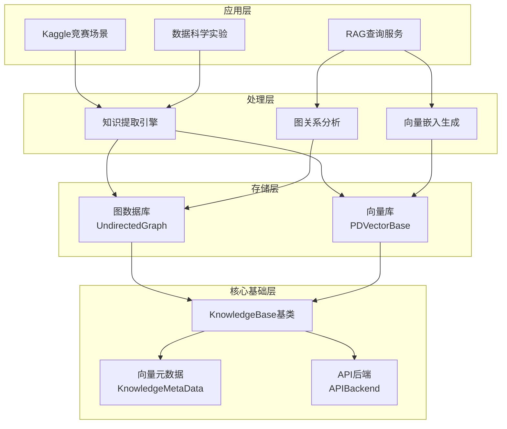
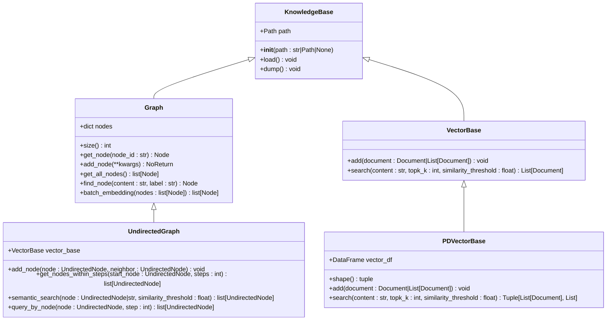
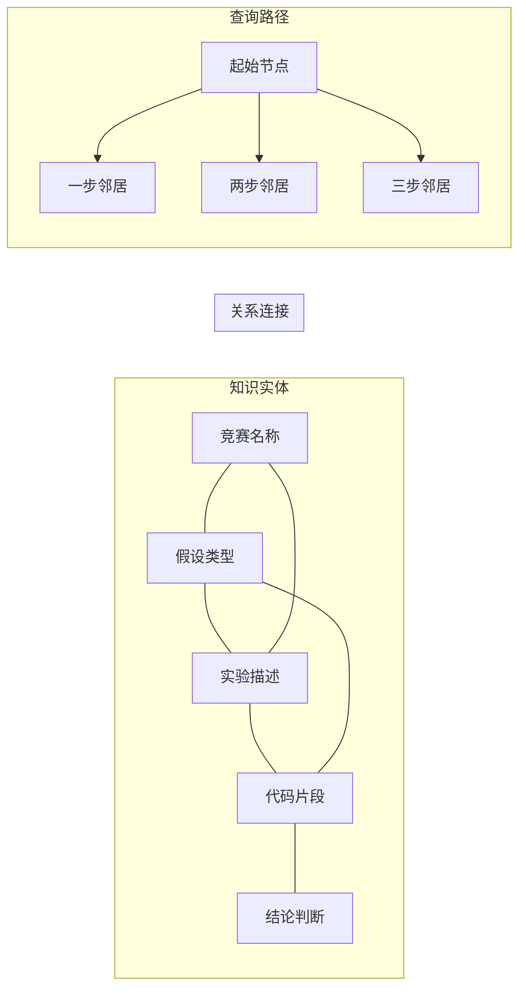
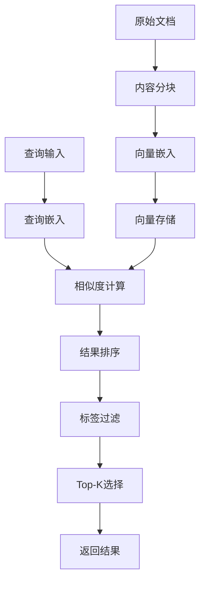
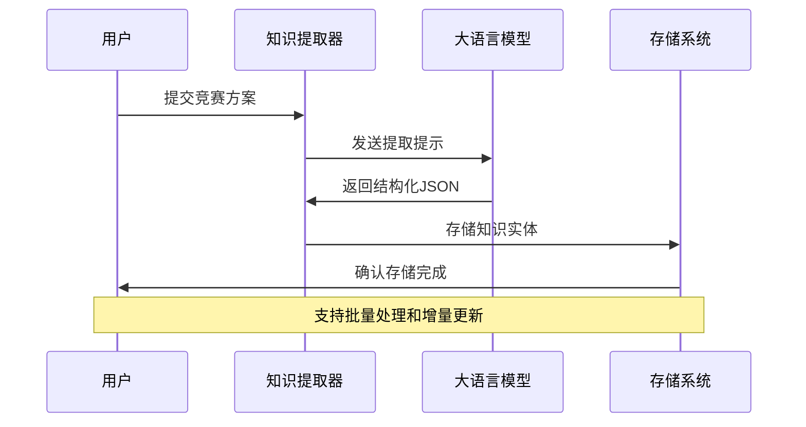
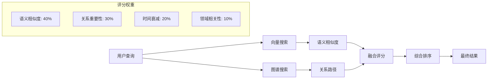

# 知识管理组件

<cite>
**本文档中引用的文件**
- [graph.py](file://rdagent/components/knowledge_management/graph.py)
- [vector_base.py](file://rdagent/components/knowledge_management/vector_base.py)
- [knowledge_base.py](file://rdagent/core/knowledge_base.py)
- [extract_knowledge.py](file://rdagent/scenarios/kaggle/knowledge_management/extract_knowledge.py)
- [kaggle_graph.py](file://rdagent/scenarios/kaggle/knowledge_management/graph.py)
- [kaggle_vector_base.py](file://rdagent/scenarios/kaggle/knowledge_management/vector_base.py)
- [prompts.yaml](file://rdagent/scenarios/kaggle/knowledge_management/prompts.yaml)
- [conf.py](file://rdagent/app/kaggle/conf.py)
- [core_conf.py](file://rdagent/core/conf.py)
</cite>

## 目录
1. [简介](#简介)
2. [系统架构概览](#系统架构概览)
3. [核心组件分析](#核心组件分析)
4. [双模存储架构详解](#双模存储架构详解)
5. [知识提取与转换流程](#知识提取与转换流程)
6. [协同工作机制](#协同工作机制)
7. [性能优化策略](#性能优化策略)
8. [数据一致性保障](#数据一致性保障)
9. [使用示例与最佳实践](#使用示例与最佳实践)
10. [总结](#总结)

## 简介

RD-Agent的知识管理组件是一个基于双模存储架构的智能知识管理系统，专门针对Kaggle数据科学竞赛场景设计。该系统采用图数据库和向量库相结合的方式，实现了结构化知识存储、语义检索和RAG（检索增强生成）功能，为数据科学家提供了强大的知识管理和决策支持能力。

系统的核心优势在于：
- **双模存储**：同时支持图数据库和向量库，兼顾结构化关系和语义相似性
- **智能提取**：通过LLM自动从非结构化文档中提取结构化知识
- **协同检索**：结合图关系和向量相似度进行多维度知识检索
- **动态更新**：支持实时知识更新和版本管理

## 系统架构概览

知识管理组件采用分层架构设计，包含核心基础层、存储层、处理层和应用层：



**图表来源**
- [knowledge_base.py](file://rdagent/core/knowledge_base.py#L1-L28)
- [graph.py](file://rdagent/components/knowledge_management/graph.py#L1-L50)
- [vector_base.py](file://rdagent/components/knowledge_management/vector_base.py#L1-L50)

## 核心组件分析

### KnowledgeBase基类

KnowledgeBase是整个知识管理系统的基础设施，提供了统一的持久化和加载机制：



**图表来源**
- [knowledge_base.py](file://rdagent/core/knowledge_base.py#L8-L28)
- [graph.py](file://rdagent/components/knowledge_management/graph.py#L42-L100)
- [vector_base.py](file://rdagent/components/knowledge_management/vector_base.py#L75-L120)

**章节来源**
- [knowledge_base.py](file://rdagent/core/knowledge_base.py#L1-L28)
- [graph.py](file://rdagent/components/knowledge_management/graph.py#L1-L100)
- [vector_base.py](file://rdagent/components/knowledge_management/vector_base.py#L1-L120)

### 图数据库组件

图数据库组件负责存储实体及其关系，支持复杂的关系查询和路径分析：

#### UndirectedNode节点类

每个节点代表一个知识实体，包含内容、标签、嵌入向量等属性：

- **内容字段**：存储具体的文本内容
- **标签字段**：标识节点类型（如实验、假设、代码等）
- **邻居集合**：维护与其他节点的连接关系
- **附加信息**：存储额外的上下文数据

#### 图操作方法

图数据库提供了丰富的操作接口：

- **节点添加**：支持单个节点和批量节点添加
- **关系建立**：自动维护双向连接关系
- **邻域查询**：支持指定步数内的邻居节点搜索
- **语义搜索**：基于向量相似度的语义匹配

**章节来源**
- [graph.py](file://rdagent/components/knowledge_management/graph.py#L15-L100)

### 向量库组件

向量库组件专注于语义检索和相似度计算，为RAG功能提供支持：

#### KnowledgeMetaData元数据

向量库的核心是KnowledgeMetaData类，它扩展了基本的文档结构：

- **分块处理**：支持大文档的智能分块和嵌入生成
- **多级索引**：同时维护完整文档和分块级别的向量索引
- **元数据丰富**：包含竞赛名称、任务类别、领域等结构化信息

#### 搜索算法

向量库实现了高效的相似度搜索：

- **余弦相似度**：使用余弦距离计算向量相似度
- **阈值过滤**：支持相似度阈值控制结果质量
- **标签约束**：可按标签类型限制搜索范围
- **Top-K选择**：返回最相关的前K个结果

**章节来源**
- [vector_base.py](file://rdagent/components/knowledge_management/vector_base.py#L10-L120)

## 双模存储架构详解

### 图数据库存储机制

图数据库采用无向图结构存储实体间的关系，特别适合表示复杂的知识网络：



**图表来源**
- [graph.py](file://rdagent/components/knowledge_management/graph.py#L150-L250)

#### 实体识别与分类

系统通过以下方式识别和分类知识实体：

| 实体类型 | 标签标识 | 内容特征 | 关系模式 |
|---------|---------|---------|---------|
| 竞赛信息 | "competition" | 赛事名称、目标、特征 | 主要实体 |
| 假设类型 | "hypothesis" | 特征工程、模型调优等 | 中心节点 |
| 实验描述 | "experiments" | 具体实验步骤和结果 | 连接节点 |
| 代码片段 | "code" | 实现代码和参数 | 技术节点 |
| 结论判断 | "conclusion" | 假设验证结果 | 结果节点 |

### 向量库存储机制

向量库采用向量空间模型存储知识的语义表示：



**图表来源**
- [vector_base.py](file://rdagent/components/knowledge_management/vector_base.py#L150-L200)

#### 分块策略

为了提高检索精度，系统采用智能分块策略：

- **固定大小分块**：默认1000字符，重叠10%
- **语义完整性**：确保每个分块包含完整的语义单元
- **嵌入生成**：为每个分块独立生成向量表示
- **索引优化**：同时维护分块级别和文档级别的索引

**章节来源**
- [vector_base.py](file://rdagent/components/knowledge_management/vector_base.py#L40-L80)

## 知识提取与转换流程

### 非结构化数据处理

系统通过LLM驱动的知识提取流程，将Kaggle竞赛方案等非结构化数据转换为结构化知识：



**图表来源**
- [extract_knowledge.py](file://rdagent/scenarios/kaggle/knowledge_management/extract_knowledge.py#L10-L30)

### 提取流程详解

#### 1. 知识点提取阶段

系统使用专门的提示模板从文档中提取关键信息：

- **竞赛信息**：名称、类型、目标、特征
- **技术方法**：特征工程、模型选择、超参数调优
- **实验结果**：具体实验步骤、参数设置、性能指标
- **经验总结**：成功因素、失败教训、改进建议

#### 2. 关系构建阶段

提取的知识点通过以下方式构建关系网络：

- **层次关系**：假设→实验→结果的因果链
- **并列关系**：不同技术方案的对比
- **时间序列**：实验的先后顺序
- **领域关联**：同一领域的相关技术

#### 3. 图谱构建阶段

最终形成完整的知识图谱：

- **节点标准化**：统一节点格式和命名规范
- **关系验证**：检查关系的合理性和完整性
- **图谱优化**：去除冗余关系，保持图谱简洁性

**章节来源**
- [extract_knowledge.py](file://rdagent/scenarios/kaggle/knowledge_management/extract_knowledge.py#L1-L65)
- [prompts.yaml](file://rdagent/scenarios/kaggle/knowledge_management/prompts.yaml#L1-L50)

## 协同工作机制

### 查询融合机制

系统通过多维度查询融合提供更准确的知识检索：



**图表来源**
- [graph.py](file://rdagent/components/knowledge_management/graph.py#L300-L400)

### 检索策略组合

#### 1. 语义检索（向量库）

基于内容相似度的检索策略：

- **相似度阈值**：过滤低质量匹配
- **Top-K选择**：控制结果数量
- **标签约束**：限定搜索范围
- **批量处理**：提高处理效率

#### 2. 关系检索（图数据库）

基于知识图谱的推理检索：

- **路径长度**：控制推理深度
- **邻居聚合**：合并相关节点信息
- **约束过滤**：排除不相关节点
- **优先级排序**：根据关系重要性排序

#### 3. 融合策略

将两种检索结果进行有效融合：

- **评分加权**：根据检索类型分配权重
- **去重处理**：消除重复结果
- **多样性保证**：确保结果的多样性
- **上下文感知**：考虑用户历史和偏好

**章节来源**
- [graph.py](file://rdagent/components/knowledge_management/graph.py#L250-L350)

### 动态更新机制

系统支持知识的实时更新和版本管理：

#### 1. 增量更新

- **检测变更**：识别新增或修改的知识点
- **局部更新**：只更新受影响的部分
- **缓存优化**：避免全量重建索引
- **一致性保证**：确保更新过程的数据一致性

#### 2. 版本控制

- **时间戳记录**：跟踪知识的时间变化
- **版本比较**：识别重要的变更
- **回滚机制**：支持撤销错误更新
- **历史追踪**：保存完整的变更历史

**章节来源**
- [graph.py](file://rdagent/components/knowledge_management/graph.py#L400-L497)

## 性能优化策略

### 存储优化

#### 1. 向量索引优化

- **分层索引**：采用多层索引结构加速搜索
- **近似最近邻**：使用ANN算法平衡精度和速度
- **内存映射**：利用内存映射文件减少内存占用
- **压缩存储**：对向量进行量化压缩

#### 2. 图数据库优化

- **邻接矩阵**：使用稀疏矩阵存储图结构
- **布隆过滤器**：快速判断节点存在性
- **缓存机制**：缓存频繁访问的子图
- **分区存储**：按领域或时间分区存储

### 计算优化

#### 1. 批处理优化

- **批量嵌入**：一次性处理多个文档
- **流水线处理**：重叠计算和I/O操作
- **异步处理**：使用异步IO提高并发性
- **GPU加速**：利用GPU进行向量计算

#### 2. 检索优化

- **预计算相似度**：预先计算常用查询的相似度
- **索引预热**：启动时加载常用索引
- **结果缓存**：缓存热门查询的结果
- **查询优化**：优化查询执行计划

**章节来源**
- [vector_base.py](file://rdagent/components/knowledge_management/vector_base.py#L150-L209)
- [graph.py](file://rdagent/components/knowledge_management/graph.py#L80-L120)

### 内存管理

#### 1. 数据分片

- **水平分割**：按数据量分割存储
- **垂直分割**：按字段分割存储
- **时间分割**：按时间周期分割存储
- **逻辑分割**：按业务逻辑分割存储

#### 2. 缓存策略

- **LRU缓存**：最近最少使用的数据优先淘汰
- **预取机制**：预测可能需要的数据提前加载
- **压缩缓存**：对缓存数据进行压缩
- **分布式缓存**：在多个节点间共享缓存

## 数据一致性保障

### 事务机制

#### 1. ACID特性

系统通过以下机制保证数据一致性：

- **原子性**：操作要么全部成功，要么全部失败
- **一致性**：保持数据的内在一致性和业务规则
- **隔离性**：并发操作不会相互干扰
- **持久性**：一旦提交，数据永久保存

#### 2. 并发控制

- **乐观锁**：基于版本号的并发控制
- **悲观锁**：排他锁防止并发修改
- **读写分离**：区分读写操作的并发策略
- **冲突检测**：检测和解决并发冲突

### 数据校验

#### 1. 完整性检查

- **约束验证**：检查数据是否符合业务约束
- **关系验证**：验证图关系的合理性
- **格式验证**：检查数据格式的正确性
- **范围验证**：验证数值在合理范围内

#### 2. 一致性校验

- **交叉验证**：不同存储层间的数据一致性检查
- **定期扫描**：定期检查数据质量问题
- **异常告警**：发现异常时及时告警
- **自动修复**：自动修复可恢复的一致性问题

**章节来源**
- [knowledge_base.py](file://rdagent/core/knowledge_base.py#L15-L28)

## 使用示例与最佳实践

### 基础使用流程

#### 1. 初始化知识库

```python
# 创建向量库实例
vector_base = KaggleExperienceBase(
    vector_df_path="vector_base.pkl",
    kaggle_experience_path="experience_data.json"
)

# 加载已有数据
vector_base.load_kaggle_experience("experience_data.json")

# 添加新数据
vector_base.add_experience_to_vector_base(experiment_feedback)
```

#### 2. 知识检索

```python
# 基于内容的检索
results, similarities = vector_base.search_experience(
    target="图像分类",
    query="特征工程方法",
    topk_k=5,
    similarity_threshold=0.1
)

# 基于图谱的检索
graph_results = undirected_graph.query_by_content(
    content="机器学习模型",
    step=2,
    constraint_labels=["modeling", "feature_engineering"],
    similarity_threshold=0.7
)
```

### 最佳实践建议

#### 1. 数据组织

- **结构化存储**：确保数据具有清晰的结构和标签
- **版本管理**：为不同版本的知识建立版本标识
- **分类体系**：建立合理的知识分类体系
- **元数据丰富**：提供充足的元数据支持

#### 2. 性能优化

- **索引优化**：定期重建和优化索引
- **缓存策略**：合理使用缓存提高响应速度
- **批量处理**：对大量数据使用批量处理
- **监控告警**：建立性能监控和告警机制

#### 3. 质量控制

- **数据清洗**：定期清理和清洗数据
- **质量评估**：建立知识质量评估体系
- **用户反馈**：收集用户反馈持续改进
- **专家审核**：重要知识经过专家审核

**章节来源**
- [kaggle_vector_base.py](file://rdagent/scenarios/kaggle/knowledge_management/vector_base.py#L280-L312)
- [kaggle_graph.py](file://rdagent/scenarios/kaggle/knowledge_management/graph.py#L100-L116)

## 总结

RD-Agent的知识管理组件通过双模存储架构实现了高效的知识管理和智能检索。图数据库擅长处理复杂的实体关系，向量库则提供了强大的语义检索能力。两者协同工作，为Kaggle竞赛场景提供了全面的知识支持。

### 核心优势

1. **双模存储**：兼顾结构化关系和语义相似性
2. **智能提取**：自动化从非结构化数据提取知识
3. **协同检索**：多维度融合提升检索质量
4. **动态更新**：支持实时知识更新和版本管理
5. **性能优化**：多层次优化确保系统高效运行

### 应用价值

- **知识积累**：系统化积累竞赛经验和最佳实践
- **智能决策**：为数据科学家提供智能化的决策支持
- **效率提升**：减少重复劳动，提高工作效率
- **团队协作**：促进团队间的知识共享和协作

### 发展方向

未来系统可以在以下方面进一步发展：

- **多模态支持**：扩展对图片、音频等多模态数据的支持
- **实时更新**：实现实时的知识流处理
- **个性化推荐**：基于用户偏好的个性化知识推荐
- **智能推理**：引入更高级的推理机制

这个知识管理组件为RD-Agent在Kaggle竞赛场景中的应用奠定了坚实的基础，是实现智能化数据科学工作流的重要支撑。