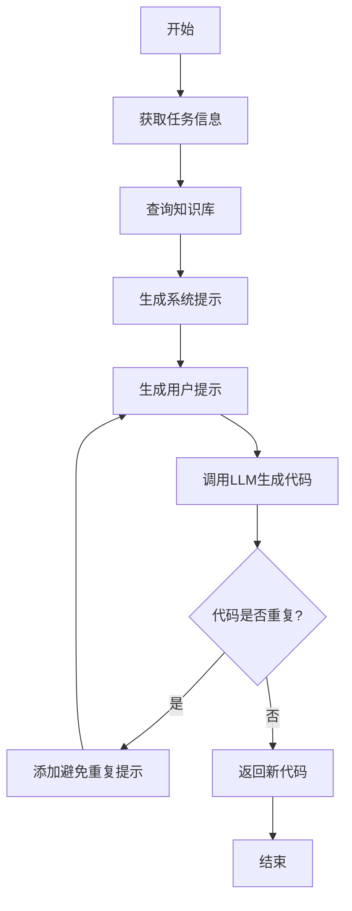
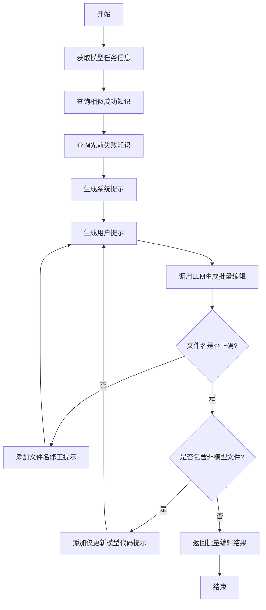
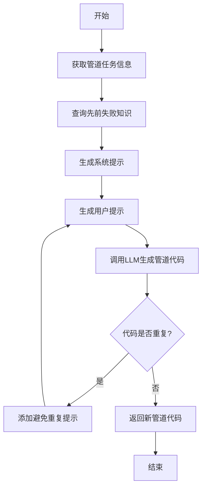
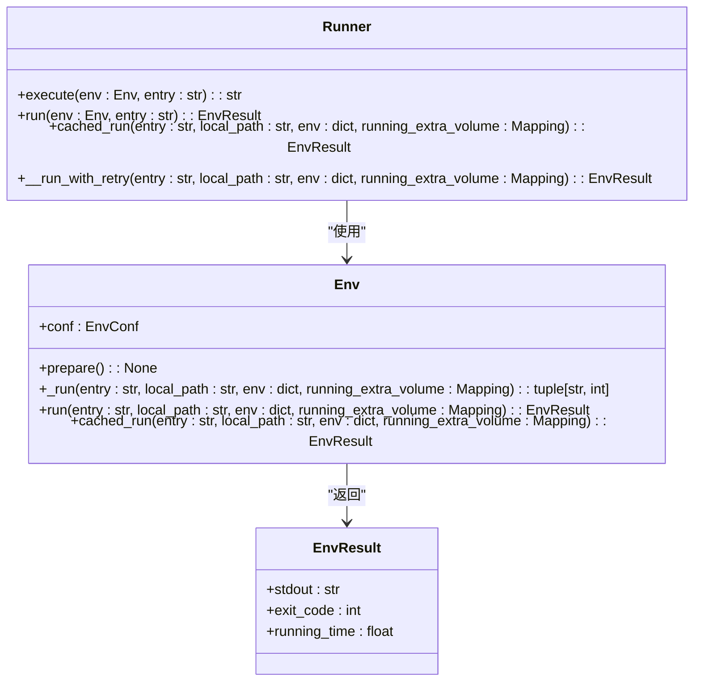
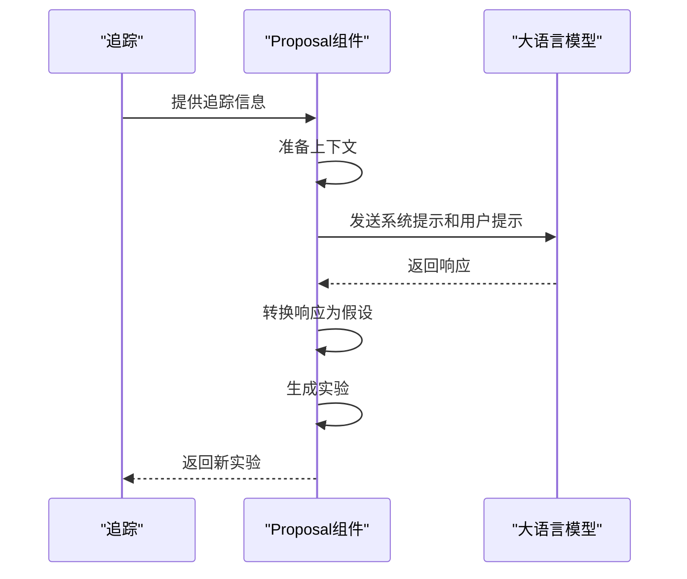
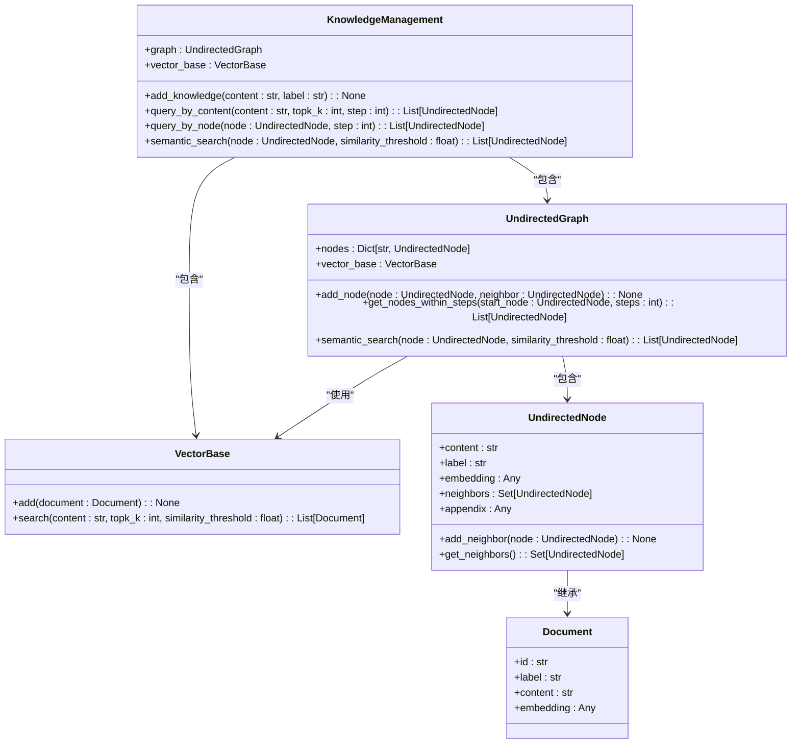
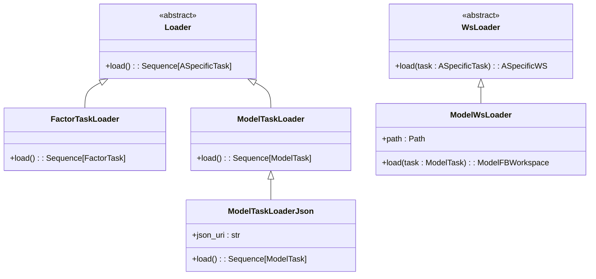
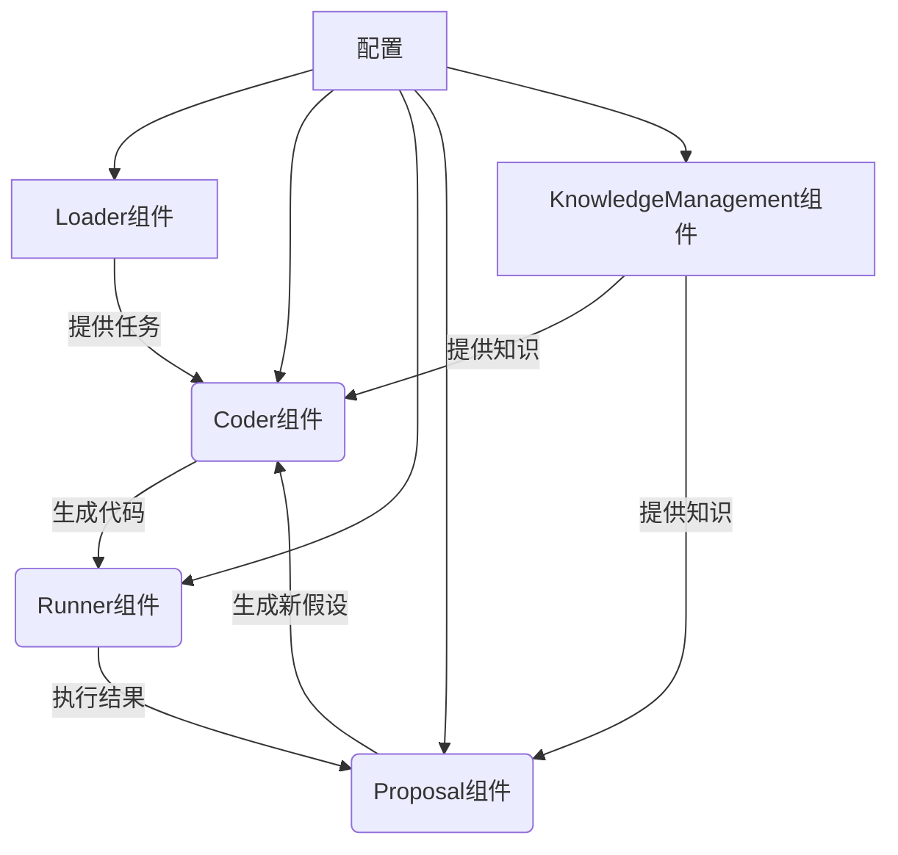

# 组件系统

<cite>
**本文档中引用的文件**  
- [conf.py](file://rdagent\components\coder\data_science\conf.py)
- [__init__.py](file://rdagent\components\runner\__init__.py)
- [__init__.py](file://rdagent\components\proposal\__init__.py)
- [graph.py](file://rdagent\components\knowledge_management\graph.py)
- [vector_base.py](file://rdagent\components\knowledge_management\vector_base.py)
- [experiment_loader.py](file://rdagent\components\loader\experiment_loader.py)
- [task_loader.py](file://rdagent\components\loader\task_loader.py)
- [__init__.py](file://rdagent\components\coder\data_science\feature\__init__.py)
- [__init__.py](file://rdagent\components\coder\data_science\model\__init__.py)
- [__init__.py](file://rdagent\components\coder\data_science\pipeline\__init__.py)
- [ds_costeer.py](file://rdagent\components\coder\data_science\share\ds_costeer.py)
- [config.py](file://rdagent\components\coder\CoSTEER\config.py)
- [experiment.py](file://rdagent\core\experiment.py)
</cite>

## 目录
1. [引言](#引言)
2. [Coder组件](#coder组件)
3. [Runner组件](#runner组件)
4. [Proposal组件](#proposal组件)
5. [KnowledgeManagement组件](#knowledgemanagement组件)
6. [Loader组件](#loader组件)
7. [组件间依赖关系](#组件间依赖关系)
8. [结论](#结论)

## 引言
本系统是一个面向数据科学任务的自动化研发框架，通过多个可复用的功能组件协同工作，实现从问题分析到代码生成、执行和优化的完整闭环。系统核心由Coder、Runner、Proposal、KnowledgeManagement和Loader五大组件构成，每个组件都有明确的职责和接口。Coder组件负责根据场景生成Python代码，支持特征、模型和管道等多种代码类型；Runner组件提供沙箱执行环境，确保代码安全运行；Proposal组件通过提示工程设计实现创意生成；KnowledgeManagement组件利用图数据库和向量库协同工作来管理知识；Loader组件负责任务加载和实验初始化。这些组件通过清晰的接口和数据交换格式紧密协作，形成一个高效、可扩展的自动化研发系统。

## Coder组件

Coder组件是系统的核心代码生成引擎，负责根据不同的数据科学场景生成Python代码。该组件支持三种主要的代码类型：特征工程（Feature）、模型（Model）和管道（Pipeline），每种类型都有专门的实现策略。组件采用CoSTEER框架，通过多进程演化策略（MultiProcessEvolvingStrategy）实现代码的迭代优化。在代码生成过程中，系统会查询知识库中相似的成功案例和先前的失败经验，以指导新代码的生成。为了防止生成重复代码，系统设置了重试机制，在五次尝试后仍无法生成新代码时会抛出异常。组件的配置通过DSCoderCoSTEERSettings类管理，允许设置最大循环次数、环境类型等参数。

**组件来源**
- [conf.py](file://rdagent\components\coder\data_science\conf.py#L1-L87)
- [__init__.py](file://rdagent\components\coder\data_science\feature\__init__.py#L1-L140)
- [__init__.py](file://rdagent\components\coder\data_science\model\__init__.py#L1-L173)
- [__init__.py](file://rdagent\components\coder\data_science\pipeline\__init__.py#L1-L165)
- [ds_costeer.py](file://rdagent\components\coder\data_science\share\ds_costeer.py#L1-L9)
- [config.py](file://rdagent\components\coder\CoSTEER\config.py#L1-L42)

### 特征工程代码生成
特征工程代码生成器（FeatureMultiProcessEvolvingStrategy）专门负责生成数据特征处理代码。它通过分析任务描述、数据加载代码和先前的反馈来生成新的特征代码。系统会查询知识库中相似的成功特征实现，并避免重复先前的失败尝试。生成的代码必须与现有代码不同，否则会触发重试机制。该组件与数据加载器紧密协作，确保生成的特征代码能够正确处理输入数据。

**图表来源**
- [__init__.py](file://rdagent\components\coder\data_science\feature\__init__.py#L1-L140)

### 模型代码生成
模型代码生成器（ModelMultiProcessEvolvingStrategy）负责生成机器学习模型的实现代码。与特征生成器类似，它也采用迭代优化策略，但更关注模型架构和超参数的调整。系统会检查生成的代码是否只包含模型相关的文件更新，并确保文件名与任务名称匹配。对于模型移除操作，系统假设每次只能处理一个模型。该组件与特征工程组件紧密协作，确保生成的模型代码能够正确使用已生成的特征。

**图表来源**
- [__init__.py](file://rdagent\components\coder\data_science\model\__init__.py#L1-L173)

### 管道代码生成
管道代码生成器（PipelineMultiProcessEvolvingStrategy）负责生成整个数据科学工作流的管道代码。它关注于将特征工程、模型训练和结果输出等环节有机地连接起来。该组件需要考虑运行时环境、包依赖信息和调试模式等配置。生成的管道代码必须能够正确调用先前生成的特征和模型代码，并处理数据流的传递。该组件是整个数据科学工作流的 orchestrator，确保各个组件能够协同工作。

**图表来源**
- [__init__.py](file://rdagent\components\coder\data_science\pipeline\__init__.py#L1-L165)

## Runner组件

Runner组件负责在隔离的沙箱环境中执行生成的代码，确保系统的安全性和稳定性。该组件通过Docker容器实现执行环境的隔离，支持配置额外的卷挂载和运行超时。执行结果通过EnvResult对象返回，包含标准输出、退出码和运行时间等信息。为了提高效率，组件支持缓存机制，通过代码和参数的哈希值作为缓存键，避免重复执行相同的操作。在Docker执行过程中，系统会实时输出容器日志，便于监控和调试。执行环境的准备和清理操作都经过精心设计，确保每次执行都在干净的环境中进行。

**图表来源**
- [__init__.py](file://rdagent\components\runner\__init__.py#L1-L20)
- [env.py](file://rdagent\utils\env.py#L1-L1000)

## Proposal组件

Proposal组件通过先进的提示工程技术实现创意生成和实验设计。该组件采用分层的提示设计，包括假设生成（HypothesisGen）和实验转换（Hypothesis2Experiment）两个主要阶段。在假设生成阶段，系统根据场景描述、先前的实验反馈和知识库信息生成可测试的假设。在实验转换阶段，系统将假设转化为具体的实验任务，包括任务设计和工作流更新。组件支持多种类型的假设生成器，如因子假设生成器（FactorHypothesisGen）和模型假设生成器（ModelHypothesisGen），每种生成器都针对特定的任务类型进行了优化。系统还实现了重试机制，确保在LLM调用失败时能够自动重试。

**图表来源**
- [__init__.py](file://rdagent\components\proposal\__init__.py#L1-L138)

## KnowledgeManagement组件

KnowledgeManagement组件采用图数据库和向量库协同工作的混合架构来管理知识。图数据库（UndirectedGraph）用于存储知识节点之间的关系，支持基于连接的查询和多跳检索。向量库（PDVectorBase）用于存储知识的嵌入表示，支持基于语义相似度的搜索。两个系统通过知识元数据（KnowledgeMetaData）类进行集成，每个知识节点既包含结构化的关系信息，又包含非结构化的语义信息。系统实现了多种查询方法，包括基于连接的查询、基于语义的查询以及两者的组合查询。这种混合架构既保留了知识的结构化关系，又支持灵活的语义搜索，为Coder和Proposal组件提供了强大的知识支持。

**图表来源**
- [graph.py](file://rdagent\components\knowledge_management\graph.py#L1-L497)
- [vector_base.py](file://rdagent\components\knowledge_management\vector_base.py#L1-L208)

## Loader组件

Loader组件负责任务加载和实验初始化，为系统提供数据输入和任务配置。该组件包含两种主要的加载器：实验加载器（ExperimentLoader）和任务加载器（TaskLoader）。实验加载器负责从各种数据源（如JSON、PDF等）加载完整的实验配置，而任务加载器则负责加载具体的任务定义。对于模型任务，系统支持从JSON文件加载模型字典，每个模型包含名称、描述、公式和变量等信息。加载器还负责工作区的初始化，包括准备工作区路径、注入代码文件等操作。通过灵活的加载机制，系统能够适应不同的数据源和任务类型，为Coder和Runner组件提供一致的输入接口。

**图表来源**
- [experiment_loader.py](file://rdagent\components\loader\experiment_loader.py#L1-L10)
- [task_loader.py](file://rdagent\components\loader\task_loader.py#L1-L96)

## 组件间依赖关系

系统各组件之间通过清晰的接口和数据交换格式紧密协作。Loader组件为Coder组件提供任务输入，Coder组件生成的代码由Runner组件执行，执行结果反馈给Proposal组件用于生成新的假设，而KnowledgeManagement组件为所有组件提供知识支持。这种协作模式形成了一个闭环的研发流程，实现了从问题分析到解决方案的自动化迭代。组件间的依赖关系通过接口定义和配置选项进行管理，确保系统的可扩展性和可维护性。

**图表来源**
- [experiment.py](file://rdagent\core\experiment.py#L1-L199)

## 结论
本系统通过精心设计的组件架构，实现了数据科学任务的自动化研发。Coder、Runner、Proposal、KnowledgeManagement和Loader五大组件各司其职，通过清晰的接口和数据交换格式紧密协作，形成了一个高效、可扩展的自动化研发闭环。系统采用先进的技术架构，包括基于Docker的沙箱执行环境、混合式的知识管理架构和分层的提示工程设计，确保了系统的安全性、灵活性和智能性。通过可配置的参数和灵活的扩展机制，系统能够适应不同的数据科学场景和任务需求。未来的工作可以进一步优化组件间的协作效率，增强知识管理系统的智能化水平，并扩展支持更多的任务类型和应用场景。