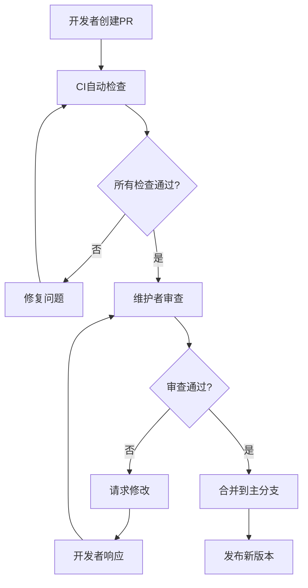
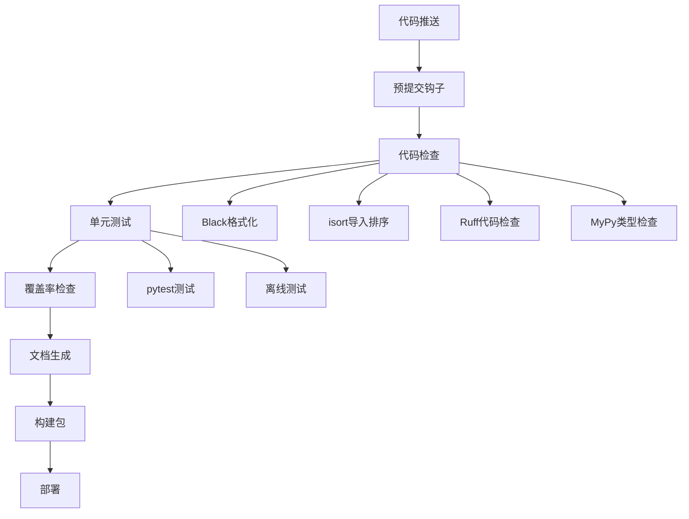
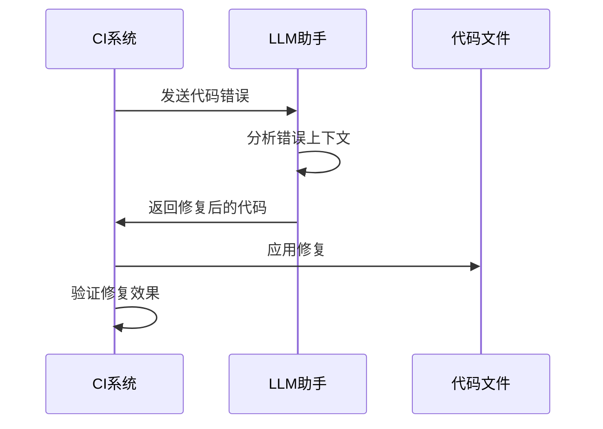
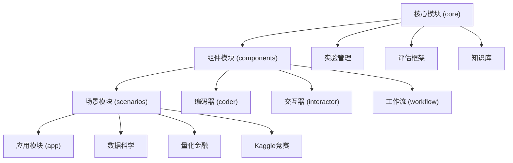

# 贡献指南

<cite>
**本文档中引用的文件**
- [CONTRIBUTING.md](file://CONTRIBUTING.md)
- [README.md](file://README.md)
- [pyproject.toml](file://pyproject.toml)
- [Makefile](file://Makefile)
- [requirements/lint.txt](file://requirements/lint.txt)
- [requirements/test.txt](file://requirements/test.txt)
- [rdagent/app/CI/run.py](file://rdagent/app/CI/run.py)
- [rdagent/app/CI/prompts.yaml](file://rdagent/app/CI/prompts.yaml)
- [rdagent/core/developer.py](file://rdagent/core/developer.py)
- [rdagent/utils/fmt.py](file://rdagent/utils/fmt.py)
- [CODE_OF_CONDUCT.md](file://CODE_OF_CONDUCT.md)
- [rdagent/utils/agent/apply_patch.py](file://rdagent/utils/agent/apply_patch.py)
- [test/utils/README.md](file://test/utils/README.md)
</cite>

## 目录
1. [项目简介](#项目简介)
2. [开发环境搭建](#开发环境搭建)
3. [代码风格要求](#代码风格要求)
4. [测试要求](#测试要求)
5. [Pull Request 审查流程](#pull-request-审查流程)
6. [CI/CD 流水线](#cicd-流水线)
7. [代码组织建议](#代码组织建议)
8. [文档贡献指南](#文档贡献指南)
9. [问题报告与反馈](#问题报告与反馈)
10. [社区行为准则](#社区行为准则)

## 项目简介

RD-Agent 是一个基于大型语言模型的自动化研发代理框架，旨在实现数据驱动的研发过程自动化。该项目支持多个工业场景，包括量化交易、数据科学竞赛、医疗预测等。

### 核心特性
- **多场景支持**：支持量化金融、数据科学、医疗等多个领域
- **自动化程度高**：从想法提出到代码实现的完整自动化流程
- **模块化设计**：清晰的组件分离和可扩展的架构
- **工业级质量**：经过严格测试和持续集成保证代码质量

**章节来源**
- [README.md](file://README.md#L1-L50)
- [CONTRIBUTING.md](file://CONTRIBUTING.md#L1-L10)

## 开发环境搭建

### 系统要求
- **操作系统**：Linux（推荐）
- **Python版本**：3.10 或 3.11（已通过CI测试）
- **Docker**：用于运行演示和测试环境

### 快速开始

#### 1. 克隆仓库
```bash
git clone https://github.com/microsoft/RD-Agent.git
cd RD-Agent
```

#### 2. 创建虚拟环境
```bash
conda create -n rdagent python=3.10
conda activate rdagent
```

#### 3. 安装开发依赖
```bash
make dev
```

该命令会安装所有必要的开发工具和依赖项，包括：
- 文档生成工具
- 代码检查工具
- 测试框架
- 包构建工具

#### 4. 验证安装
```bash
# 运行健康检查
rdagent health_check --no-check-env

# 检查Docker配置
rdagent health_check --no-check-env --no-check-docker
```

### 环境变量配置

项目支持多种LLM提供商配置，推荐使用LiteLLM作为默认后端：

```bash
# OpenAI配置示例
cat << EOF > .env
CHAT_MODEL=gpt-4o
EMBEDDING_MODEL=text-embedding-3-small
OPENAI_API_KEY=<your_api_key>
EOF

# DeepSeek配置示例
cat << EOF > .env
CHAT_MODEL=deepseek/deepseek-chat
DEEPSEEK_API_KEY=<your_api_key>
EMBEDDING_MODEL=litellm_proxy/BAAI/bge-m3
LITELLM_PROXY_API_KEY=<siliconflow_api_key>
LITELLM_PROXY_API_BASE=https://api.siliconflow.cn/v1
EOF
```

**章节来源**
- [README.md](file://README.md#L150-L250)
- [Makefile](file://Makefile#L60-L80)

## 代码风格要求

### 自动化代码格式化

项目采用多种工具确保代码风格一致性：

#### Black 格式化
```bash
# 检查格式
make black

# 自动修复格式
make auto-black
```

#### isort 导入排序
```bash
# 检查导入顺序
make isort

# 自动修复导入顺序
make auto-isort
```

#### Ruff 代码检查
```bash
# 检查代码质量
make ruff

# 自动修复可修复的问题
make auto-lint
```

#### MyPy 类型检查
```bash
# 检查类型注解
make mypy
```

#### TOML 文件排序
```bash
# 检查pyproject.toml格式
make toml-sort

# 自动修复格式
make auto-toml-sort
```

### 手动代码风格指南

#### 命名约定
- **类名**：使用 PascalCase（如 `DataScienceScenario`）
- **函数和方法名**：使用 snake_case（如 `process_data()`）
- **常量**：使用 UPPER_CASE（如 `MAX_RETRIES = 5`）
- **私有成员**：以单下划线开头（如 `_private_method`）

#### 类型注解标准
```python
from typing import List, Dict, Optional, Union
from dataclasses import dataclass

@dataclass
class ExperimentConfig:
    name: str
    params: Dict[str, Union[int, float, str]]
    timeout: Optional[int] = None
    
    def validate(self) -> bool:
        """验证配置的有效性"""
        return self.timeout is None or self.timeout > 0
```

#### 文档字符串规范
```python
def process_data(data: List[float], threshold: float = 0.5) -> Dict[str, float]:
    """
    处理输入数据并返回统计信息。
    
    Args:
        data: 要处理的数据列表
        threshold: 用于过滤的阈值，默认为0.5
        
    Returns:
        包含统计数据的字典
        
    Raises:
        ValueError: 当输入数据为空时
    """
    if not data:
        raise ValueError("数据不能为空")
    
    return {
        "mean": sum(data) / len(data),
        "max": max(data),
        "min": min(data)
    }
```

**章节来源**
- [pyproject.toml](file://pyproject.toml#L40-L80)
- [Makefile](file://Makefile#L80-L120)

## 测试要求

### 测试覆盖率目标

项目要求至少 **80%** 的代码覆盖率：

```bash
# 运行完整测试套件
make test

# 运行离线测试（不依赖API）
make test-offline
```

### 测试文件组织结构

```
test/
├── notebook/           # Notebook测试
│   ├── testfiles/     # 测试用例文件
│   └── *.py           # 测试脚本
├── oai/               # OAI相关测试
├── qlib/              # Qlib测试
└── utils/             # 工具测试
    └── test_env.py    # 环境测试
```

### 单元测试编写指南

#### 基本测试结构
```python
import pytest
from rdagent.components.coder.data_science import DataScienceCoder

class TestDataScienceCoder:
    @pytest.fixture
    def coder(self):
        return DataScienceCoder()
    
    def test_process_feature(self, coder):
        """测试特征处理功能"""
        input_data = {"feature1": [1, 2, 3], "feature2": [4, 5, 6]}
        result = coder.process_features(input_data)
        
        assert "feature1_transformed" in result
        assert len(result["feature1_transformed"]) == 3
    
    @pytest.mark.offline
    def test_offline_functionality(self, coder):
        """测试离线功能"""
        config = {"mode": "offline"}
        result = coder.configure(config)
        assert result["mode"] == "offline"
```

#### Mock 和模拟对象
```python
from unittest.mock import Mock, patch

def test_llm_integration():
    """测试与LLM服务的集成"""
    with patch('rdagent.oai.backend.APIBackend') as mock_backend:
        mock_backend.return_value.chat_completion.return_value = "mock response"
        
        coder = DataScienceCoder()
        result = coder.generate_code("test prompt")
        
        assert result == "mock response"
        mock_backend.return_value.chat_completion.assert_called_once()
```

### 测试运行方法

#### 完整测试套件
```bash
# 清理旧的覆盖率数据
make clean

# 运行测试并生成覆盖率报告
make test

# 查看HTML覆盖率报告
open public/reports/coverage/index.html
```

#### 针对性测试
```bash
# 只测试特定模块
pytest test/utils/test_env.py

# 使用并发执行提高速度
pytest --concurrency=multiprocessing

# 显示详细输出
pytest -vvs
```

**章节来源**
- [pyproject.toml](file://pyproject.toml#L30-L40)
- [Makefile](file://Makefile#L140-L170)
- [requirements/test.txt](file://requirements/test.txt#L1-L4)

## Pull Request 审查流程

### 必要检查项

#### 1. 代码质量检查
- [ ] 通过所有自动化的代码检查（Black、isort、Ruff、MyPy）
- [ ] 单元测试覆盖率不低于80%
- [ ] 所有现有测试通过
- [ ] 新增功能有对应的测试用例

#### 2. 文档更新
- [ ] 更新相关文档
- [ ] 添加必要的类型注解
- [ ] 更新变更日志（CHANGELOG.md）
- [ ] 提供清晰的提交消息

#### 3. 向后兼容性
- [ ] 不破坏现有API
- [ ] 标记废弃的功能（如果需要）
- [ ] 提供迁移指南（如适用）

### Pull Request 模板

```markdown
## 描述
简要描述此PR的目的和更改内容。

## 更改类型
- [ ] 新功能
- [ ] 错误修复
- [ ] 文档改进
- [ ] 性能优化
- [ ] 重构

## 测试
- [ ] 添加了新的测试用例
- [ ] 所有现有测试通过
- [ ] 手动测试完成

## 检查清单
- [ ] 代码遵循项目风格指南
- [ ] 自我审查了代码
- [ ] 添加了必要的注释
- [ ] 更新了相关文档
- [ ] 未引入向后不兼容的更改
```

### 审查流程



**图表来源**
- [CONTRIBUTING.md](file://CONTRIBUTING.md#L42-L50)

**章节来源**
- [CONTRIBUTING.md](file://CONTRIBUTING.md#L15-L40)

## CI/CD 流水线

### CI 流水线架构

项目使用 GitHub Actions 实现持续集成，包含以下阶段：



**图表来源**
- [rdagent/app/CI/run.py](file://rdagent/app/CI/run.py#L1-L50)

### 验证规则

#### 1. 代码质量验证
CI系统自动运行以下检查：

| 检查工具 | 验证内容 | 失败处理 |
|---------|---------|---------|
| Black | 代码格式化 | 自动修复或标记错误 |
| isort | 导入语句排序 | 检查导入顺序 |
| Ruff | 代码质量和风格 | 报告具体错误位置 |
| MyPy | 类型注解检查 | 报告类型错误 |

#### 2. 自动修复机制
CI系统具备智能修复能力：



**图表来源**
- [rdagent/app/CI/run.py](file://rdagent/app/CI/run.py#L400-L500)

#### 3. 错误分类和统计
CI系统会对错误进行分类统计：

- **直接修复**：可自动修复的简单错误
- **手动修复**：需要人工干预的复杂错误  
- **跳过错误**：暂时无法修复的错误

### CI 配置文件

项目使用多种配置文件管理CI设置：

- **GitHub Actions**：`.github/workflows/`
- **Ruff配置**：`pyproject.toml` 中的 `[tool.ruff]` 部分
- **MyPy配置**：`pyproject.toml` 中的 `[tool.mypy]` 部分
- **Coverage配置**：`pyproject.toml` 中的 `[tool.coverage]` 部分

**章节来源**
- [rdagent/app/CI/run.py](file://rdagent/app/CI/run.py#L1-L100)
- [pyproject.toml](file://pyproject.toml#L40-L80)

## 代码组织建议

### 模块化设计原则

#### 1. 组件层次结构


**图表来源**
- [rdagent/core/developer.py](file://rdagent/core/developer.py#L1-L35)

#### 2. 文件命名规范
- **模块文件**：使用小写字母和下划线（如 `data_science_coder.py`）
- **配置文件**：使用小写字母和下划线（如 `conf.yaml`）
- **测试文件**：以 `test_` 开头（如 `test_data_science_coder.py`）
- **示例文件**：以 `example_` 开头（如 `example_config.yaml`）

#### 3. 导入组织结构
```python
# 标准库导入
import os
import sys
from typing import List, Dict, Optional

# 第三方库导入
from rdagent.core import Experiment, Scenario

# 项目内部导入
from rdagent.components.coder import CoderBase
from rdagent.utils import format_code
```

### 架构设计指导

#### 1. 单一职责原则
每个类和函数应该只有一个改变的理由：

```python
class DataProcessor:
    """负责数据预处理的核心类"""
    
    def preprocess(self, raw_data: List[Dict]) -> List[Dict]:
        """预处理原始数据"""
        cleaned_data = self._clean_data(raw_data)
        normalized_data = self._normalize_data(cleaned_data)
        return normalized_data
    
    def _clean_data(self, data: List[Dict]) -> List[Dict]:
        """清理数据中的异常值"""
        return [item for item in data if self._is_valid(item)]
    
    def _normalize_data(self, data: List[Dict]) -> List[Dict]:
        """标准化数据范围"""
        return [self._normalize_item(item) for item in data]
```

#### 2. 接口设计
使用抽象基类定义清晰的接口：

```python
from abc import ABC, abstractmethod
from typing import Generic, TypeVar

T = TypeVar('T')

class Processor(ABC, Generic[T]):
    """处理器接口"""
    
    @abstractmethod
    def process(self, data: T) -> T:
        """处理数据"""
        pass
    
    @abstractmethod
    def validate(self, data: T) -> bool:
        """验证数据有效性"""
        pass
```

#### 3. 错误处理策略
实现统一的错误处理机制：

```python
from dataclasses import dataclass
from typing import Optional

@dataclass
class ProcessingResult:
    """处理结果类"""
    success: bool
    data: Optional[List[Dict]] = None
    error: Optional[str] = None
    metrics: Optional[Dict] = None
    
    @classmethod
    def failure(cls, error: str) -> 'ProcessingResult':
        return cls(success=False, error=error)
    
    @classmethod
    def success(cls, data: List[Dict], metrics: Dict) -> 'ProcessingResult':
        return cls(success=True, data=data, metrics=metrics)
```

**章节来源**
- [rdagent/core/developer.py](file://rdagent/core/developer.py#L10-L35)

## 文档贡献指南

### 文档结构

#### 1. 代码文档
- **模块级别**：在模块顶部添加文档字符串
- **类级别**：为每个类添加详细的说明
- **方法级别**：为公共方法添加参数和返回值说明
- **示例代码**：提供实际使用示例

#### 2. 用户文档
- **快速开始**：简洁的安装和使用指南
- **教程**：循序渐进的学习路径
- **API参考**：完整的接口文档
- **最佳实践**：常见问题和解决方案

#### 3. 开发者文档
- **架构设计**：系统整体架构说明
- **开发指南**：代码贡献流程
- **测试指南**：测试编写和运行方法
- **部署指南**：生产环境部署说明

### 文档生成

项目使用 Sphinx 生成文档：

```bash
# 生成文档
make docs-gen

# 自动构建文档（实时预览）
make docs-autobuild

# 生成mypy报告
make docs-mypy

# 生成覆盖率报告
make docs-coverage
```

### 示例补充

#### 数据科学场景示例
```python
# 示例：如何使用数据科学场景
from rdagent.scenarios.data_science import DataScienceScen

# 创建场景实例
scenario = DataScienceScen(
    competition="tabular-playground-series-dec-2021",
    local_data_path="./data"
)

# 运行实验循环
result = scenario.run()
```

#### 量化金融场景示例
```python
# 示例：如何使用量化金融场景
from rdagent.scenarios.qlib import QuantScen

# 创建量化场景
quant_scenario = QuantScen(
    factor_data_path="./factor_data",
    model_config={"model_type": "lightgbm"}
)

# 执行因子优化
results = quant_scenario.optimize_factors()
```

**章节来源**
- [Makefile](file://Makefile#L190-L222)

## 问题报告与反馈

### 获取帮助

#### 1. 查找现有问题
```bash
# 搜索TODO注释
grep -r "TODO:" .

# 查看GitHub Issues
# https://github.com/microsoft/RD-Agent/issues
```

#### 2. 报告Bug
创建Bug报告时，请包含以下信息：
- **环境信息**：操作系统、Python版本、依赖版本
- **重现步骤**：详细的复现步骤
- **预期行为**：期望的正确行为
- **实际行为**：当前观察到的行为
- **错误日志**：完整的错误堆栈跟踪

#### 3. 功能请求
功能请求应包含：
- **使用场景**：为什么需要这个功能
- **期望行为**：功能的具体描述
- **替代方案**：目前的解决方案（如果有）

### 社区交流

#### 1. Discord频道
加入我们的Discord社区获得实时帮助：
- 频道链接：[Discord](https://discord.gg/ybQ97B6Jjy)
- 加入方式：扫描GitHub仓库中的二维码

#### 2. 微信群组
加入官方微信群获取最新动态：
- 群组二维码：[GitHub Issue #880](https://github.com/microsoft/RD-Agent/issues/880)

**章节来源**
- [CONTRIBUTING.md](file://CONTRIBUTING.md#L35-L40)

## 社区行为准则

### 基本原则

#### 1. 尊重他人
- 使用友好和包容的语言
- 尊重不同的观点和经验
- 接受建设性的批评
- 专注于对社区最有利的事情

#### 2. 包容性
- 欢迎新贡献者
- 提供建设性的反馈
- 避免歧视性语言
- 支持所有背景的参与者

#### 3. 专业性
- 保持专业的沟通方式
- 避免人身攻击
- 遵守法律和道德规范
- 维护项目的声誉

### 执行机制

#### 1. 报告程序
如果遇到违反行为准则的行为：
1. **私下沟通**：首先尝试私下解决
2. **社区介入**：通过社区渠道报告
3. **正式处理**：项目维护团队将调查处理

#### 2. 处理措施
根据违规严重程度，可能采取以下措施：
- **警告**：书面警告
- **限制**：临时限制参与
- **移除**：永久移除贡献资格

#### 3. 申诉机制
被处罚的用户有权提出申诉：
1. 向项目维护团队提交申诉
2. 提供相关证据和说明
3. 等待公正的处理决定

**章节来源**
- [CODE_OF_CONDUCT.md](file://CODE_OF_CONDUCT.md#L1-L10)

## 结语

RD-Agent作为一个前沿的AI研发自动化平台，欢迎所有形式的贡献。无论是代码贡献、文档改进、问题报告还是功能建议，每一份贡献都将推动项目向前发展。

### 如何开始贡献

1. **选择感兴趣的领域**：数据科学、量化金融、文档、测试等
2. **阅读相关文档**：了解项目架构和设计原则
3. **从小处着手**：从简单的bug修复或文档改进开始
4. **积极参与讨论**：在GitHub Issues和Discord中分享想法
5. **持续学习**：跟进项目的发展和新技术的应用

### 期待您的贡献！

我们相信，通过社区的共同努力，RD-Agent将成为AI研发自动化领域的标杆项目。感谢您对开源社区的支持和贡献！