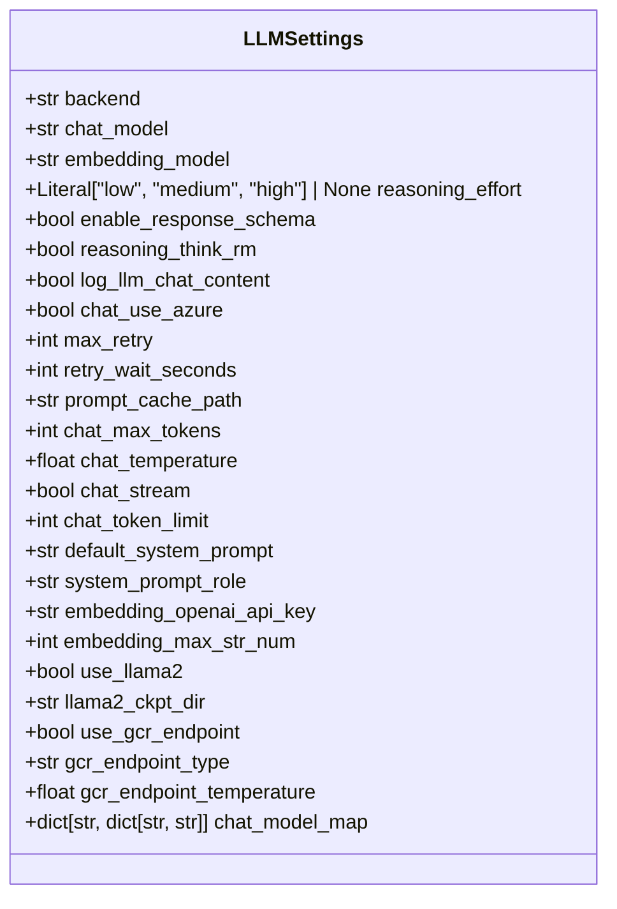

# 配置与设置

<cite>
**本文档中引用的文件**  
- [pyproject.toml](file://pyproject.toml)
- [rdagent/oai/llm_conf.py](file://rdagent/oai/llm_conf.py)
- [rdagent/app/data_science/conf.py](file://rdagent/app/data_science/conf.py)
- [rdagent/utils/env.py](file://rdagent/utils/env.py)
- [rdagent/core/conf.py](file://rdagent/core/conf.py)
- [rdagent/log/conf.py](file://rdagent/log/conf.py)
- [rdagent/app/cli.py](file://rdagent/app/cli.py)
- [README.md](file://README.md)
</cite>

## 目录
1. [简介](#简介)
2. [.env环境变量配置](#env环境变量配置)
3. LLM配置详解 (llm_conf.py)  
4. 项目元数据与脚本入口 (pyproject.toml)  
5. 完整配置示例
6. 不同使用场景的配置建议
7. 配置验证与健康检查

## 简介
RD-Agent 是一个自动化研发代理框架，其行为高度依赖于配置文件。本指南旨在全面解析其配置系统，涵盖从环境变量到高级LLM设置的所有关键选项。通过理解这些配置，用户可以灵活地定制框架以适应不同的应用场景，如数据科学竞赛、量化交易研究或通用模型开发。配置主要通过三个层面实现：`.env`文件中的环境变量、Python代码中的配置类以及`pyproject.toml`中的项目元数据。

**Section sources**
- [README.md](file://README.md#L162-L336)

## .env环境变量配置
`.env` 文件是RD-Agent配置的核心，用于设置运行时的环境变量。这些变量控制着LLM提供商、API密钥、数据路径和特定场景的行为。以下是关键环境变量的详细说明。

### 核心LLM环境变量
这些变量定义了用于聊天和嵌入的LLM模型及其API端点。

| 环境变量 | 作用 | 可选值/说明 |
| :--- | :--- | :--- |
| `CHAT_MODEL` | 指定用于聊天补全的LLM模型。 | - **OpenAI**: `gpt-4o`, `gpt-4-turbo`, `gpt-3.5-turbo`<br>- **Azure OpenAI**: `azure/<your_deployment_name>`<br>- **DeepSeek**: `deepseek/deepseek-chat`<br>- **LiteLLM支持的任何模型** |
| `EMBEDDING_MODEL` | 指定用于生成文本嵌入的模型。 | - **OpenAI**: `text-embedding-3-small`, `text-embedding-3-large`<br>- **Azure OpenAI**: `azure/<Model_deployment_supporting_embedding>`<br>- **第三方提供商**: `litellm_proxy/BAAI/bge-m3` (通过LiteLLM代理) |
| `OPENAI_API_KEY` | OpenAI API密钥。当使用OpenAI或Azure OpenAI时需要。 | 从OpenAI平台获取的密钥字符串。 |
| `DEEPSEEK_API_KEY` | DeepSeek API密钥。当使用DeepSeek作为聊天模型时需要。 | 从DeepSeek平台获取的密钥字符串。 |
| `LITELLM_PROXY_API_KEY` | LiteLLM代理的API密钥，用于访问非OpenAI的嵌入模型。 | 例如，使用SiliconFlow时，需提供其API密钥。 |

**Section sources**
- [README.md](file://README.md#L162-L248)

### 场景与数据路径环境变量
这些变量定义了特定应用场景和数据存储位置。

| 环境变量 | 作用 | 可选值/说明 |
| :--- | :--- | :--- |
| `DS_SCEN` | 指定数据科学场景的类路径。 | - `rdagent.scenarios.data_science.scen.KaggleScen`: 用于Kaggle竞赛<br>- `rdagent.scenarios.data_science.scen.DataScienceScen`: 用于自定义数据科学任务 |
| `DS_LOCAL_DATA_PATH` | 本地数据集的存储路径。 | 一个有效的文件系统路径，例如 `$(pwd)/git_ignore_folder/ds_data`。 |
| `DS_IF_USING_MLE_DATA` | 是否使用MLEBench数据集。 | `True` 或 `False`。 |
| `DS_SAMPLE_DATA_BY_LLM` | 是否让LLM对数据进行采样。 | `True` 或 `False`。 |
| `KG_RAG_PATH` | 知识库向量数据库的路径。 | 一个`.pkl`文件的路径，例如 `./knowledge_base.pkl`。 |

**Section sources**
- [README.md](file://README.md#L254-L336)
- [rdagent/scenarios/kaggle/knowledge_management/README.md](file://rdagent/scenarios/kaggle/knowledge_management/README.md#L0-L7)

### 高级与调试环境变量
这些变量用于控制框架的高级行为和调试功能。

| 环境变量 | 作用 | 可选值/说明 |
| :--- | :--- | :--- |
| `REASONING_THINK_RM` | 如果LLM响应中包含 `<think>...</think>` 标签，设置为 `True` 以移除这些标签。 | `True` 或 `False`。 |
| `LOG_UI_SERVER_PORT` | 指定日志UI服务器的端口号。 | 一个整数端口号，例如 `19899`。 |
| `QLIB_DOCKER_MEM_LIMIT` | 为Qlib Docker容器设置内存限制。 | 一个内存大小字符串，例如 `48g`。 |
| `RUNNING_TIMEOUT_PERIOD` | 设置Docker容器运行的超时时间（秒）。 | 一个整数，`None` 表示无限制。 |

**Section sources**
- [README.md](file://README.md#L162-L248)
- [rdagent/utils/env.py](file://rdagent/utils/env.py#L606-L637)
- [rdagent/log/conf.py](file://rdagent/log/conf.py#L0-L27)

## LLM配置详解 (llm_conf.py)
`llm_conf.py` 文件定义了 `LLMSettings` 类，它通过 `pydantic` 提供了对LLM后端的细粒度控制。该配置类是 `ExtendedBaseSettings` 的子类，可以从环境变量中自动加载配置。

### LLMSettings 配置结构
`LLMSettings` 类的结构清晰地分为几个逻辑部分：



**Diagram sources**
- [rdagent/oai/llm_conf.py](file://rdagent/oai/llm_conf.py#L0-L132)

### 核心配置项说明
- **`backend`**: 指定LLM后端实现。默认为 `"rdagent.oai.backend.LiteLLMAPIBackend"`，这使得框架可以与多个LLM提供商集成。
- **`reasoning_effort`**: 控制LLM推理的“努力程度”，可选值为 `"low"`, `"medium"`, `"high"` 或 `None`。这可能影响LLM生成响应的深度和复杂性。
- **`enable_response_schema`**: 是否启用聊天模型的响应模式（json_mode）。对于支持此功能的模型，这可以确保LLM返回结构化的JSON响应。
- **`reasoning_think_rm`**: 一个布尔值，用于处理包含 `<think>` 标签的推理模型的输出，自动清理这些内部思考标记。
- **`chat_temperature`**: 控制聊天响应的随机性。值越低，输出越确定和集中；值越高，输出越随机和创造性。
- **`chat_token_limit`**: 设置聊天上下文的最大令牌限制。默认值 `100000` 适用于GPT-4等大上下文模型。
- **`system_prompt_role`**: 允许自定义系统提示的角色。这对于不支持 `system` 角色的模型（如o1）至关重要。
- **`use_gcr_endpoint`**: 启用使用Google Cloud Run (GCR) 托管的私有LLM端点。
- **`gcr_endpoint_type`**: 当 `use_gcr_endpoint` 为 `True` 时，指定要使用的端点类型，如 `"llama2_70b"`, `"llama3_70b"`, `"phi3_128k"` 等。
- **`chat_model_map`**: 一个字典，用于映射模型名称到特定的提供商配置，提供了一种灵活的模型路由机制。

**Section sources**
- [rdagent/oai/llm_conf.py](file://rdagent/oai/llm_conf.py#L0-L132)

## 项目元数据与脚本入口 (pyproject.toml)
`pyproject.toml` 是Python项目的现代构建配置文件，它定义了项目的元数据和命令行接口。

### 项目元数据
该文件的 `[project]` 部分定义了项目的基本信息：
- **`name`**: 项目名称，为 `rdagent`。
- **`description`**: 项目描述，为 "Research & Development Agent"。
- **`authors`**: 作者信息，为 `MSRA-MIIC`。
- **`readme`**: 项目的README文件，为 `README.md`。
- **`requires-python`**: 所需的Python版本，为 `>=3.10`。

### 脚本入口
`[project.scripts]` 部分定义了命令行工具的入口点，这是用户与RD-Agent交互的主要方式。
```toml
[project.scripts]
rdagent = "rdagent.app.cli:app"
```
这行配置将 `rdagent` 命令映射到 `rdagent.app.cli` 模块中的 `app` 对象。`app` 是一个 `typer.Typer` 实例，它注册了所有可用的子命令。

### 可用的CLI命令
根据 `cli.py` 文件，`rdagent` 命令提供了以下子命令：
- `rdagent fin_factor`: 运行量化交易因子演化。
- `rdagent fin_model`: 运行量化交易模型演化。
- `rdagent fin_quant`: 运行因子与模型联合演化。
- `rdagent fin_factor_report`: 从金融报告中提取因子。
- `rdagent general_model`: 从论文中提取和实现模型。
- `rdagent data_science`: 运行数据科学任务（如Kaggle竞赛）。
- `rdagent health_check`: 执行配置健康检查。
- `rdagent ui`: 启动Web UI来查看日志。

**Section sources**
- [pyproject.toml](file://pyproject.toml#L0-L124)
- [rdagent/app/cli.py](file://rdagent/app/cli.py#L0-L87)

## 完整配置示例
以下是一个完整的 `.env` 配置文件示例，适用于在Kaggle竞赛中使用DeepSeek作为聊天模型，并使用SiliconFlow进行嵌入。

```bash
# CHAT MODEL: 使用DeepSeek官方API
CHAT_MODEL=deepseek/deepseek-chat 
DEEPSEEK_API_KEY=your_deepseek_api_key_here

# EMBEDDING MODEL: 使用SiliconFlow进行嵌入
EMBEDDING_MODEL=litellm_proxy/BAAI/bge-m3
LITELLM_PROXY_API_KEY=your_siliconflow_api_key_here
LITELLM_PROXY_API_BASE=https://api.siliconflow.cn/v1

# 数据科学场景配置
DS_SCEN=rdagent.scenarios.data_science.scen.KaggleScen
DS_LOCAL_DATA_PATH=$(pwd)/git_ignore_folder/ds_data
DS_IF_USING_MLE_DATA=True
DS_SAMPLE_DATA_BY_LLM=True
DS_CODER_ON_WHOLE_PIPELINE=True

# 日志与UI配置
LOG_UI_SERVER_PORT=19899

# 高级设置
REASONING_THINK_RM=True
```

**Section sources**
- [README.md](file://README.md#L162-L248)

## 不同使用场景的配置建议

### 切换LLM提供商
RD-Agent通过LiteLLM后端支持多种LLM提供商。切换提供商非常简单，只需更改 `.env` 文件中的 `CHAT_MODEL` 和 `EMBEDDING_MODEL` 变量，并提供相应的API密钥。

- **从OpenAI切换到DeepSeek**:
  将 `OPENAI_API_KEY` 替换为 `DEEPSEEK_API_KEY`，并将 `CHAT_MODEL` 的值从 `gpt-4o` 改为 `deepseek/deepseek-chat`。由于DeepSeek不提供嵌入模型，嵌入模型仍需使用第三方服务。

- **使用Azure OpenAI**:
  设置 `CHAT_MODEL=azure/<your_deployment_name>` 和 `EMBEDDING_MODEL=azure/<embedding_deployment_name>`，并提供 `AZURE_API_KEY`, `AZURE_API_BASE`, 和 `AZURE_API_VERSION`。

### 调整知识库路径
要启用知识库功能，您需要：
1.  首先，使用 `extract_knowledge.py` 脚本生成知识库。
2.  然后，在 `vector_base.py` 中创建向量数据库并保存为 `.pkl` 文件。
3.  最后，在 `.env` 文件中设置 `KG_RAG_PATH` 指向该 `.pkl` 文件。

### 针对数据科学竞赛的配置
对于Kaggle竞赛，关键配置是 `DS_SCEN`。将其设置为 `rdagent.scenarios.data_science.scen.KaggleScen` 以启用Kaggle特定的工作流。同时，确保 `DS_LOCAL_DATA_PATH` 指向包含竞赛数据的正确目录，并根据需要设置 `DS_IF_USING_MLE_DATA`。

### 针对本地开发的配置
为了便于本地调试，可以设置 `LOG_UI_SERVER_PORT` 来指定UI端口，并将 `LOG_TRACE_PATH` 设置为一个固定的路径，而不是使用时间戳，以便于日志的持续追踪。

**Section sources**
- [rdagent/app/data_science/conf.py](file://rdagent/app/data_science/conf.py#L0-L206)
- [rdagent/scenarios/kaggle/knowledge_management/README.md](file://rdagent/scenarios/kaggle/knowledge_management/README.md#L0-L7)

## 配置验证与健康检查
在运行任何任务之前，强烈建议使用 `rdagent health_check` 命令来验证您的配置。此命令会测试LLM的聊天和嵌入功能是否正常工作。

```bash
rdagent health_check
```
该命令会检查 `.env` 文件中定义的API密钥和模型配置，并尝试执行一个简单的聊天和嵌入查询。如果所有测试都通过，说明您的配置是有效的。如果失败，它会提供详细的错误信息，帮助您诊断问题。

**Section sources**
- [README.md](file://README.md#L162-L248)
- [rdagent/app/utils/health_check.py](file://rdagent/app/utils/health_check.py#L102-L128)