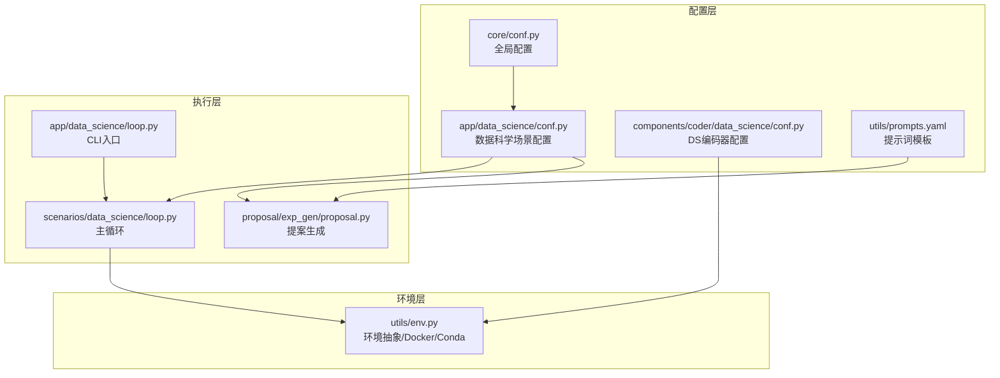
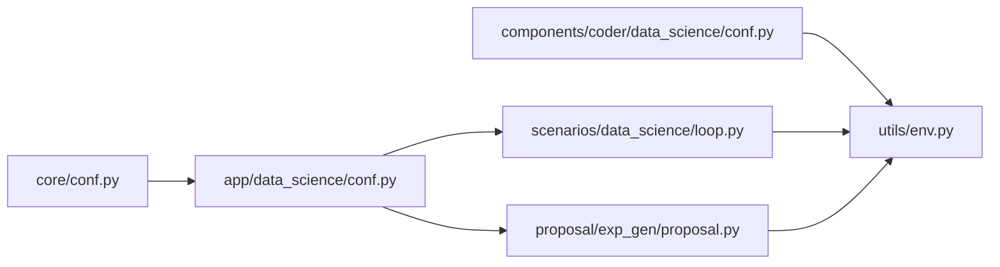

# 数据科学配置系统

<cite>
**本文引用的文件**
- [rdagent/app/data_science/conf.py](file://rdagent/app/data_science/conf.py)
- [rdagent/components/coder/data_science/conf.py](file://rdagent/components/coder/data_science/conf.py)
- [rdagent/scenarios/data_science/proposal/exp_gen/proposal.py](file://rdagent/scenarios/data_science/proposal/exp_gen/proposal.py)
- [rdagent/scenarios/data_science/loop.py](file://rdagent/scenarios/data_science/loop.py)
- [rdagent/app/data_science/loop.py](file://rdagent/app/data_science/loop.py)
- [rdagent/utils/env.py](file://rdagent/utils/env.py)
- [rdagent/core/conf.py](file://rdagent/core/conf.py)
- [rdagent/utils/prompts.yaml](file://rdagent/utils/prompts.yaml)
- [rdagent/app/data_science/CLAUDE.md](file://rdagent/app/data_science/CLAUDE.md)
- [docs/installation_and_configuration.rst](file://docs/installation_and_configuration.rst)
- [docs/scens/data_science.rst](file://docs/scens/data_science.rst)
- [test/utils/test_conf.py](file://test/utils/test_conf.py)
- [test/utils/test_env.py](file://test/utils/test_env.py)
</cite>

## 目录
1. [简介](#简介)
2. [项目结构](#项目结构)
3. [核心组件](#核心组件)
4. [架构总览](#架构总览)
5. [详细组件分析](#详细组件分析)
6. [依赖分析](#依赖分析)
7. [性能考虑](#性能考虑)
8. [故障排查指南](#故障排查指南)
9. [结论](#结论)
10. [附录](#附录)

## 简介
本文件面向“数据科学配置系统”，系统性梳理 RD-Agent 在数据科学场景下的配置与执行闭环，重点覆盖：
- 配置体系：全局配置、数据科学场景配置、编码器/运行器环境配置、提示词与模板配置
- 执行流程：CLI 入口、主循环、提案生成、编码、运行、反馈与归档
- 环境管理：Docker/Conda 等执行环境的统一抽象与配置
- 多轨迹/多样性/奖励等高级特性配置
- 可观测性与可恢复性：断点恢复、日志归档、工作区清理

## 项目结构
数据科学配置系统围绕“配置-执行-环境”三层展开：
- 配置层：全局配置、场景配置、编码器/运行器配置、提示词模板
- 执行层：CLI 入口、主循环、提案生成、编码、运行、反馈、归档
- 环境层：统一的环境抽象与 Docker/Conda 配置



图表来源
- [rdagent/app/data_science/conf.py](file://rdagent/app/data_science/conf.py#L1-L207)
- [rdagent/components/coder/data_science/conf.py](file://rdagent/components/coder/data_science/conf.py#L1-L88)
- [rdagent/scenarios/data_science/proposal/exp_gen/proposal.py](file://rdagent/scenarios/data_science/proposal/exp_gen/proposal.py#L1-L120)
- [rdagent/scenarios/data_science/loop.py](file://rdagent/scenarios/data_science/loop.py#L87-L175)
- [rdagent/app/data_science/loop.py](file://rdagent/app/data_science/loop.py#L34-L174)
- [rdagent/utils/env.py](file://rdagent/utils/env.py#L121-L200)

章节来源
- [rdagent/app/data_science/conf.py](file://rdagent/app/data_science/conf.py#L1-L207)
- [rdagent/scenarios/data_science/loop.py](file://rdagent/scenarios/data_science/loop.py#L87-L175)
- [rdagent/app/data_science/loop.py](file://rdagent/app/data_science/loop.py#L34-L174)
- [rdagent/utils/env.py](file://rdagent/utils/env.py#L121-L200)

## 核心组件
- 全局配置（RDAgentSettings）
  - 工作空间、多进程、缓存、并行循环、调试开关等
  - 作为所有子配置的基类，通过继承式环境变量解析实现层级配置
- 数据科学场景配置（DataScienceBasePropSetting）
  - 场景类、规划器、假设生成器、交互器、调度器、总结器等组件选择
  - 超时、重试、日志归档、知识库、多轨迹、多样性注入、LLM 选择等高级特性
- 编码器/运行器环境配置（DSCoderCoSTEERSettings + get_ds_env）
  - 通过 env_type 选择 Docker 或 Conda
  - 提供 get_ds_env 统一获取环境对象，支持额外卷挂载、超时、缓存开关
- 提示词与模板（utils/prompts.yaml）
  - 标准化提示词结构，支持冗余文本过滤
- 执行主循环（DataScienceRDLoop）
  - 统一的 RDLoop 子类，串联提案生成、编码、运行、反馈、归档
  - 支持断点恢复、SOTA 选择、知识库持久化

章节来源
- [rdagent/core/conf.py](file://rdagent/core/conf.py#L1-L213)
- [rdagent/app/data_science/conf.py](file://rdagent/app/data_science/conf.py#L1-L207)
- [rdagent/components/coder/data_science/conf.py](file://rdagent/components/coder/data_science/conf.py#L1-L88)
- [rdagent/utils/prompts.yaml](file://rdagent/utils/prompts.yaml#L1-L21)
- [rdagent/scenarios/data_science/loop.py](file://rdagent/scenarios/data_science/loop.py#L87-L175)

## 架构总览
数据科学配置系统的关键交互如下：

```mermaid
sequenceDiagram
participant User as "用户"
participant CLI as "CLI入口(app/data_science/loop.py)"
participant Loop as "主循环(scenarios/data_science/loop.py)"
participant ExpGen as "提案生成(proposal.py)"
participant Coder as "编码器(各组件)"
participant Runner as "运行器"
participant Env as "环境(utils/env.py)"
User->>CLI : 传入参数/环境变量
CLI->>Loop : 初始化 DataScienceRDLoop
Loop->>ExpGen : async_gen(trace, loop)
ExpGen-->>Loop : DSExperiment(含待执行任务)
Loop->>Coder : develop(exp)
Coder->>Env : run/prepare(容器/本地)
Env-->>Coder : 输出/退出码
Coder-->>Loop : 更新后的 DSExperiment
Loop->>Runner : develop(exp)
Runner->>Env : run/prepare
Env-->>Runner : 输出/退出码
Runner-->>Loop : 新实验状态
Loop->>Loop : feedback()/record()
Loop->>Loop : 归档/备份/清理
```

图表来源
- [rdagent/app/data_science/loop.py](file://rdagent/app/data_science/loop.py#L34-L174)
- [rdagent/scenarios/data_science/loop.py](file://rdagent/scenarios/data_science/loop.py#L138-L210)
- [rdagent/scenarios/data_science/proposal/exp_gen/proposal.py](file://rdagent/scenarios/data_science/proposal/exp_gen/proposal.py#L387-L560)
- [rdagent/utils/env.py](file://rdagent/utils/env.py#L197-L344)

## 详细组件分析

### 1) 全局配置与继承式环境变量解析
- ExtendedBaseSettings
  - 自定义配置源优先级：初始化 > 当前环境变量 > 父类环境变量 > .env > 密钥文件
  - 通过递归收集父类继承链，为每个父类构建 EnvSettingsSource，实现“子类继承父类环境变量前缀”的配置继承
- RDAgentSettings
  - 工作空间路径、检查点大小限制、多进程并发、Pickle 缓存、MLflow 开关、并行循环信号量、调试开关等
  - 提供 get_max_parallel/is_force_subproc 辅助判断并发与子进程执行

章节来源
- [rdagent/core/conf.py](file://rdagent/core/conf.py#L1-L213)

### 2) 数据科学场景配置（DS_RD_SETTING）
- 组件与流程
  - scen/planner/hypothesis_gen/interactor/trace_scheduler/summarizer 等组件类名配置
  - coder_on_whole_pipeline、max_trace_hist、coder/runner 最大循环次数
- 超时与重试
  - debug_recommend_timeout/debug_timeout/full_recommend_timeout/full_timeout
  - consecutive_errors、coding_fail_reanalyze_threshold
- 高级特性
  - enable_model_dump、enable_doc_dev、enable_mcp_documentation_search
  - enable_notebook_conversion、spec_enabled
  - 知识库开关与路径、idea_pool_json_path
  - enable_log_archive/log_archive_path/log_archive_temp_path
  - 多轨迹：max_trace_num、scheduler_temperature、scheduler_c_puct、enable_score_reward
  - 选择器：selector_name/sota_exp_selector_name、sota_count_window/sota_count_threshold
  - 多轨迹注入：enable_inject_diverse、enable_cross_trace_diversity、diversity_injection_strategy
  - 多版本实验生成：enable_multi_version_exp_gen、exp_gen_version_list
  - 合并时机：merge_hours、max_sota_retrieved_num
  - draft 与规划：enable_draft_before_first_sota、enable_planner
  - 超时策略：model_architecture_suggestion_time_percent、allow_longer_timeout、LLM 决策超时
  - 代码变更摘要：runner_enable_code_change_summary
  - 假设生成：enable_simple_hypothesis、enable_generate_unique_hypothesis、enable_research_rag
  - 假设评审：enable_hypo_critique_rewrite、enable_scale_check
  - 选择策略：ratio_merge_or_ensemble、llm_select_hypothesis
  - 任务生成：fix_seed_and_data_split、ensemble_time_upper_bound
  - 用户交互：user_interaction_wait_seconds、user_interaction_mid_folder
- 断言约束
  - enable_cross_trace_diversity 与 llm_select_hypothesis 不能同时为真

章节来源
- [rdagent/app/data_science/conf.py](file://rdagent/app/data_science/conf.py#L1-L207)

### 3) 编码器/运行器环境配置（DSCoderCoSTEERSettings + get_ds_env）
- DSCoderCoSTEERSettings
  - env_prefix=DS_Coder_CoSTEER_
  - max_seconds_multiplier、env_type(docker/conda)
  - extra_evaluator/extra_eval（扩展评估器）
- get_ds_env
  - 根据 env_type 返回 DockerEnv 或 LocalEnv
  - 支持 DSDockerConf/MLEBDockerConf/CondaConf 等具体配置
  - 支持 extra_volumes、running_timeout_period、enable_cache
  - get_clear_ws_cmd 清理工作区命令（按 enable_model_dump 控制）

章节来源
- [rdagent/components/coder/data_science/conf.py](file://rdagent/components/coder/data_science/conf.py#L1-L88)

### 4) 提示词与模板（utils/prompts.yaml）
- filter_redundant_text：标准化提示词，要求模型输出 JSON，包含 needs_sub 与 regex_patterns
- 用于清洗 stdout 中冗余日志、重复警告、进度条等

章节来源
- [rdagent/utils/prompts.yaml](file://rdagent/utils/prompts.yaml#L1-L21)

### 5) 提案生成（DSProposalV2ExpGen）
- 组件元数据（COMPONENT_META）
  - DataLoadSpec、FeatureEng、Model、Ensemble、Workflow、Pipeline 的目标、规格文件、输出格式、任务类
- 问题识别
  - identify_scenario_problem/identify_feedback_problem：基于响应模式或 JSON Schema 生成问题集合
- 假设生成
  - hypothesis_gen：支持 RAG 知识检索、多样化注入、唯一假设生成、简单假设开关、兄弟实验上下文
- 假设评审
  - hypothesis_critique：对生成的假设进行评审与改进建议
- 任务生成
  - 根据组件选择生成任务类与输出格式，支持工作流更新

章节来源
- [rdagent/scenarios/data_science/proposal/exp_gen/proposal.py](file://rdagent/scenarios/data_science/proposal/exp_gen/proposal.py#L70-L153)
- [rdagent/scenarios/data_science/proposal/exp_gen/proposal.py](file://rdagent/scenarios/data_science/proposal/exp_gen/proposal.py#L562-L800)
- [rdagent/scenarios/data_science/proposal/exp_gen/proposal.py](file://rdagent/scenarios/data_science/proposal/exp_gen/proposal.py#L1200-L1572)

### 6) 执行主循环（DataScienceRDLoop）
- 步骤
  - direct_exp_gen：选择检查点、生成 DSExperiment、交互
  - coding：按任务类型分派到 DataLoader/Feature/Model/Ensemble/Workflow/Pipeline 编码器
  - running：运行实验，可选文档开发
  - feedback：生成反馈，支持局部选择同步到 trace
  - record：同步 DAG 父节点与历史、异常处理、SOTA 选择、知识库持久化、日志归档
- 断点恢复与异常处理
  - 支持从指定路径加载会话，恢复 timer
  - 针对 CoderError/RunnerError/PolicyError 的不同处理策略
- 工作区清理与归档
  - clean_workspace：仅保留 .py/.md/.csv
  - 备份 log/workspace，打包 tar，支持临时路径与最终路径切换

章节来源
- [rdagent/scenarios/data_science/loop.py](file://rdagent/scenarios/data_science/loop.py#L43-L120)
- [rdagent/scenarios/data_science/loop.py](file://rdagent/scenarios/data_science/loop.py#L138-L210)
- [rdagent/scenarios/data_science/loop.py](file://rdagent/scenarios/data_science/loop.py#L210-L384)

### 7) CLI 入口（app/data_science/loop.py）
- 参数
  - path/checkout/checkout_path/step_n/loop_n/timeout/competition/exp_gen_cls
- 行为
  - 加载 DS_RD_SETTING，支持覆盖 competition
  - 从断点恢复或新建 DataScienceRDLoop
  - 可替换 exp_gen 类
  - 异步运行 RDLoop

章节来源
- [rdagent/app/data_science/loop.py](file://rdagent/app/data_science/loop.py#L34-L174)

### 8) 环境抽象与执行（utils/env.py）
- EnvConf/Env 抽象
  - 运行超时、重试、缓存、输出截断
- LocalEnv/CondaConf
  - CondaConf 自动注入 PATH；支持 live_output
- DockerEnv/DSDockerConf/MLEBDockerConf
  - 支持镜像构建、网络、共享内存、GPU、CPU/内存限制、超时、缓存
  - normalize_volumes 规范化卷映射
- 运行流程
  - run/check_output/cached_run：带超时包装、重试、缓存、输出截断
  - dump_python_code_run_and_get_results：临时写入代码并运行，读取 pickle 结果

章节来源
- [rdagent/utils/env.py](file://rdagent/utils/env.py#L121-L200)
- [rdagent/utils/env.py](file://rdagent/utils/env.py#L200-L344)
- [rdagent/utils/env.py](file://rdagent/utils/env.py#L345-L450)
- [rdagent/utils/env.py](file://rdagent/utils/env.py#L450-L638)
- [rdagent/utils/env.py](file://rdagent/utils/env.py#L638-L984)

## 依赖分析
- 配置继承链
  - BasePropSetting ← DataScienceBasePropSetting ← DSCoderCoSTEERSettings
  - ExtendedBaseSettings ← RDAgentSettings
- 组件耦合
  - DataScienceRDLoop 依赖 DS_RD_SETTING、场景类、编码器/运行器、总结器、选择器
  - 提案生成依赖 DS_RD_SETTING、RAG、模板系统、APIBackend
  - 环境配置被 get_ds_env 统一抽象，供编码器/运行器使用
- 外部依赖
  - Docker/Conda 客户端、模板渲染、APIBackend、日志与计时器



图表来源
- [rdagent/app/data_science/conf.py](file://rdagent/app/data_science/conf.py#L1-L207)
- [rdagent/components/coder/data_science/conf.py](file://rdagent/components/coder/data_science/conf.py#L1-L88)
- [rdagent/scenarios/data_science/loop.py](file://rdagent/scenarios/data_science/loop.py#L87-L175)
- [rdagent/scenarios/data_science/proposal/exp_gen/proposal.py](file://rdagent/scenarios/data_science/proposal/exp_gen/proposal.py#L1-L120)
- [rdagent/utils/env.py](file://rdagent/utils/env.py#L121-L200)
- [rdagent/core/conf.py](file://rdagent/core/conf.py#L1-L213)

章节来源
- [rdagent/app/data_science/conf.py](file://rdagent/app/data_science/conf.py#L1-L207)
- [rdagent/components/coder/data_science/conf.py](file://rdagent/components/coder/data_science/conf.py#L1-L88)
- [rdagent/scenarios/data_science/loop.py](file://rdagent/scenarios/data_science/loop.py#L87-L175)
- [rdagent/scenarios/data_science/proposal/exp_gen/proposal.py](file://rdagent/scenarios/data_science/proposal/exp_gen/proposal.py#L1-L120)
- [rdagent/utils/env.py](file://rdagent/utils/env.py#L121-L200)
- [rdagent/core/conf.py](file://rdagent/core/conf.py#L1-L213)

## 性能考虑
- 并行与缓存
  - 通过 RD_AGENT_SETTINGS.step_semaphore 控制并发；cached_run 与 pickle_cache_folder_path_str 降低重复执行成本
- 超时与重试
  - DS_RD_SETTING.full_timeout/debug_timeout 与 EnvConf.running_timeout_period 协同，避免长时间阻塞
- 工作区清理
  - clean_workspace 仅保留必要文件，减少归档体积
- 环境选择
  - Docker 更易隔离且可配资源限制；Conda 适合快速本地验证

章节来源
- [rdagent/core/conf.py](file://rdagent/core/conf.py#L128-L213)
- [rdagent/utils/env.py](file://rdagent/utils/env.py#L197-L344)
- [rdagent/scenarios/data_science/loop.py](file://rdagent/scenarios/data_science/loop.py#L293-L351)

## 故障排查指南
- 配置冲突
  - DS_RD_SETTING.assert 断言：enable_cross_trace_diversity 与 llm_select_hypothesis 不能同时为真
- 环境问题
  - Docker 镜像拉取/构建失败、GPU 不可用、卷挂载权限、共享内存不足
  - Conda 环境缺失或 PATH 注入失败
- 运行超时
  - 调整 DS_RD_SETTING.full_timeout/debug_timeout 或 EnvConf.running_timeout_period
- 缓存与输出
  - cached_run 失败或缓存命中不一致，可禁用缓存或清理 pickle 缓存目录
- 断点恢复
  - 使用 path/checkout 恢复；注意 checkout_path 与 checkout 的组合行为

章节来源
- [rdagent/app/data_science/conf.py](file://rdagent/app/data_science/conf.py#L201-L207)
- [rdagent/utils/env.py](file://rdagent/utils/env.py#L197-L344)
- [test/utils/test_conf.py](file://test/utils/test_conf.py#L1-L45)
- [test/utils/test_env.py](file://test/utils/test_env.py#L69-L97)

## 结论
数据科学配置系统以“配置即代码”的方式，将场景配置、执行流程、环境抽象与提示词模板有机整合，形成可扩展、可观测、可恢复的自动化数据科学研发闭环。通过继承式环境变量解析、统一的环境抽象、以及多轨迹/多样性的高级特性，系统在保证稳定性的同时，提供了强大的可定制能力。

## 附录

### A. 环境变量与配置使用
- DS_* 前缀的环境变量用于数据科学场景配置
- DS_Coder_CoSTEER_* 用于编码器环境配置
- DS_DOCKER_* / DS_CONDA_* 用于具体环境镜像与路径配置
- .env 文件与 CLI 参数优先级：CLI > 环境变量 > 配置文件 > 默认值

章节来源
- [docs/installation_and_configuration.rst](file://docs/installation_and_configuration.rst#L169-L214)
- [docs/scens/data_science.rst](file://docs/scens/data_science.rst#L322-L356)
- [rdagent/app/data_science/CLAUDE.md](file://rdagent/app/data_science/CLAUDE.md#L83-L156)

### B. CLI 与 Python API
- CLI：rdagent data-science 支持 competition、max-loop、timeout、enable-knowledge-base、path 等
- Python API：main() 直接调用；也可直接修改 DS_RD_SETTING

章节来源
- [rdagent/app/data_science/loop.py](file://rdagent/app/data_science/loop.py#L34-L174)
- [rdagent/app/data_science/CLAUDE.md](file://rdagent/app/data_science/CLAUDE.md#L120-L156)