# LLM后端配置系统深度解析

<cite>
**本文档引用的文件**
- [llm_conf.py](file://rdagent/oai/llm_conf.py)
- [base.py](file://rdagent/oai/backend/base.py)
- [deprec.py](file://rdagent/oai/backend/deprec.py)
- [README.md](file://README.md)
- [health_check.py](file://rdagent/app/utils/health_check.py)
- [timer.py](file://rdagent/log/timer.py)
- [misc.py](file://rdagent/utils/workflow/misc.py)
</cite>

## 目录
1. [简介](#简介)
2. [LLMSettings类架构概览](#llmsettings类架构概览)
3. [基础模型配置](#基础模型配置)
4. [Azure集成设置](#azure集成设置)
5. [缓存策略配置](#缓存策略配置)
6. [请求参数配置](#请求参数配置)
7. [特定提供商配置](#特定提供商配置)
8. [响应模式设置](#响应模式设置)
9. [安全配置与错误处理](#安全配置与错误处理)
10. [配置示例](#配置示例)
11. [故障排除指南](#故障排除指南)
12. [总结](#总结)

## 简介

RD-Agent的LLM后端配置系统是一个高度灵活且功能丰富的架构，支持多种LLM提供商和部署方式。该系统通过LLMSettings类统一管理所有配置参数，提供了从基础模型选择到高级缓存策略的完整配置能力。

## LLMSettings类架构概览

LLMSettings类是整个LLM配置系统的核心，继承自ExtendedBaseSettings，提供了完整的配置管理功能。

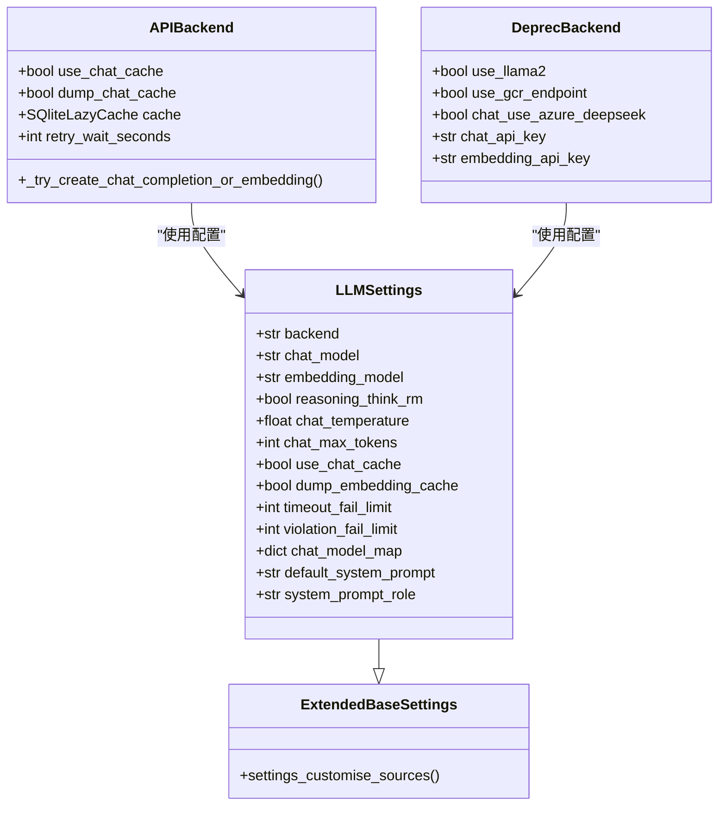

**图表来源**
- [llm_conf.py](file://rdagent/oai/llm_conf.py#L8-L133)
- [base.py](file://rdagent/oai/backend/base.py#L280-L350)
- [deprec.py](file://rdagent/oai/backend/deprec.py#L80-L150)

**章节来源**
- [llm_conf.py](file://rdagent/oai/llm_conf.py#L8-L133)

## 基础模型配置

### 核心模型参数

LLMSettings提供了两个最重要的模型配置参数：

| 参数名 | 类型 | 默认值 | 描述 |
|--------|------|--------|------|
| `chat_model` | str | "gpt-4-turbo" | 聊天模型名称，支持LiteLLM兼容的所有模型 |
| `embedding_model` | str | "text-embedding-3-small" | 嵌入模型名称，用于文本向量化 |

### 模型映射配置

系统支持通过`chat_model_map`实现动态模型切换：

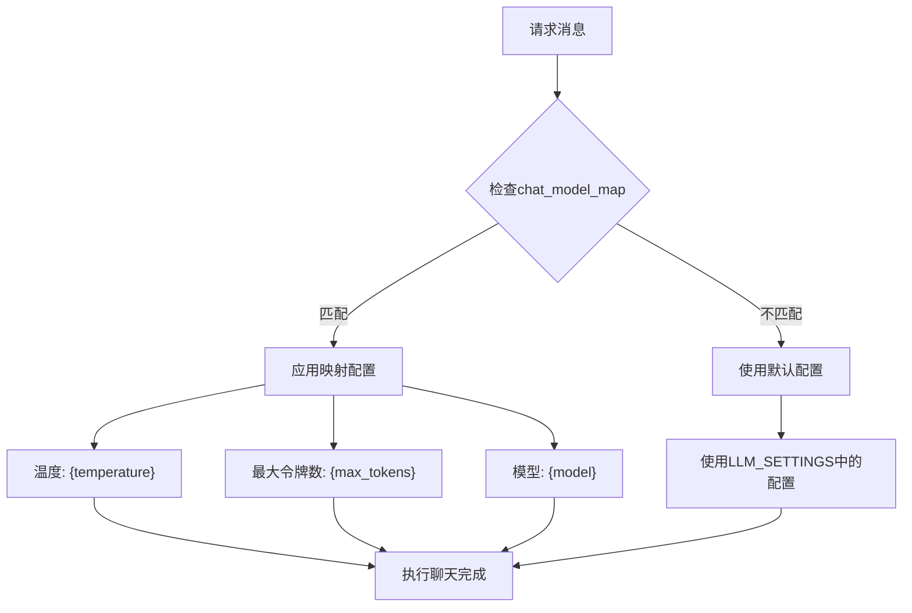

**图表来源**
- [base.py](file://rdagent/oai/backend/base.py#L400-L420)

**章节来源**
- [llm_conf.py](file://rdagent/oai/llm_conf.py#L10-L11)
- [base.py](file://rdagent/oai/backend/base.py#L400-L420)

## Azure集成设置

### Azure配置参数

系统提供了完整的Azure OpenAI集成支持：

| 参数名 | 类型 | 默认值 | 描述 |
|--------|------|--------|------|
| `chat_use_azure` | bool | False | 是否使用Azure聊天服务 |
| `embedding_use_azure` | bool | False | 是否使用Azure嵌入服务 |
| `chat_azure_api_base` | str | "" | Azure聊天API基础URL |
| `chat_azure_api_version` | str | "" | Azure API版本 |
| `embedding_azure_api_base` | str | "" | Azure嵌入API基础URL |
| `embedding_azure_api_version` | str | "" | Azure嵌入API版本 |

### Azure身份验证

支持多种Azure身份验证方式：

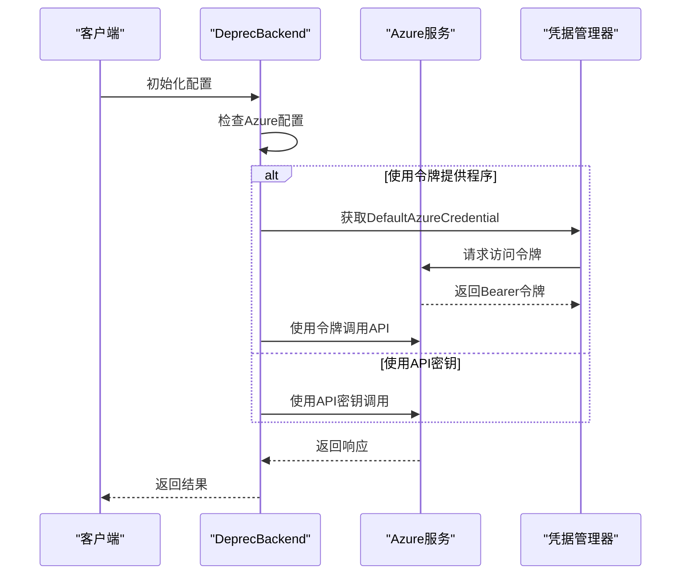

**图表来源**
- [deprec.py](file://rdagent/oai/backend/deprec.py#L180-L220)

**章节来源**
- [llm_conf.py](file://rdagent/oai/llm_conf.py#L25-L35)
- [deprec.py](file://rdagent/oai/backend/deprec.py#L180-L220)

## 缓存策略配置

### 缓存类型与配置

系统提供了多层次的缓存策略：

| 缓存类型 | 配置参数 | 功能描述 |
|----------|----------|----------|
| 聊天缓存 | `use_chat_cache` | 启用聊天响应缓存 |
| 嵌入缓存 | `use_embedding_cache` | 启用嵌入向量缓存 |
| 转储缓存 | `dump_chat_cache` | 将缓存写入数据库 |
| 嵌入转储 | `dump_embedding_cache` | 将嵌入缓存写入数据库 |

### 缓存架构设计

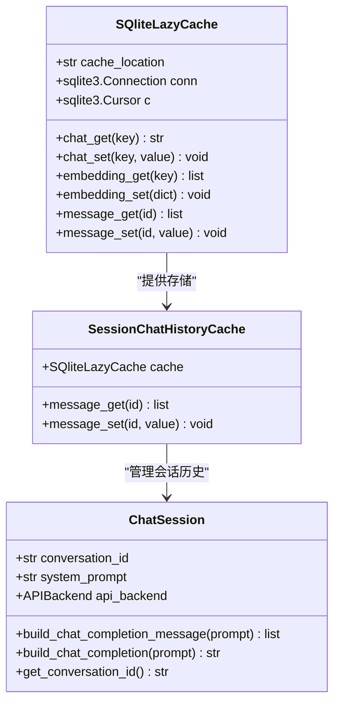

**图表来源**
- [base.py](file://rdagent/oai/backend/base.py#L139-L207)
- [base.py](file://rdagent/oai/backend/base.py#L209-L230)
- [base.py](file://rdagent/oai/backend/base.py#L232-L280)

### 自动种子生成

系统支持自动聊天缓存种子生成机制：

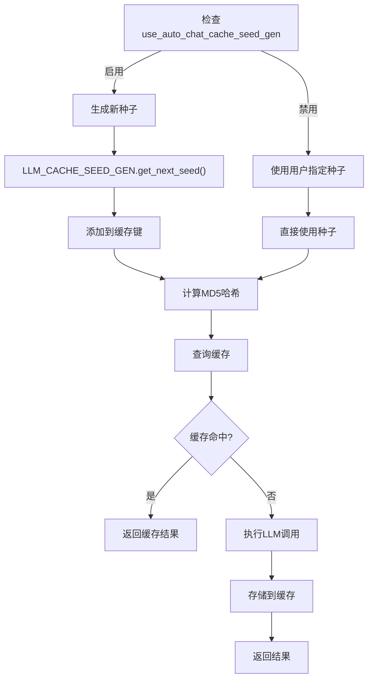

**图表来源**
- [base.py](file://rdagent/oai/backend/base.py#L580-L600)

**章节来源**
- [llm_conf.py](file://rdagent/oai/llm_conf.py#L42-L52)
- [base.py](file://rdagent/oai/backend/base.py#L139-L207)

## 请求参数配置

### 聊天请求参数

系统提供了丰富的聊天请求配置选项：

| 参数名 | 类型 | 默认值 | 描述 |
|--------|------|--------|------|
| `chat_temperature` | float | 0.5 | 控制输出随机性，范围0.0-2.0 |
| `chat_max_tokens` | int | None | 最大生成令牌数 |
| `chat_stream` | bool | True | 是否启用流式响应 |
| `chat_seed` | int | None | 固定随机种子以获得可重现的结果 |
| `chat_frequency_penalty` | float | 0.0 | 频率惩罚系数(-2.0到2.0) |
| `chat_presence_penalty` | float | 0.0 | 存在惩罚系数(-2.0到2.0) |
| `chat_token_limit` | int | 100000 | 最大令牌限制 |

### 系统提示配置

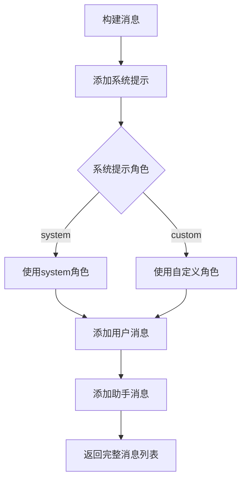

**图表来源**
- [base.py](file://rdagent/oai/backend/base.py#L332-L380)

**章节来源**
- [llm_conf.py](file://rdagent/oai/llm_conf.py#L54-L70)
- [base.py](file://rdagent/oai/backend/base.py#L332-L380)

## 特定提供商配置

### DeepSeek集成

系统提供实验性的DeepSeek模型支持：

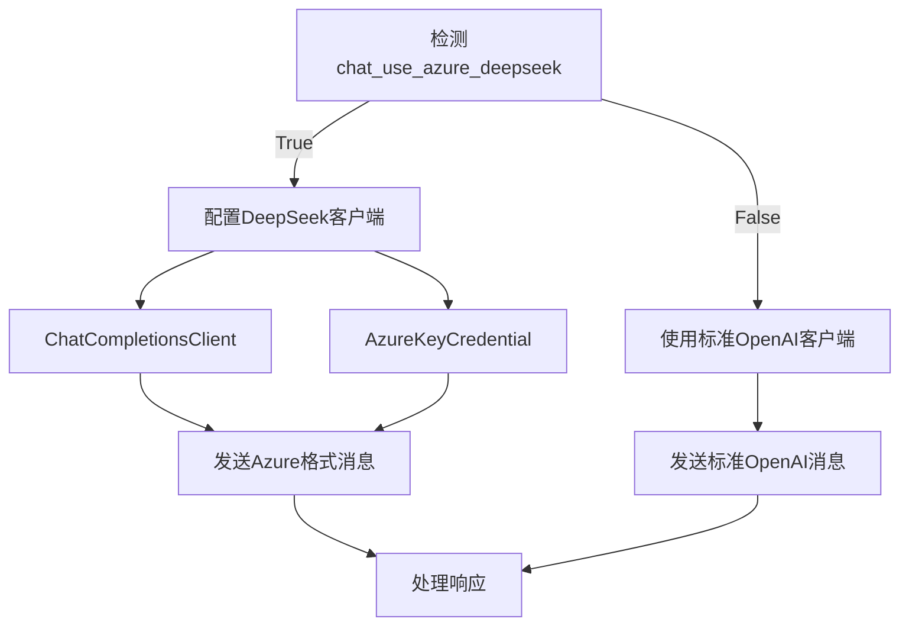

**图表来源**
- [deprec.py](file://rdagent/oai/backend/deprec.py#L159-L180)

### GCR端点配置

支持多种GCR托管模型：

| 模型类型 | 端点配置 | 温度 | Top P | 最大令牌 |
|----------|----------|------|-------|----------|
| llama2_70b | `llama2_70b_endpoint` | 0.7 | 0.9 | 100 |
| llama3_70b | `llama3_70b_endpoint` | 0.7 | 0.9 | 100 |
| phi2 | `phi2_endpoint` | 0.7 | 0.9 | 100 |
| phi3_4k | `phi3_4k_endpoint` | 0.7 | 0.9 | 100 |
| phi3_128k | `phi3_128k_endpoint` | 0.7 | 0.9 | 100 |

### 本地Llama2支持

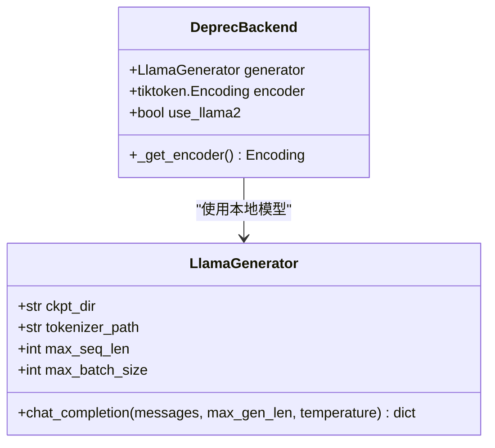

**图表来源**
- [deprec.py](file://rdagent/oai/backend/deprec.py#L100-L120)

**章节来源**
- [llm_conf.py](file://rdagent/oai/llm_conf.py#L110-L133)
- [deprec.py](file://rdagent/oai/backend/deprec.py#L100-L180)

## 响应模式设置

### 思维过程移除

系统支持移除推理模型的思维过程标记：

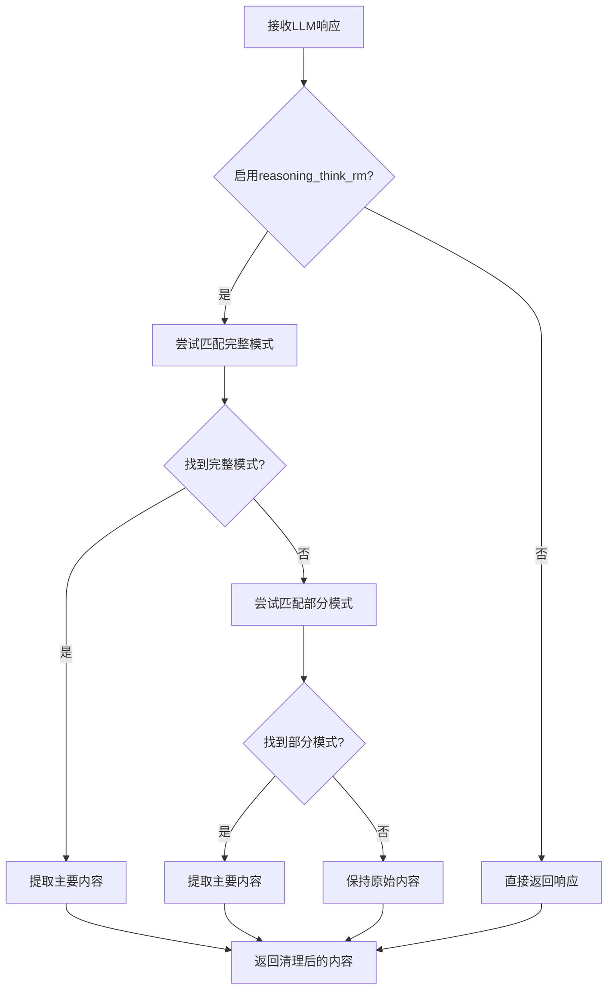

**图表来源**
- [base.py](file://rdagent/oai/backend/base.py#L602-L620)

### 系统提示定制

支持自定义系统提示和角色配置：

| 配置项 | 默认值 | 描述 |
|--------|--------|------|
| `default_system_prompt` | "You are an AI assistant..." | 默认系统提示 |
| `system_prompt_role` | "system" | 系统提示角色名称 |

**章节来源**
- [llm_conf.py](file://rdagent/oai/llm_conf.py#L18-L22)
- [base.py](file://rdagent/oai/backend/base.py#L602-L620)

## 安全配置与错误处理

### 错误处理机制

系统实现了完善的错误处理和重试机制：

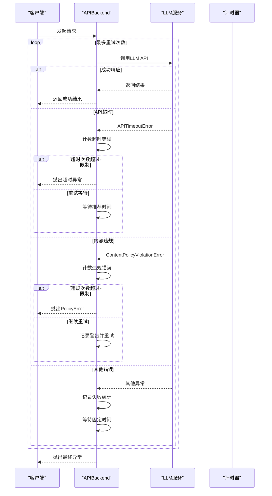

**图表来源**
- [base.py](file://rdagent/oai/backend/base.py#L500-L550)

### 配置参数

| 参数名 | 默认值 | 描述 |
|--------|--------|------|
| `max_retry` | 10 | 最大重试次数 |
| `retry_wait_seconds` | 1 | 重试等待秒数 |
| `timeout_fail_limit` | 10 | 超时错误限制 |
| `violation_fail_limit` | 1 | 违规错误限制 |

### API密钥管理

系统支持多层级的API密钥优先级：

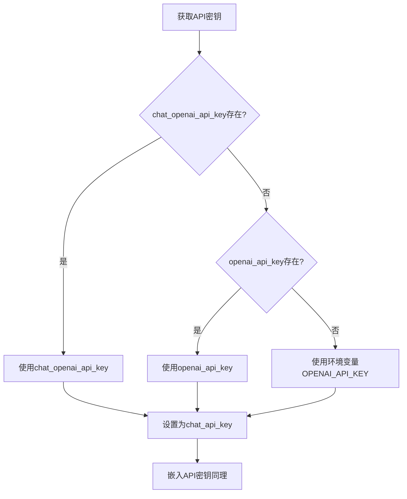

**图表来源**
- [deprec.py](file://rdagent/oai/backend/deprec.py#L180-L200)

**章节来源**
- [llm_conf.py](file://rdagent/oai/llm_conf.py#L42-L52)
- [base.py](file://rdagent/oai/backend/base.py#L500-L550)
- [deprec.py](file://rdagent/oai/backend/deprec.py#L180-L200)

## 配置示例

### OpenAI配置示例

```bash
# 基础OpenAI配置
cat << EOF > .env
# 设置模型
CHAT_MODEL=gpt-4o
EMBEDDING_MODEL=text-embedding-3-small

# 配置API密钥
OPENAI_API_KEY=your_openai_api_key_here

# 可选：自定义API基础URL
OPENAI_API_BASE=https://api.openai.com/v1
EOF
```

### Azure OpenAI配置示例

```bash
# Azure OpenAI配置
cat << EOF > .env
# 设置模型（需要支持嵌入的部署）
EMBEDDING_MODEL=azure/text-embedding-ada-002
CHAT_MODEL=azure/gpt-4o

# Azure配置
AZURE_API_KEY=your_azure_api_key
AZURE_API_BASE=your_azure_endpoint
AZURE_API_VERSION=2024-02-15-preview
EOF
```

### DeepSeek配置示例

```bash
# DeepSeek配置
cat << EOF > .env
# 聊天模型使用DeepSeek官方API
CHAT_MODEL=deepseek/deepseek-chat
DEEPSEEK_API_KEY=your_deepseek_api_key

# 嵌入模型使用SiliconFlow代理
EMBEDDING_MODEL=litellm_proxy/BAAI/bge-m3
LITELLM_PROXY_API_KEY=your_siliconflow_api_key
LITELLM_PROXY_API_BASE=https://api.siliconflow.cn/v1
EOF
```

### 本地Llama2配置示例

```bash
# 本地Llama2配置
cat << EOF > .env
# 启用本地模型
USE_LLAMA2=True

# 模型路径配置
LLAMA2_CKPT_DIR=./models/Llama-2-7b-chat
LLAMA2_TOKENIZER_PATH=./models/Llama-2-7b-chat/tokenizer.model

# 批处理大小
LLAMS2_MAX_BATCH_SIZE=8
EOF
```

### 高级配置示例

```bash
# 高级配置示例
cat << EOF > .env
# 缓存配置
USE_CHAT_CACHE=True
DUMP_CHAT_CACHE=True
USE_EMBEDDING_CACHE=True
DUMP_EMBEDDING_CACHE=True
PROMPT_CACHE_PATH=./custom_cache.db

# 错误处理配置
MAX_RETRY=15
TIMEOUT_FAIL_LIMIT=5
VIOLATION_FAIL_LIMIT=2
RETRY_WAIT_SECONDS=2

# 聊天参数
CHAT_TEMPERATURE=0.7
CHAT_MAX_TOKENS=2048
CHAT_STREAM=True
CHAT_SEED=42

# 推理配置
REASONING_THINK_RM=True
DEFAULT_SYSTEM_PROMPT=You are a helpful AI assistant.
SYSTEM_PROMPT_ROLE=system

# 本地模型配置
USE_GCR_ENDPOINT=True
GCR_ENDPOINT_TYPE=llama2_70b
LLAMA2_70B_ENDPOINT=https://your-gcr-endpoint.com
LLAMA2_70B_ENDPOINT_KEY=your_endpoint_key
LLAMA2_70B_ENDPOINT_DEPLOYMENT=your_deployment
EOF
```

## 故障排除指南

### 常见问题诊断

#### 1. API连接问题

**症状**: 超时或连接失败
**解决方案**:
- 检查网络连接
- 验证API密钥有效性
- 检查防火墙设置
- 增加`timeout_fail_limit`值

#### 2. 缓存问题

**症状**: 缓存未命中或损坏
**解决方案**:
- 删除缓存文件重新开始
- 检查磁盘空间
- 验证SQLite权限

#### 3. 模型配置问题

**症状**: 模型不支持或参数无效
**解决方案**:
- 验证模型名称拼写
- 检查模型是否支持所需功能
- 调整模型参数范围

### 健康检查

系统提供了完整的健康检查功能：

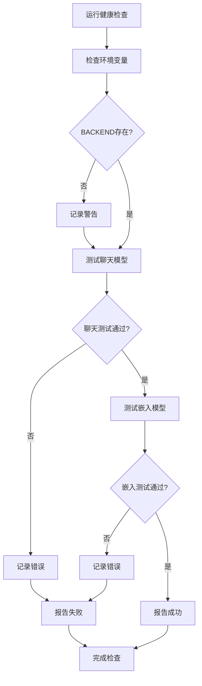

**图表来源**
- [health_check.py](file://rdagent/app/utils/health_check.py#L73-L109)

**章节来源**
- [health_check.py](file://rdagent/app/utils/health_check.py#L73-L138)

## 总结

RD-Agent的LLM后端配置系统提供了以下核心优势：

1. **统一配置管理**: 通过LLMSettings类集中管理所有配置参数
2. **多提供商支持**: 支持OpenAI、Azure、DeepSeek、本地模型等多种提供商
3. **灵活缓存策略**: 提供多层次的缓存配置选项
4. **健壮错误处理**: 实现完善的重试和错误恢复机制
5. **高度可定制**: 支持系统提示、响应格式等个性化配置

该系统的设计充分考虑了生产环境的需求，提供了稳定性、性能和灵活性的完美平衡。通过合理的配置，可以满足从开发测试到大规模生产的各种应用场景需求。