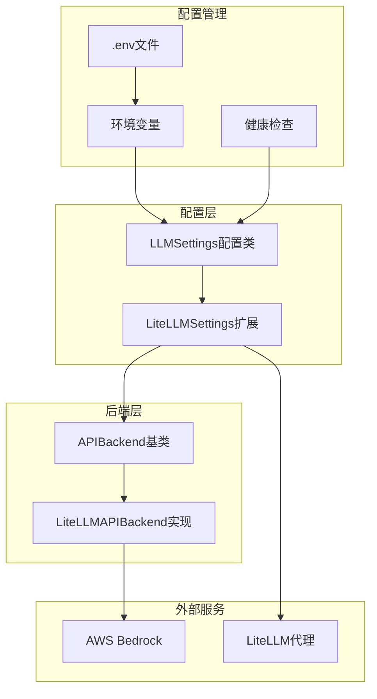
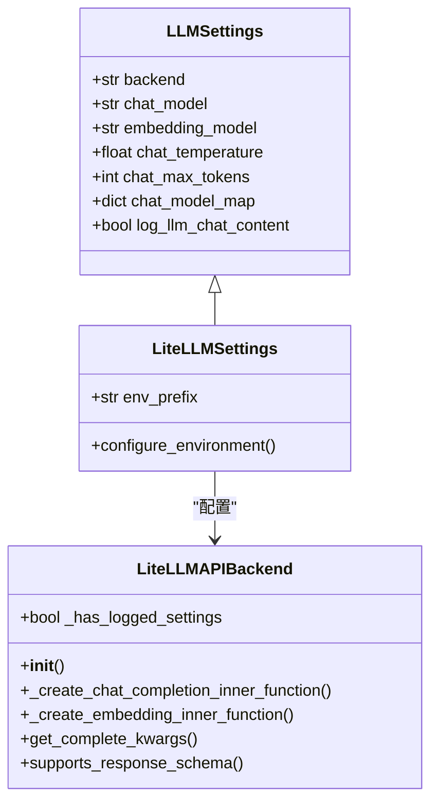
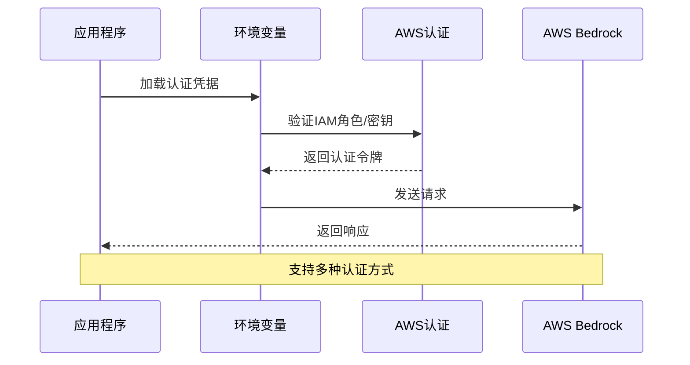
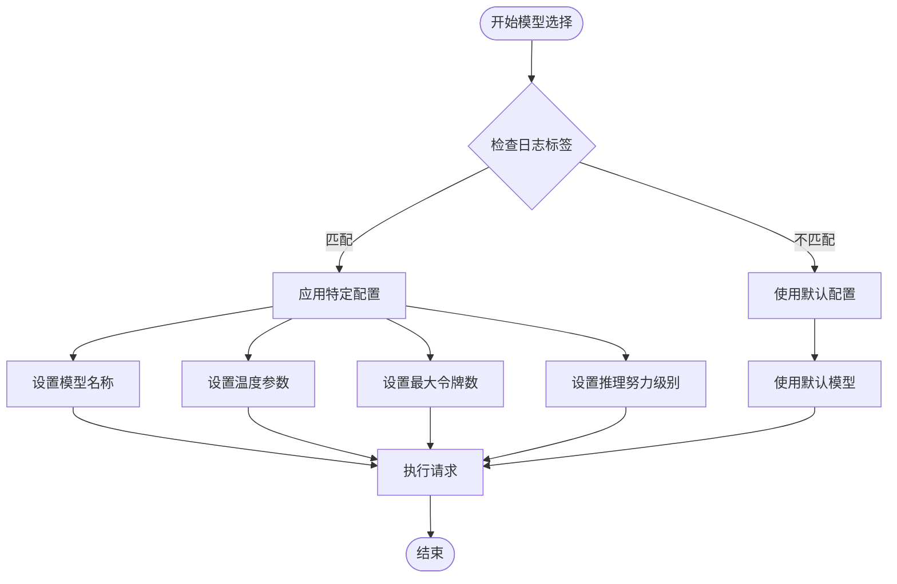
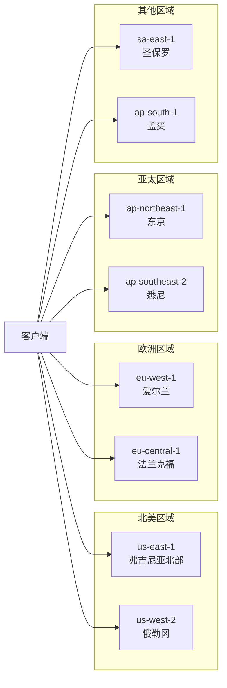
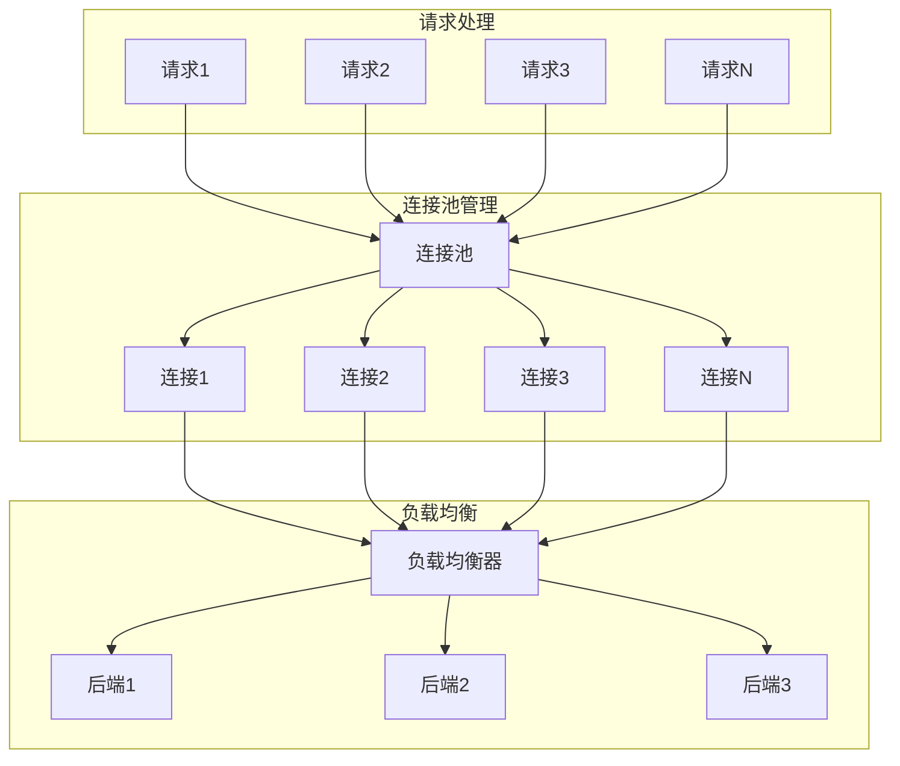

# AWS Bedrock 集成配置

<cite>
**本文档引用的文件**
- [llm_conf.py](file://rdagent/oai/llm_conf.py)
- [litellm.py](file://rdagent/oai/backend/litellm.py)
- [deprec.py](file://rdagent/oai/backend/deprec.py)
- [pydantic_ai.py](file://rdagent/oai/backend/pydantic_ai.py)
- [health_check.py](file://rdagent/app/utils/health_check.py)
- [conf.py](file://rdagent/core/conf.py)
- [README.md](file://README.md)
</cite>

## 目录
1. [简介](#简介)
2. [项目架构概览](#项目架构概览)
3. [LiteLLM后端配置](#litellm后端配置)
4. [AWS Bedrock身份验证](#aws-bedrock身份验证)
5. [模型名称映射配置](#模型名称映射配置)
6. [区域和网络配置](#区域和网络配置)
7. [性能优化配置](#性能优化配置)
8. [故障排除指南](#故障排除指南)
9. [最佳实践建议](#最佳实践建议)
10. [总结](#总结)

## 简介

本文档详细介绍了如何在RD-Agent框架中配置和使用AWS Bedrock服务。RD-Agent采用LiteLLM作为主要的LLM后端，提供了统一的接口来支持多种大语言模型提供商，包括AWS Bedrock。通过本指南，您将了解如何正确配置身份验证、模型映射、区域选择等关键参数，以实现高效的AWS Bedrock集成。

## 项目架构概览

RD-Agent的LLM配置系统采用了分层架构设计，主要包含以下核心组件：



**图表来源**
- [llm_conf.py](file://rdagent/oai/llm_conf.py#L1-L133)
- [litellm.py](file://rdagent/oai/backend/litellm.py#L1-L245)

**章节来源**
- [llm_conf.py](file://rdagent/oai/llm_conf.py#L1-L133)
- [litellm.py](file://rdagent/oai/backend/litellm.py#L1-L245)

## LiteLLM后端配置

### 基础配置结构

RD-Agent使用LiteLLM作为默认的LLM后端，通过继承和扩展基础配置类来实现特定功能：



**图表来源**
- [llm_conf.py](file://rdagent/oai/llm_conf.py#L8-L133)
- [litellm.py](file://rdagent/oai/backend/litellm.py#L32-L245)

### 环境变量前缀配置

LiteLLMSettings类为AWS Bedrock配置定义了专门的环境变量前缀：

| 配置项 | 描述 | 默认值 |
|--------|------|--------|
| `LITELLM_API_KEY` | AWS Bedrock API密钥 | 空字符串 |
| `LITELLM_API_BASE` | AWS Bedrock端点URL | 空字符串 |
| `LITELLM_AWS_REGION` | AWS区域配置 | us-east-1 |
| `LITELLM_AWS_ACCESS_KEY_ID` | AWS访问密钥ID | 空字符串 |
| `LITELLM_AWS_SECRET_ACCESS_KEY` | AWS秘密访问密钥 | 空字符串 |

**章节来源**
- [litellm.py](file://rdagent/oai/backend/litellm.py#L32-L40)

## AWS Bedrock身份验证

### IAM角色授权配置

AWS Bedrock的身份验证可以通过多种方式实现，包括IAM角色、访问密钥和临时凭证：



**图表来源**
- [health_check.py](file://rdagent/app/utils/health_check.py#L73-L109)

### 访问密钥配置方法

#### 方法一：直接环境变量配置

```bash
# 基础AWS认证配置
export AWS_ACCESS_KEY_ID="your-access-key-id"
export AWS_SECRET_ACCESS_KEY="your-secret-access-key"
export AWS_DEFAULT_REGION="us-east-1"

# LiteLLM Bedrock配置
export LITELLM_API_KEY="${AWS_SECRET_ACCESS_KEY}"
export LITELLM_API_BASE="bedrock-runtime.${AWS_DEFAULT_REGION}.amazonaws.com"
```

#### 方法二：使用AWS CLI配置

```bash
# 使用AWS CLI配置
aws configure set aws_access_key_id YOUR_ACCESS_KEY
aws configure set aws_secret_access_key YOUR_SECRET_KEY
aws configure set region us-east-1
```

#### 方法三：IAM角色配置

对于运行在EC2实例或ECS容器中的应用：

```bash
# EC2实例IAM角色配置
export AWS_ROLE_ARN="arn:aws:iam::123456789012:role/BedrockAccessRole"
export AWS_WEB_IDENTITY_TOKEN_FILE="/var/run/secrets/eks.amazonaws.com/serviceaccount/token"
export AWS_REGION="us-east-1"
```

**章节来源**
- [health_check.py](file://rdagent/app/utils/health_check.py#L73-L109)

## 模型名称映射配置

### chat_model_map配置详解

在RD-Agent中，`chat_model_map`是一个关键的配置字典，用于将不同的标签与特定的模型配置进行映射：



**图表来源**
- [litellm.py](file://rdagent/oai/backend/litellm.py#L85-L109)

### Claude模型映射示例

以下是针对Claude系列模型的典型配置示例：

| 标签 | 模型名称 | 温度 | 最大令牌数 | 推理努力 |
|------|----------|------|------------|----------|
| `claude-chat` | `anthropic/claude-3-sonnet-20240229` | 0.7 | 4096 | medium |
| `claude-instant` | `anthropic/claude-3-haiku-20240307` | 0.5 | 2048 | low |
| `claude-opus` | `anthropic/claude-3-opus-20240229` | 0.8 | 8192 | high |

### 配置文件示例

```python
# 在 .env 文件中配置
CHAT_MODEL_MAP='{
    "claude-chat": {
        "model": "anthropic/claude-3-sonnet-20240229",
        "temperature": 0.7,
        "max_tokens": 4096,
        "reasoning_effort": "medium"
    },
    "claude-instant": {
        "model": "anthropic/claude-3-haiku-20240307",
        "temperature": 0.5,
        "max_tokens": 2048,
        "reasoning_effort": "low"
    }
}'
```

**章节来源**
- [litellm.py](file://rdagent/oai/backend/litellm.py#L85-L109)
- [llm_conf.py](file://rdagent/oai/llm_conf.py#L125-L131)

## 区域和网络配置

### AWS区域选择策略

AWS Bedrock支持多个区域部署，选择合适的区域对性能至关重要：



### 网络策略配置

#### VPC配置要求

| 组件 | 要求 | 配置建议 |
|------|------|----------|
| 私有子网 | 必须启用DNS解析 | CIDR: 10.0.0.0/24 |
| 安全组 | 允许出站HTTPS流量 | 443端口 |
| 路由表 | 配置NAT网关 | 目标: 0.0.0.0/0 |
| IAM策略 | 允许bedrock:*操作 | 最小权限原则 |

#### 网络连通性测试

```bash
# 测试AWS Bedrock端点连通性
curl -X POST "https://${AWS_DEFAULT_REGION}.bedrock-runtime.amazonaws.com/model/anthropic.claude-3-sonnet-20240229/invoke" \
  -H "Content-Type: application/json" \
  -H "Authorization: AWS4-HMAC-SHA256 Credential=${AWS_ACCESS_KEY_ID}/${DATE}/${AWS_DEFAULT_REGION}/bedrock/aws4_request" \
  -d '{"prompt": "Hello", "max_tokens_to_sample": 50}'
```

**章节来源**
- [health_check.py](file://rdagent/app/utils/health_check.py#L73-L109)

## 性能优化配置

### 连接池配置

LiteLLM支持连接池优化，可以显著提升并发性能：



### 性能参数优化

| 参数 | 推荐值 | 说明 |
|------|--------|------|
| `max_connections` | 10-50 | 连接池最大连接数 |
| `timeout` | 30-60秒 | 请求超时时间 |
| `retry_attempts` | 3-5次 | 失败重试次数 |
| `keep_alive` | true | 启用HTTP Keep-Alive |
| `compression` | gzip | 启用响应压缩 |

### 缓存策略配置

```python
# 缓存配置示例
CACHE_CONFIG = {
    "enable_response_cache": True,
    "cache_ttl": 3600,  # 1小时
    "max_cache_size": 1000,
    "cache_backend": "redis://localhost:6379"
}
```

**章节来源**
- [litellm.py](file://rdagent/oai/backend/litellm.py#L43-L76)

## 故障排除指南

### 常见问题及解决方案

#### 权限不足错误

**错误信息**: `AccessDeniedException: User is not authorized to perform`

**解决方案**:
1. 检查IAM策略是否包含`bedrock:*`权限
2. 验证用户/角色是否属于正确的组织
3. 确认区域是否已启用Bedrock服务

```bash
# 检查IAM权限
aws iam get-user-policy --policy-name BedrockAccessPolicy

# 验证区域可用性
aws bedrock list-regions --region us-east-1
```

#### 模型不可用错误

**错误信息**: `ValidationException: Model identifier is invalid`

**解决方案**:
1. 验证模型ID格式是否正确
2. 检查模型是否在当前区域可用
3. 确认账户是否有使用该模型的权限

```python
# 模型可用性检查
import boto3

bedrock_client = boto3.client('bedrock')
response = bedrock_client.list_foundation_models(
    byOutputModality='TEXT',
    byInferenceType='ON_DEMAND'
)

available_models = [model['modelId'] for model in response['modelSummaries']]
print(f"可用模型: {available_models}")
```

#### 网络连接问题

**错误信息**: `ConnectionError: Failed to establish connection`

**解决方案**:
1. 检查VPC安全组规则
2. 验证NAT网关配置
3. 确认DNS解析设置

```bash
# 网络连通性测试
ping bedrock-runtime.us-east-1.amazonaws.com
nslookup bedrock-runtime.us-east-1.amazonaws.com
```

### 调试工具和命令

#### 健康检查命令

```bash
# 执行完整的健康检查
rdagent health_check --check-env --check-docker --check-ports

# 仅检查环境配置
rdagent health_check --check-env

# 自定义检查参数
rdagent health_check --check-env --check-docker=false
```

#### 日志分析

```bash
# 查看LiteLLM相关日志
tail -f rdagent.log | grep -i "litellm"

# 分析API调用统计
grep "token_cost" rdagent.log | tail -10
```

**章节来源**
- [health_check.py](file://rdagent/app/utils/health_check.py#L73-L170)

## 最佳实践建议

### 安全配置最佳实践

1. **最小权限原则**
   - 仅授予必要的Bedrock操作权限
   - 使用IAM角色而非长期访问密钥
   - 定期轮换访问密钥

2. **网络隔离**
   - 在私有子网中部署应用
   - 配置适当的网络安全组规则
   - 使用VPC端点访问Bedrock服务

3. **监控和审计**
   - 启用CloudTrail记录API调用
   - 设置CloudWatch告警
   - 定期审查访问日志

### 性能优化最佳实践

1. **模型选择策略**
   - 根据任务复杂度选择合适模型
   - 利用模型映射实现动态配置
   - 实施成本控制机制

2. **缓存策略**
   - 合理设置缓存过期时间
   - 使用分布式缓存提高性能
   - 监控缓存命中率

3. **错误处理**
   - 实现指数退避重试机制
   - 设置合理的超时时间
   - 提供优雅的降级方案

### 开发和运维最佳实践

1. **配置管理**
   - 使用环境变量管理敏感配置
   - 实施配置版本控制
   - 建立配置变更审批流程

2. **测试策略**
   - 编写单元测试覆盖核心功能
   - 实施集成测试验证端到端流程
   - 建立性能基准测试

3. **部署策略**
   - 使用基础设施即代码管理资源
   - 实施蓝绿部署减少风险
   - 建立回滚机制

## 总结

通过本文档的详细介绍，我们全面了解了在RD-Agent框架中配置和使用AWS Bedrock服务的完整流程。从基础的身份验证配置到高级的性能优化，从模型映射策略到故障排除方法，每个环节都提供了详细的指导和最佳实践建议。

关键要点包括：

1. **LiteLLM后端优势**: 统一的接口设计使得多提供商支持变得简单高效
2. **身份验证灵活性**: 支持IAM角色、访问密钥等多种认证方式
3. **模型映射能力**: 通过`chat_model_map`实现精细化的模型配置管理
4. **区域选择重要性**: 合理的区域选择直接影响性能和成本
5. **性能优化空间**: 连接池、缓存策略等优化手段可显著提升效率
6. **故障排除体系**: 完善的健康检查和调试工具确保系统稳定性

遵循这些配置指南和最佳实践，您可以构建一个稳定、高效、安全的AWS Bedrock集成系统，为您的AI应用提供强大的语言模型支持。