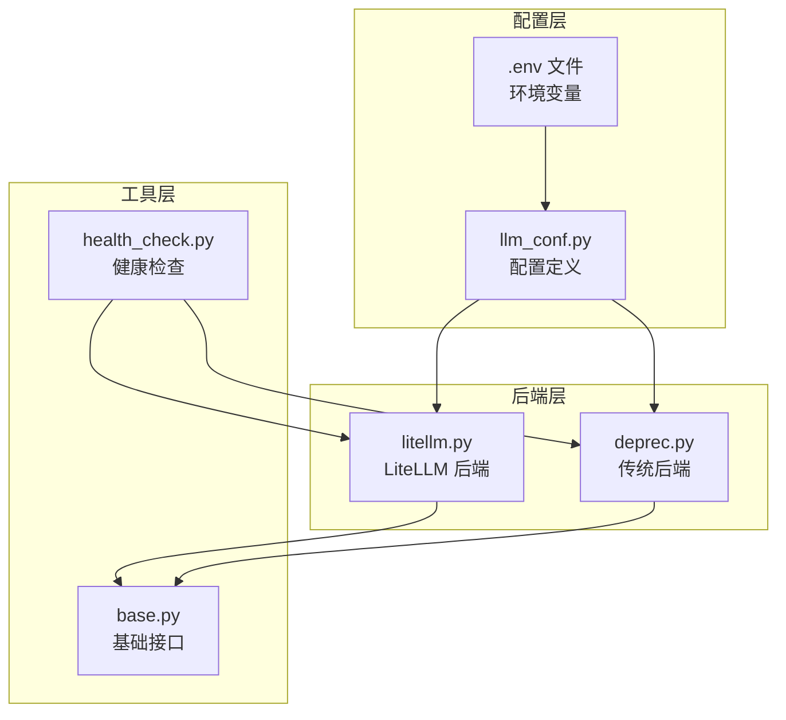
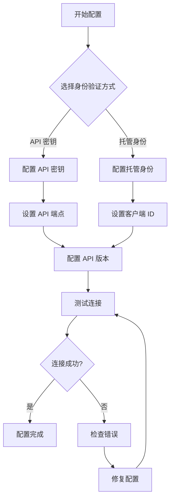
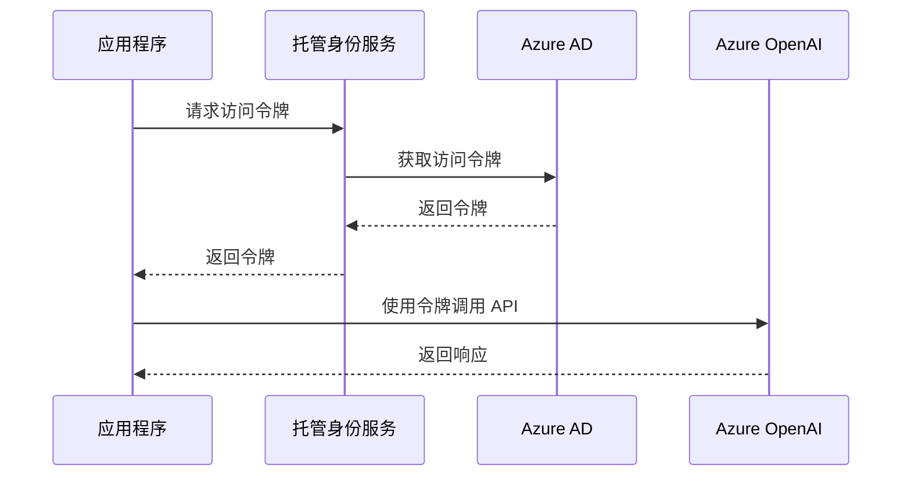
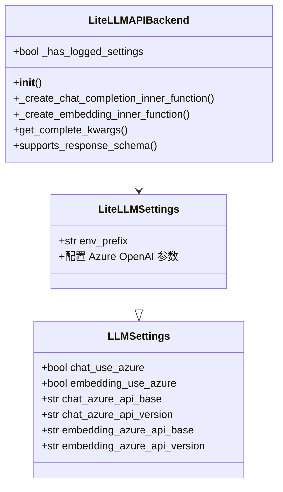
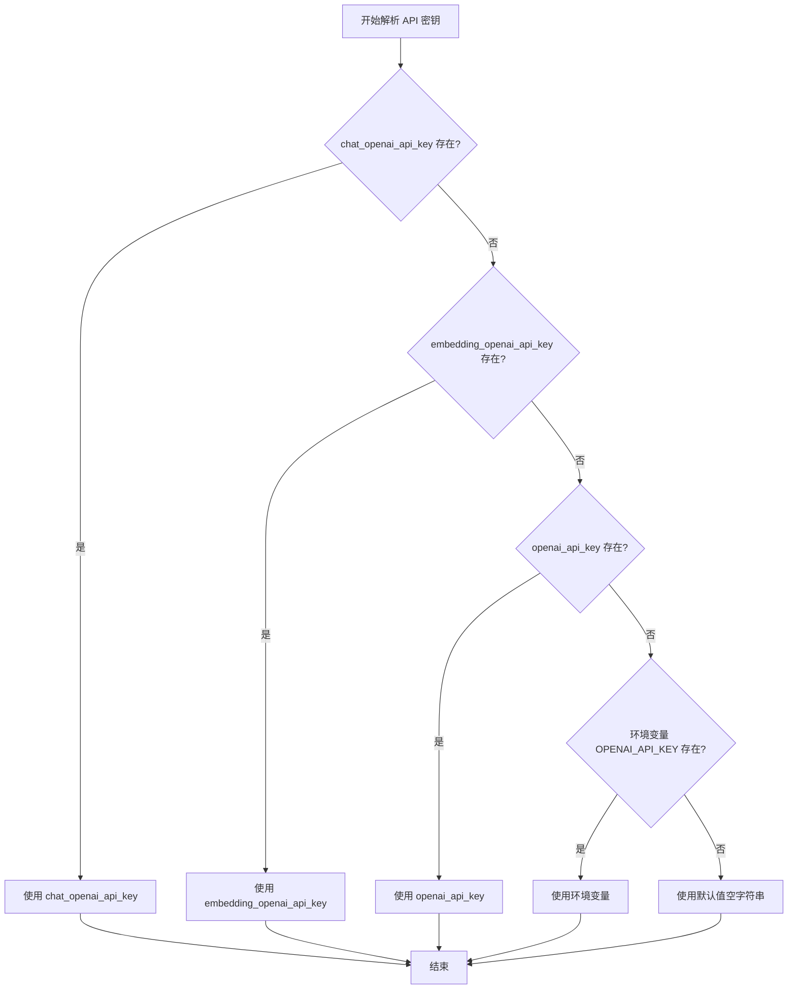
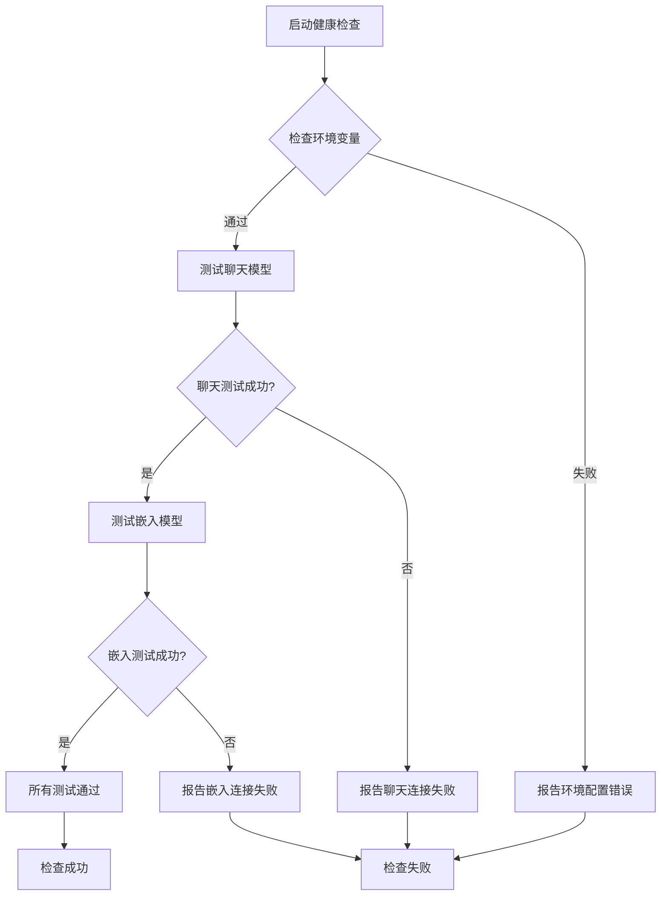

# Azure OpenAI 集成配置

<cite>
**本文档中引用的文件**
- [llm_conf.py](file://rdagent/oai/llm_conf.py)
- [litellm.py](file://rdagent/oai/backend/litellm.py)
- [deprec.py](file://rdagent/oai/backend/deprec.py)
- [health_check.py](file://rdagent/app/utils/health_check.py)
- [README.md](file://README.md)
</cite>

## 目录
1. [简介](#简介)
2. [项目结构概览](#项目结构概览)
3. [核心配置参数](#核心配置参数)
4. [Azure OpenAI 配置详解](#azure-openai-配置详解)
5. [身份验证机制](#身份验证机制)
6. [LiteLLM 后端配置](#litellm-后端配置)
7. [环境变量配置](#环境变量配置)
8. [健康检查与故障排查](#健康检查与故障排查)
9. [高级配置场景](#高级配置场景)
10. [故障排除指南](#故障排除指南)
11. [总结](#总结)

## 简介

RD-Agent 提供了对 Azure OpenAI 服务的全面集成支持，允许用户通过多种方式进行配置和身份验证。本文档详细说明了如何配置 Azure OpenAI 服务集成，包括启用 chat_use_azure 和 embedding_use_azure 开关、配置 Azure 资源名称、部署 ID、API 版本等具体步骤。

## 项目结构概览

RD-Agent 的 Azure OpenAI 集成功能主要分布在以下关键模块中：



**图表来源**
- [llm_conf.py](file://rdagent/oai/llm_conf.py#L1-L133)
- [litellm.py](file://rdagent/oai/backend/litellm.py#L1-L245)
- [deprec.py](file://rdagent/oai/backend/deprec.py#L1-L260)

## 核心配置参数

### 基础配置参数

在 `llm_conf.py` 中定义的核心 Azure OpenAI 配置参数包括：

| 参数名 | 类型 | 默认值 | 描述 |
|--------|------|--------|------|
| `chat_use_azure` | bool | False | 是否启用 Azure OpenAI 聊天功能 |
| `embedding_use_azure` | bool | False | 是否启用 Azure OpenAI 嵌入功能 |
| `chat_use_azure_token_provider` | bool | False | 聊天是否使用 Azure AD 令牌提供程序 |
| `embedding_use_azure_token_provider` | bool | False | 嵌入是否使用 Azure AD 令牌提供程序 |
| `managed_identity_client_id` | str \| None | None | 托管身份客户端 ID |

**章节来源**
- [llm_conf.py](file://rdagent/oai/llm_conf.py#L35-L40)

### Azure API 配置参数

| 参数名 | 类型 | 默认值 | 描述 |
|--------|------|--------|------|
| `chat_azure_api_base` | str | "" | Azure 聊天 API 端点 |
| `chat_azure_api_version` | str | "" | Azure 聊天 API 版本 |
| `embedding_azure_api_base` | str | "" | Azure 嵌入 API 端点 |
| `embedding_azure_api_version` | str | "" | Azure 嵌入 API 版本 |

**章节来源**
- [llm_conf.py](file://rdagent/oai/llm_conf.py#L60-L65)

## Azure OpenAI 配置详解

### 启用 Azure OpenAI 功能

要启用 Azure OpenAI 功能，需要设置以下配置参数：

#### 方法一：直接配置
```python
# 在代码中直接设置
LLM_SETTINGS.chat_use_azure = True
LLM_SETTINGS.embedding_use_azure = True
```

#### 方法二：通过环境变量
```bash
# 设置环境变量
export CHAT_USE_AZURE=true
export EMBEDDING_USE_AZURE=true
```

### 部署 ID 和资源配置

Azure OpenAI 服务需要配置特定的部署 ID 和资源信息：



**图表来源**
- [deprec.py](file://rdagent/oai/backend/deprec.py#L191-L205)

**章节来源**
- [deprec.py](file://rdagent/oai/backend/deprec.py#L170-L174)

## 身份验证机制

### API 密钥认证

最简单的身份验证方式是使用 API 密钥：

```python
# 配置 API 密钥
LLM_SETTINGS.chat_openai_api_key = "your-azure-api-key"
LLM_SETTINGS.embedding_openai_api_key = "your-azure-api-key"
```

或者通过环境变量：
```bash
export CHAT_OPENAI_API_KEY=your-azure-api-key
export EMBEDDING_OPENAI_API_KEY=your-azure-api-key
```

### Azure AD 托管身份认证

对于生产环境，推荐使用 Azure AD 托管身份进行认证：

```python
# 启用托管身份认证
LLM_SETTINGS.chat_use_azure_token_provider = True
LLM_SETTINGS.embedding_use_azure_token_provider = True
LLM_SETTINGS.managed_identity_client_id = "your-client-id"
```

#### 托管身份工作流程



**图表来源**
- [deprec.py](file://rdagent/oai/backend/deprec.py#L203-L205)

**章节来源**
- [deprec.py](file://rdagent/oai/backend/deprec.py#L172-L174)

## LiteLLM 后端配置

### LiteLLM 配置类

LiteLLM 后端提供了专门的配置类来处理 Azure OpenAI 连接：



**图表来源**
- [litellm.py](file://rdagent/oai/backend/litellm.py#L25-L40)
- [llm_conf.py](file://rdagent/oai/llm_conf.py#L10-L35)

### 后端连接建立过程

LiteLLM 后端通过以下步骤建立 Azure OpenAI 连接：

1. **初始化配置**：加载 LiteLLMSettings 配置
2. **检测 Azure 配置**：检查 chat_use_azure 和 embedding_use_azure 标志
3. **选择认证方式**：根据 use_azure_token_provider 决定使用 API 密钥还是令牌提供程序
4. **建立客户端连接**：创建 AzureOpenAI 客户端实例

**章节来源**
- [litellm.py](file://rdagent/oai/backend/litellm.py#L35-L45)

## 环境变量配置

### 推荐的环境变量配置

基于 README 文档中的示例，以下是完整的 Azure OpenAI 环境变量配置：

```bash
# Azure OpenAI 基础配置
export CHAT_MODEL=azure/gpt-4o
export EMBEDDING_MODEL=azure/text-embedding-3-small
export AZURE_API_KEY=your-azure-api-key
export AZURE_API_BASE=https://your-resource.openai.azure.com/
export AZURE_API_VERSION=2024-02-15-preview

# 或者使用 LiteLLM 格式
export CHAT_MODEL=azure/<your-deployment-name>
export EMBEDDING_MODEL=azure/<embedding-model-deployment>
export AZURE_API_KEY=your-azure-api-key
export AZURE_API_BASE=https://your-resource.openai.azure.com/
export AZURE_API_VERSION=2024-02-15-preview
```

### 环境变量优先级

系统按照以下优先级解析 API 密钥：



**图表来源**
- [deprec.py](file://rdagent/oai/backend/deprec.py#L175-L181)

**章节来源**
- [deprec.py](file://rdagent/oai/backend/deprec.py#L175-L181)

## 健康检查与故障排查

### 健康检查功能

RD-Agent 提供了完整的健康检查功能来验证 Azure OpenAI 配置：



**图表来源**
- [health_check.py](file://rdagent/app/utils/health_check.py#L120-L140)

### 健康检查命令

运行健康检查以验证配置：

```bash
# 基本健康检查
rdagent health_check

# 包含环境检查
rdagent health_check --check-env

# 包含 Docker 检查
rdagent health_check --check-env --check-docker
```

**章节来源**
- [health_check.py](file://rdagent/app/utils/health_check.py#L120-L140)

## 高级配置场景

### 私有网络部署

在私有网络环境中部署时，需要注意以下配置：

#### 网络配置要求
- 确保应用程序能够访问 Azure OpenAI 端点
- 配置适当的防火墙规则
- 考虑使用 Azure Private Link

#### 配置示例
```bash
# 私有网络端点配置
export AZURE_API_BASE=https://your-private-endpoint.privatelink.openai.azure.com/
export AZURE_API_VERSION=2024-02-15-preview
```

### 多区域部署

对于多区域部署，可以配置不同的端点：

```python
# 不同区域的配置映射
LLM_SETTINGS.chat_model_map = {
    "us-east": {
        "model": "azure/gpt-4o-us-east",
        "temperature": 0.7,
        "max_tokens": 4000
    },
    "eu-west": {
        "model": "azure/gpt-4o-eu-west",
        "temperature": 0.7,
        "max_tokens": 4000
    }
}
```

### 故障转移配置

实现自动故障转移机制：

```python
# 主备端点配置
primary_endpoints = [
    "https://primary-resource.openai.azure.com/",
    "https://secondary-resource.openai.azure.com/"
]

current_endpoint_index = 0

def get_azure_endpoint():
    global current_endpoint_index
    endpoint = primary_endpoints[current_endpoint_index]
    # 测试端点可用性
    if test_endpoint(endpoint):
        return endpoint
    else:
        # 切换到下一个端点
        current_endpoint_index = (current_endpoint_index + 1) % len(primary_endpoints)
        return get_azure_endpoint()
```

## 故障排除指南

### 常见问题及解决方案

#### 认证失败

**问题症状**：
- `401 Unauthorized` 错误
- `Invalid API key` 错误消息

**解决方案**：
1. 验证 API 密钥是否正确
2. 检查 API 密钥是否已过期
3. 确认资源访问权限

```bash
# 验证 API 密钥
curl -H "Authorization: Bearer $AZURE_API_KEY" \
     -H "Content-Type: application/json" \
     "$AZURE_API_BASE/openai/deployments?api-version=$AZURE_API_VERSION"
```

#### 资源不可访问

**问题症状**：
- `404 Not Found` 错误
- `Deployment not found` 错误

**解决方案**：
1. 验证部署名称是否正确
2. 检查资源是否存在
3. 确认 API 版本兼容性

```python
# 验证部署状态
import openai

client = openai.AzureOpenAI(
    api_key=os.getenv("AZURE_API_KEY"),
    api_version=os.getenv("AZURE_API_VERSION"),
    azure_endpoint=os.getenv("AZURE_API_BASE")
)

try:
    deployments = client.deployments.list()
    print("可用部署:", [d.id for d in deployments.data])
except Exception as e:
    print("获取部署列表失败:", e)
```

#### 网络连接问题

**问题症状**：
- 连接超时
- DNS 解析失败

**解决方案**：
1. 检查网络连通性
2. 验证防火墙设置
3. 检查代理配置

```bash
# 测试网络连通性
ping your-resource.openai.azure.com
nslookup your-resource.openai.azure.com
curl -v https://your-resource.openai.azure.com/
```

#### 托管身份配置错误

**问题症状**：
- `ManagedIdentityCredential authentication failed`
- 缺少客户端 ID 错误

**解决方案**：
1. 验证托管身份是否已启用
2. 检查客户端 ID 是否正确
3. 确认角色分配

```python
# 验证托管身份配置
from azure.identity import DefaultAzureCredential

credential = DefaultAzureCredential(
    managed_identity_client_id="your-client-id"
)

token = credential.get_token("https://cognitiveservices.azure.com/.default")
print("令牌获取成功")
```

### 调试技巧

#### 启用详细日志记录

```python
# 在配置中启用详细日志
LLM_SETTINGS.log_llm_chat_content = True
```

#### 使用健康检查诊断

```bash
# 详细的健康检查输出
rdagent health_check --check-env --verbose
```

#### 直接测试 API 连接

```python
# 直接测试 Azure OpenAI API
import openai

def test_azure_openai():
    try:
        client = openai.AzureOpenAI(
            api_key=os.getenv("AZURE_API_KEY"),
            api_version=os.getenv("AZURE_API_VERSION"),
            azure_endpoint=os.getenv("AZURE_API_BASE")
        )
        
        # 测试聊天功能
        response = client.chat.completions.create(
            model="gpt-4o",
            messages=[{"role": "user", "content": "Hello!"}]
        )
        print("聊天测试成功:", response.choices[0].message.content)
        
        # 测试嵌入功能
        embedding_response = client.embeddings.create(
            model="text-embedding-3-small",
            input="Hello world!"
        )
        print("嵌入测试成功")
        
    except Exception as e:
        print("Azure OpenAI 测试失败:", e)
```

## 总结

RD-Agent 提供了灵活且强大的 Azure OpenAI 集成配置选项，支持多种身份验证方式和部署场景。通过本文档的指导，您可以：

1. **正确配置 Azure OpenAI 功能**：启用 chat_use_azure 和 embedding_use_azure 开关
2. **选择合适的认证方式**：API 密钥或 Azure AD 托管身份
3. **优化性能配置**：调整重试次数、超时设置等参数
4. **实施故障排除策略**：使用健康检查和调试工具
5. **适应高级部署需求**：私有网络、多区域、故障转移等场景

建议在生产环境中使用托管身份认证，并定期运行健康检查以确保配置的有效性。对于复杂的部署场景，建议制定详细的配置文档和故障排除流程。