# Google Cloud Vertex AI 集成配置

<cite>
**本文档引用的文件**
- [llm_conf.py](file://rdagent/oai/llm_conf.py)
- [deprec.py](file://rdagent/oai/backend/deprec.py)
- [conf.py](file://rdagent/app/data_science/conf.py)
- [prompts.yaml](file://rdagent/scenarios/data_science/dev/runner/prompts.yaml)
- [env.py](file://rdagent/utils/env.py)
- [core/conf.py](file://rdagent/core/conf.py)
</cite>

## 目录
1. [简介](#简介)
2. [项目架构概览](#项目架构概览)
3. [核心配置组件](#核心配置组件)
4. [GCR端点配置详解](#gcr端点配置详解)
5. [模型类型与端点映射](#模型类型与端点映射)
6. [生成参数优化](#生成参数优化)
7. [服务账户认证配置](#服务账户认证配置)
8. [模型调用实例](#模型调用实例)
9. [微调功能集成](#微调功能集成)
10. [运维注意事项](#运维注意事项)
11. [故障排除指南](#故障排除指南)
12. [总结](#总结)

## 简介

本文档详细阐述了在RD-Agent框架中集成Google Cloud Vertex AI（GCR端点）的方法。RD-Agent是一个先进的AI驱动的研发平台，支持多种大语言模型的集成，包括Google Cloud Vertex AI托管的Llama2、Llama3、Phi系列等模型。

通过本指南，您将学会如何：
- 启用和配置use_gcr_endpoint开关
- 正确设置gcr_endpoint_type、endpoint_url和endpoint_key
- 优化gcr_endpoint_temperature、top_p等生成参数
- 实施安全的服务账户密钥配置
- 在rdagent框架中调用不同GCR托管模型
- 集成模型微调功能
- 处理跨区域部署和配额管理

## 项目架构概览

RD-Agent采用模块化架构设计，支持多种后端服务的统一接口。系统的核心架构如下：

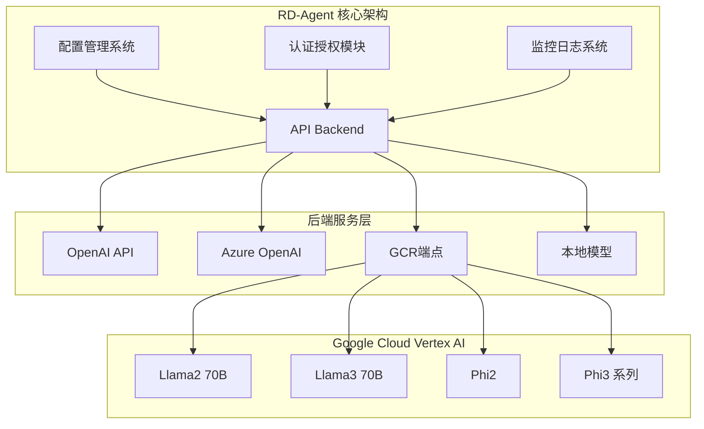

**图表来源**
- [deprec.py](file://rdagent/oai/backend/deprec.py#L89-L122)
- [llm_conf.py](file://rdagent/oai/llm_conf.py#L96-L131)

## 核心配置组件

### LLMSettings配置类

RD-Agent使用Pydantic的ExtendedBaseSettings类来管理所有LLM相关的配置。主要配置项包括：

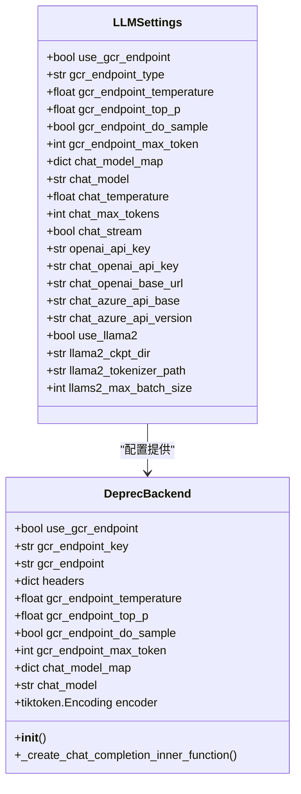

**图表来源**
- [llm_conf.py](file://rdagent/oai/llm_conf.py#L96-L131)
- [deprec.py](file://rdagent/oai/backend/deprec.py#L120-L161)

**章节来源**
- [llm_conf.py](file://rdagent/oai/llm_conf.py#L96-L131)
- [deprec.py](file://rdagent/oai/backend/deprec.py#L89-L122)

## GCR端点配置详解

### use_gcr_endpoint开关启用

要启用Google Cloud Vertex AI GCR端点，需要在配置中设置以下参数：

| 配置项 | 类型 | 默认值 | 描述 |
|--------|------|--------|------|
| use_gcr_endpoint | bool | False | 启用GCR端点模式 |
| gcr_endpoint_type | str | "llama2_70b" | 指定使用的模型类型 |

支持的模型类型包括：
- `"llama2_70b"` - Llama2 70B模型
- `"llama3_70b"` - Llama3 70B模型  
- `"phi2"` - Phi-2模型
- `"phi3_4k"` - Phi-3 4K上下文模型
- `"phi3_128k"` - Phi-3 128K上下文模型

### 端点URL和密钥配置

每个模型类型都需要对应的端点URL和访问密钥：

| 模型类型 | 端点URL配置 | 密钥配置 | 部署配置 |
|----------|-------------|----------|----------|
| Llama2 70B | llama2_70b_endpoint | llama2_70b_endpoint_key | llama2_70b_endpoint_deployment |
| Llama3 70B | llama3_70b_endpoint | llama3_70b_endpoint_key | llama3_70b_endpoint_deployment |
| Phi-2 | phi2_endpoint | phi2_endpoint_key | phi2_endpoint_deployment |
| Phi-3 4K | phi3_4k_endpoint | phi3_4k_endpoint_key | phi3_4k_endpoint_deployment |
| Phi-3 128K | phi3_128k_endpoint | phi3_128k_endpoint_key | phi3_128k_endpoint_deployment |

**章节来源**
- [llm_conf.py](file://rdagent/oai/llm_conf.py#L96-L131)
- [deprec.py](file://rdagent/oai/backend/deprec.py#L120-L141)

## 模型类型与端点映射

### 端点选择逻辑

系统根据gcr_endpoint_type自动选择相应的端点配置：

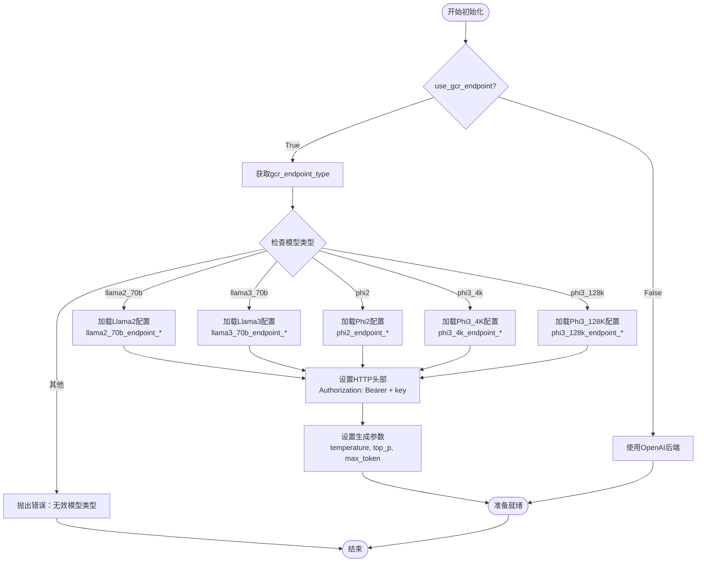

**图表来源**
- [deprec.py](file://rdagent/oai/backend/deprec.py#L120-L141)

### 认证头设置

成功配置后，系统会自动设置以下HTTP头部：

```python
headers = {
    "Content-Type": "application/json",
    "Authorization": ("Bearer " + self.gcr_endpoint_key),
}
```

**章节来源**
- [deprec.py](file://rdagent/oai/backend/deprec.py#L140-L161)

## 生成参数优化

### 核心生成参数

RD-Agent为GCR端点提供了丰富的生成参数配置：

| 参数名称 | 类型 | 默认值 | 描述 | 优化建议 |
|----------|------|--------|------|----------|
| gcr_endpoint_temperature | float | 0.7 | 控制输出随机性 | 低值(0.3-0.5)适合事实性任务，高值(0.7-0.9)适合创造性任务 |
| gcr_endpoint_top_p | float | 0.9 | 核采样参数 | 通常保持默认值，可调整范围0.8-0.95 |
| gcr_endpoint_do_sample | bool | False | 是否启用采样 | 推荐保持False以获得确定性输出 |
| gcr_endpoint_max_token | int | 100 | 最大生成token数 | 根据任务复杂度调整，一般50-500 |

### 参数调优策略

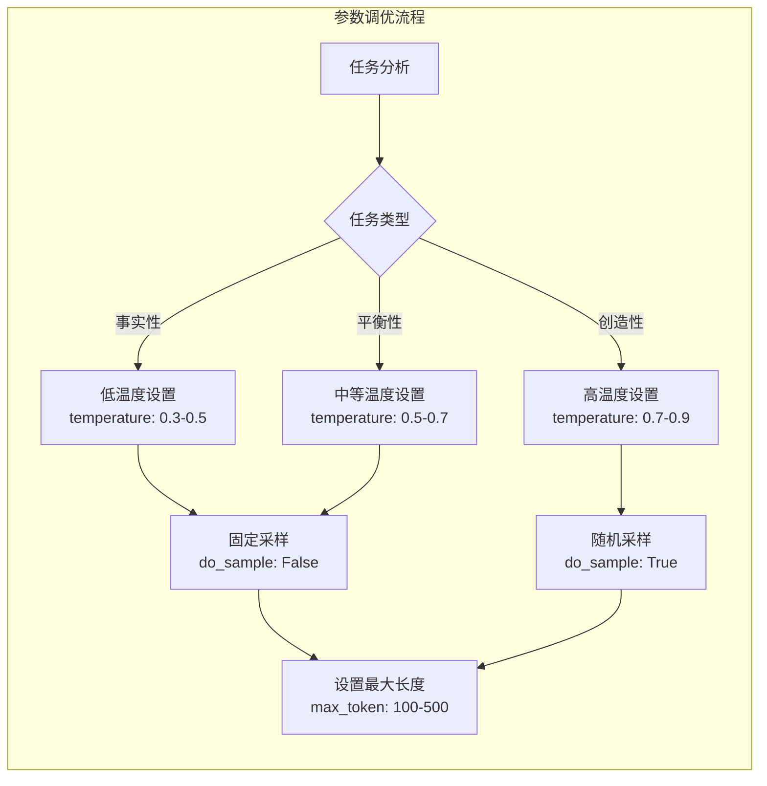

**图表来源**
- [deprec.py](file://rdagent/oai/backend/deprec.py#L338-L366)

**章节来源**
- [llm_conf.py](file://rdagent/oai/llm_conf.py#L118-L122)
- [deprec.py](file://rdagent/oai/backend/deprec.py#L338-L366)

## 服务账户认证配置

### 认证机制概述

Google Cloud Vertex AI使用Bearer Token认证机制，要求提供有效的服务账户密钥。

### 环境变量配置

推荐使用环境变量来管理敏感信息：

| 环境变量名 | 描述 | 示例值 |
|------------|------|--------|
| GOOGLE_CLOUD_PROJECT | Google Cloud项目ID | "my-project-id" |
| GOOGLE_APPLICATION_CREDENTIALS | 服务账户JSON密钥文件路径 | "/path/to/service-account.json" |

### 安全存储最佳实践

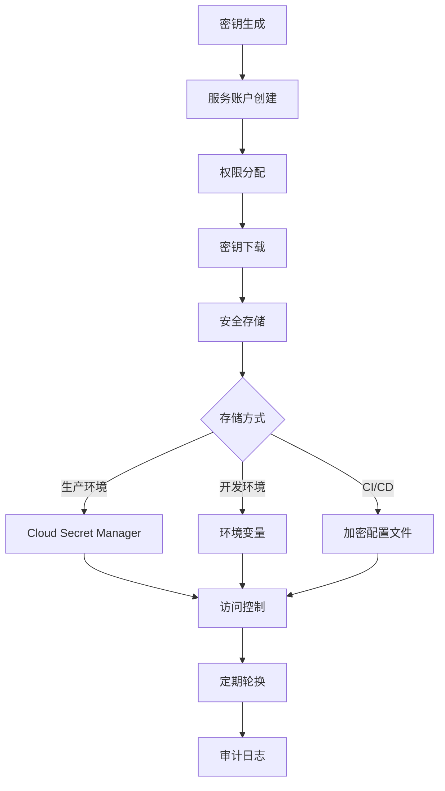

### 代码中的认证处理

系统自动处理HTTPS验证问题：

```python
if not os.environ.get("PYTHONHTTPSVERIFY", "") and hasattr(ssl, "_create_unverified_context"):
    ssl._create_default_https_context = ssl._create_unverified_context
```

**章节来源**
- [deprec.py](file://rdagent/oai/backend/deprec.py#L145-L150)

## 模型调用实例

### 基本调用流程

以下是使用GCR端点进行模型调用的标准流程：

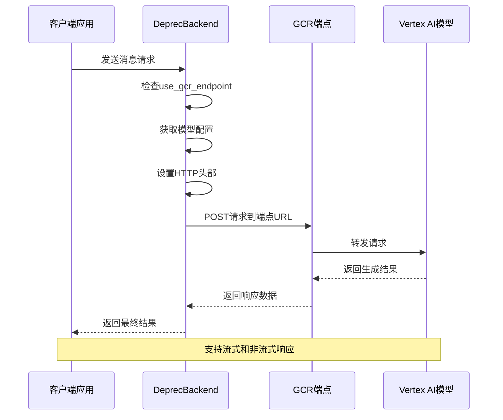

**图表来源**
- [deprec.py](file://rdagent/oai/backend/deprec.py#L338-L366)

### 请求格式示例

系统发送的JSON请求格式：

```json
{
    "input_data": {
        "input_string": messages,
        "parameters": {
            "temperature": 0.7,
            "top_p": 0.9,
            "max_new_tokens": 100
        }
    }
}
```

### 响应处理

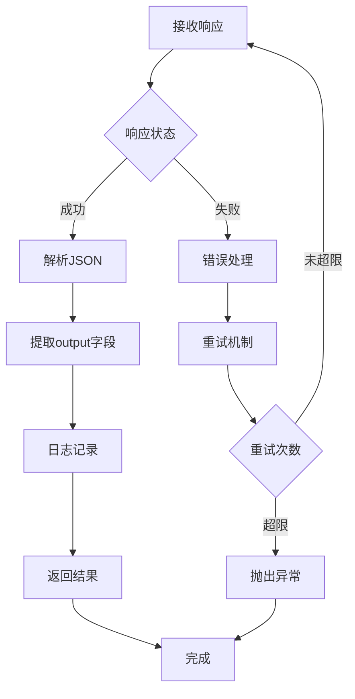

**图表来源**
- [deprec.py](file://rdagent/oai/backend/deprec.py#L350-L366)

**章节来源**
- [deprec.py](file://rdagent/oai/backend/deprec.py#L338-L366)

## 微调功能集成

### 微调架构概述

RD-Agent支持基于QLoRA的参数高效微调，特别针对GCR托管模型的优化：

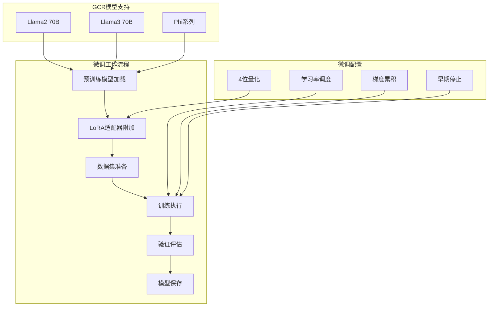

**图表来源**
- [prompts.yaml](file://rdagent/app/finetune/llm/tpl/scenarios/data_science/prompts.yaml#L0-L9)

### 微调配置要点

| 配置项 | 描述 | 推荐值 |
|--------|------|--------|
| n_epochs | 训练轮数 | 100 |
| lr | 学习率 | 2e-4 |
| early_stop | 早停耐心值 | 10 |
| batch_size | 批次大小 | 256 |
| weight_decay | 权重衰减 | 0.0001 |

### 微调实施步骤

1. **模型准备**：从GCR端点加载预训练模型
2. **适配器配置**：附加4位LoRA适配器
3. **数据处理**：准备训练和验证数据集
4. **训练监控**：实时监控损失和指标
5. **评估验证**：在验证集上评估性能

**章节来源**
- [prompts.yaml](file://rdagent/app/finetune/llm/tpl/scenarios/data_science/prompts.yaml#L0-L9)

## 运维注意事项

### 跨区域部署

#### 区域选择策略

| 区域 | 优势 | 适用场景 | 延迟特征 |
|------|------|----------|----------|
| us-central1 | 成熟稳定 | 生产环境 | 全球最低延迟 |
| europe-west1 | GDPR合规 | 欧洲用户 | 中等延迟 |
| asia-east1 | 亚洲用户 | 亚太地区 | 较高延迟 |

#### 部署最佳实践

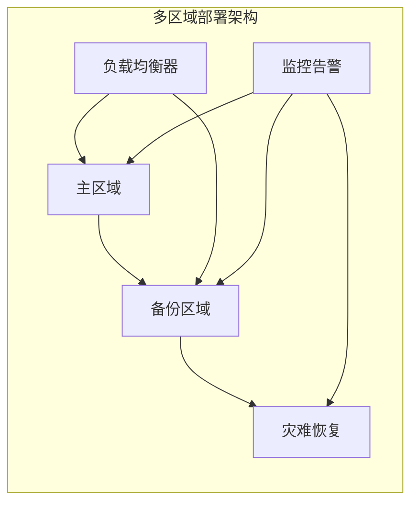

### 配额管理

#### 速率限制配置

| 组件 | 限制类型 | 默认值 | 可调范围 |
|------|----------|--------|----------|
| 每秒请求数 | RPS | 10 | 1-100 |
| 并发连接数 | 并发 | 5 | 1-20 |
| 日请求量 | 日限额 | 1000 | 100-10000 |
| 上下文长度 | token | 8192 | 1024-32768 |

#### 配额监控指标

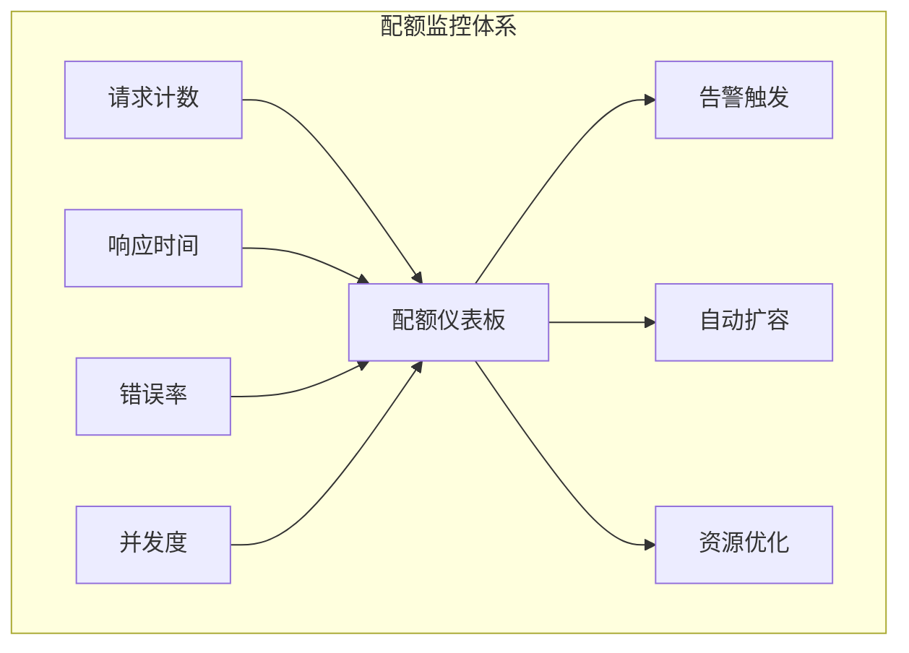

### 性能优化

#### 缓存策略

| 缓存类型 | 生命周期 | 适用场景 | 存储位置 |
|----------|----------|----------|----------|
| 请求缓存 | 1小时 | 相同查询 | 内存/Redis |
| 模型缓存 | 24小时 | 模型加载 | 本地磁盘 |
| 嵌入缓存 | 7天 | 特征计算 | 数据库 |
| 响应缓存 | 30分钟 | 结果复用 | 分布式缓存 |

**章节来源**
- [env.py](file://rdagent/utils/env.py#L720-L754)
- [conf.py](file://rdagent/app/data_science/conf.py#L32-L39)

## 故障排除指南

### 常见问题诊断

#### 认证相关问题

| 错误类型 | 症状 | 解决方案 |
|----------|------|----------|
| 401 Unauthorized | 认证失败 | 检查endpoint_key有效性 |
| 403 Forbidden | 权限不足 | 验证服务账户权限 |
| SSL证书错误 | HTTPS连接失败 | 设置PYTHONHTTPSVERIFY=0 |

#### 网络连接问题

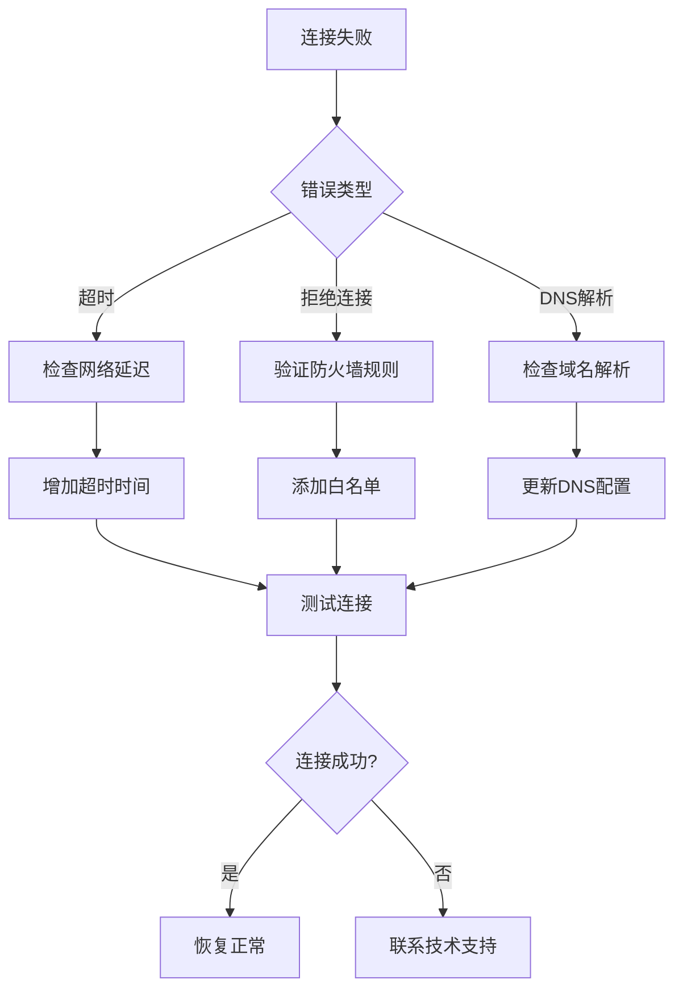

### 性能调优指南

#### 响应时间优化

1. **连接池配置**：启用HTTP连接复用
2. **批量处理**：合并多个小请求
3. **异步调用**：使用异步客户端
4. **预热机制**：提前建立连接

#### 内存使用优化

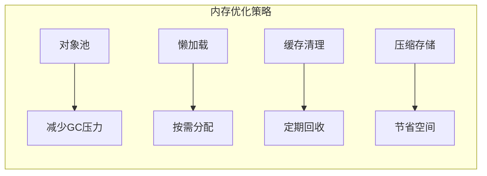

### 监控和日志

#### 关键指标监控

| 指标类别 | 监控项目 | 告警阈值 | 处理动作 |
|----------|----------|----------|----------|
| 可用性 | 请求成功率 | < 95% | 自动切换备用节点 |
| 性能 | 平均响应时间 | > 2秒 | 扩容或优化 |
| 负载 | 并发请求数 | > 80%容量 | 动态扩展 |
| 错误 | 错误率 | > 5% | 立即告警 |

**章节来源**
- [deprec.py](file://rdagent/oai/backend/deprec.py#L145-L150)
- [prompts.yaml](file://rdagent/scenarios/data_science/dev/runner/prompts.yaml#L0-L173)

## 总结

Google Cloud Vertex AI在RD-Agent框架中的集成提供了强大而灵活的AI服务能力。通过本文档的指导，您可以：

1. **正确配置GCR端点**：启用use_gcr_endpoint开关，设置合适的模型类型和端点参数
2. **优化生成质量**：通过调优temperature、top_p等参数获得最佳输出效果
3. **确保安全认证**：采用最佳实践保护服务账户密钥和访问凭据
4. **实现模型微调**：利用QLoRA技术对GCR托管模型进行高效定制
5. **处理运维挑战**：应对跨区域部署、配额管理和性能优化等实际问题

随着AI技术的不断发展，RD-Agent将继续演进，为用户提供更加智能和高效的研发体验。建议定期关注官方更新，及时采用新功能和优化改进。