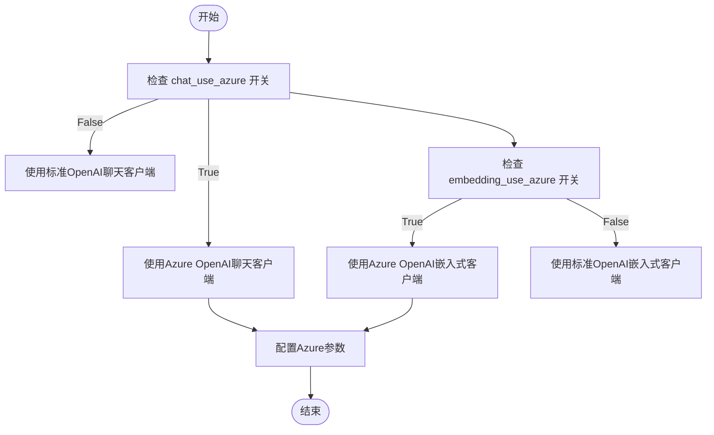
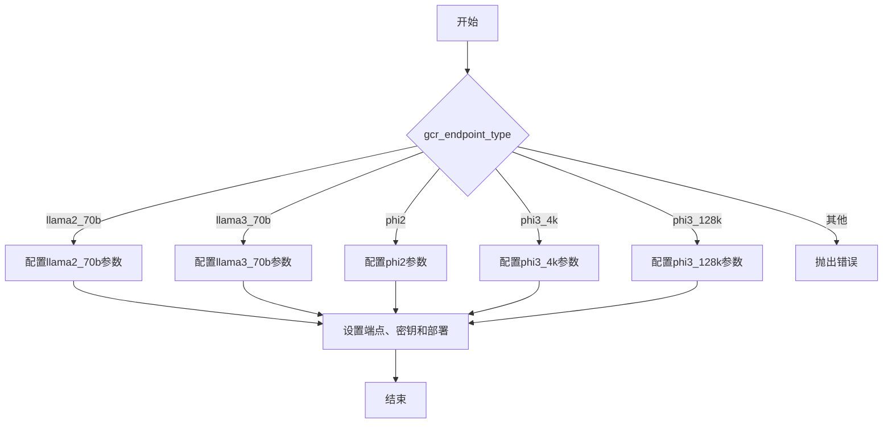
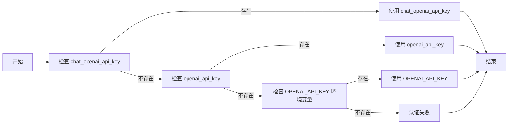
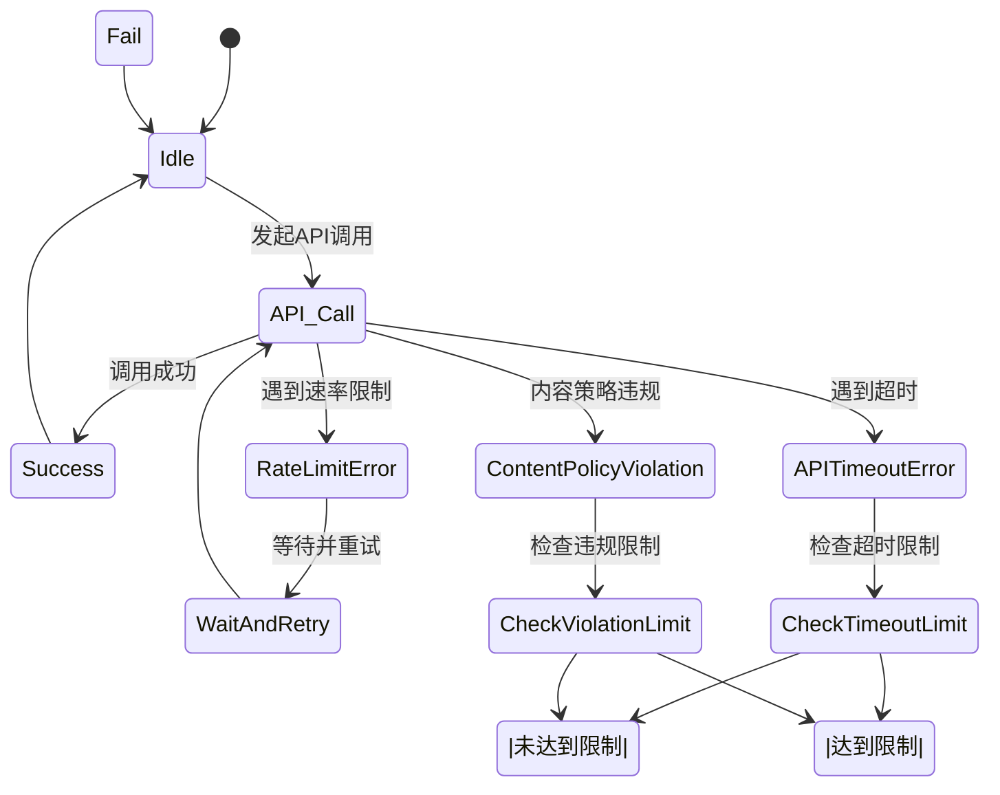
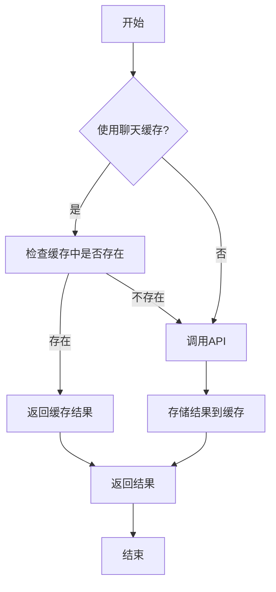

# 云服务集成配置

<cite>
**本文档引用的文件**  
- [llm_conf.py](file://rdagent/oai/llm_conf.py)
- [deprec.py](file://rdagent/oai/backend/deprec.py)
- [embedding.py](file://rdagent/oai/utils/embedding.py)
</cite>

## 目录
1. [引言](#引言)
2. [Azure OpenAI服务配置](#azure-openai服务配置)
3. [Google Cloud Vertex AI(GCR端点)配置](#google-cloud-vertex-aigcr端点配置)
4. [AWS Bedrock集成](#aws-bedrock集成)
5. [身份验证机制](#身份验证机制)
6. [跨云平台故障转移与负载均衡](#跨云平台故障转移与负载均衡)
7. [云服务特有功能优化](#云服务特有功能优化)
8. [性能与错误处理](#性能与错误处理)
9. [总结](#总结)

## 引言
本文档系统性地介绍了RD-Agent项目中LLM后端与主流云服务的集成方法。重点说明了Azure OpenAI服务、Google Cloud Vertex AI(GCR端点)等平台的配置流程，涵盖了身份验证机制、故障转移策略以及云服务特有功能的优化使用。通过分析代码库中的配置文件和实现逻辑，为开发者提供了详细的集成指南。

## Azure OpenAI服务配置

### chat_use_azure和embedding_use_azure开关
在`llm_conf.py`中，通过`chat_use_azure`和`embedding_use_azure`两个布尔值开关来控制是否使用Azure OpenAI服务。当这两个开关设置为`True`时，系统将使用Azure端点进行聊天和嵌入式模型调用。



**Diagram sources**
- [llm_conf.py](file://rdagent/oai/llm_conf.py#L38-L70)
- [deprec.py](file://rdagent/oai/backend/deprec.py#L159-L181)

**Section sources**
- [llm_conf.py](file://rdagent/oai/llm_conf.py#L38-L70)
- [deprec.py](file://rdagent/oai/backend/deprec.py#L159-L181)

### 资源名称、部署ID和API版本设置
Azure OpenAI服务的配置需要以下关键参数：
- `chat_azure_api_base`: 聊天模型的Azure API基础URL
- `chat_azure_api_version`: 聊天模型的API版本
- `embedding_azure_api_base`: 嵌入式模型的Azure API基础URL
- `embedding_azure_api_version`: 嵌入式模型的API版本

这些参数在`llm_conf.py`中定义，并在`deprec.py`中用于初始化Azure客户端。

## Google Cloud Vertex AI(GCR端点)配置

### GCR端点类型配置
系统支持多种GCR端点类型，包括`llama2_70b`、`llama3_70b`、`phi2`、`phi3_4k`和`phi3_128k`。通过`gcr_endpoint_type`参数来指定使用的端点类型。



**Diagram sources**
- [llm_conf.py](file://rdagent/oai/llm_conf.py#L98-L131)
- [deprec.py](file://rdagent/oai/backend/deprec.py#L120-L141)

**Section sources**
- [llm_conf.py](file://rdagent/oai/llm_conf.py#L98-L131)
- [deprec.py](file://rdagent/oai/backend/deprec.py#L120-L141)

### 端点参数设置
每种GCR端点类型都有对应的端点URL、密钥和部署ID配置：
- `*_endpoint`: 端点URL
- `*_endpoint_key`: 认证密钥
- `*_endpoint_deployment`: 部署ID

此外，还支持通用的GCR端点参数配置：
- `gcr_endpoint_temperature`: 温度参数
- `gcr_endpoint_top_p`: Top-P采样参数
- `gcr_endpoint_do_sample`: 是否采样
- `gcr_endpoint_max_token`: 最大token数

## AWS Bedrock集成

### 当前状态
根据代码库分析，目前的实现中没有直接支持AWS Bedrock的集成。系统主要支持Azure OpenAI、GCR端点和标准OpenAI API。

### 潜在集成方案
虽然没有直接的AWS Bedrock集成，但可以通过以下方式实现：
1. 使用`chat_openai_base_url`和`embedding_openai_base_url`配置自定义端点
2. 通过`openai_api_key`提供AWS Bedrock的认证密钥
3. 在`deprec.py`中添加对AWS Bedrock的特殊处理逻辑

## 身份验证机制

### API密钥认证
系统支持多种API密钥认证方式，优先级如下：
1. `chat_openai_api_key`/`embedding_openai_api_key`
2. `openai_api_key`
3. 环境变量`OPENAI_API_KEY`



**Diagram sources**
- [deprec.py](file://rdagent/oai/backend/deprec.py#L180-L205)

**Section sources**
- [deprec.py](file://rdagent/oai/backend/deprec.py#L180-L205)

### Azure服务主体认证
对于Azure服务，系统支持使用`DefaultAzureCredential`进行服务主体认证。当`chat_use_azure_token_provider`或`embedding_use_azure_token_provider`设置为`True`时，系统将使用Azure AD令牌提供程序进行认证。

```python
credential = DefaultAzureCredential(**dac_kwargs)
token_provider = get_bearer_token_provider(
    credential,
    "https://cognitiveservices.azure.com/.default",
)
```

### IAM角色
代码库中没有直接实现IAM角色认证，但可以通过环境变量或配置文件间接支持。

## 跨云平台故障转移和负载均衡

### 故障转移策略
系统通过以下机制实现故障转移：
1. **重试机制**: 当API调用失败时，系统会自动重试，重试次数由`max_retry`参数控制
2. **超时处理**: 当API调用超时时，系统会根据`timeout_fail_limit`决定是否继续重试
3. **内容策略违规处理**: 当检测到内容策略违规时，系统会根据`violation_fail_limit`决定是否继续



**Diagram sources**
- [base.py](file://rdagent/oai/backend/base.py#L503-L547)

**Section sources**
- [base.py](file://rdagent/oai/backend/base.py#L503-L547)

### 负载均衡策略
目前的实现中没有显式的负载均衡策略，但可以通过以下方式实现：
1. 配置多个云服务提供商
2. 根据响应时间和成本动态选择最优服务
3. 实现轮询或加权轮询算法

## 云服务特有功能优化

### Azure私有网络部署
系统支持通过`managed_identity_client_id`配置托管身份客户端ID，这可以用于在Azure私有网络中进行安全的API调用。

### GCR模型微调
虽然代码库中没有直接的模型微调功能，但可以通过以下方式实现：
1. 使用`gcr_endpoint_type`选择合适的模型
2. 通过`gcr_endpoint_temperature`和`gcr_endpoint_top_p`调整模型行为
3. 实现自定义的微调接口

## 性能与错误处理

### 缓存机制
系统实现了多种缓存机制来提高性能：
- **聊天缓存**: 当`use_chat_cache`为`True`时，系统会缓存聊天响应
- **嵌入式缓存**: 当`use_embedding_cache`为`True`时，系统会缓存嵌入式结果
- **缓存位置**: 缓存文件存储在`prompt_cache_path`指定的路径



**Diagram sources**
- [base.py](file://rdagent/oai/backend/base.py#L139-L178)

**Section sources**
- [base.py](file://rdagent/oai/backend/base.py#L139-L178)

### 错误处理
系统实现了全面的错误处理机制：
1. **网络错误**: 自动重试
2. **认证错误**: 提示用户检查认证信息
3. **内容策略违规**: 记录违规并根据限制决定是否继续
4. **超时错误**: 根据超时限制决定是否继续

## 总结
本文档详细介绍了RD-Agent项目中LLM后端与主流云服务的集成方法。通过分析代码库，我们了解了Azure OpenAI服务、GCR端点的配置流程，以及身份验证机制、故障转移策略和性能优化方法。虽然目前没有直接支持AWS Bedrock，但系统架构为未来的云服务集成提供了良好的扩展性。