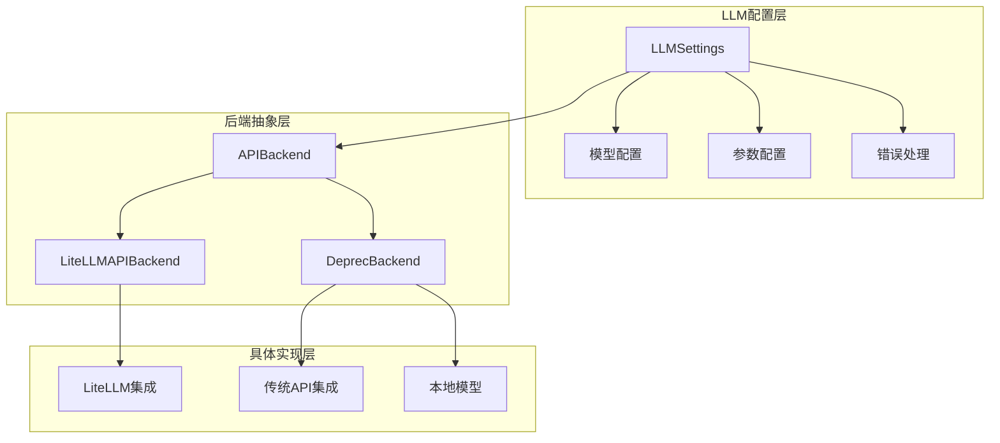
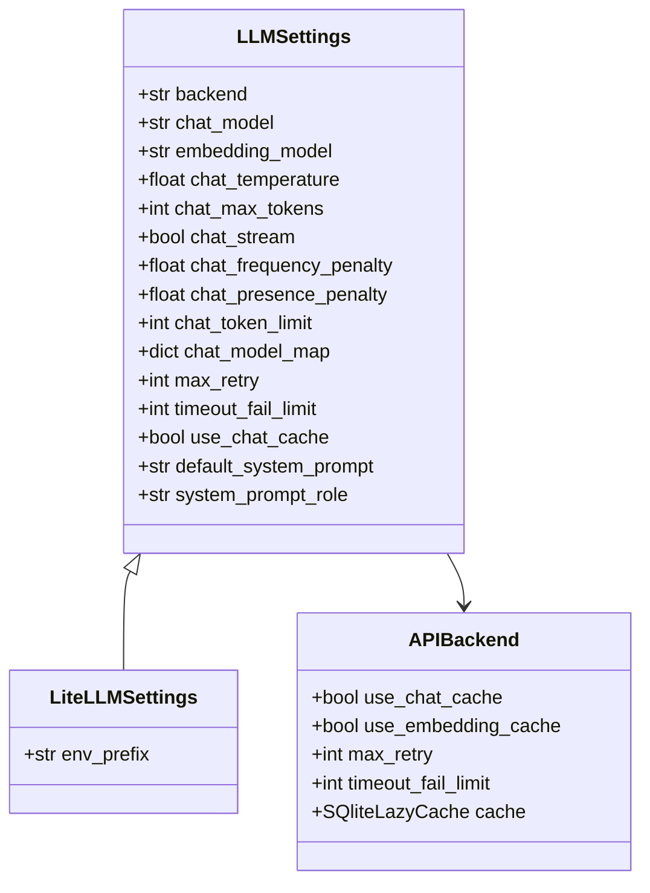
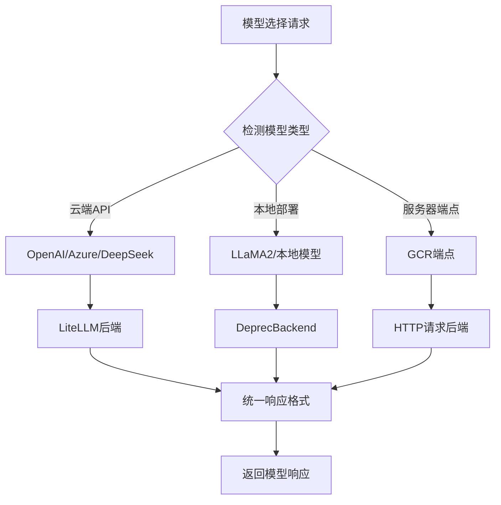
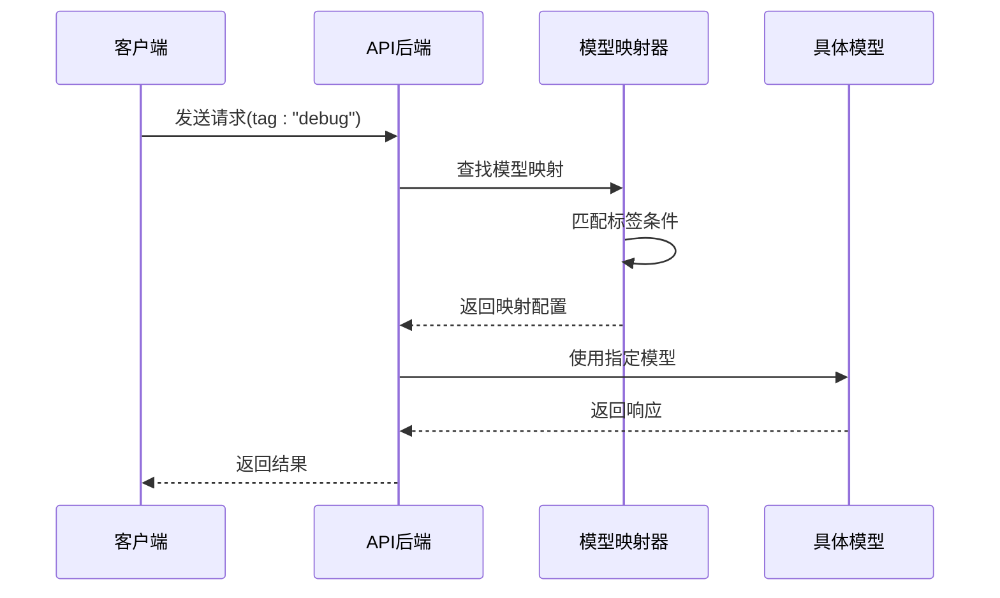
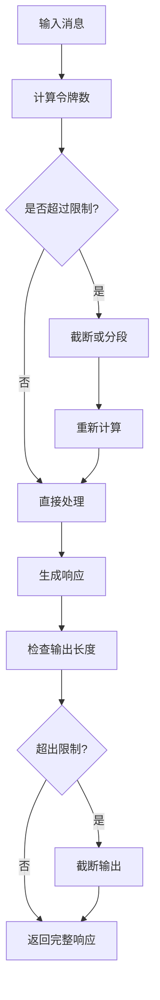
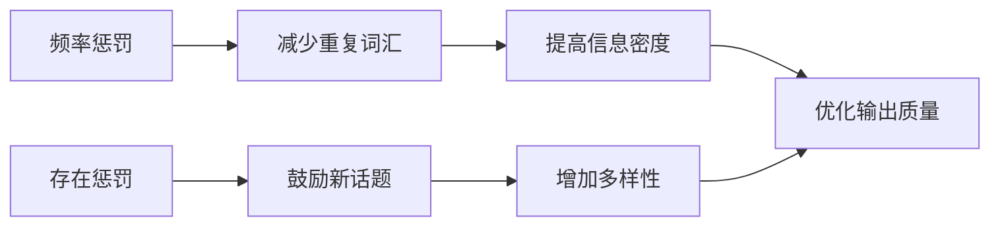
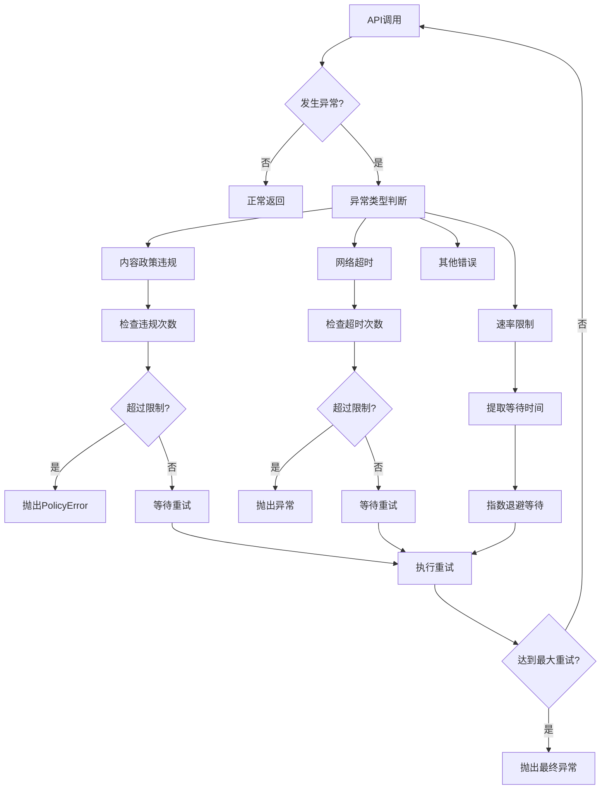
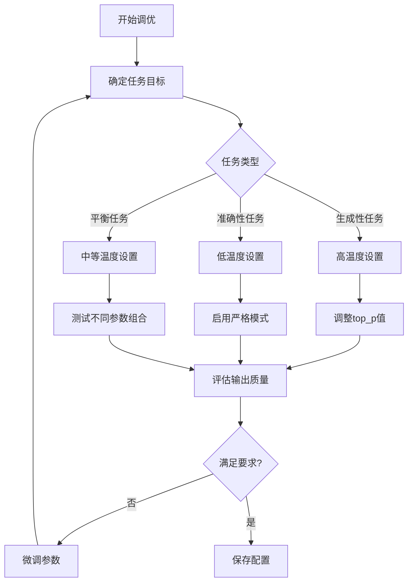

# 模型选择与参数配置

<cite>
**本文档中引用的文件**
- [llm_conf.py](file://rdagent/oai/llm_conf.py)
- [litellm.py](file://rdagent/oai/backend/litellm.py)
- [base.py](file://rdagent/oai/backend/base.py)
- [deprec.py](file://rdagent/oai/backend/deprec.py)
- [README.md](file://README.md)
- [test_advanced.py](file://test/oai/test_advanced.py)
</cite>

## 目录
1. [简介](#简介)
2. [项目结构概览](#项目结构概览)
3. [LLMSettings核心配置类](#llmsettings核心配置类)
4. [模型选择机制](#模型选择机制)
5. [核心参数配置详解](#核心参数配置详解)
6. [高级采样参数调优](#高级采样参数调优)
7. [错误处理与超时重试策略](#错误处理与超时重试策略)
8. [实际应用配置示例](#实际应用配置示例)
9. [性能优化建议](#性能优化建议)
10. [故障排除指南](#故障排除指南)

## 简介

RD-Agent是一个基于LLM的智能研发代理系统，其核心架构围绕灵活的模型选择机制和精细的参数配置展开。该系统支持多种LLM提供商和模型类型，通过统一的配置接口实现无缝切换，为不同的应用场景提供最优的模型配置。

## 项目结构概览



**图表来源**
- [llm_conf.py](file://rdagent/oai/llm_conf.py#L10-L128)
- [base.py](file://rdagent/oai/backend/base.py#L300-L400)

## LLMSettings核心配置类

### 类结构设计

LLMSettings类是整个LLM系统的配置中心，继承自ExtendedBaseSettings，提供了完整的模型配置管理功能。



**图表来源**
- [llm_conf.py](file://rdagent/oai/llm_conf.py#L10-L128)
- [litellm.py](file://rdagent/oai/backend/litellm.py#L30-L45)

### 核心配置字段说明

| 配置字段 | 类型 | 默认值 | 说明 |
|---------|------|--------|------|
| `backend` | str | "rdagent.oai.backend.LiteLLMAPIBackend" | 后端实现选择 |
| `chat_model` | str | "gpt-4-turbo" | 聊天模型名称 |
| `embedding_model` | str | "text-embedding-3-small" | 嵌入模型名称 |
| `chat_temperature` | float | 0.5 | 控制输出随机性的温度参数 |
| `chat_max_tokens` | int \| None | None | 最大生成令牌数 |
| `chat_stream` | bool | True | 是否启用流式响应 |
| `chat_token_limit` | int | 100000 | 聊天令牌上限 |

**章节来源**
- [llm_conf.py](file://rdagent/oai/llm_conf.py#L10-L128)

## 模型选择机制

### 多模型支持架构

系统支持多种模型提供商和部署方式，通过统一的接口实现无缝切换。



**图表来源**
- [litellm.py](file://rdagent/oai/backend/litellm.py#L43-L76)
- [deprec.py](file://rdagent/oai/backend/deprec.py#L120-L180)

### 模型映射机制

系统提供了灵活的模型映射功能，允许根据不同的应用场景动态切换模型。



**图表来源**
- [litellm.py](file://rdagent/oai/backend/litellm.py#L85-L110)
- [deprec.py](file://rdagent/oai/backend/deprec.py#L311-L325)

**章节来源**
- [litellm.py](file://rdagent/oai/backend/litellm.py#L85-L110)
- [deprec.py](file://rdagent/oai/backend/deprec.py#L311-L325)

## 核心参数配置详解

### 温度参数 (chat_temperature)

温度参数控制生成文本的随机性和创造性，是影响输出质量的关键因素。

| 温度范围 | 输出特性 | 适用场景 |
|----------|----------|----------|
| 0.0 - 0.3 | 确定性强，重复性高 | 代码生成、技术文档 |
| 0.4 - 0.7 | 平衡创造性和一致性 | 文本理解和分析 |
| 0.8 - 1.0 | 创造性强，多样性高 | 创意写作、头脑风暴 |

### 最大令牌数 (chat_max_tokens)

令牌数限制策略确保响应长度在合理范围内，避免超出模型上下文窗口。



**图表来源**
- [litellm.py](file://rdagent/oai/backend/litellm.py#L225-L243)

### 系统提示词配置

系统提示词角色配置提供了灵活的对话管理机制。

| 角色类型 | 适用模型 | 配置说明 |
|----------|----------|----------|
| "system" | 大多数模型 | 标准系统提示词 |
| 自定义角色 | 不支持system的角色模型 | 如o1系列模型 |

**章节来源**
- [llm_conf.py](file://rdagent/oai/llm_conf.py#L75-L80)

## 高级采样参数调优

### 频率惩罚 (frequency_penalty) 和存在惩罚 (presence_penalty)

这两个参数用于控制生成文本中的重复内容和新话题引入。



### Top-p采样策略

Top-p采样（核采样）是一种动态的词汇选择策略，平衡了质量和多样性。

| Top-p值 | 采样行为 | 应用场景 |
|---------|----------|----------|
| 0.1-0.3 | 保守采样，高质量 | 技术文档、代码生成 |
| 0.4-0.7 | 平衡采样，适中多样性 | 文本分析、总结 |
| 0.8-0.95 | 激进采样，高多样性 | 创意写作、头脑风暴 |

**章节来源**
- [llm_conf.py](file://rdagent/oai/llm_conf.py#L70-L75)

## 错误处理与超时重试策略

### 异常分类处理

系统实现了完善的异常分类和处理机制，针对不同类型的错误采用相应的恢复策略。



**图表来源**
- [base.py](file://rdagent/oai/backend/base.py#L503-L547)

### 缓存机制配置

系统提供了多层次的缓存机制，包括聊天缓存和嵌入缓存。

| 缓存类型 | 功能描述 | 配置参数 |
|----------|----------|----------|
| 聊天缓存 | 存储对话历史和响应 | `use_chat_cache`, `dump_chat_cache` |
| 嵌入缓存 | 存储文本向量表示 | `use_embedding_cache`, `dump_embedding_cache` |
| 会话缓存 | 管理对话会话状态 | `prompt_cache_path` |

### 超时重试配置

| 参数 | 默认值 | 说明 |
|------|--------|------|
| `max_retry` | 10 | 最大重试次数 |
| `retry_wait_seconds` | 1 | 基础等待时间（秒） |
| `timeout_fail_limit` | 10 | 超时失败阈值 |
| `violation_fail_limit` | 1 | 内容违规失败阈值 |

**章节来源**
- [base.py](file://rdagent/oai/backend/base.py#L503-L547)
- [llm_conf.py](file://rdagent/oai/llm_conf.py#L40-L50)

## 实际应用配置示例

### 开发环境配置

```bash
# OpenAI API配置
cat << EOF > .env
# 设置支持LiteLLM的任何模型
CHAT_MODEL=gpt-4o
EMBEDDING_MODEL=text-embedding-3-small
# 配置统一API基础
OPENAI_API_BASE=<your_unified_api_base>
OPENAI_API_KEY=<replace_with_your_openai_api_key>
EOF
```

### Azure OpenAI配置

```bash
# Azure OpenAI配置
cat << EOF > .env
EMBEDDING_MODEL=azure/<支持嵌入的模型部署>
CHAT_MODEL=azure/<你的部署名称>
AZURE_API_KEY=<替换为你的Azure API密钥>
AZURE_API_BASE=<你的统一API基础>
AZURE_API_VERSION=<Azure API版本>
EOF
```

### DeepSeek模型配置

```bash
# DeepSeek官方API配置
cat << EOF > .env
# 聊天模型：使用DeepSeek官方API
CHAT_MODEL=deepseek/deepseek-chat
DEEPSEEK_API_KEY=<替换为你的DeepSeek API密钥>

# 嵌入模型：使用SiliconFlow，因为DeepSeek没有内置嵌入模型
# 注意：嵌入需要litellm_proxy前缀
EMBEDDING_MODEL=litellm_proxy/BAAI/bge-m3
LITELLM_PROXY_API_KEY=<替换为你的SiliconFlow API密钥>
LITELLM_PROXY_API_BASE=https://api.siliconflow.cn/v1
EOF
```

### 特殊模型处理配置

对于包含思考过程标签的推理模型（如[思考]标签），需要额外配置：

```bash
# 对于包含思考过程的模型
REASONING_THINK_RM=True
```

**章节来源**
- [README.md](file://README.md#L162-L248)

## 性能优化建议

### 模型选择策略

根据不同任务类型选择最适合的模型：

| 任务类型 | 推荐模型 | 配置要点 |
|----------|----------|----------|
| 代码生成 | gpt-4-turbo, deepseek-chat | 低温度（0.1-0.3），长上下文 |
| 文本理解 | gpt-4o, claude-3 | 中等温度（0.4-0.6），关注准确性 |
| 创意写作 | gpt-4o, llama3-70b | 高温度（0.7-0.9），鼓励多样性 |
| 数据科学 | gpt-4-turbo, llama2-70b | 结构化输出，关注事实准确性 |

### 参数调优最佳实践



### 缓存策略优化

| 场景 | 推荐缓存策略 | 说明 |
|------|-------------|------|
| 开发调试 | 启用聊天缓存 | 快速迭代，节省成本 |
| 生产环境 | 条件性缓存 | 关键对话启用缓存 |
| 高并发 | 分布式缓存 | 提升响应速度 |
| 数据隐私 | 禁用缓存 | 保护敏感信息 |

## 故障排除指南

### 常见问题诊断

| 问题症状 | 可能原因 | 解决方案 |
|----------|----------|----------|
| 模型调用失败 | API密钥无效 | 检查环境变量配置 |
| 响应超时 | 网络连接问题 | 增加超时重试次数 |
| 内容被过滤 | 政策违规 | 调整提示词内容 |
| 令牌溢出 | 上下文过长 | 减少输入长度或分段处理 |

### 调试工具使用

系统提供了完整的日志记录和健康检查功能：

```bash
# 运行健康检查
rdagent health_check

# 查看详细日志
rdagent ui --port 19899 --log-dir ./logs/
```

### 性能监控指标

| 指标类型 | 监控内容 | 正常范围 |
|----------|----------|----------|
| 响应时间 | API调用延迟 | < 5秒 |
| 成功率 | 请求成功率 | > 95% |
| 成本控制 | 单次调用费用 | 根据模型定价 |
| 缓存命中率 | 缓存效率 | > 80% |

**章节来源**
- [test_advanced.py](file://test/oai/test_advanced.py#L99-L161)

## 总结

RD-Agent的模型选择与参数配置系统提供了高度灵活和可扩展的架构。通过LLMSettings类的统一配置接口，系统能够支持多种模型提供商和部署方式，同时通过完善的错误处理和缓存机制确保稳定运行。

关键优势：
- **灵活性**：支持多种模型提供商和部署方式
- **可扩展性**：模块化设计便于添加新的后端实现
- **稳定性**：完善的错误处理和重试机制
- **性能**：多层次缓存和优化策略
- **易用性**：统一的配置接口和丰富的示例

通过合理的配置和调优，该系统能够在各种应用场景中提供高质量的LLM服务，为智能研发代理提供强大的语言模型支撑。