# 缓存与性能优化

<cite>
**本文档中引用的文件**
- [llm_conf.py](file://rdagent/oai/llm_conf.py)
- [base.py](file://rdagent/oai/backend/base.py)
- [embedding.py](file://rdagent/oai/utils/embedding.py)
- [loop.py](file://rdagent/utils/workflow/loop.py)
- [conf.py](file://rdagent/core/conf.py)
- [timer.py](file://rdagent/log/timer.py)
- [test_advanced.py](file://test/oai/test_advanced.py)
- [test_embedding_and_similarity.py](file://test/oai/test_embedding_and_similarity.py)
</cite>

## 目录
1. [简介](#简介)
2. [项目结构概览](#项目结构概览)
3. [核心缓存机制](#核心缓存机制)
4. [缓存配置详解](#缓存配置详解)
5. [缓存存储后端](#缓存存储后端)
6. [缓存键生成策略](#缓存键生成策略)
7. [性能优化策略](#性能优化策略)
8. [并发控制与异步处理](#并发控制与异步处理)
9. [API调用成本优化](#api调用成本优化)
10. [监控与基准测试](#监控与基准测试)
11. [大规模部署配置](#大规模部署配置)
12. [故障排除指南](#故障排除指南)
13. [总结](#总结)

## 简介

RD-Agent是一个基于LLM的智能代理系统，其缓存与性能优化机制是确保高效运行的核心组件。本文档深入解析了系统的缓存架构、性能优化策略以及大规模部署的最佳实践。

该系统采用了多层次的缓存策略，包括聊天缓存、嵌入缓存和会话历史缓存，同时实现了智能的重试机制、超时控制和资源管理功能。

## 项目结构概览

RD-Agent的缓存与性能优化功能分布在以下关键模块中：

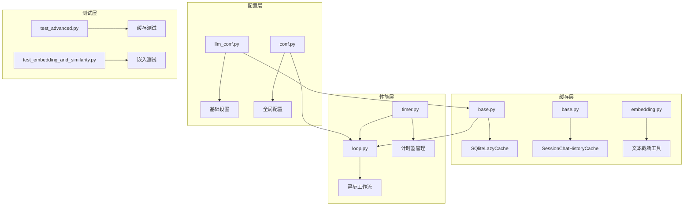

**图表来源**
- [llm_conf.py](file://rdagent/oai/llm_conf.py#L1-L133)
- [base.py](file://rdagent/oai/backend/base.py#L1-L711)
- [loop.py](file://rdagent/utils/workflow/loop.py#L1-L538)

## 核心缓存机制

### 缓存架构设计

RD-Agent实现了三层缓存架构，每层都有特定的用途和优化策略：

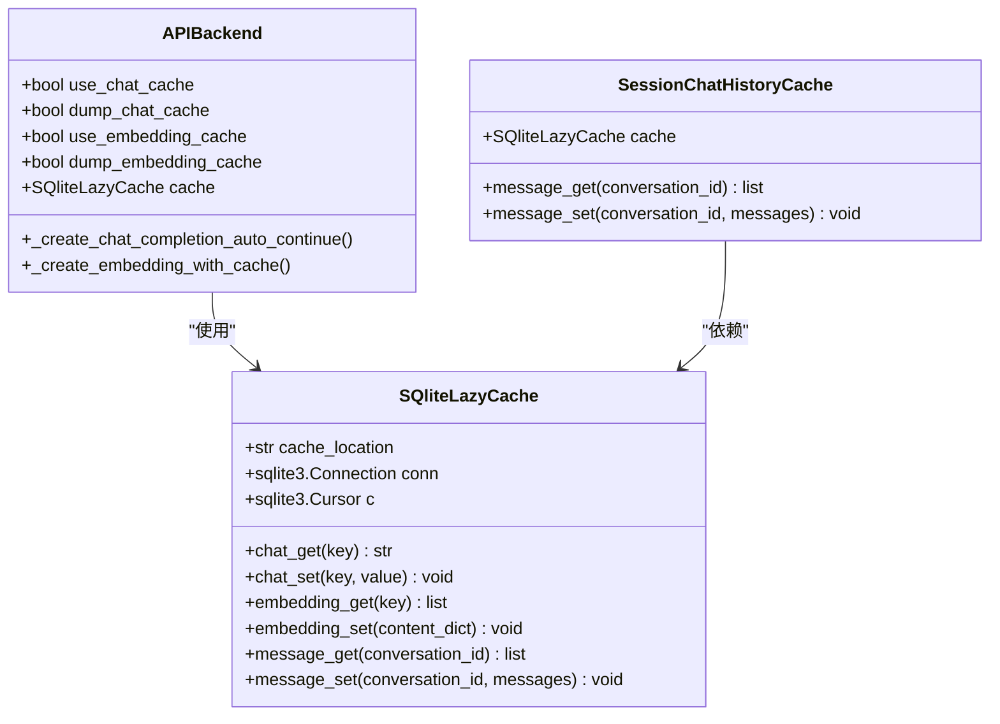

**图表来源**
- [base.py](file://rdagent/oai/backend/base.py#L139-L234)
- [base.py](file://rdagent/oai/backend/base.py#L236-L250)

### 缓存类型与用途

| 缓存类型 | 存储内容 | 用途 | 性能影响 |
|---------|---------|------|----------|
| 聊天缓存 | 完整对话内容 | 避免重复API调用 | 显著减少延迟和成本 |
| 嵌入缓存 | 文本向量表示 | 加速相似度计算 | 大幅提升检索效率 |
| 会话历史缓存 | 对话历史记录 | 维护上下文连续性 | 支持长对话场景 |

**章节来源**
- [base.py](file://rdagent/oai/backend/base.py#L139-L234)

## 缓存配置详解

### 关键配置参数

系统提供了丰富的缓存配置选项，允许用户根据需求进行精细调整：

| 配置项 | 类型 | 默认值 | 说明 |
|-------|------|--------|------|
| `use_chat_cache` | bool | False | 启用聊天内容缓存 |
| `dump_chat_cache` | bool | False | 将聊天内容写入缓存 |
| `use_embedding_cache` | bool | False | 启用嵌入向量缓存 |
| `dump_embedding_cache` | bool | False | 将嵌入向量写入缓存 |
| `prompt_cache_path` | str | "./prompt_cache.db" | 缓存数据库路径 |
| `init_chat_cache_seed` | int | 42 | 初始缓存种子值 |
| `max_past_message_include` | int | 10 | 最大历史消息数量 |

### 缓存行为配置

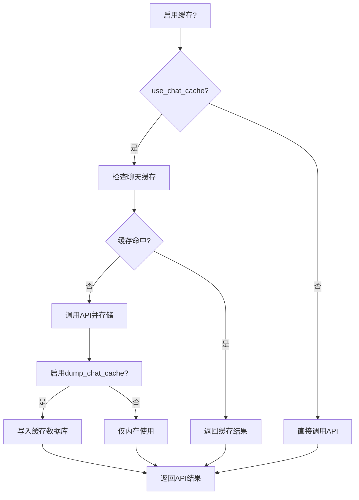

**图表来源**
- [base.py](file://rdagent/oai/backend/base.py#L400-L450)

**章节来源**
- [llm_conf.py](file://rdagent/oai/llm_conf.py#L38-L70)

## 缓存存储后端

### SQLite后端实现

系统默认采用SQLite作为缓存存储后端，提供了高性能的本地存储解决方案：

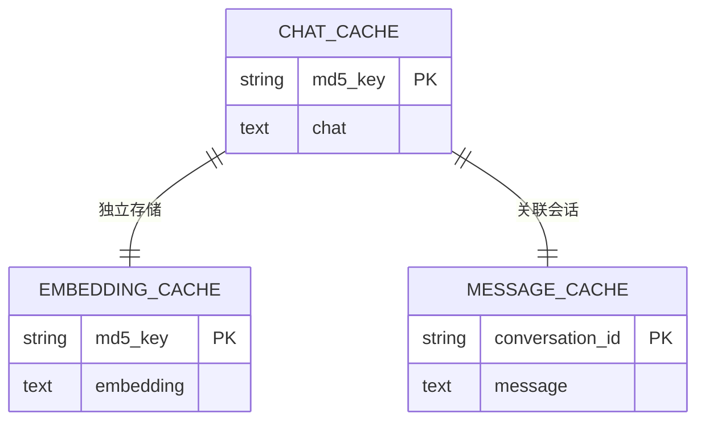

**图表来源**
- [base.py](file://rdagent/oai/backend/base.py#L147-L178)

### 数据库表结构

每个缓存类型对应一个专门的数据库表：

| 表名 | 主键 | 字段 | 用途 |
|------|------|------|------|
| `chat_cache` | md5_key | md5_key, chat | 存储聊天对话内容 |
| `embedding_cache` | md5_key | md5_key, embedding | 存储文本向量 |
| `message_cache` | conversation_id | conversation_id, message | 存储会话历史 |

### 内存与持久化平衡

系统支持内存级缓存和持久化缓存的灵活组合：

- **内存缓存**：快速访问，进程重启后丢失
- **持久化缓存**：数据持久化，支持跨进程访问
- **混合模式**：同时启用内存和磁盘缓存

**章节来源**
- [base.py](file://rdagent/oai/backend/base.py#L139-L178)

## 缓存键生成策略

### MD5哈希算法

系统采用MD5哈希算法生成缓存键，确保唯一性和一致性：

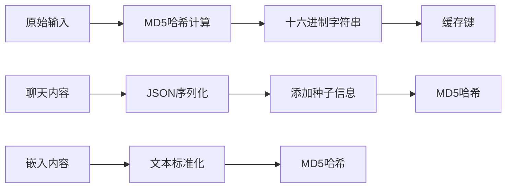

**图表来源**
- [base.py](file://rdagent/oai/backend/base.py#L176-L207)

### 种子机制

为了支持多轮对话和随机性控制，系统引入了种子机制：

| 种子类型 | 用途 | 配置项 |
|---------|------|--------|
| 自动种子生成 | 多轮对话区分 | `use_auto_chat_cache_seed_gen` |
| 固定种子 | 可重现性测试 | `init_chat_cache_seed` |
| 用户指定种子 | 特殊场景控制 | `chat_cache_prefix` |

### 键冲突处理

系统通过以下策略避免键冲突：

1. **内容标准化**：统一输入格式
2. **时间戳附加**：在种子中加入时间信息
3. **版本控制**：支持缓存格式升级

**章节来源**
- [base.py](file://rdagent/oai/backend/base.py#L400-L450)

## 性能优化策略

### 批量请求处理

系统支持批量处理多个请求以提高吞吐量：

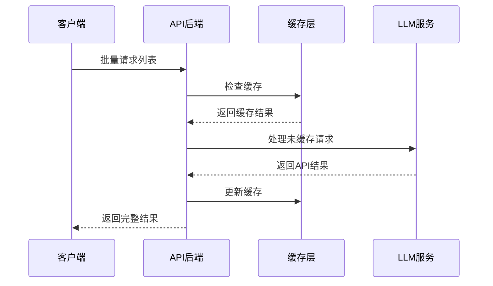

**图表来源**
- [base.py](file://rdagent/oai/backend/base.py#L450-L500)

### 流式响应优化

对于支持流式输出的模型，系统实现了高效的流式处理：

| 优化特性 | 实现方式 | 性能收益 |
|---------|---------|----------|
| 异步流处理 | asyncio.StreamReader | 减少等待时间 |
| 缓冲区管理 | 动态缓冲区大小 | 平衡延迟和吞吐量 |
| 错误恢复 | 断点续传机制 | 提高可靠性 |

### 文本截断策略

针对嵌入模型的token限制，系统实现了智能截断：

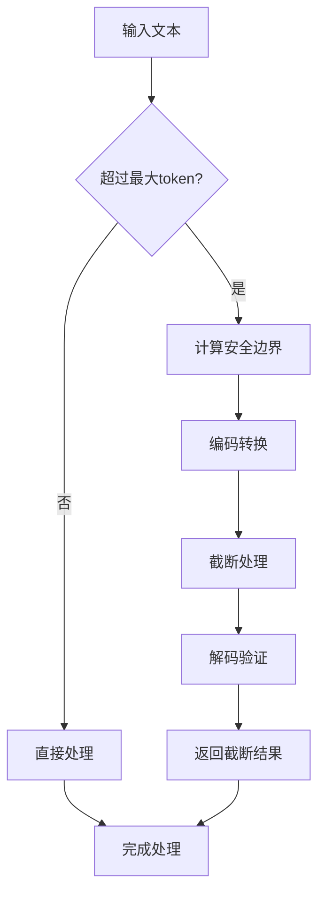

**图表来源**
- [embedding.py](file://rdagent/oai/utils/embedding.py#L84-L121)

**章节来源**
- [embedding.py](file://rdagent/oai/utils/embedding.py#L47-L134)

## 并发控制与异步处理

### 工作流并发管理

系统采用基于信号量的并发控制系统：

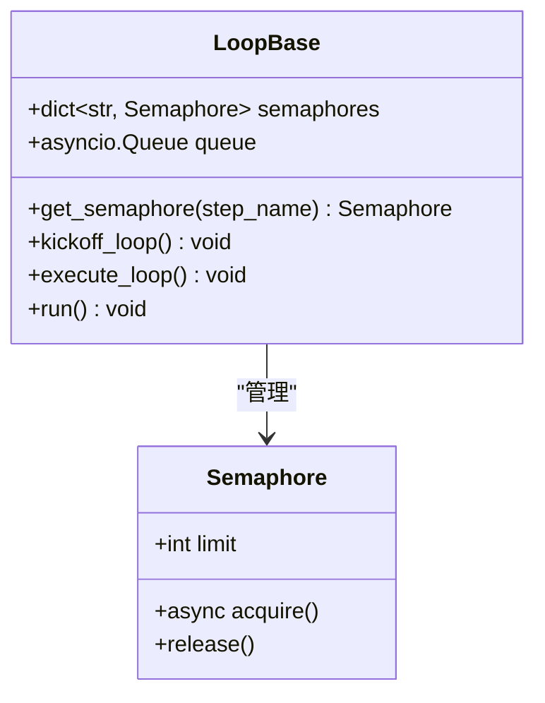

**图表来源**
- [loop.py](file://rdagent/utils/workflow/loop.py#L128-L157)

### 并发限制策略

| 步骤类型 | 并发限制 | 原因 |
|---------|---------|------|
| 记录步骤 | 1 | 避免环境状态冲突 |
| 反馈步骤 | 1 | 保持数据一致性 |
| 其他步骤 | 可配置 | 根据资源情况调整 |

### 异步执行模式

系统支持多种执行模式：

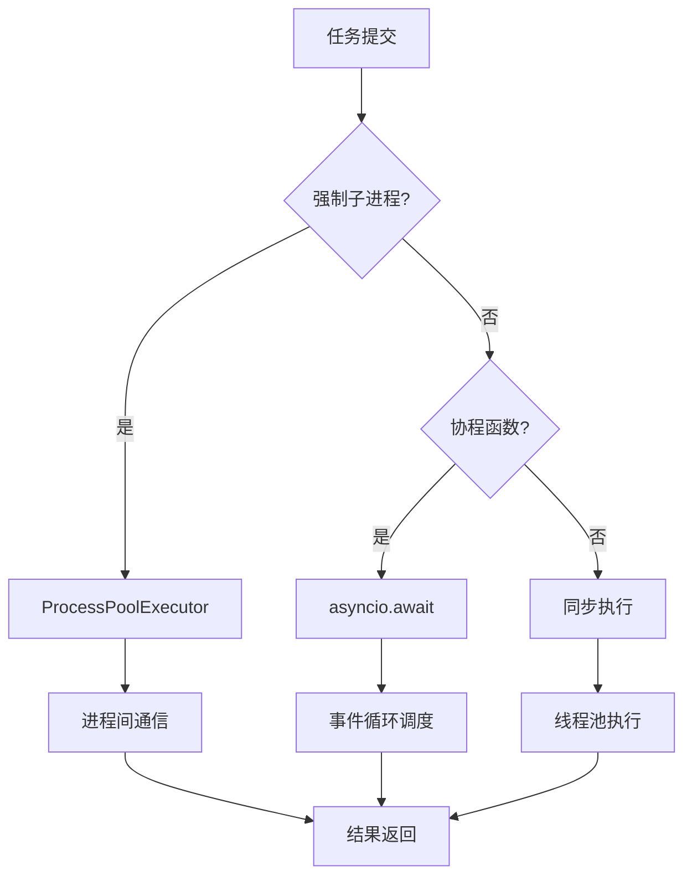

**图表来源**
- [loop.py](file://rdagent/utils/workflow/loop.py#L240-L280)

**章节来源**
- [loop.py](file://rdagent/utils/workflow/loop.py#L128-L323)

## API调用成本优化

### 成本控制机制

系统实现了多层次的成本控制策略：

| 控制层级 | 策略 | 实现方式 |
|---------|------|----------|
| 请求级 | 缓存优先 | 高效利用缓存 |
| 会话级 | 上下文压缩 | 减少历史消息长度 |
| 全局级 | 配额管理 | 设置总体使用限制 |

### 成本监控指标

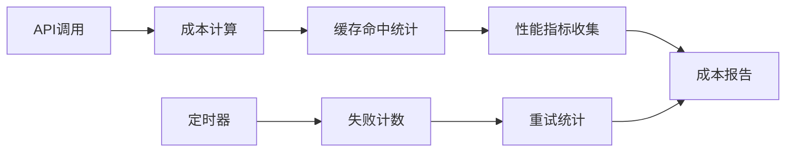

**图表来源**
- [timer.py](file://rdagent/log/timer.py#L64-L85)

### 成本优化最佳实践

1. **合理配置缓存**：根据使用模式调整缓存策略
2. **批量处理**：合并小请求为批量操作
3. **智能重试**：避免不必要的重试次数
4. **超时控制**：及时终止无响应请求

**章节来源**
- [base.py](file://rdagent/oai/backend/base.py#L503-L547)

## 监控与基准测试

### 缓存命中率监控

系统提供了详细的缓存性能监控：

| 监控指标 | 计算方式 | 优化目标 |
|---------|---------|----------|
| 聊天缓存命中率 | 命中次数/总查询次数 | >80% |
| 嵌入缓存命中率 | 命中次数/总查询次数 | >70% |
| 平均响应时间 | 总时间/请求数 | <2秒 |
| 缓存大小 | 数据库文件大小 | 合理增长 |

### 性能基准测试

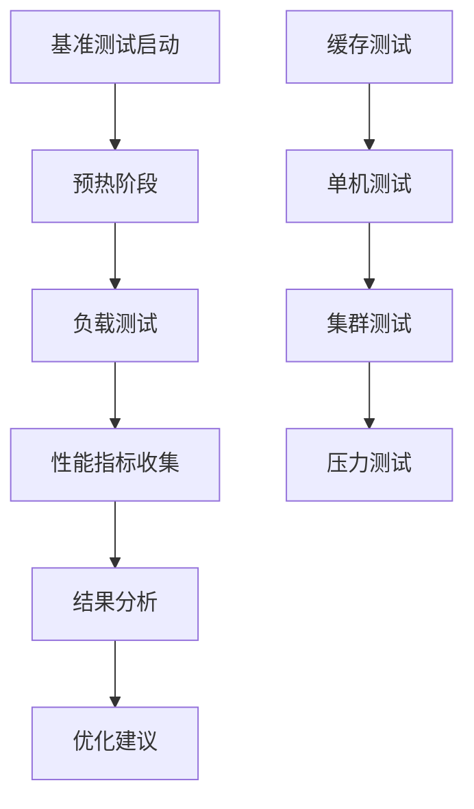

**图表来源**
- [test_advanced.py](file://test/oai/test_advanced.py#L70-L101)

### 测试用例设计

系统包含完整的缓存功能测试：

- **单进程缓存测试**：验证基本缓存功能
- **多进程缓存测试**：测试并发访问
- **嵌入缓存测试**：验证向量缓存
- **错误处理测试**：测试异常情况

**章节来源**
- [test_advanced.py](file://test/oai/test_advanced.py#L0-L161)
- [test_embedding_and_similarity.py](file://test/oai/test_embedding_and_similarity.py#L33-L48)

## 大规模部署配置

### 资源限制配置

针对大规模部署，系统提供了灵活的资源配置选项：

| 配置项 | 推荐值 | 说明 |
|-------|--------|------|
| 最大并发数 | CPU核数×2 | 根据硬件能力调整 |
| 缓存大小限制 | 1GB | 防止内存溢出 |
| 连接超时 | 30秒 | 平衡响应时间和稳定性 |
| 重试次数 | 3次 | 避免无限重试 |

### 请求队列管理

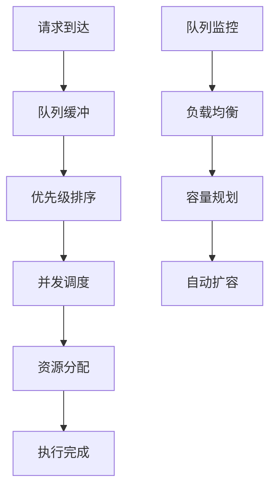

### 自动伸缩策略

系统支持基于负载的自动伸缩：

1. **CPU利用率监控**：当CPU使用率超过80%时触发扩容
2. **内存使用监控**：监控内存使用情况
3. **请求队列长度**：根据队列长度动态调整
4. **响应时间监控**：确保服务质量

**章节来源**
- [conf.py](file://rdagent/core/conf.py#L50-L80)
- [loop.py](file://rdagent/utils/workflow/loop.py#L345-L379)

## 故障排除指南

### 常见问题诊断

| 问题类型 | 症状 | 解决方案 |
|---------|------|----------|
| 缓存失效 | 响应时间增加 | 检查缓存配置和权限 |
| 内存泄漏 | 内存持续增长 | 检查缓存清理机制 |
| 并发冲突 | 数据不一致 | 调整并发限制 |
| 超时错误 | 请求超时 | 增加超时时间或优化网络 |

### 性能调优建议

1. **缓存优化**：
   - 启用适当的缓存功能
   - 定期清理过期缓存
   - 监控缓存命中率

2. **并发优化**：
   - 根据硬件配置调整并发数
   - 使用异步处理提高效率
   - 实施合理的限流策略

3. **网络优化**：
   - 配置合适的超时时间
   - 实施重试机制
   - 监控网络延迟

### 日志分析

系统提供了详细的日志记录功能：

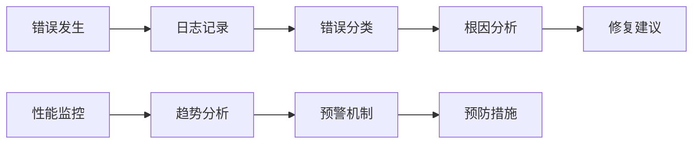

**章节来源**
- [base.py](file://rdagent/oai/backend/base.py#L526-L547)

## 总结

RD-Agent的缓存与性能优化系统提供了全面的解决方案，涵盖了从基础缓存机制到高级性能优化的各个方面。通过合理配置和使用这些功能，可以显著提升系统的性能和成本效益。

### 关键优势

1. **多层次缓存**：聊天、嵌入和会话历史的全面覆盖
2. **智能重试**：自动处理API错误和超时
3. **并发控制**：灵活的并发管理和资源控制
4. **成本优化**：有效的API调用成本控制
5. **可扩展性**：支持大规模部署和自动伸缩

### 最佳实践建议

1. **根据使用模式选择缓存策略**
2. **定期监控和优化性能指标**
3. **实施合理的资源限制**
4. **建立完善的监控和告警机制**
5. **保持配置的灵活性和可调性**

通过深入理解和正确应用这些缓存与性能优化技术，可以构建高效、稳定且经济的LLM应用系统。