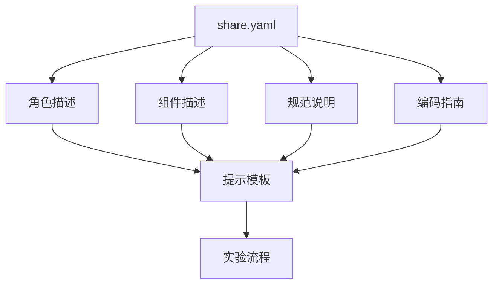
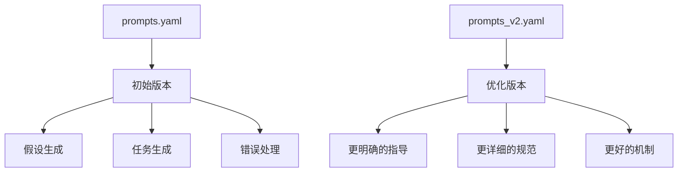
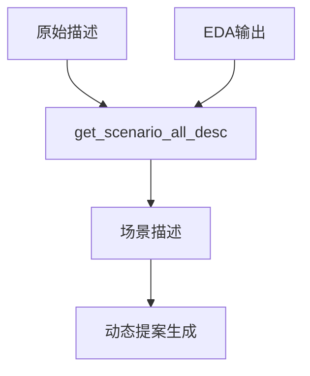
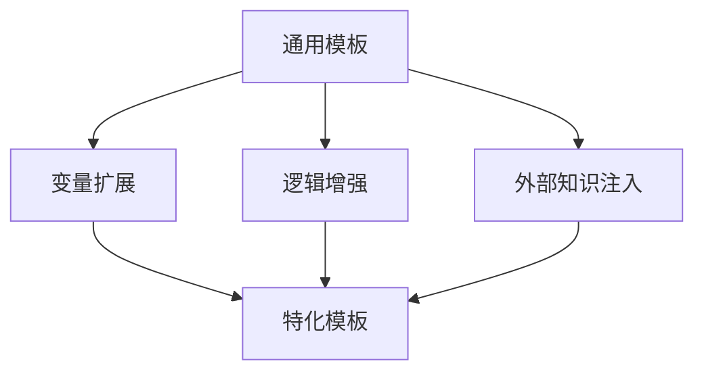
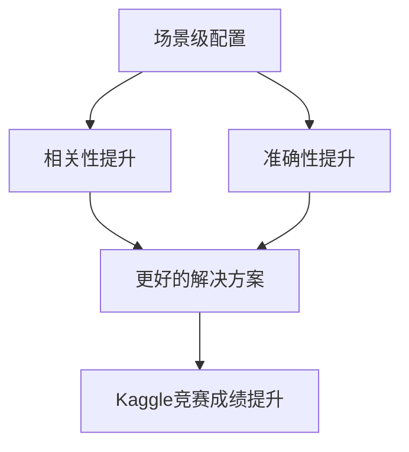

# 场景级模板定制

<cite>
**本文档中引用的文件**  
- [share.yaml](file://rdagent/scenarios/data_science/share.yaml)
- [prompts.yaml](file://rdagent/scenarios/data_science/proposal/exp_gen/prompts.yaml)
- [prompts_v2.yaml](file://rdagent/scenarios/data_science/proposal/exp_gen/prompts_v2.yaml)
- [scen.py](file://rdagent/app/finetune/llm/scen.py)
- [tpl.py](file://rdagent/utils/agent/tpl.py)
</cite>

## 目录
1. [引言](#引言)
2. [共享配置结构与复用机制](#共享配置结构与复用机制)
3. [提示模板演进分析](#提示模板演进分析)
4. [上下文集成与动态提案生成](#上下文集成与动态提案生成)
5. [从通用到特化模板的定制路径](#从通用到特化模板的定制路径)
6. [实际用例与效果提升](#实际用例与效果提升)
7. [结论](#结论)

## 引言
本文档详细说明在具体应用场景中如何对提示模板进行高级定制，以data_science场景为例，解析share.yaml中共享配置的结构及其在多个实验流程中的复用机制。分析proposal/exp_gen目录下prompts.yaml与prompts_v2.yaml的演进关系，说明版本迭代中的优化点与兼容性处理。阐述scen模块中prompts.yaml如何集成上下文信息以支持动态提案生成。提供从通用模板到场景特化模板的定制路径，包括变量扩展、逻辑增强和外部知识注入方法。结合实际用例说明如何通过场景级配置提升LLM输出的相关性与准确性。

## 共享配置结构与复用机制
`share.yaml`文件定义了数据科学场景下的共享配置，包括角色描述、输入路径、缓存路径、组件描述、规范说明和编码指南等。这些配置通过Jinja2模板语法被多个实验流程复用，确保了一致性和可维护性。

**图表来源**
- [share.yaml](file://rdagent/scenarios/data_science/share.yaml)

**本节来源**
- [share.yaml](file://rdagent/scenarios/data_science/share.yaml)

## 提示模板演进分析
`prompts.yaml`与`prompts_v2.yaml`位于`proposal/exp_gen`目录下，代表了提示模板的两个版本。`prompts.yaml`是初始版本，而`prompts_v2.yaml`是经过优化和增强的版本。演进过程中，主要优化点包括更明确的假设生成指导、更详细的任务生成规范以及更好的错误处理机制。

**图表来源**
- [prompts.yaml](file://rdagent/scenarios/data_science/proposal/exp_gen/prompts.yaml)
- [prompts_v2.yaml](file://rdagent/scenarios/data_science/proposal/exp_gen/prompts_v2.yaml)

**本节来源**
- [prompts.yaml](file://rdagent/scenarios/data_science/proposal/exp_gen/prompts.yaml)
- [prompts_v2.yaml](file://rdagent/scenarios/data_science/proposal/exp_gen/prompts_v2.yaml)

## 上下文集成与动态提案生成
`scen.py`模块中的`get_scenario_all_desc`方法通过调用`T(".prompts:scenario_description").r()`来集成上下文信息，支持动态提案生成。该方法接收原始描述和EDA输出，生成包含所有必要信息的场景描述，从而帮助LLM更好地理解当前任务。

**图表来源**
- [scen.py](file://rdagent/app/finetune/llm/scen.py)

**本节来源**
- [scen.py](file://rdagent/app/finetune/llm/scen.py)

## 从通用到特化模板的定制路径
从通用模板到场景特化模板的定制路径包括变量扩展、逻辑增强和外部知识注入。变量扩展允许在模板中使用动态变量，逻辑增强通过条件语句和循环提高模板的灵活性，外部知识注入则通过引入领域特定的知识来提升模板的专业性。

**图表来源**
- [tpl.py](file://rdagent/utils/agent/tpl.py)

**本节来源**
- [tpl.py](file://rdagent/utils/agent/tpl.py)

## 实际用例与效果提升
结合实际用例，通过场景级配置可以显著提升LLM输出的相关性与准确性。例如，在一个Kaggle竞赛中，通过定制化的提示模板，模型能够更准确地识别关键挑战并提出有效的解决方案，从而在排行榜上取得更好的成绩。

**图表来源**
- [share.yaml](file://rdagent/scenarios/data_science/share.yaml)
- [prompts_v2.yaml](file://rdagent/scenarios/data_science/proposal/exp_gen/prompts_v2.yaml)

**本节来源**
- [share.yaml](file://rdagent/scenarios/data_science/share.yaml)
- [prompts_v2.yaml](file://rdagent/scenarios/data_science/proposal/exp_gen/prompts_v2.yaml)

## 结论
通过对提示模板的高级定制，可以在具体应用场景中显著提升LLM的性能。`share.yaml`中的共享配置为多个实验流程提供了统一的基础，`prompts.yaml`与`prompts_v2.yaml`的演进展示了模板优化的过程，`scen.py`模块中的上下文集成支持了动态提案生成，而从通用到特化模板的定制路径则为提升LLM输出的相关性与准确性提供了有效的方法。