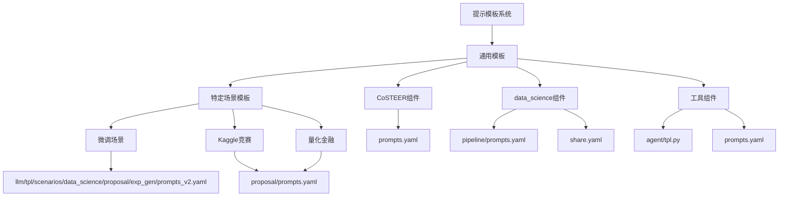
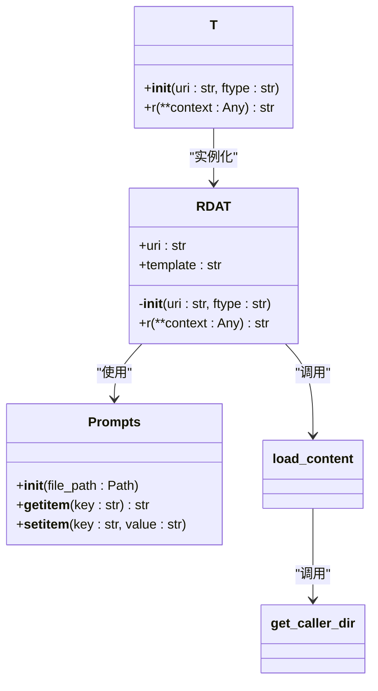
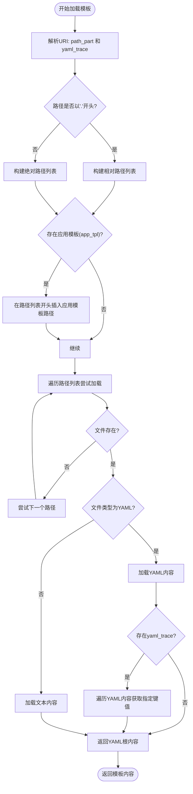
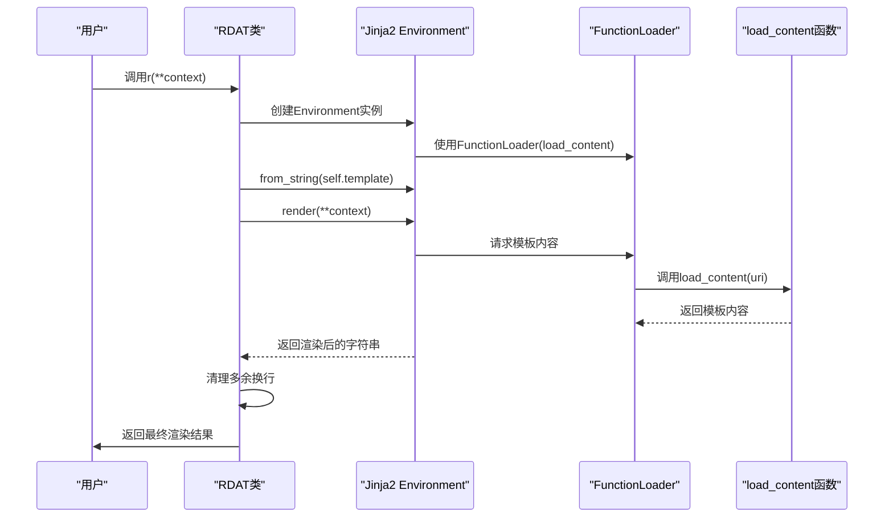
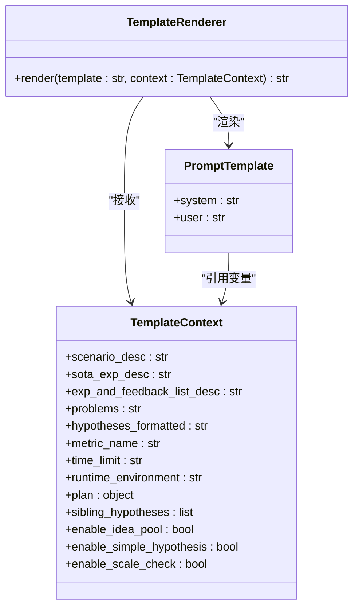
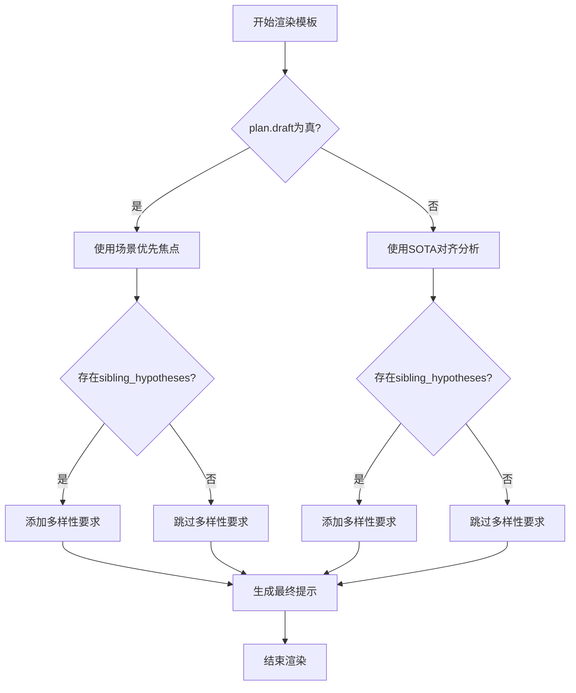
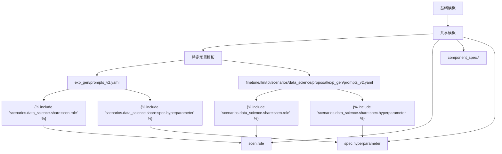
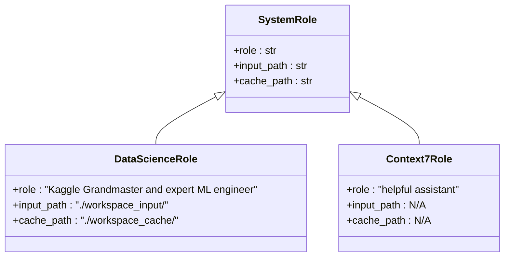
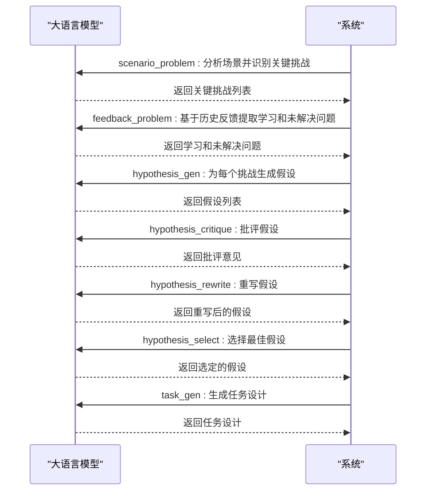
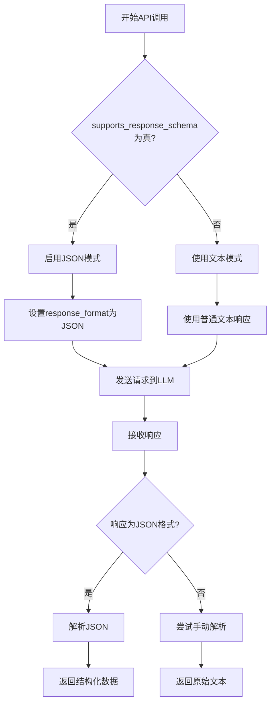

# 提示模板管理

<cite>
**本文档引用的文件**   
- [conf.py](file://rdagent/app/data_science/conf.py)
- [prompts.yaml](file://rdagent/components/coder/CoSTEER/prompts.yaml)
- [prompts.yaml](file://rdagent/app/finetune/llm/prompts.yaml)
- [prompts.py](file://rdagent/core/prompts.py)
- [prompts.yaml](file://rdagent/utils/prompts.yaml)
- [prompts_v2.yaml](file://rdagent/scenarios/data_science/proposal/exp_gen/prompts_v2.yaml)
- [prompts.yaml](file://rdagent/components/coder/data_science/pipeline/prompts.yaml)
- [tpl.py](file://rdagent/utils/agent/tpl.py)
- [share.yaml](file://rdagent/scenarios/data_science/share.yaml)
- [prompts.yaml](file://rdagent/scenarios/data_science/scen/prompts.yaml)
- [prompts.yaml](file://rdagent/components/agent/context7/prompts.yaml)
</cite>

## 目录
1. [介绍](#介绍)
2. [项目结构](#项目结构)
3. [核心组件](#核心组件)
4. [架构概述](#架构概述)
5. [详细组件分析](#详细组件分析)
6. [依赖分析](#依赖分析)
7. [性能考虑](#性能考虑)
8. [故障排除指南](#故障排除指南)
9. [结论](#结论)
10. [附录](#附录)（如有必要）

## 介绍
本文档全面解析提示模板的组织结构与管理机制。我们将深入探讨YAML格式提示模板的目录布局，展示不同组件（如CoSTEER、data_science）如何组织其专属提示文件。文档将详细解释模板变量注入机制和条件逻辑使用方法，提供多层级模板继承与覆盖的示例，说明如何在场景特定配置中定制通用提示。此外，我们将分析提示工程的最佳实践，包括系统角色设置(system_prompt_role)、思维链提示(think标签处理)和响应模式控制(enable_response_schema)，并包含模板调试技巧和版本管理建议。

## 项目结构
提示模板系统采用分层的目录结构，将通用模板与特定场景模板分离，实现代码复用和灵活定制。系统通过YAML文件存储提示模板，并利用Jinja2模板引擎实现动态内容注入和条件逻辑处理。



**Diagram sources**
- [prompts.yaml](file://rdagent/components/coder/CoSTEER/prompts.yaml)
- [prompts.yaml](file://rdagent/components/coder/data_science/pipeline/prompts.yaml)
- [share.yaml](file://rdagent/scenarios/data_science/share.yaml)
- [tpl.py](file://rdagent/utils/agent/tpl.py)
- [prompts_v2.yaml](file://rdagent/scenarios/data_science/proposal/exp_gen/prompts_v2.yaml)

**Section sources**
- [prompts.yaml](file://rdagent/components/coder/CoSTEER/prompts.yaml)
- [prompts.yaml](file://rdagent/components/coder/data_science/pipeline/prompts.yaml)
- [share.yaml](file://rdagent/scenarios/data_science/share.yaml)

## 核心组件
提示模板系统的核心组件包括模板加载器(T)、模板渲染引擎和配置管理系统。模板加载器负责从文件系统中加载YAML模板，支持相对路径和绝对路径引用，并实现了模板继承和覆盖机制。模板渲染引擎基于Jinja2，支持变量注入、条件逻辑和模板包含功能。配置管理系统通过Pydantic设置模型管理全局配置，允许通过环境变量覆盖默认设置。

**Section sources**
- [tpl.py](file://rdagent/utils/agent/tpl.py)
- [conf.py](file://rdagent/app/data_science/conf.py)
- [prompts.py](file://rdagent/core/prompts.py)

## 架构概述
提示模板系统采用分层架构，从底层的模板加载到上层的模板渲染，形成完整的提示管理解决方案。系统通过RDAT类封装模板操作，提供简洁的API接口。模板继承机制允许特定场景覆盖通用模板，实现灵活的配置管理。



**Diagram sources**
- [tpl.py](file://rdagent/utils/agent/tpl.py#L120-L147)
- [prompts.py](file://rdagent/core/prompts.py#L0-L20)

## 详细组件分析
### 模板加载与渲染机制
提示模板系统的核心是模板加载与渲染机制，它通过`tpl.py`文件中的`RDAT`类实现。该类提供了一个简洁的接口来加载和渲染模板，支持YAML和文本格式的模板文件。

#### 模板加载机制
模板加载器`load_content`函数实现了复杂的文件路径解析和加载优先级逻辑。它支持多种URI格式，包括相对路径和绝对路径引用，并考虑了应用模板覆盖的场景。



**Diagram sources**
- [tpl.py](file://rdagent/utils/agent/tpl.py#L41-L96)

#### 模板渲染机制
模板渲染通过`RDAT`类的`r`方法实现，该方法使用Jinja2的`Environment`和`FunctionLoader`来支持``语法，允许在一个模板中包含另一个模板的内容。



**Diagram sources**
- [tpl.py](file://rdagent/utils/agent/tpl.py#L120-L147)

### 模板变量注入与条件逻辑
提示模板系统充分利用Jinja2模板引擎的强大功能，支持复杂的变量注入和条件逻辑处理，使得模板能够根据运行时上下文动态生成内容。

#### 变量注入机制
系统通过`r`方法的`**context`参数接收上下文变量，并将其注入到模板中。这些变量可以是简单的字符串，也可以是复杂的嵌套对象。



**Diagram sources**
- [prompts_v2.yaml](file://rdagent/scenarios/data_science/proposal/exp_gen/prompts_v2.yaml#L0-L799)

#### 条件逻辑处理
模板中的条件逻辑通过Jinja2的``、``和``语法实现，允许根据不同的配置选项或运行时状态生成不同的提示内容。



**Diagram sources**
- [prompts_v2.yaml](file://rdagent/scenarios/data_science/proposal/exp_gen/prompts_v2.yaml#L0-L799)

### 多层级模板继承与覆盖
系统实现了多层级的模板继承与覆盖机制，允许特定场景的模板覆盖通用模板，同时保持代码的可维护性和可扩展性。

#### 模板继承示例
以数据科学场景的提示模板为例，系统通过``语法实现了模板继承，允许在特定模板中复用通用模板的内容。



**Diagram sources**
- [prompts_v2.yaml](file://rdagent/scenarios/data_science/proposal/exp_gen/prompts_v2.yaml#L0-L799)
- [prompts_v2.yaml](file://rdagent/app/finetune/llm/tpl/scenarios/data_science/proposal/exp_gen/prompts_v2.yaml#L0-L82)

### 提示工程最佳实践
#### 系统角色设置
系统通过`scen.role`模板定义了统一的系统角色，确保所有提示都以一致的身份和专业水平进行响应。



**Diagram sources**
- [share.yaml](file://rdagent/scenarios/data_science/share.yaml#L0-L380)
- [prompts.yaml](file://rdagent/components/agent/context7/prompts.yaml#L0-L59)

#### 思维链提示
系统通过分阶段的提示设计实现了思维链(Chain-of-Thought)提示，引导模型逐步完成复杂的分析任务。



**Diagram sources**
- [prompts_v2.yaml](file://rdagent/scenarios/data_science/proposal/exp_gen/prompts_v2.yaml#L0-L799)

#### 响应模式控制
系统通过`enable_response_schema`配置项控制是否启用结构化响应模式，确保模型输出符合预期的JSON格式。



**Diagram sources**
- [draft.py](file://rdagent/scenarios/data_science/proposal/exp_gen/draft/draft.py#L134-L166)

## 依赖分析
提示模板系统依赖于多个核心组件和第三方库，形成了一个复杂的依赖网络。系统通过清晰的模块划分和接口定义，降低了组件间的耦合度。

```mermaid
graph TD
Prompts[prompts.py] --> YAML[yaml]
Prompts --> Path[Path]
Tpl[tpl.py] --> Jinja2[jinja2]
Tpl --> YAML
Tpl --> Inspect[inspect]
Tpl --> RD_AGENT_SETTINGS[RD_AGENT_SETTINGS]
Tpl --> logger[rdagent_logger]
Tpl --> Prompts : "使用"
Prompts --> Tpl : "被引用"
DataScienceConf[conf.py] --> SettingsConfigDict[SettingsConfigDict]
DataScienceConf --> KaggleBasePropSetting[KaggleBasePropSetting]
DataScienceConf --> DS_RD_SETTING[DS_RD_SETTING]
DataScienceConf --> Tpl : "使用T类"
DataScienceConf --> Prompts : "使用Prompts类"
PromptsV2[prompts_v2.yaml] --> Share[share.yaml]
PromptsV2 --> Scen[scen.prompts.yaml]
PromptsV2 --> ComponentSpec[component_spec.*]
PipelinePrompts[pipeline/prompts.yaml] --> Share
PipelinePrompts --> Spec[spec.*]
PipelinePrompts --> Guidelines[guidelines.*]
```

**Diagram sources**
- [prompts.py](file://rdagent/core/prompts.py#L0-L20)
- [tpl.py](file://rdagent/utils/agent/tpl.py#L0-L148)
- [conf.py](file://rdagent/app/data_science/conf.py#L0-L206)

**Section sources**
- [prompts.py](file://rdagent/core/prompts.py#L0-L20)
- [tpl.py](file://rdagent/utils/agent/tpl.py#L0-L148)
- [conf.py](file://rdagent/app/data_science/conf.py#L0-L206)

## 性能考虑
提示模板系统的性能主要受模板加载和渲染速度的影响。系统通过缓存机制和高效的文件I/O操作优化了性能表现。

1. **模板缓存**：系统通过`SingletonBaseClass`实现模板的单例模式，避免重复加载和解析相同的模板文件。
2. **文件I/O优化**：模板加载器优先尝试高优先级路径，减少不必要的文件系统访问。
3. **内存管理**：系统在加载YAML文件时使用流式解析，避免一次性加载大文件导致内存溢出。
4. **渲染效率**：Jinja2模板引擎经过优化，能够快速处理复杂的模板逻辑和大量变量注入。

## 故障排除指南
### 常见问题及解决方案
1. **模板文件找不到**
   - 检查文件路径是否正确，特别是相对路径和绝对路径的区别
   - 确认`RD_AGENT_SETTINGS.app_tpl`配置是否正确设置了应用模板路径
   - 验证文件扩展名是否匹配（.yaml或.txt）

2. **变量注入失败**
   - 检查上下文变量名称是否与模板中的变量名称完全匹配
   - 确认变量类型是否正确，特别是嵌套对象的属性访问
   - 验证Jinja2模板语法是否正确，特别是`{{ }}`和``的使用

3. **条件逻辑不生效**
   - 检查条件表达式中的变量是否已正确定义
   - 确认布尔值的传递是否正确，特别是在YAML配置中
   - 验证Jinja2语法是否正确，特别是``、``和``的配对

4. **模板继承失败**
   - 检查``语句中的URI格式是否正确
   - 确认被包含的模板文件是否存在且可访问
   - 验证模板路径是否在搜索路径列表中

**Section sources**
- [tpl.py](file://rdagent/utils/agent/tpl.py#L0-L148)
- [prompts.py](file://rdagent/core/prompts.py#L0-L20)

## 结论
提示模板管理系统通过分层的目录结构、灵活的模板继承机制和强大的变量注入功能，为复杂的AI应用提供了可靠的提示管理解决方案。系统采用YAML格式存储模板，结合Jinja2模板引擎实现动态内容生成，支持条件逻辑和模板包含等高级功能。通过单例模式和高效的文件I/O操作，系统在保证功能丰富性的同时也注重性能优化。该系统的设计模式可为其他类似的提示工程项目提供有价值的参考。