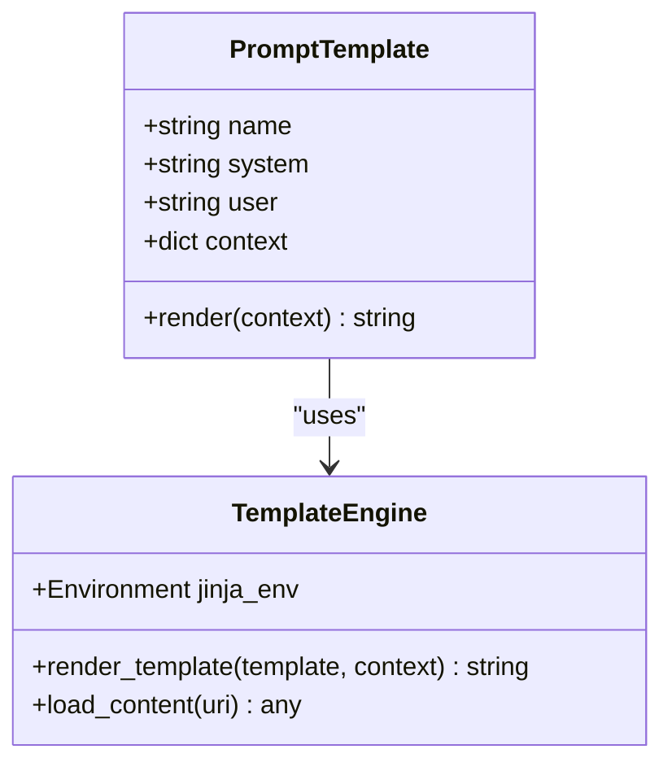
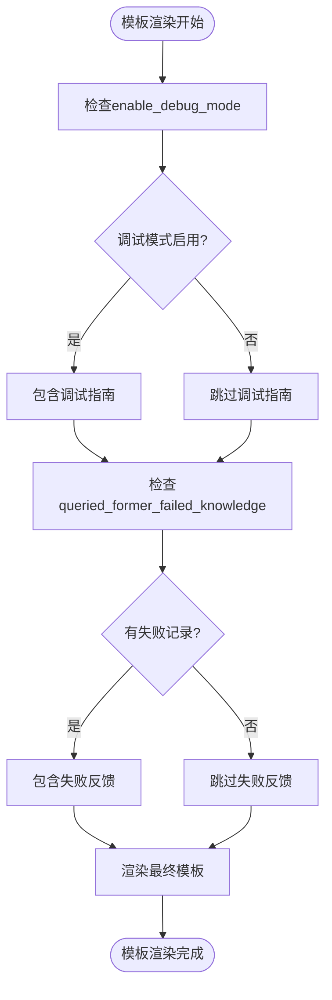
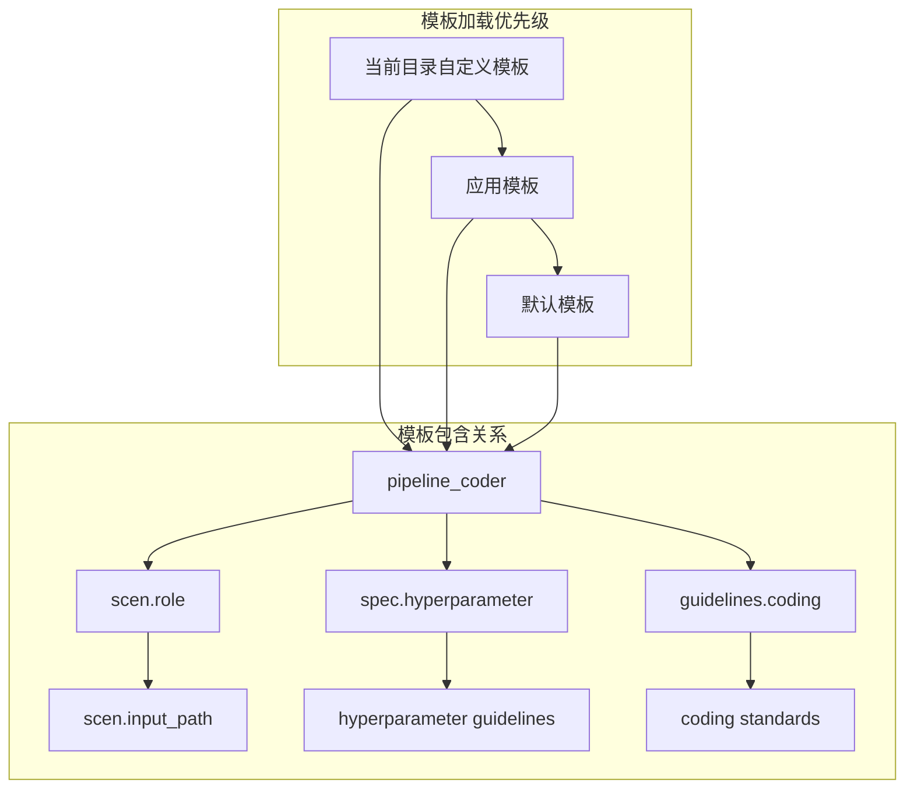
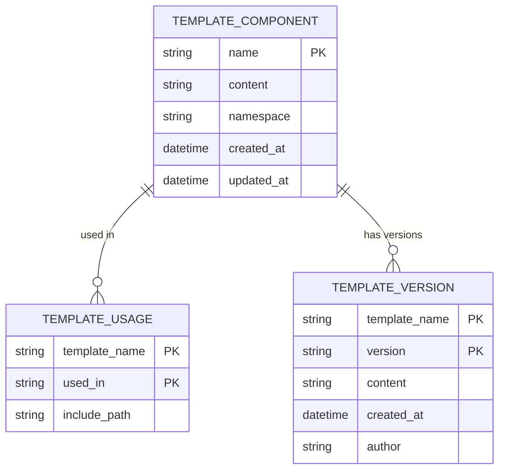

# 模板结构与语法

<cite>
**本文档中引用的文件**
- [prompts.yaml](file://rdagent/components/coder/CoSTEER/prompts.yaml)
- [tpl.py](file://rdagent/utils/agent/tpl.py)
- [pipeline\prompts.yaml](file://rdagent/components/coder/data_science/pipeline/prompts.yaml)
- [prompts_v2.yaml](file://rdagent/scenarios/data_science/proposal/exp_gen/prompts_v2.yaml)
- [share\prompts.yaml](file://rdagent/components/coder/data_science/share/prompts.yaml)
- [utils\prompts.yaml](file://rdagent/app/utils/prompts.yaml)
</cite>

## 目录
1. [引言](#引言)
2. [YAML模板核心字段解析](#yaml模板核心字段解析)
3. [变量注入与条件逻辑](#变量注入与条件逻辑)
4. [多层级模板继承机制](#多层级模板继承机制)
5. [模板调试与版本控制](#模板调试与版本控制)
6. [可复用模板体系构建](#可复用模板体系构建)

## 引言

本文档深入解析CoSTEER框架中YAML格式提示模板的语法结构与组织规范。通过分析框架中的prompts.yaml文件，详细说明模板文件中system_prompt_role、think、enable_response_schema等核心字段的语义与作用机制，展示变量注入（如{{variable}}）和条件逻辑（if/else）的使用方法。同时，解释多层级模板继承机制与覆盖优先级规则，包括全局默认值、组件级定制和场景级特化。最后，提供模板调试技巧和版本控制策略以支持团队协作。

**Section sources**
- [prompts.yaml](file://rdagent/components/coder/CoSTEER/prompts.yaml#L1-L10)
- [pipeline\prompts.yaml](file://rdagent/components/coder/data_science/pipeline/prompts.yaml#L1-L50)

## YAML模板核心字段解析

YAML模板中的核心字段定义了提示的结构和行为。`system_prompt_role`字段用于定义系统提示的角色和背景，`think`字段控制是否启用思维链推理，`enable_response_schema`字段则指定是否启用结构化响应模式。

在CoSTEER框架中，这些字段通过Jinja2模板引擎进行处理，支持复杂的条件逻辑和变量替换。例如，在`pipeline_coder`模板中，`system`字段包含了详细的编码指导，通过条件语句控制是否包含调试模式或模型转储指南。

**Diagram sources**
- [pipeline\prompts.yaml](file://rdagent/components/coder/data_science/pipeline/prompts.yaml#L1-L348)
- [tpl.py](file://rdagent/utils/agent/tpl.py#L1-L148)

**Section sources**
- [pipeline\prompts.yaml](file://rdagent/components/coder/data_science/pipeline/prompts.yaml#L1-L348)
- [tpl.py](file://rdagent/utils/agent/tpl.py#L1-L148)

## 变量注入与条件逻辑

模板系统支持通过`{{variable}}`语法进行变量注入，允许在运行时动态替换内容。条件逻辑通过Jinja2的``语法实现，可以根据上下文动态包含或排除模板片段。

例如，在`pipeline_coder`模板中，当`enable_debug_mode`为真时，会包含调试模式的特殊指导；当`queried_former_failed_knowledge`不为空时，会包含先前失败尝试的反馈信息。这种机制使得模板能够根据不同的上下文生成针对性的提示。

**Diagram sources**
- [pipeline\prompts.yaml](file://rdagent/components/coder/data_science/pipeline/prompts.yaml#L1-L348)
- [tpl.py](file://rdagent/utils/agent/tpl.py#L1-L148)

**Section sources**
- [pipeline\prompts.yaml](file://rdagent/components/coder/data_science/pipeline/prompts.yaml#L1-L348)
- [tpl.py](file://rdagent/utils/agent/tpl.py#L1-L148)

## 多层级模板继承机制

CoSTEER框架实现了多层级模板继承机制，通过``语法实现模板的模块化和复用。模板加载遵循特定的优先级顺序：当前目录的自定义模板 > 应用模板 > 默认模板。

在`tpl.py`文件中，`load_content`函数实现了这一机制，支持从多个可能的路径加载模板内容。这种设计允许开发者在不同层级上定制模板，同时保持核心功能的统一性。

**Diagram sources**
- [tpl.py](file://rdagent/utils/agent/tpl.py#L1-L148)
- [pipeline\prompts.yaml](file://rdagent/components/coder/data_science/pipeline/prompts.yaml#L1-L348)

**Section sources**
- [tpl.py](file://rdagent/utils/agent/tpl.py#L1-L148)
- [pipeline\prompts.yaml](file://rdagent/components/coder/data_science/pipeline/prompts.yaml#L1-L348)

## 模板调试与版本控制

模板调试可以通过日志输出验证渲染结果，`tpl.py`中的`RDAT`类会记录模板渲染的详细信息，包括原始模板、上下文和渲染结果。此外，可以使用YAML语法检查工具确保模板格式正确。

版本控制策略建议使用Git等工具管理模板文件，通过分支和标签管理不同版本的模板。团队协作时，应建立模板审查流程，确保模板变更经过充分测试和验证。

**Section sources**
- [tpl.py](file://rdagent/utils/agent/tpl.py#L1-L148)
- [utils\prompts.yaml](file://rdagent/app/utils/prompts.yaml#L1-L120)

## 可复用模板体系构建

构建可复用的模板体系需要遵循模块化设计原则，将通用功能提取为独立的模板片段。通过``语法在不同模板中复用这些片段，可以减少重复代码，提高维护效率。

例如，`scenarios.data_science.share`命名空间下的模板片段被多个组件共享，包括角色定义、编码指南和超参数规范。这种设计使得修改一个共享片段就能影响所有使用它的模板，确保了一致性和可维护性。

**Diagram sources**
- [share\prompts.yaml](file://rdagent/components/coder/data_science/share/prompts.yaml#L1-L124)
- [pipeline\prompts.yaml](file://rdagent/components/coder/data_science/pipeline/prompts.yaml#L1-L348)

**Section sources**
- [share\prompts.yaml](file://rdagent/components/coder/data_science/share/prompts.yaml#L1-L124)
- [pipeline\prompts.yaml](file://rdagent/components/coder/data_science/pipeline/prompts.yaml#L1-L348)