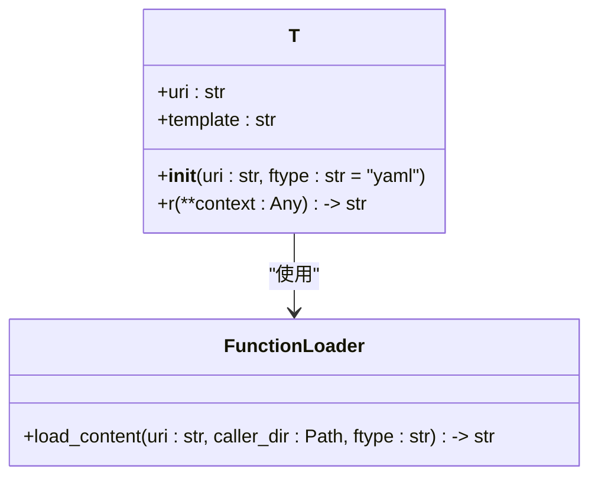
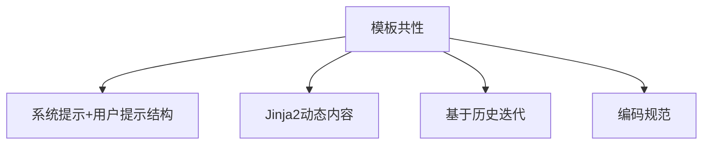

# 组件级模板实现

<cite>
**本文档中引用的文件**   
- [ensemble\prompts.yaml](file://rdagent/components/coder/data_science/ensemble/prompts.yaml)
- [feature\prompts.yaml](file://rdagent/components/coder/data_science/feature/prompts.yaml)
- [model\prompts.yaml](file://rdagent/components/coder/data_science/model/prompts.yaml)
- [pipeline\prompts.yaml](file://rdagent/components/coder/data_science/pipeline/prompts.yaml)
- [raw_data_loader\prompts.yaml](file://rdagent/components/coder/data_science/raw_data_loader/prompts.yaml)
- [factor_coder\prompts.yaml](file://rdagent/components/coder/factor_coder/prompts.yaml)
- [model_coder\prompts.yaml](file://rdagent/components/coder/model_coder/prompts.yaml)
- [share\prompts.yaml](file://rdagent/components/coder/data_science/share/prompts.yaml)
- [conf.py](file://rdagent/components/coder/data_science/conf.py)
- [utils.py](file://rdagent/components/coder/data_science/utils.py)
- [tpl.py](file://rdagent/utils/agent/tpl.py)
- [exp.py](file://rdagent/components/coder/data_science/model/exp.py)
- [__init__.py](file://rdagent/components/coder/factor_coder/__init__.py)
- [__init__.py](file://rdagent/components/coder/model_coder/__init__.py)
</cite>

## 目录
1. [引言](#引言)
2. [data_science模块模板结构分析](#data_science模块模板结构分析)
3. [factor_coder与model_coder模板设计逻辑](#factor_coder与model_coder模板设计逻辑)
4. [模板加载与渲染机制](#模板加载与渲染机制)
5. [组件间模板共性与差异](#组件间模板共性与差异)
6. [最佳实践指南](#最佳实践指南)
7. [结论](#结论)

## 引言
本文档系统阐述了RD-Agent项目中各功能组件提示模板的具体实现方式。重点分析data_science模块下ensemble、feature、model等子组件的prompts.yaml文件结构，说明其如何针对特定任务定制提示内容。详细描述factor_coder与model_coder中模板的设计逻辑，包括输入输出格式约定、领域术语使用和LLM行为引导策略。结合代码实例展示coder组件如何加载并渲染这些模板，以及模板参数如何与运行时上下文动态绑定。讨论组件间模板的共性与差异，提炼可复用设计模式，并提供新增组件时模板创建的最佳实践指南。

## data_science模块模板结构分析

### ensemble组件模板结构
ensemble组件的模板定义在`rdagent/components/coder/data_science/ensemble/prompts.yaml`文件中，包含`ensemble_coder`和`ensemble_eval`两个主要模板。`ensemble_coder`模板用于指导LLM生成集成模型代码，其系统提示（system prompt）包含任务描述、竞赛信息、相关知识（包括成功实现和失败尝试）、编码指南和输出格式要求。模板使用Jinja2语法动态插入上下文变量，如`{{ task_desc }}`、`{{ competition_info }}`和`{{ all_code }}`。用户提示（user prompt）部分包含代码规范、先前代码和反馈信息，引导LLM基于历史信息进行迭代改进。

**Section sources**
- [ensemble\prompts.yaml](file://rdagent/components/coder/data_science/ensemble/prompts.yaml#L1-L125)

### feature组件模板结构
feature组件的模板定义在`rdagent/components/coder/data_science/feature/prompts.yaml`文件中，包含`feature_coder`和`feature_eval`两个模板。`feature_coder`模板的系统提示部分除了包含通用的任务描述和竞赛信息外，还特别强调了特征工程的注意事项，如避免随意删除列、输入数据来自数据加载器的输出、使用joblib缓存结果等。模板中使用``语法包含共享的编码指南，实现了模板内容的复用。用户提示部分与ensemble组件类似，提供代码规范和历史迭代信息。

**Section sources**
- [feature\prompts.yaml](file://rdagent/components/coder/data_science/feature/prompts.yaml#L1-L132)

### model组件模板结构
model组件的模板定义在`rdagent/components/coder/data_science/model/prompts.yaml`文件中，包含`model_coder`、`model_eval`和`model_eval_rm`三个模板。`model_coder`模板的系统提示部分特别强调了模型输入来自特征工程函数的输出，并提供了数据加载器和特征工程代码作为上下文。模板还包含PyTorch优先于TensorFlow的指导原则和使用joblib缓存的建议。`model_eval`模板的评估标准更为严格，要求模型必须正确处理超参数，包括早停轮次的使用，并且模型输出形状必须严格匹配规范要求。

**Section sources**
- [model\prompts.yaml](file://rdagent/components/coder/data_science/model/prompts.yaml#L1-L187)

### pipeline组件模板结构
pipeline组件的模板定义在`rdagent/components/coder/data_science/pipeline/prompts.yaml`文件中，是所有data_science组件中最复杂的模板。它不仅包含代码生成和评估模板，还包含了调试模式、模型转储等高级功能的指导。模板详细规定了工作流的各个阶段，包括数据加载、探索性数据分析（EDA）、模型训练等。特别值得注意的是，模板中包含了对调试模式的详细指导，要求代码在调试模式下采样10%的数据并运行最少的epoch，同时记录调试时间和估计的完整运行时间。

**Section sources**
- [pipeline\prompts.yaml](file://rdagent/components/coder/data_science/pipeline/prompts.yaml#L1-L348)

## factor_coder与model_coder模板设计逻辑

### factor_coder模板设计
factor_coder的模板定义在`rdagent/components/coder/factor_coder/prompts.yaml`文件中，包含多个评估和演化策略模板。这些模板的设计逻辑体现了对量化因子开发的深刻理解。例如，`evolving_strategy_factor_implementation_v1_system`模板要求LLM基于先前的失败尝试和反馈来改进代码，强调"不要修改正确部分的代码"。`evaluator_code_feedback_v1_system`模板则专注于检查代码是否与因子和场景一致，特别强调不向用户泄露真实代码，而是提供清晰的改进建议。模板中使用了`{{ factor_information }}`、`{{ code }}`和`{{ execution_feedback }}`等变量，实现了对因子开发过程的精细化控制。

**Section sources**
- [factor_coder\prompts.yaml](file://rdagent/components/coder/factor_coder/prompts.yaml#L1-L210)

### model_coder模板设计
model_coder的模板定义在`rdagent/components/model_coder/prompts.yaml`文件中，包含`extract_model_formulation_system`、`evolving_strategy_model_coder`和`evaluator_code_feedback`等模板。`extract_model_formulation_system`模板要求LLM从论文中提取模型公式、架构和变量定义，并以特定的JSON格式输出，体现了对学术研究的严谨性。`evolving_strategy_model_coder`模板的设计逻辑与factor_coder类似，要求LLM基于先前的失败尝试和成功实现来改进模型代码。特别值得注意的是，当存在先前代码时，模板明确要求"新代码应与先前代码90%以上相同"，这体现了对渐进式改进的重视。

**Section sources**
- [model_coder\prompts.yaml](file://rdagent/components/coder/model_coder/prompts.yaml#L1-L156)

## 模板加载与渲染机制

### 模板加载机制
系统使用`rdagent/utils/agent/tpl.py`文件中的`T`类来加载和渲染模板。`T`类的构造函数通过`load_content`函数根据URI加载模板内容，支持多种加载方式，包括从相对路径、调用者目录或项目包目录加载。URI的格式遵循特定的约定，如`a.b.c`表示从`a/b/c.yaml`加载，`.c:x.y.z`表示从调用者目录的`c.yaml`文件中加载`x.y.z`键的值。这种设计实现了模板的灵活组织和复用。

**Diagram sources **
- [tpl.py](file://rdagent/utils/agent/tpl.py#L95-L124)

### 模板渲染机制
模板渲染通过`T`类的`r`方法实现，该方法使用Jinja2环境将模板字符串与上下文变量结合。渲染过程中，系统会记录模板URI、原始模板、上下文和渲染结果，便于调试和追踪。`r`方法使用`StrictUndefined`作为未定义变量的处理方式，确保在变量缺失时抛出异常，提高了模板的健壮性。渲染后的结果会去除多余的空行，保证输出的整洁性。

**Section sources**
- [tpl.py](file://rdagent/utils/agent/tpl.py#L120-L147)

### 运行时上下文绑定
模板参数与运行时上下文的动态绑定通过`r`方法的`**context`参数实现。在实际使用中，如`model_coder/one_shot/__init__.py`中的`ModelCodeWriter`类，通过调用`T(".prompts:code_implement_user").r()`并传入具体的上下文变量（如`name`、`description`、`formulation`等）来渲染模板。这种设计实现了模板的通用性和具体任务的定制化之间的平衡，使得同一模板可以应用于不同的模型实现任务。

**Section sources**
- [__init__.py](file://rdagent/components/coder/model_coder/one_shot/__init__.py#L1-L34)

## 组件间模板共性与差异

### 模板共性分析
各组件的模板设计体现了高度的一致性。首先，所有模板都遵循"系统提示+用户提示"的基本结构，系统提示提供任务背景和指导原则，用户提示提供具体任务信息和历史迭代数据。其次，模板都使用Jinja2语法实现动态内容插入，支持条件判断和循环等高级功能。再次，模板都强调基于历史信息的迭代改进，通过提供先前的失败尝试和反馈来引导LLM进行有针对性的优化。最后，模板都注重代码质量和可维护性，包含避免使用日志模块、使用print函数输出等编码规范。

**Diagram sources **
- [ensemble\prompts.yaml](file://rdagent/components/coder/data_science/ensemble/prompts.yaml)
- [feature\prompts.yaml](file://rdagent/components/coder/data_science/feature/prompts.yaml)
- [model\prompts.yaml](file://rdagent/components/coder/data_science/model/prompts.yaml)

### 模板差异分析
尽管存在共性，各组件的模板也体现了针对特定任务的差异化设计。ensemble组件的模板特别关注集成策略和模型间的关系，要求LLM考虑多个模型的预测结果。feature组件的模板强调特征工程的注意事项，如避免数据泄露和合理处理缺失值。model组件的模板则更关注模型架构和超参数优化，提供了PyTorch优先的指导原则。factor_coder和model_coder的模板最为复杂，包含了多个评估和演化策略模板，体现了对量化因子和模型开发的精细化控制需求。

**Section sources**
- [ensemble\prompts.yaml](file://rdagent/components/coder/data_science/ensemble/prompts.yaml)
- [feature\prompts.yaml](file://rdagent/components/coder/data_science/feature/prompts.yaml)
- [model\prompts.yaml](file://rdagent/components/coder/data_science/model/prompts.yaml)
- [factor_coder\prompts.yaml](file://rdagent/components/coder/factor_coder/prompts.yaml)
- [model_coder\prompts.yaml](file://rdagent/components/coder/model_coder/prompts.yaml)

## 最佳实践指南

### 新增组件模板创建
创建新增组件的模板时，应遵循以下最佳实践：首先，继承已有的模板结构，使用"系统提示+用户提示"的基本模式；其次，充分利用Jinja2的模板继承和包含功能，通过``语法复用共享的编码指南和评估标准；再次，针对组件的特定需求设计独特的指导原则，如feature组件对数据泄露的防范；最后，确保模板的可维护性，通过清晰的变量命名和结构化的内容组织提高模板的可读性。

### 模板设计原则
模板设计应遵循以下原则：明确性原则，确保指导原则具体、可操作，避免模糊的表述；一致性原则，保持与项目整体风格和规范的一致；可扩展性原则，设计易于扩展和修改的模板结构；安全性原则，避免在模板中暴露敏感信息或真实代码。此外，应充分利用模板的条件判断和循环功能，实现对复杂逻辑的精确控制。

### 模板维护策略
模板维护应建立版本控制机制，记录每次修改的原因和影响。建议定期审查模板的有效性，根据实际使用反馈进行优化。对于共享的模板内容，应建立专门的共享目录（如`scenarios.data_science.share`），便于统一管理和更新。在修改模板时，应充分考虑对现有组件的影响，避免引入破坏性变更。

## 结论
本文档系统分析了RD-Agent项目中各功能组件提示模板的实现方式。通过分析data_science模块下ensemble、feature、model等子组件的prompts.yaml文件结构，揭示了模板如何针对特定任务定制提示内容。详细阐述了factor_coder与model_coder中模板的设计逻辑，包括输入输出格式约定、领域术语使用和LLM行为引导策略。展示了coder组件如何通过`T`类加载并渲染模板，以及模板参数如何与运行时上下文动态绑定。总结了组件间模板的共性与差异，提炼出可复用的设计模式，并提供了新增组件时模板创建的最佳实践指南。这些分析为理解和优化RD-Agent的提示工程提供了全面的参考。