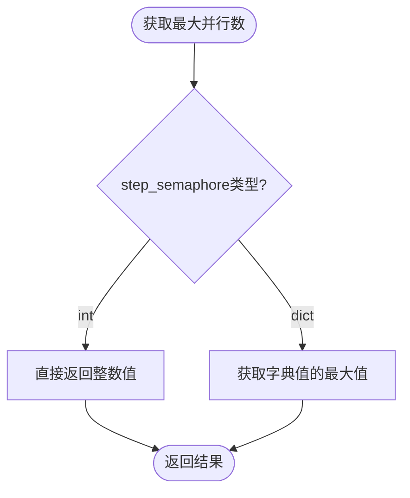

# 核心配置

<cite>
**本文档引用的文件**
- [rdagent/core/conf.py](file://rdagent/core/conf.py)
- [rdagent/log/conf.py](file://rdagent/log/conf.py)
- [rdagent/app/data_science/conf.py](file://rdagent/app/data_science/conf.py)
- [rdagent/app/kaggle/conf.py](file://rdagent/app/kaggle/conf.py)
- [rdagent/app/finetune/data_science/conf.py](file://rdagent/app/finetune/data_science/conf.py)
- [rdagent/utils/agent/tpl.py](file://rdagent/utils/agent/tpl.py)
- [rdagent/utils/env.py](file://rdagent/utils/env.py)
- [test/utils/test_conf.py](file://test/utils/test_conf.py)
</cite>

## 目录
1. [简介](#简介)
2. [配置架构概述](#配置架构概述)
3. [RDAgentSettings核心配置类](#rdagentsettings核心配置类)
4. [配置继承机制](#配置继承机制)
5. [配置验证与错误处理](#配置验证与错误处理)
6. [应用特定配置](#应用特定配置)
7. [环境变量配置](#环境变量配置)
8. [调试配置](#调试配置)
9. [最佳实践](#最佳实践)
10. [故障排除指南](#故障排除指南)

## 简介

RD-Agent采用了一套完整的配置管理体系，以`RDAgentSettings`为核心，提供了灵活且可扩展的配置机制。该体系支持多层级配置继承、环境变量覆盖、应用特定定制等功能，确保系统在不同场景下的适应性和可维护性。

## 配置架构概述

RD-Agent的配置系统采用了分层架构设计，主要包含以下层次：

**图表来源**
- [rdagent/core/conf.py](file://rdagent/core/conf.py#L10-L37)
- [rdagent/log/conf.py](file://rdagent/log/conf.py#L9-L27)

## RDAgentSettings核心配置类

### 类定义与继承

`RDAgentSettings`是整个配置系统的核心类，继承自`ExtendedBaseSettings`，后者扩展了Pydantic的`BaseSettings`功能。

**图表来源**
- [rdagent/core/conf.py](file://rdagent/core/conf.py#L39-L105)

### 核心配置参数详解

#### 工作空间配置 (Workspace Configuration)

| 参数名 | 类型 | 默认值 | 描述 |
|--------|------|--------|------|
| `workspace_path` | Path | `Path.cwd() / "git_ignore_folder" / "RD-Agent_workspace"` | 工作空间根目录路径 |
| `workspace_ckp_size_limit` | int | 0 | 工作空间检查点大小限制（字节），0表示无限制 |
| `workspace_ckp_white_list_names` | list[str] \| None | None | 允许包含在检查点中的文件白名单 |

#### 并行执行控制 (Parallel Execution Control)

| 参数名 | 类型 | 默认值 | 描述 |
|--------|------|--------|------|
| `multi_proc_n` | int | 1 | 最大并行进程数 |
| `step_semaphore` | int \| dict[str, int] | 1 | 步骤级信号量控制 |

**段落来源**
- [rdagent/core/conf.py](file://rdagent/core/conf.py#L55-L65)

#### 缓存机制配置 (Cache Mechanism)

| 参数名 | 类型 | 默认值 | 描述 |
|--------|------|--------|------|
| `cache_with_pickle` | bool | True | 是否启用pickle缓存 |
| `pickle_cache_folder_path_str` | str | `"pickle_cache/"` | pickle缓存存储目录路径 |
| `use_file_lock` | bool | True | 是否使用文件锁避免重复执行 |

#### 因子去重限制 (Factor Deduplication Limits)

| 参数名 | 类型 | 默认值 | 描述 |
|--------|------|--------|------|
| `max_input_duplicate_factor_group` | int | 300 | 输入因子组最大重复数量 |
| `max_output_duplicate_factor_group` | int | 20 | 输出因子组最大重复数量 |
| `max_kmeans_group_number` | int | 40 | K-means聚类最大组数 |

#### 日志与输出配置 (Logging & Output)

| 参数名 | 类型 | 默认值 | 描述 |
|--------|------|--------|------|
| `stdout_context_len` | int | 400 | 标准输出上下文长度限制 |
| `stdout_line_len` | int | 10000 | 单行标准输出最大长度 |
| `enable_mlflow` | bool | False | 是否启用MLflow跟踪 |

**段落来源**
- [rdagent/core/conf.py](file://rdagent/core/conf.py#L45-L85)

### 配置方法

#### 并行控制方法

**图表来源**
- [rdagent/core/conf.py](file://rdagent/core/conf.py#L87-L91)

#### 调试控制方法

`is_force_subproc()`方法用于判断是否强制使用子进程模式，结合`subproc_step`配置和并行度进行决策。

**段落来源**
- [rdagent/core/conf.py](file://rdagent/core/conf.py#L93-L96)

## 配置继承机制

### 继承层次结构

RD-Agent的配置系统支持多层级继承，允许子类扩展和覆盖父类配置：

**图表来源**
- [rdagent/app/kaggle/conf.py](file://rdagent/app/kaggle/conf.py#L5-L7)
- [rdagent/app/data_science/conf.py](file://rdagent/app/data_science/conf.py#L7-L9)
- [rdagent/app/finetune/data_science/conf.py](file://rdagent/app/finetune/data_science/conf.py#L9-L11)

### 配置覆盖机制

配置系统支持多种覆盖方式：

1. **环境变量优先**：通过`env_prefix`指定的环境变量会覆盖默认值
2. **子类覆盖**：子类可以重写父类的配置值
3. **运行时修改**：程序运行期间可以动态修改配置

**段落来源**
- [rdagent/core/conf.py](file://rdagent/core/conf.py#L15-L37)

## 配置验证与错误处理

### 验证机制

配置系统使用Pydantic的验证功能，自动验证配置值的类型和范围：

### 断言与约束

系统在多个地方使用断言来确保配置的一致性：

**段落来源**
- [rdagent/app/data_science/conf.py](file://rdagent/app/data_science/conf.py#L204-L206)

### 错误处理示例

测试文件展示了配置验证的实际应用：

**段落来源**
- [test/utils/test_conf.py](file://test/utils/test_conf.py#L10-L25)

## 应用特定配置

### 数据科学配置 (Data Science)

`DataScienceBasePropSetting`为数据科学任务提供了专门的配置选项：

| 配置类别 | 主要参数 | 描述 |
|----------|----------|------|
| 场景配置 | `scen`, `planner`, `hypothesis_gen` | 任务场景和规划器配置 |
| 超时设置 | `debug_timeout`, `full_timeout` | 调试和完整数据超时时间 |
| 模型配置 | `enable_model_dump`, `model_dump_check_level` | 模型导出和检查级别 |
| 多线程配置 | `max_trace_num`, `scheduler_temperature` | 多轨迹调度参数 |

**段落来源**
- [rdagent/app/data_science/conf.py](file://rdagent/app/data_science/conf.py#L10-L50)

### Kaggle竞赛配置

`KaggleBasePropSetting`针对Kaggle竞赛优化了配置：

| 配置类别 | 主要参数 | 描述 |
|----------|----------|------|
| 竞赛配置 | `competition`, `local_data_path` | 竞赛名称和本地数据路径 |
| 自动提交 | `auto_submit` | 自动提交到Kaggle平台 |
| 知识库配置 | `knowledge_base`, `rag_path` | 图谱和向量检索配置 |
| 超参数调优 | `time_ratio_limit_to_enable_hyperparameter_tuning` | 超参数调优触发条件 |

**段落来源**
- [rdagent/app/kaggle/conf.py](file://rdagent/app/kaggle/conf.py#L10-L50)

### 微调场景配置

`DSFinetuneScen`为模型微调提供了专用配置：

**段落来源**
- [rdagent/app/finetune/data_science/conf.py](file://rdagent/app/finetune/data_science/conf.py#L13-L35)

## 环境变量配置

### 环境变量前缀系统

配置系统使用环境变量前缀来组织不同模块的配置：

| 前缀 | 模块 | 示例 |
|------|------|------|
| `LOG_` | 日志模块 | `LOG_TRACE_PATH` |
| `KG_` | Kaggle模块 | `KG_COMPETITION` |
| `DS_` | 数据科学模块 | `DS_DEBUG_TIMEOUT` |
| `FT_` | 微调模块 | `FT_FULL_TIMEOUT` |

### 配置加载顺序

配置加载遵循以下优先级顺序：

**段落来源**
- [rdagent/core/conf.py](file://rdagent/core/conf.py#L15-L37)

## 调试配置

### 子进程调试 (Subprocess Debugging)

`subproc_step`配置用于调试子进程行为：

**图表来源**
- [rdagent/core/conf.py](file://rdagent/core/conf.py#L93-L96)

### 调试工具集成

调试配置与多个组件集成：

**段落来源**
- [rdagent/utils/agent/tpl.py](file://rdagent/utils/agent/tpl.py#L41-L66)

## 最佳实践

### 配置管理建议

1. **使用环境变量**：对于部署配置，推荐使用环境变量而非硬编码
2. **合理设置缓存**：根据内存和磁盘空间合理配置缓存策略
3. **监控并行度**：避免过度并行导致资源耗尽
4. **定期清理缓存**：定期清理pickle缓存以释放磁盘空间

### 性能优化配置

### 安全配置考虑

1. **敏感信息保护**：不要在代码中硬编码敏感配置
2. **访问权限控制**：确保配置文件的适当访问权限
3. **审计日志**：启用必要的审计和日志记录

## 故障排除指南

### 常见配置问题

| 问题类型 | 症状 | 解决方案 |
|----------|------|----------|
| 内存不足 | 进程被杀死或超时 | 降低`multi_proc_n`或增加系统内存 |
| 缓存冲突 | 重复计算或错误结果 | 清理`pickle_cache_folder_path_str`目录 |
| 权限错误 | 文件访问被拒绝 | 检查工作空间目录的读写权限 |
| 环境变量冲突 | 配置值意外覆盖 | 检查环境变量命名和前缀 |

### 调试步骤

1. **验证配置加载**：检查配置是否正确加载
2. **检查依赖关系**：确认所有必需的配置项都已设置
3. **测试最小配置**：使用最小配置集进行测试
4. **查看日志输出**：分析详细的日志信息

### 性能监控

建议监控以下指标：
- 内存使用率
- CPU利用率
- 磁盘I/O
- 网络连接状态

**段落来源**
- [test/utils/test_conf.py](file://test/utils/test_conf.py#L27-L45)

## 结论

RD-Agent的配置体系提供了一个强大而灵活的基础，支持从简单实验到复杂生产环境的各种需求。通过理解配置层次结构、继承机制和最佳实践，开发者可以有效地定制和优化系统行为，确保在不同场景下获得最佳性能。

配置系统的模块化设计使得扩展和维护变得简单，同时强大的验证机制确保了配置的可靠性和一致性。随着项目的不断发展，这套配置体系将继续为RD-Agent的功能扩展和性能优化提供坚实的基础。