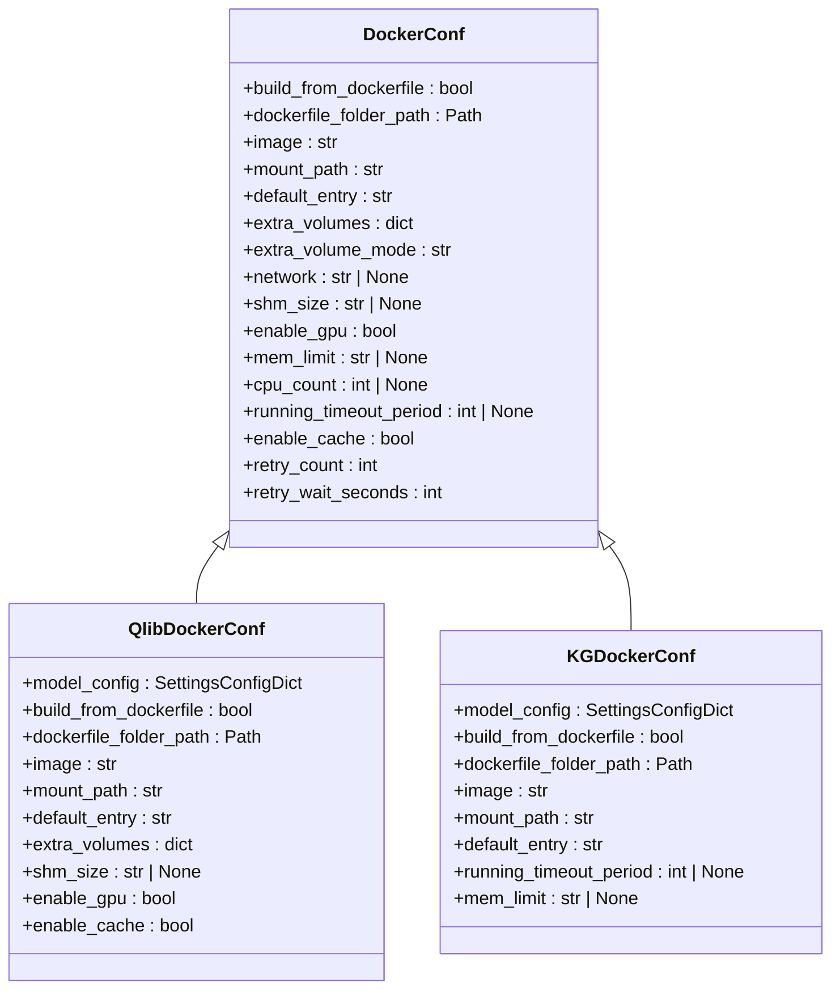

# 执行环境实现

<cite>
**本文档引用的文件**
- [env.py](file://rdagent/utils/env.py#L630-L983)
- [Dockerfile](file://rdagent/scenarios/qlib/docker/Dockerfile#L1-L26)
- [Dockerfile](file://rdagent/scenarios/kaggle/docker/kaggle_docker/Dockerfile#L1-L30)
- [Dockerfile](file://rdagent/scenarios/kaggle/docker/DS_docker/Dockerfile#L1-L9)
- [test_env.py](file://test/utils/test_env.py#L126-L145)
</cite>

## 目录
1. [引言](#引言)
2. [核心实现类分析](#核心实现类分析)
3. [Docker容器镜像构建](#docker容器镜像构建)
4. [挂载路径与权限管理](#挂载路径与权限管理)
5. [资源限制与GPU支持](#资源限制与gpu支持)
6. [超时机制与稳定性保障](#超时机制与稳定性保障)
7. [网络配置与安全策略](#网络配置与安全策略)

## 引言
RD-Agent系统通过Docker容器化技术为不同场景提供隔离且一致的执行环境。本系统设计了QlibDockerConf和KGDockerConf等具体实现类，针对量化投资和Kaggle竞赛等不同应用场景进行优化配置。这些配置类继承自基础的DockerConf类，通过环境变量前缀实现配置隔离，确保不同场景的执行环境互不干扰。

## 核心实现类分析

RD-Agent的执行环境实现基于面向对象的继承体系，核心配置类包括QlibDockerConf和KGDockerConf。这些类继承自基础的DockerConf类，通过模型配置(model_config)指定不同的环境变量前缀，实现配置的隔离和覆盖。



**Diagram sources**
- [env.py](file://rdagent/utils/env.py#L630-L732)

**Section sources**
- [env.py](file://rdagent/utils/env.py#L630-L732)

## Docker容器镜像构建

RD-Agent系统采用Docker容器化技术为不同应用场景提供隔离的执行环境。系统通过Dockerfile定义容器镜像的构建过程，确保环境的一致性和可重复性。

### Qlib场景Docker镜像构建
Qlib场景的Docker镜像基于PyTorch官方镜像构建，专门针对量化投资分析进行了优化配置。Dockerfile首先安装必要的系统工具，然后克隆Qlib项目并安装相关依赖。

```dockerfile
FROM pytorch/pytorch:2.2.1-cuda12.1-cudnn8-runtime

RUN apt-get clean && apt-get update && apt-get install -y \  
    curl \  
    vim \  
    git \  
    build-essential \
    coreutils \
    && rm -rf /var/lib/apt/lists/* 

RUN git clone https://github.com/microsoft/qlib.git

WORKDIR /workspace/qlib

RUN git fetch && git reset 3e72593b8c985f01979bebcf646658002ac43b00 --hard

RUN python -m pip install --upgrade cython
RUN python -m pip install -e .

RUN pip install catboost
RUN pip install xgboost
RUN pip install scipy==1.11.4
RUN pip install tables
```

### Kaggle场景Docker镜像构建
Kaggle场景的Docker镜像同样基于PyTorch官方镜像，但根据Kaggle竞赛的特点安装了不同的Python包，如pandas、pytorch_lightning、optuna等机器学习常用库。

```dockerfile
FROM pytorch/pytorch:2.2.1-cuda12.1-cudnn8-runtime

RUN apt-get clean && apt-get update && apt-get install -y \  
    curl \  
    vim \  
    git \  
    build-essential \
    && rm -rf /var/lib/apt/lists/* 

WORKDIR /workspace

RUN python -m pip install numpy
RUN python -m pip install pandas
RUN pip install torch_geometric
RUN pip install pytorch_lightning
RUN pip install ogb
RUN pip install networkx
RUN pip install scikit-learn
RUN pip install catboost
RUN pip install xgboost
RUN pip install sparse
RUN pip install lightgbm==3.3.5
RUN pip install pyarrow
RUN pip install fastparquet
RUN pip install optuna
```

### 数据科学场景Docker镜像构建
数据科学场景直接使用Kaggle官方提供的GPU镜像作为基础，仅添加必要的系统工具，确保与Kaggle竞赛环境高度一致。

```dockerfile
FROM gcr.io/kaggle-gpu-images/python:latest

RUN apt-get clean && apt-get update && apt-get install -y \  
    curl \  
    vim \  
    git \  
    build-essential \
    strace \
    && rm -rf /var/lib/apt/lists/* 
```

**Section sources**
- [Dockerfile](file://rdagent/scenarios/qlib/docker/Dockerfile#L1-L26)
- [Dockerfile](file://rdagent/scenarios/kaggle/docker/kaggle_docker/Dockerfile#L1-L30)
- [Dockerfile](file://rdagent/scenarios/kaggle/docker/DS_docker/Dockerfile#L1-L9)

## 挂载路径与权限管理

RD-Agent系统通过精心设计的挂载路径(mount_path)和权限管理机制，确保容器内外的数据交互安全且高效。

### 挂载路径设置
系统为不同场景配置了专门的挂载路径：
- Qlib场景：`/workspace/qlib_workspace/`
- Kaggle场景：`/workspace/kg_workspace/`
- 数据科学场景：`/kaggle/workspace`

这些路径在DockerConf基类中定义为mount_path属性，并在具体实现类中被覆盖。当容器运行时，本地路径会被挂载到这些指定的容器路径中，实现代码和数据的共享。

### normalize_volumes工具函数
系统提供了normalize_volumes工具函数来处理卷路径的标准化。该函数接收卷字典和工作目录作为参数，将所有相对路径转换为绝对路径，确保路径引用的正确性。

```python
def normalize_volumes(vols: dict[str, str | dict[str, str]], working_dir: str) -> dict:
    abs_vols: dict[str, str | dict[str, str]] = {}

    def to_abs(path: str) -> str:
        return os.path.abspath(os.path.join(working_dir, path)) if not os.path.isabs(path) else path

    for lp, vinfo in vols.items():
        if isinstance(vinfo, dict):
            vinfo = vinfo.copy()
            vinfo["bind"] = to_abs(vinfo["bind"])
            abs_vols[lp] = vinfo
        else:
            abs_vols[lp] = to_abs(vinfo)
    return abs_vols
```

该函数支持两种卷定义格式：
1. `{<host_path>: <container_path>}`
2. `{<host_path>: {"bind": <container_path>, "mode": <mode>}}`

### 权限管理机制
系统通过extra_volume_mode属性控制额外卷的访问模式，默认为只读(ro)。只有主挂载路径(mount_path)被设置为可读写(rw)，其他额外卷默认为只读，这有助于保护宿主机上的重要数据不被意外修改。

在DockerEnv的_run方法中，系统会根据配置构建卷映射字典，将本地路径映射到容器内的指定路径，并设置相应的访问模式。这种精细化的权限控制机制确保了执行环境的安全性。

**Section sources**
- [env.py](file://rdagent/utils/env.py#L70-L103)
- [env.py](file://rdagent/utils/env.py#L862-L896)

## 资源限制与GPU支持

RD-Agent系统通过精细的资源限制和GPU支持机制，确保容器化执行环境的稳定性和性能。

### 资源限制配置
系统在DockerConf基类中定义了mem_limit和cpu_count属性，用于限制容器的内存和CPU使用：

```python
class DockerConf(EnvConf):
    mem_limit: str | None = "48g"  # 内存限制
    cpu_count: int | None = None  # CPU限制
```

这些限制在DockerEnv的_run方法中被应用到容器创建参数中：

```python
container = client.containers.run(
    image=self.conf.image,
    command=entry,
    volumes=volumes,
    environment=env,
    detach=True,
    working_dir=self.conf.mount_path,
    network=self.conf.network,
    shm_size=self.conf.shm_size,
    mem_limit=self.conf.mem_limit,  # 设置内存限制
    cpu_count=self.conf.cpu_count,  # 设置CPU限制
    **self._gpu_kwargs(client),
)
```

测试用例验证了内存限制的有效性：当设置mem_limit为"10m"时，内存密集型操作会失败；而设置为"1g"时则能成功执行。

### GPU支持机制
系统通过enable_gpu属性控制GPU支持的启用状态。QlibDockerConf和KGDockerConf默认启用GPU支持。

```python
class DockerConf(EnvConf):
    enable_gpu: bool = True  # 默认启用GPU支持
```

系统通过私有方法_gpu_kwargs动态生成GPU相关的容器创建参数：

```python
def _gpu_kwargs(self, client: docker.DockerClient) -> dict:
    if not self.conf.enable_gpu:
        return {}
    gpu_kwargs = {
        "device_requests": (
            [docker.types.DeviceRequest(count=-1, capabilities=[["gpu"]])] if self.conf.enable_gpu else None
        ),
    }
    # GPU可用性测试逻辑
    return _f()
```

该方法首先检查enable_gpu配置，如果禁用则返回空字典。如果启用，则创建包含GPU设备请求的字典。系统还包含GPU可用性测试逻辑，通过运行nvidia-smi命令验证GPU设备是否可用。

**Section sources**
- [env.py](file://rdagent/utils/env.py#L637-L665)
- [env.py](file://rdagent/utils/env.py#L831-L864)
- [test/env.py](file://test/utils/test_env.py#L126-L145)

## 超时机制与稳定性保障

RD-Agent系统通过running_timeout_period超时机制和重试策略，确保执行过程的稳定性和可靠性。

### 超时机制实现
系统在EnvConf基类中定义了running_timeout_period属性，用于设置执行超时时间：

```python
class EnvConf(ExtendedBaseSettings):
    running_timeout_period: int | None = 3600  # 1小时
```

具体实现类根据场景需求设置不同的超时值：
- QlibDockerConf：3600秒（1小时）
- KGDockerConf：600秒（10分钟）

在Env基类的run方法中，系统将超时设置转换为Linux timeout命令：

```python
if self.conf.running_timeout_period is None:
    timeout_cmd = entry
else:
    timeout_cmd = f"timeout --kill-after=10 {self.conf.running_timeout_period} {entry}"
```

当执行时间超过设定的超时周期时，系统会终止进程并记录警告信息，防止长时间运行的任务占用资源。

### 重试机制
系统通过retry_count和retry_wait_seconds属性实现重试机制：

```python
class EnvConf(ExtendedBaseSettings):
    retry_count: int = 5  # 重试次数
    retry_wait_seconds: int = 10  # 重试等待时间
```

在__run_with_retry方法中，系统会捕获执行过程中的异常，并在达到重试次数上限前进行重试：

```python
def __run_with_retry(
    self,
    entry: str | None = None,
    local_path: str = ".",
    env: dict | None = None,
    running_extra_volume: Mapping = MappingProxyType({}),
) -> EnvResult:
    for retry_index in range(self.conf.retry_count + 1):
        try:
            # 执行逻辑
            return EnvResult(log_output, return_code, end - start)
        except Exception as e:
            if retry_index == self.conf.retry_count:
                raise
            logger.warning(f"Error while running the container: {e}, current try index: {retry_index + 1}, {self.conf.retry_count - retry_index - 1} retries left.")
            time.sleep(self.conf.retry_wait_seconds)
```

这种重试机制能够应对临时性的网络问题或资源竞争，提高系统的整体稳定性。

**Section sources**
- [env.py](file://rdagent/utils/env.py#L123-L145)
- [env.py](file://rdagent/utils/env.py#L208-L241)

## 网络配置与安全策略

RD-Agent系统通过合理的网络配置和安全策略，确保容器化执行环境的安全性和可靠性。

### 网络配置
系统在DockerConf基类中定义了network属性，用于指定容器的网络模式：

```python
class DockerConf(EnvConf):
    network: str | None = "bridge"  # 容器的网络模式
```

默认使用bridge网络模式，这是Docker的标准网络配置。在容器创建时，该配置通过network参数传递给Docker API：

```python
container = client.containers.run(
    # ... 其他参数
    network=self.conf.network,
    # ... 其他参数
)
```

### 安全策略
系统实施了多层次的安全策略：

1. **权限最小化原则**：通过extra_volume_mode属性将额外卷设置为只读模式，只有主挂载路径为可读写，减少潜在的安全风险。

2. **环境变量隔离**：不同场景的配置类使用不同的环境变量前缀（如QLIB_DOCKER_和KG_DOCKER_），避免配置冲突。

3. **进程隔离**：每个执行任务都在独立的Docker容器中运行，与其他任务完全隔离，防止相互干扰。

4. **日志审计**：系统在执行前后输出详细的运行信息表，包括镜像、容器ID、入口点、环境变量和卷映射等，便于审计和调试。

5. **资源限制**：通过mem_limit和cpu_count限制容器资源使用，防止资源耗尽攻击。

6. **清理机制**：系统在容器执行完成后自动清理容器资源，即使发生异常也会通过finally块确保清理操作执行。

```python
def cleanup_container(container: docker.models.containers.Container | None, context: str = "") -> None:
    if container is not None:
        try:
            container.stop()
            container.remove()
        except Exception as cleanup_error:
            context_str = f" {context}" if context else ""
            logger.warning(f"Failed to cleanup{context_str} container {container.id}: {cleanup_error}")
```

这些安全策略共同构成了RD-Agent执行环境的防护体系，确保系统在自动化运行过程中的安全性和稳定性。

**Section sources**
- [env.py](file://rdagent/utils/env.py#L648-L665)
- [env.py](file://rdagent/utils/env.py#L915-L944)