# 环境变量管理

<cite>
**本文档中引用的文件**
- [env.py](file://rdagent/utils/env.py)
- [test_env.py](file://test/utils/test_env.py)
- [test_conf.py](file://test/utils/test_conf.py)
- [conf.py](file://rdagent/app/data_science/conf.py)
- [conf.py](file://rdagent/app/kaggle/conf.py)
- [conf.py](file://rdagent/app/qlib_rd_loop/conf.py)
- [conf.py](file://rdagent/components/coder/data_science/conf.py)
- [conf.py](file://rdagent/core/conf.py)
</cite>

## 目录
1. [简介](#简介)
2. [项目结构概述](#项目结构概述)
3. [EnvConf基类设计](#envconf基类设计)
4. [环境配置实现](#环境配置实现)
5. [Docker环境管理](#docker环境管理)
6. [Conda环境管理](#conda环境管理)
7. [环境变量前缀机制](#环境变量前缀机制)
8. [卷挂载与权限管理](#卷挂载与权限管理)
9. [GPU支持与资源限制](#gpu支持与资源限制)
10. [超时设置与重试机制](#超时设置与重试机制)
11. [故障排除指南](#故障排除指南)
12. [总结](#总结)

## 简介

RD-Agent是一个智能代理系统，需要在不同的环境中运行以完成各种任务。为了确保环境的一致性和可配置性，系统采用了统一的环境变量管理机制。该机制基于Python的Pydantic库，提供了灵活且强大的配置管理功能，支持Docker容器、Conda虚拟环境等多种运行环境。

## 项目结构概述

RD-Agent的环境管理系统主要集中在以下目录结构中：

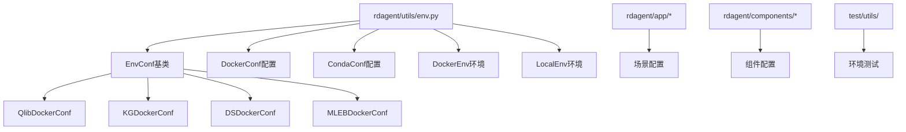

**图表来源**
- [env.py](file://rdagent/utils/env.py#L120-L799)

## EnvConf基类设计

EnvConf是所有环境配置的基础类，它继承自ExtendedBaseSettings，提供了统一的配置管理接口。

### 核心设计原理

EnvConf采用以下设计原则：

1. **继承性**：通过继承机制支持不同类型的环境配置
2. **灵活性**：支持环境变量、配置文件等多种配置方式
3. **类型安全**：使用Pydantic提供类型验证和默认值处理
4. **扩展性**：支持子类化以添加特定功能

### 基础配置参数

EnvConf定义了以下核心配置参数：

| 参数名称 | 类型 | 默认值 | 描述 |
|---------|------|--------|------|
| default_entry | str | 必需 | 默认执行入口点 |
| extra_volumes | dict | {} | 额外的卷挂载配置 |
| running_timeout_period | int \| None | 3600 | 运行超时时间（秒） |
| enable_cache | bool | True | 是否启用缓存机制 |
| retry_count | int | 5 | 重试次数 |
| retry_wait_seconds | int | 10 | 重试等待时间 |

**节来源**
- [env.py](file://rdagent/utils/env.py#L120-L141)

## 环境配置实现

### Docker环境配置

Docker环境配置通过DockerConf类实现，支持丰富的容器化特性：

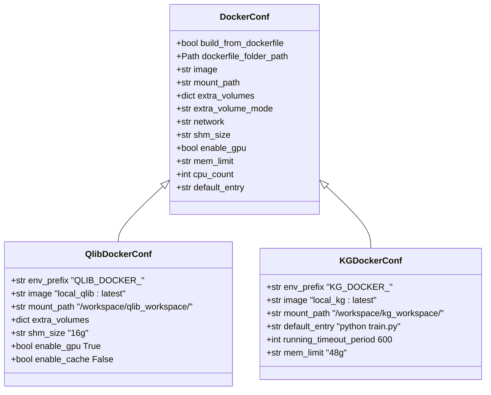

**图表来源**
- [env.py](file://rdagent/utils/env.py#L630-L750)

### Conda环境配置

Conda环境配置通过CondaConf类实现，专注于本地Python环境管理：

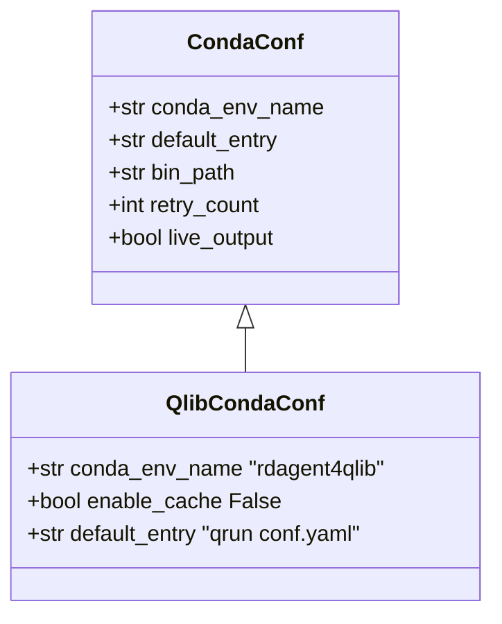

**图表来源**
- [env.py](file://rdagent/utils/env.py#L609-L669)

**节来源**
- [env.py](file://rdagent/utils/env.py#L630-L750)

## Docker环境管理

### 准备方法（prepare）

Docker环境的准备过程包括镜像构建或拉取、数据下载等操作：

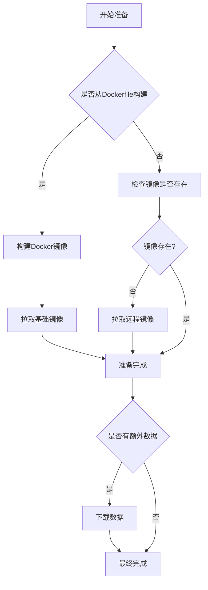

**图表来源**
- [env.py](file://rdagent/utils/env.py#L790-L831)

### 运行方法（run）

Docker环境的运行过程涉及容器启动、卷挂载、环境变量设置等步骤：

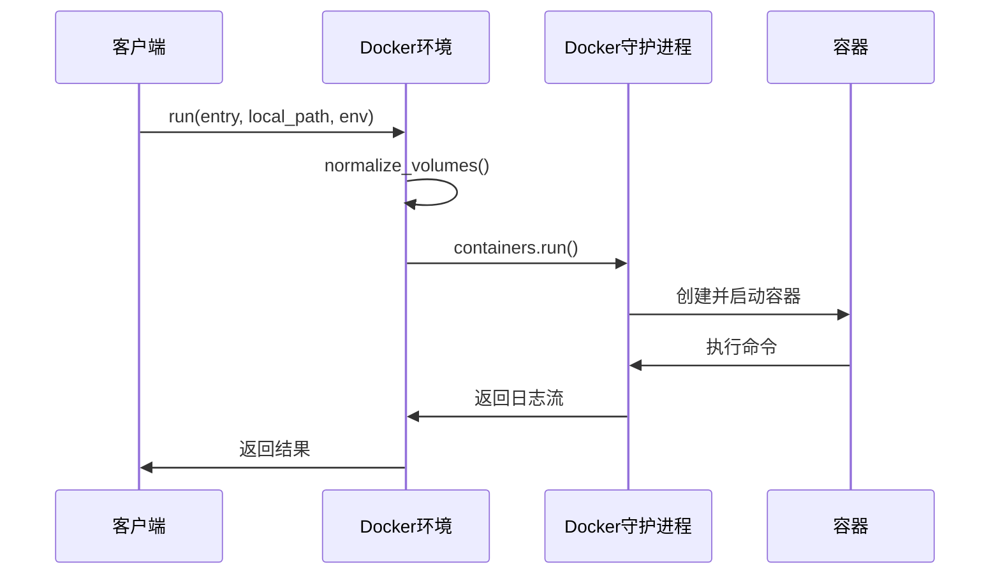

**图表来源**
- [env.py](file://rdagent/utils/env.py#L848-L922)

**节来源**
- [env.py](file://rdagent/utils/env.py#L790-L922)

## Conda环境管理

Conda环境管理专注于本地Python环境的创建和配置：

### Conda环境准备流程

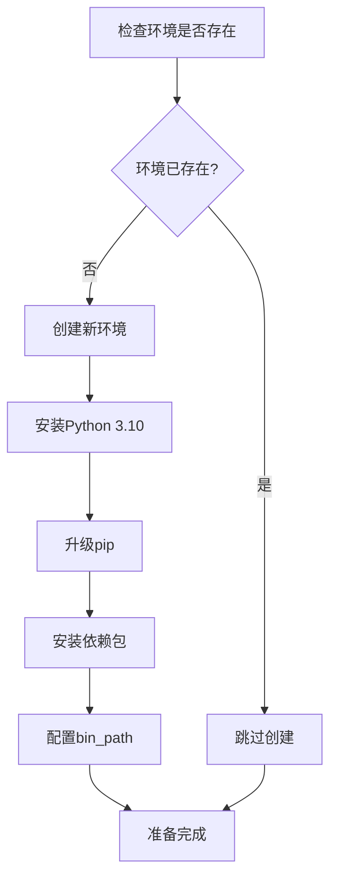

**图表来源**
- [env.py](file://rdagent/utils/env.py#L669-L689)

**节来源**
- [env.py](file://rdagent/utils/env.py#L669-L689)

## 环境变量前缀机制

RD-Agent通过环境变量前缀实现了配置隔离，确保不同场景下的配置不会相互干扰。

### 前缀配置表

| 场景 | 前缀 | 示例环境变量 |
|------|------|-------------|
| Qlib Docker | QLIB_DOCKER_ | QLIB_DOCKER_MEM_LIMIT=48g |
| Kaggle Docker | KG_DOCKER_ | KG_DOCKER_RUNNING_TIMEOUT_PERIOD=600 |
| 数据科学 | DS_ | DS_DEBUG_TIMEOUT=600 |
| 模型开发 | QLIB_MODEL_ | QLIB_MODEL_EVOLVING_N=10 |
| 因子开发 | QLIB_FACTOR_ | QLIB_FACTOR_EVOLVING_N=10 |

### 配置继承机制

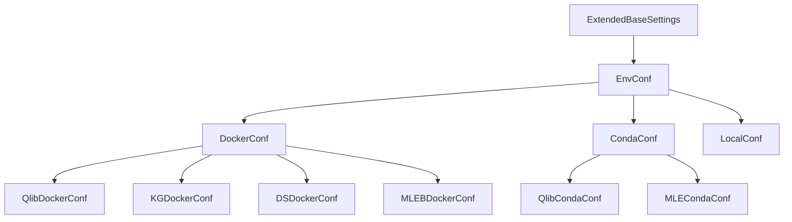

**图表来源**
- [env.py](file://rdagent/utils/env.py#L15-L40)
- [conf.py](file://rdagent/core/conf.py#L15-L40)

**节来源**
- [env.py](file://rdagent/utils/env.py#L696-L750)
- [conf.py](file://rdagent/app/data_science/conf.py#L10-L15)
- [conf.py](file://rdagent/app/kaggle/conf.py#L6-L7)
- [conf.py](file://rdagent/app/qlib_rd_loop/conf.py#L6-L7)

## 卷挂载与权限管理

### normalize_volumes函数

normalize_volumes函数负责将相对路径转换为绝对路径，并处理复杂的卷挂载配置：

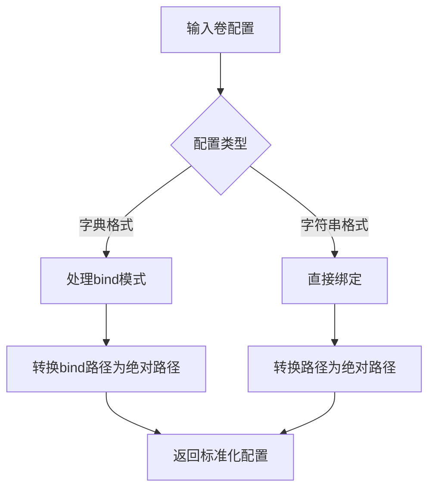

**图表来源**
- [env.py](file://rdagent/utils/env.py#L70-L103)

### 权限管理策略

系统采用以下权限管理策略：

1. **默认只读模式**：除挂载路径外的所有卷都设置为只读
2. **动态权限调整**：根据需要动态调整卷的访问权限
3. **安全隔离**：确保容器内的操作不会影响主机文件系统

**节来源**
- [env.py](file://rdagent/utils/env.py#L70-L103)
- [env.py](file://rdagent/utils/env.py#L862-L896)

## GPU支持与资源限制

### GPU检测与配置

系统自动检测GPU可用性并进行相应配置：

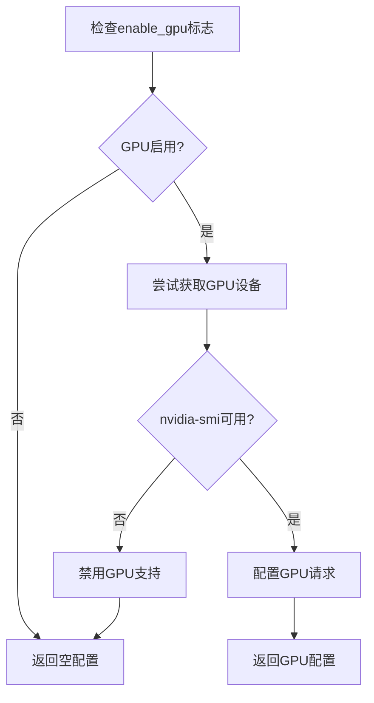

**图表来源**
- [env.py](file://rdagent/utils/env.py#L831-L864)

### 资源限制配置

| 资源类型 | 配置参数 | 默认值 | 描述 |
|---------|----------|--------|------|
| 内存限制 | mem_limit | 48g | 容器内存上限 |
| CPU限制 | cpu_count | None | 可用CPU核心数 |
| 共享内存 | shm_size | 16g | 共享内存大小 |
| 网络模式 | network | bridge | 网络连接模式 |

**节来源**
- [env.py](file://rdagent/utils/env.py#L831-L864)
- [env.py](file://rdagent/utils/env.py#L630-L650)

## 超时设置与重试机制

### 超时控制

系统提供了多层次的超时控制机制：

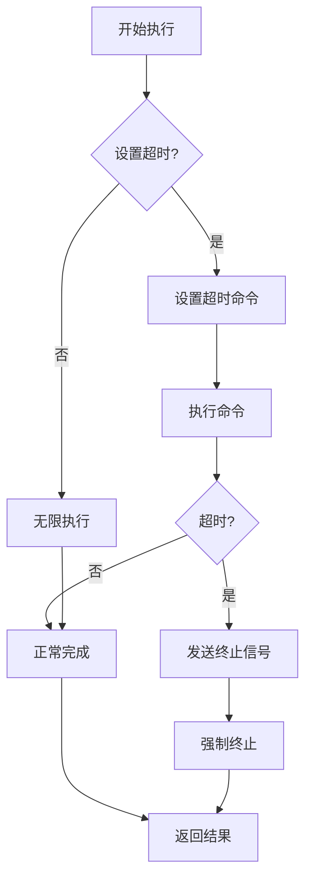

**图表来源**
- [env.py](file://rdagent/utils/env.py#L280-L320)

### 重试机制

系统实现了智能重试机制，包括指数退避策略：

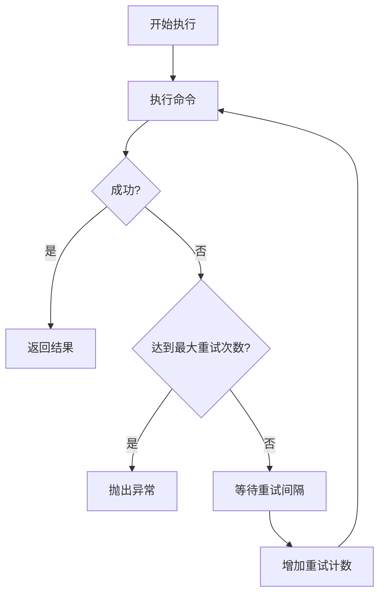

**图表来源**
- [env.py](file://rdagent/utils/env.py#L242-L268)

**节来源**
- [env.py](file://rdagent/utils/env.py#L242-L268)
- [env.py](file://rdagent/utils/env.py#L280-L320)

## 故障排除指南

### 常见问题及解决方案

#### Docker相关问题

1. **权限错误**
   - 错误：`PermissionError: [Errno 13] Permission denied`
   - 解决方案：将用户添加到docker组并重新登录

2. **镜像不存在**
   - 错误：`Docker image not found`
   - 解决方案：检查镜像名称或启用自动构建

3. **GPU不可用**
   - 错误：`nvidia-smi not found`
   - 解决方案：禁用GPU支持或安装NVIDIA驱动

#### 环境变量配置问题

1. **配置优先级**
   - 环境变量优先级高于默认值
   - 子类配置会覆盖父类配置

2. **None值处理**
   - 使用`env_parse_none_str="None"`正确解析None值

**节来源**
- [test_env.py](file://test/utils/test_env.py#L22-L49)
- [test_conf.py](file://test/utils/test_conf.py#L10-L34)

## 总结

RD-Agent的环境变量管理系统具有以下特点：

1. **统一架构**：基于EnvConf基类提供一致的配置接口
2. **灵活配置**：支持多种配置方式和继承机制
3. **环境隔离**：通过前缀机制实现配置隔离
4. **资源管理**：提供完善的资源限制和监控
5. **容错能力**：具备重试机制和超时控制
6. **扩展性强**：易于添加新的环境类型和配置选项

该系统为RD-Agent提供了稳定可靠的环境管理基础，确保了在不同场景下的一致性和可预测性。通过合理的抽象和设计，系统既保持了灵活性，又保证了易用性，为开发者提供了强大的工具支持。