# 配置基础架构

<cite>
**本文档引用的文件**
- [rdagent/core/conf.py](file://rdagent/core/conf.py)
- [rdagent/utils/env.py](file://rdagent/utils/env.py)
- [rdagent/app/data_science/conf.py](file://rdagent/app/data_science/conf.py)
- [rdagent/scenarios/qlib_rd_loop/conf.py](file://rdagent/scenarios/qlib_rd_loop/conf.py)
- [test/utils/test_env.py](file://test/utils/test_env.py)
</cite>

## 目录
1. [引言](#引言)
2. [项目结构概览](#项目结构概览)
3. [核心组件分析](#核心组件分析)
4. [架构设计原理](#架构设计原理)
5. [详细组件分析](#详细组件分析)
6. [配置验证机制](#配置验证机制)
7. [生命周期管理](#生命周期管理)
8. [性能考虑](#性能考虑)
9. [故障排除指南](#故障排除指南)
10. [总结](#总结)

## 引言

RD-Agent的环境变量管理基础架构是一个高度模块化和可扩展的系统，旨在为不同的计算环境提供统一的配置管理接口。该架构的核心是`EnvConf`抽象基类，它定义了环境配置的标准契约，并通过继承机制支持多种具体的环境类型。

该系统的设计哲学体现了现代软件工程的最佳实践：通过抽象基类提供通用接口，通过具体子类实现特定功能，通过配置驱动的方式实现灵活的环境管理。

## 项目结构概览

RD-Agent的配置管理主要分布在以下几个关键模块中：

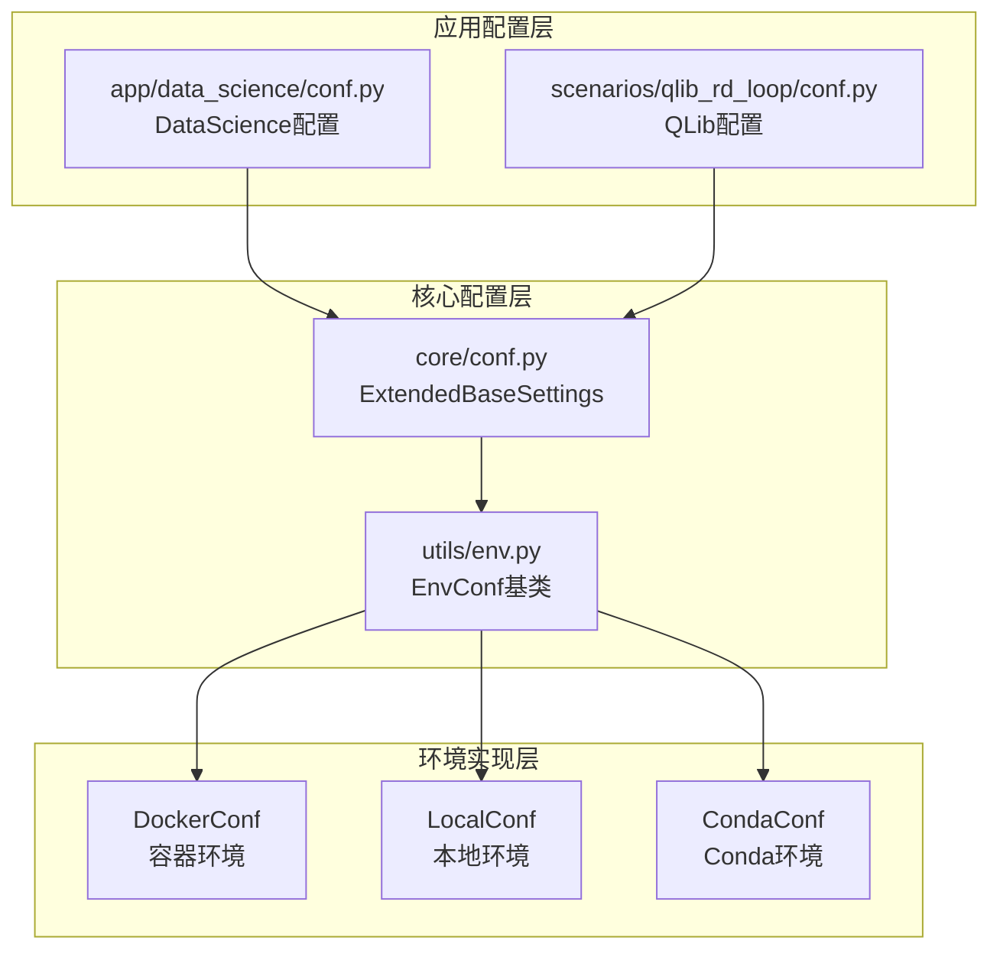

**图表来源**
- [rdagent/core/conf.py](file://rdagent/core/conf.py#L1-L37)
- [rdagent/utils/env.py](file://rdagent/utils/env.py#L120-L132)

**章节来源**
- [rdagent/core/conf.py](file://rdagent/core/conf.py#L1-L110)
- [rdagent/utils/env.py](file://rdagent/utils/env.py#L1-L200)

## 核心组件分析

### ExtendedBaseSettings基类

`ExtendedBaseSettings`是整个配置系统的基础，它扩展了Pydantic的`BaseSettings`类，提供了更强大的环境变量解析能力。

该基类的核心特性包括：
- **多层级环境源支持**：能够从多个父类继承环境配置源
- **动态前缀处理**：支持运行时动态添加环境变量前缀
- **类型安全**：利用Python类型注解确保配置的类型安全性

### EnvConf抽象基类

`EnvConf`是所有环境配置的抽象基类，定义了环境配置的标准契约：

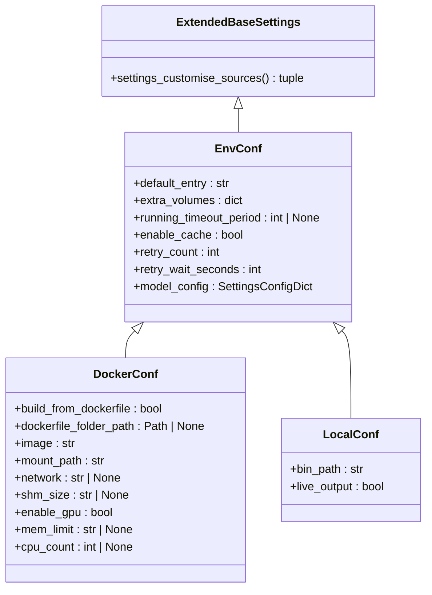

**图表来源**
- [rdagent/core/conf.py](file://rdagent/core/conf.py#L12-L37)
- [rdagent/utils/env.py](file://rdagent/utils/env.py#L120-L132)
- [rdagent/utils/env.py](file://rdagent/utils/env.py#L637-L665)

**章节来源**
- [rdagent/core/conf.py](file://rdagent/core/conf.py#L12-L37)
- [rdagent/utils/env.py](file://rdagent/utils/env.py#L120-L132)

## 架构设计原理

### 抽象基类设计理念

EnvConf抽象基类采用了面向对象设计中的模板方法模式，定义了环境配置的通用框架：

1. **标准化配置参数**：定义了所有环境都必须遵循的基本配置项
2. **可扩展性**：通过继承机制支持特定环境类型的定制
3. **类型安全**：利用Python类型注解确保配置的完整性
4. **配置隔离**：通过env_prefix实现不同场景下的配置隔离

### 配置参数体系

EnvConf定义了以下核心配置参数：

| 参数名称 | 类型 | 默认值 | 描述 |
|---------|------|--------|------|
| default_entry | str | 必需 | 环境的默认执行入口点 |
| extra_volumes | dict | {} | 额外的卷挂载配置 |
| running_timeout_period | int \| None | 3600 | 运行超时时间（秒） |
| enable_cache | bool | True | 是否启用缓存机制 |
| retry_count | int | 5 | Docker运行重试次数 |
| retry_wait_seconds | int | 10 | 重试等待时间（秒） |

### env_prefix配置隔离机制

env_prefix属性是配置隔离的核心机制，它通过以下方式实现不同场景下的配置命名空间管理：

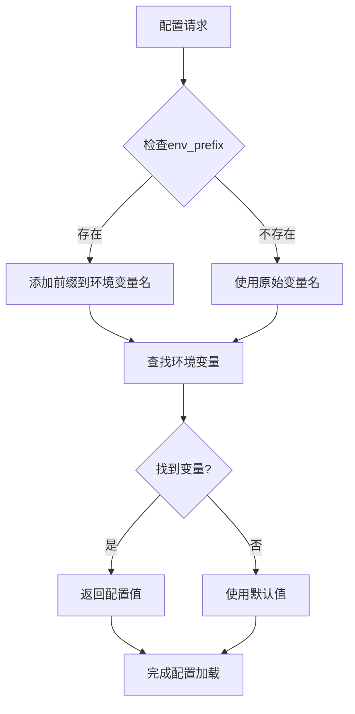

**图表来源**
- [rdagent/core/conf.py](file://rdagent/core/conf.py#L37-L45)

**章节来源**
- [rdagent/utils/env.py](file://rdagent/utils/env.py#L120-L132)
- [rdagent/app/data_science/conf.py](file://rdagent/app/data_science/conf.py#L10-L11)

## 详细组件分析

### DockerConf配置类

DockerConf是Docker环境的具体配置实现，扩展了EnvConf并添加了容器特有的配置参数：

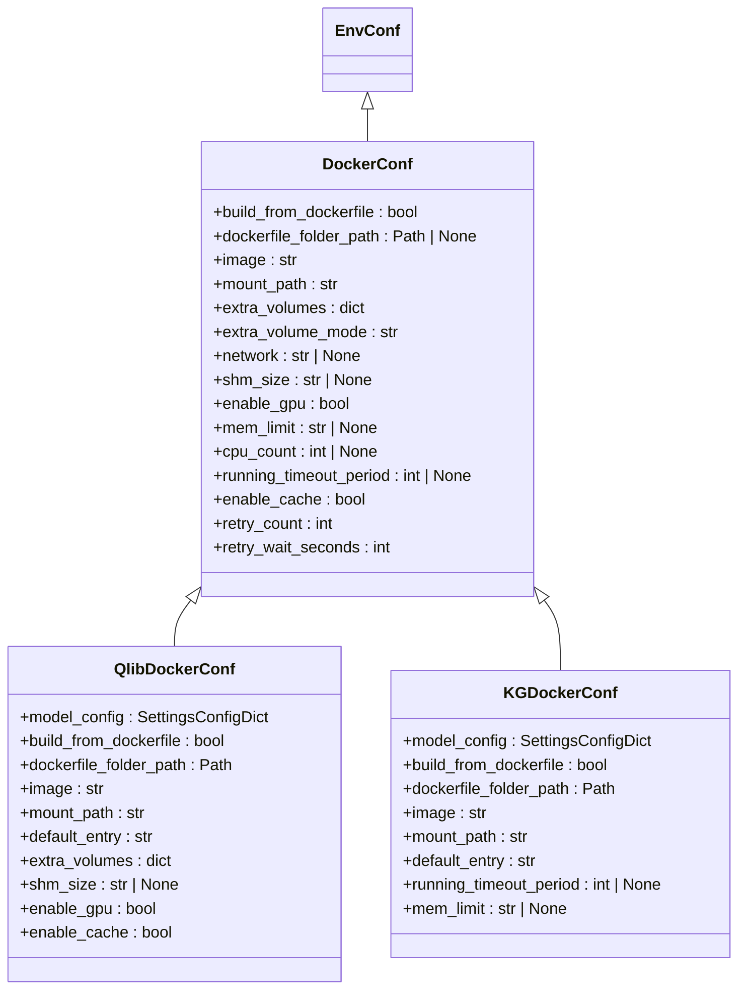

**图表来源**
- [rdagent/utils/env.py](file://rdagent/utils/env.py#L637-L665)
- [rdagent/utils/env.py](file://rdagent/utils/env.py#L667-L698)
- [rdagent/utils/env.py](file://rdagent/utils/env.py#L700-L735)

#### 关键配置参数详解

**image参数**：指定要使用的Docker镜像，这是容器环境的核心标识。

**mem_limit参数**：内存限制配置，支持多种格式（如"48g"表示48GB），用于防止容器占用过多系统资源。

**cpu_count参数**：CPU数量限制，可以精确控制容器的CPU使用量。

**enable_gpu参数**：GPU支持开关，系统会自动检测GPU可用性并相应调整配置。

**extra_volumes参数**：卷挂载配置，支持复杂的主机-容器文件系统映射关系。

**章节来源**
- [rdagent/utils/env.py](file://rdagent/utils/env.py#L637-L665)
- [rdagent/utils/env.py](file://rdagent/utils/env.py#L667-L735)

### LocalConf配置类

LocalConf专门用于本地环境配置，适用于开发测试场景：

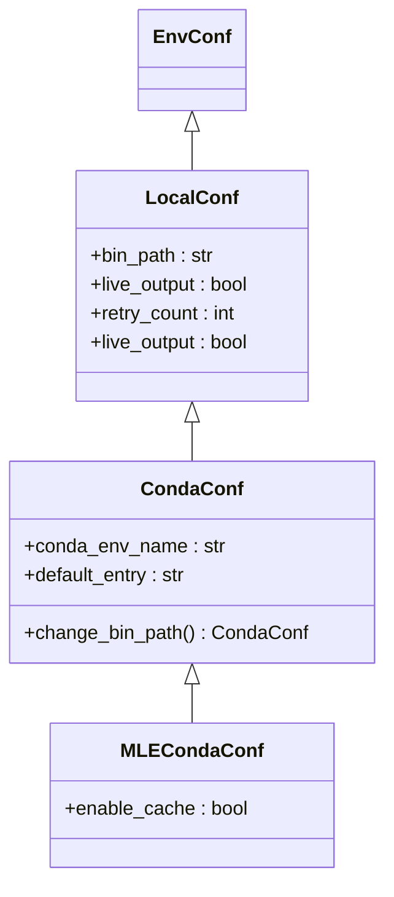

**图表来源**
- [rdagent/utils/env.py](file://rdagent/utils/env.py#L444-L488)
- [rdagent/utils/env.py](file://rdagent/utils/env.py#L490-L515)

**章节来源**
- [rdagent/utils/env.py](file://rdagent/utils/env.py#L444-L488)
- [rdagent/utils/env.py](file://rdagent/utils/env.py#L490-L515)

## 配置验证机制

### 类型注解系统

RD-Agent广泛使用Python类型注解来确保配置的完整性：

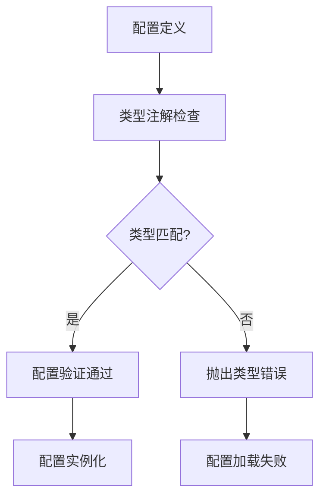

**图表来源**
- [rdagent/utils/env.py](file://rdagent/utils/env.py#L120-L132)

### 属性装饰器验证

系统使用Pydantic的模型验证器来实现复杂的配置验证逻辑：

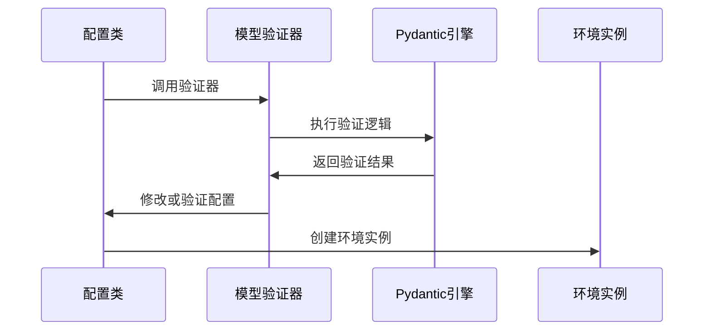

**图表来源**
- [rdagent/utils/env.py](file://rdagent/utils/env.py#L490-L515)

### 异常处理模式

配置系统实现了多层次的异常处理机制：

1. **配置加载异常**：处理环境变量解析失败的情况
2. **类型转换异常**：处理配置值类型不匹配的情况
3. **依赖缺失异常**：处理配置依赖的外部资源不可用的情况

**章节来源**
- [rdagent/utils/env.py](file://rdagent/utils/env.py#L490-L515)
- [rdagent/utils/env.py](file://rdagent/utils/env.py#L800-L850)

## 生命周期管理

### prepare方法契约

prepare方法是环境准备阶段的核心抽象方法，其契约定义如下：

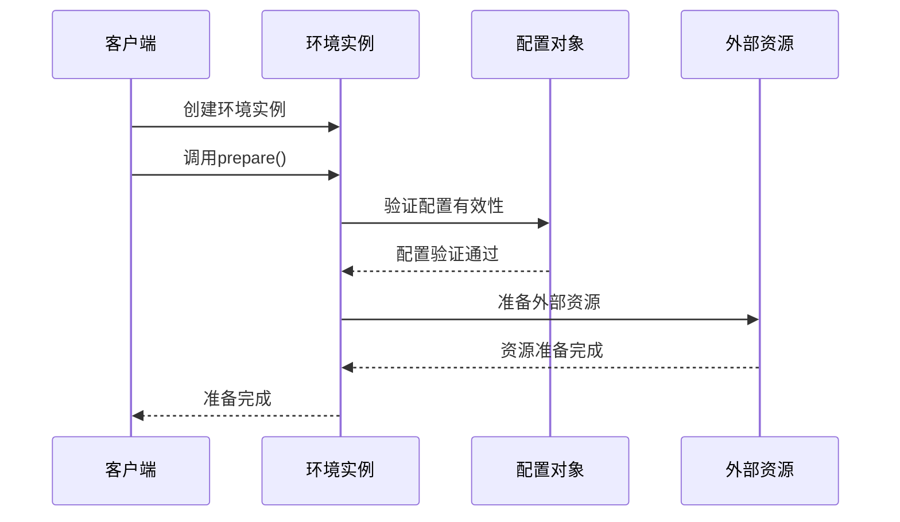

**图表来源**
- [rdagent/utils/env.py](file://rdagent/utils/env.py#L200-L250)

### run方法契约

run方法负责执行实际的环境操作，它与prepare方法配合形成完整的生命周期：

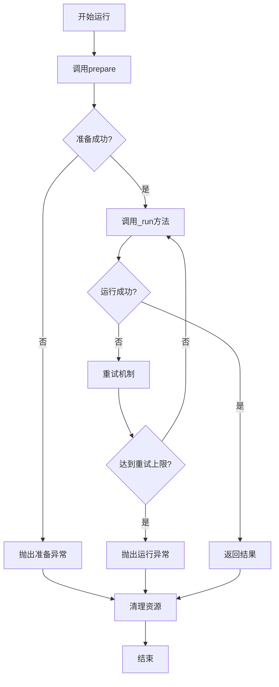

**图表来源**
- [rdagent/utils/env.py](file://rdagent/utils/env.py#L250-L350)

### 调用时序分析

配置系统的生命周期遵循严格的时序约定：

1. **初始化阶段**：创建配置对象并进行基本验证
2. **准备阶段**：调用prepare方法准备运行环境
3. **执行阶段**：调用run方法执行具体任务
4. **清理阶段**：释放资源并进行必要的清理工作

**章节来源**
- [rdagent/utils/env.py](file://rdagent/utils/env.py#L200-L350)

## 性能考虑

### 缓存机制

EnvConf系统实现了智能的缓存机制来提升性能：

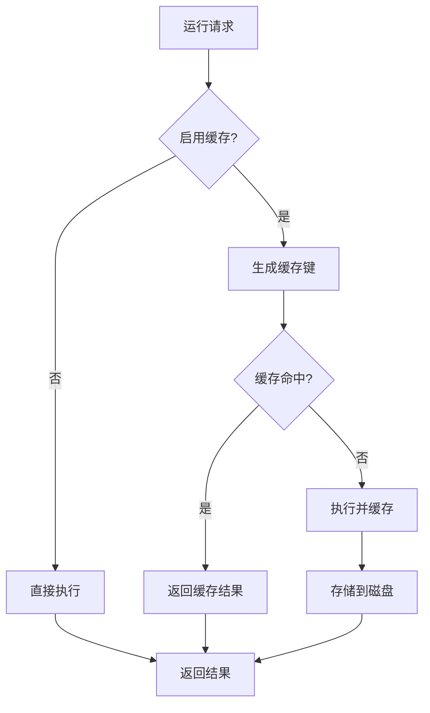

**图表来源**
- [rdagent/utils/env.py](file://rdagent/utils/env.py#L350-L400)

### 资源管理优化

系统采用多种策略来优化资源使用：

- **连接池管理**：复用Docker客户端连接
- **镜像预拉取**：提前下载常用镜像
- **GPU资源调度**：智能分配GPU设备
- **内存限制**：精确控制容器内存使用

**章节来源**
- [rdagent/utils/env.py](file://rdagent/utils/env.py#L350-L400)
- [rdagent/utils/env.py](file://rdagent/utils/env.py#L831-L864)

## 故障排除指南

### 常见配置问题

1. **环境变量解析失败**
   - 检查env_prefix设置是否正确
   - 验证环境变量命名规范
   - 确认变量值格式正确

2. **Docker配置错误**
   - 验证镜像名称和标签
   - 检查网络配置
   - 确认GPU支持状态

3. **权限问题**
   - 检查文件系统权限
   - 验证用户组配置
   - 确认容器特权设置

### 调试技巧

系统提供了丰富的调试信息输出：

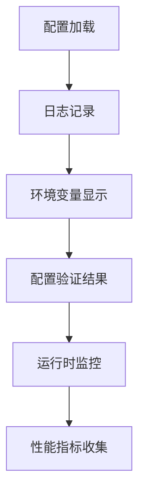

**图表来源**
- [rdagent/utils/env.py](file://rdagent/utils/env.py#L515-L547)

**章节来源**
- [test/utils/test_env.py](file://test/utils/test_env.py#L126-L145)

## 总结

RD-Agent的环境变量管理基础架构展现了现代软件系统设计的最佳实践。通过EnvConf抽象基类，系统实现了：

1. **统一的配置接口**：为不同类型的环境提供一致的配置体验
2. **灵活的扩展机制**：通过继承支持各种特定需求的环境配置
3. **强类型的安全保障**：利用Python类型注解和Pydantic验证确保配置正确性
4. **智能的资源管理**：通过缓存和资源池化提升系统性能
5. **完善的异常处理**：多层次的错误处理确保系统稳定性

这个架构不仅满足了当前的功能需求，还为未来的扩展预留了充足的空间，是构建复杂分布式系统配置管理的优秀范例。