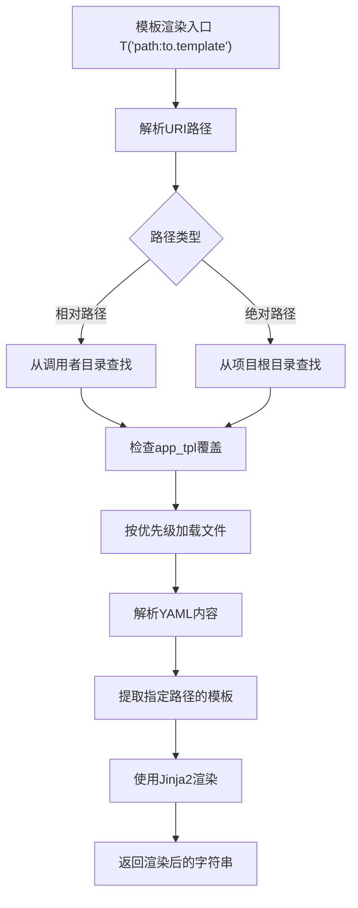
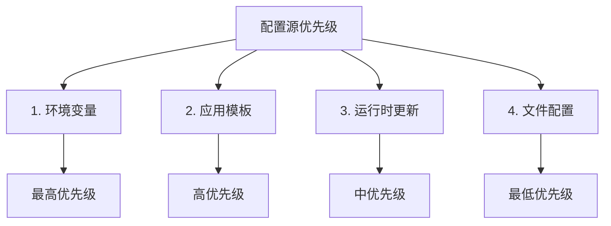

# 配置管理

<cite>
**本文档中引用的文件**  
- [conf.py](file://rdagent/core/conf.py)
- [llm_conf.py](file://rdagent/oai/llm_conf.py)
- [env.py](file://rdagent/utils/env.py)
- [data_science/conf.py](file://rdagent/app/data_science/conf.py)
- [finetune/data_science/conf.py](file://rdagent/app/finetune/data_science/conf.py)
- [finetune/llm/conf.py](file://rdagent/app/finetune/llm/conf.py)
- [kaggle/conf.py](file://rdagent/app/kaggle/conf.py)
- [tpl.py](file://rdagent/utils/agent/tpl.py)
- [prompts.yaml](file://rdagent/app/finetune/llm/prompts.yaml)
- [pipeline/prompts.yaml](file://rdagent/components/coder/data_science/pipeline/prompts.yaml)
- [utils/prompts.yaml](file://rdagent/app/utils/prompts.yaml)
</cite>

## 目录
1. [核心配置体系](#核心配置体系)
2. [LLM后端配置](#llm后端配置)
3. [环境变量管理](#环境变量管理)
4. [应用场景特定配置](#应用场景特定配置)
5. [YAML提示模板体系](#yaml提示模板体系)
6. [配置继承与覆盖机制](#配置继承与覆盖机制)
7. [安全配置建议](#安全配置建议)

## 核心配置体系

系统的核心配置由 `rdagent/core/conf.py` 文件中的 `RDAgentSettings` 类定义，该类继承自 `ExtendedBaseSettings`，提供了系统运行所需的基础参数。核心配置包含多个维度的设置：

- **工作空间配置**：通过 `workspace_path` 定义工作目录路径，默认为当前目录下的 `git_ignore_folder/RD-Agent_workspace`。`workspace_ckp_size_limit` 控制工作区检查点的大小限制，值为0表示无限制。

- **多进程配置**：`multi_proc_n` 参数控制并行处理的进程数量。

- **缓存配置**：`cache_with_pickle` 决定是否使用pickle缓存，`pickle_cache_folder_path_str` 指定缓存文件夹路径，`use_file_lock` 控制是否使用文件锁避免重复执行。

- **执行限制**：`stdout_context_len` 和 `stdout_line_len` 分别限制标准输出的上下文长度和单行长度。

- **并行循环控制**：`step_semaphore` 参数控制每个步骤的信号量，可以是全局整数值或针对不同步骤的字典配置，如 `{"coding": 3, "running": 2}`。

- **调试配置**：`subproc_step` 用于调试目的，控制是否强制使用子进程执行。

这些配置通过全局实例 `RD_AGENT_SETTINGS` 提供，被系统各组件广泛引用，确保了配置的一致性和可访问性。

**Section sources**
- [conf.py](file://rdagent/core/conf.py#L1-L109)

## LLM后端配置

LLM后端配置由 `rdagent/oai/llm_conf.py` 文件中的 `LLMSettings` 类管理，该类同样继承自 `ExtendedBaseSettings`。此配置专门用于管理大语言模型的连接和行为参数。

- **后端选择**：`backend` 参数指定使用的后端实现，默认为 `rdagent.oai.backend.LiteLLMAPIBackend`，支持OpenAI和LiteLLM等多种提供商。

- **模型选择**：`chat_model` 和 `embedding_model` 分别定义聊天模型和嵌入模型的名称，如 `gpt-4-turbo` 和 `text-embedding-3-small`。

- **API连接配置**：
  - `openai_api_key`：OpenAI API密钥
  - `chat_openai_api_key` 和 `chat_openai_base_url`：聊天API的密钥和基础URL
  - `embedding_openai_api_key` 和 `embedding_openai_base_url`：嵌入API的密钥和基础URL

- **Azure配置**：虽然 `use_azure` 已弃用，但 `chat_use_azure` 和 `embedding_use_azure` 分别控制聊天和嵌入功能是否使用Azure服务。

- **缓存配置**：`use_chat_cache` 和 `use_embedding_cache` 控制是否启用聊天和嵌入缓存，`prompt_cache_path` 指定缓存数据库的路径。

- **请求参数**：`chat_temperature` 控制生成文本的随机性，`chat_max_tokens` 限制最大令牌数，`chat_stream` 控制是否启用流式响应。

- **服务器端点配置**：支持GCR（Google Cloud Run）等服务器端点，通过 `use_gcr_endpoint` 启用，并配置相应的端点URL、密钥和部署名称。

- **离线模型配置**：支持本地Llama2模型，通过 `use_llama2` 启用，并配置检查点目录和分词器路径。

这些配置使得系统能够灵活地与不同的LLM提供商集成，并根据需要调整性能和成本。

**Section sources**
- [llm_conf.py](file://rdagent/oai/llm_conf.py#L1-L132)

## 环境变量管理

环境变量管理在 `rdagent/utils/env.py` 文件中实现，通过 `EnvConf` 类和相关环境类来处理敏感信息和环境配置。该模块的设计目的是为代理运行创建统一的环境。

- **环境配置基类**：`EnvConf` 继承自 `ExtendedBaseSettings`，定义了环境配置的基础参数，如 `default_entry`（默认入口点）、`extra_volumes`（额外卷映射）和 `running_timeout_period`（运行超时时间）。

- **Docker环境配置**：`DockerConf` 类扩展了 `EnvConf`，专门用于Docker环境配置：
  - `image`：指定要使用的Docker镜像
  - `mount_path`：容器内挂载代码的路径
  - `build_from_dockerfile`：是否从Dockerfile构建镜像
  - `dockerfile_folder_path`：Dockerfile所在文件夹路径
  - `enable_gpu`：是否启用GPU支持
  - `mem_limit` 和 `cpu_count`：内存和CPU资源限制

- **特定场景配置**：系统为不同应用场景提供了专门的Docker配置类：
  - `QlibDockerConf`：用于Qlib场景，配置了QLib相关的Docker设置
  - `KGDockerConf`：用于Kaggle场景，配置了Kaggle竞赛的Docker环境
  - `DSDockerConf`：用于数据科学场景的Docker配置
  - `MLEBDockerConf`：用于MLE基准测试的Docker配置

- **本地环境配置**：`LocalConf` 和 `CondaConf` 类支持本地和Conda环境，允许在没有Docker的情况下进行测试和开发。

- **环境变量前缀**：通过 `SettingsConfigDict` 的 `env_prefix` 属性，配置类可以自动从环境变量中加载配置，如 `QLIB_DOCKER_` 前缀的变量会自动映射到 `QlibDockerConf` 的相应字段。

这种设计使得敏感信息（如API密钥、路径配置）可以通过环境变量安全地注入，而不需要硬编码在配置文件中。

**Section sources**
- [env.py](file://rdagent/utils/env.py#L1-L984)

## 应用场景特定配置

系统支持多种应用场景的特定配置，通过继承和覆盖机制实现配置的精细化管理。主要的应用场景配置包括数据科学、Kaggle竞赛和微调任务。

### 数据科学配置

`rdagent/app/data_science/conf.py` 文件中的 `DataScienceBasePropSetting` 类定义了数据科学场景的核心配置：

- **场景组件**：通过字符串配置指定各个组件的实现类，如 `scen` 指定场景类，`planner` 指定规划器类，`hypothesis_gen` 指定假设生成类。

- **超时设置**：`debug_timeout` 和 `full_timeout` 分别定义调试数据和完整数据的运行超时时间。

- **编码相关**：`coding_fail_reanalyze_threshold` 控制编码失败后重新分析的阈值，`enable_model_dump` 控制是否启用模型转储。

- **多轨迹配置**：支持多轨迹实验，通过 `max_trace_num` 控制最大轨迹数量，`selector_name` 指定检查点选择器，`sota_exp_selector_name` 指定SOTA实验选择器。

- **知识库集成**：`enable_knowledge_base` 控制是否启用知识库，`knowledge_base_path` 指定知识库路径。

### Kaggle竞赛配置

`rdagent/app/kaggle/conf.py` 文件中的 `KaggleBasePropSetting` 类定义了Kaggle竞赛的特定配置：

- **竞赛信息**：`competition` 字段指定Kaggle竞赛名称，`local_data_path` 指定本地数据路径。

- **组件配置**：与数据科学配置类似，通过字符串指定各个组件的实现类，如 `feature_coder`、`model_coder` 等。

- **评估配置**：`if_using_mle_data` 控制是否使用MLE数据，`auto_submit` 控制是否自动提交结果到Kaggle平台。

- **知识检索**：支持向量和图两种RAG（检索增强生成）模式，通过 `if_using_vector_rag` 和 `if_using_graph_rag` 分别控制。

### 微调任务配置

系统为微调任务提供了专门的配置类，位于 `rdagent/app/finetune/` 目录下：

- **数据科学微调**：`DSFinetuneScen` 类继承自 `ExtendedBaseSettings`，为数据科学微调场景提供配置，包括更长的超时时间（`full_timeout` 为10800秒）和启用模型转储。

- **LLM微调**：`LLMFinetuneScen` 类为LLM微调场景提供配置，具有更长的超时时间（`full_timeout` 为360000秒），适合长时间的微调任务。

- **模板应用**：通过 `app_tpl` 参数指定应用模板路径，如 `"app/finetune/data_science/tpl"`，允许微调任务使用特定的提示模板。

这些特定配置通过 `update_settings` 函数动态更新全局配置，实现了场景间的配置隔离和定制化。

**Section sources**
- [data_science/conf.py](file://rdagent/app/data_science/conf.py#L1-L206)
- [kaggle/conf.py](file://rdagent/app/kaggle/conf.py#L1-L96)
- [finetune/data_science/conf.py](file://rdagent/app/finetune/data_science/conf.py#L1-L40)
- [finetune/llm/conf.py](file://rdagent/app/finetune/llm/conf.py#L1-L43)

## YAML提示模板体系

系统的提示模板采用YAML格式组织，通过 `rdagent/utils/agent/tpl.py` 模块实现模板的加载和渲染。这种设计使得提示工程更加模块化和可维护。

### 模板组织结构

提示模板分布在多个YAML文件中，按功能和组件组织：

- **应用级模板**：位于 `rdagent/app/` 目录下，如 `finetune/llm/prompts.yaml` 为LLM微调任务提供场景描述和竞赛背景。

- **组件级模板**：位于 `rdagent/components/` 目录下，如 `coder/data_science/pipeline/prompts.yaml` 为数据科学管道编码器提供系统提示和用户提示。

- **共享模板**：位于 `rdagent/components/coder/data_science/share/prompts.yaml` 等位置，提供可被多个组件复用的模板片段。

### 变量注入方式

模板系统支持强大的变量注入功能，通过Jinja2模板引擎实现：

- **上下文变量**：在渲染模板时，可以通过 `r()` 方法传入上下文变量，如 `{{ raw_description }}`、`{{ task_desc }}` 等占位符会被实际值替换。

- **条件渲染**：支持Jinja2的条件语句，如 ``，根据配置动态包含或排除模板内容。

- **模板包含**：通过 `` 语法包含其他模板文件，实现模板的模块化和复用。



**Diagram sources**
- [tpl.py](file://rdagent/utils/agent/tpl.py#L1-L148)
- [prompts.yaml](file://rdagent/app/finetune/llm/prompts.yaml#L1-L12)
- [pipeline/prompts.yaml](file://rdagent/components/coder/data_science/pipeline/prompts.yaml#L1-L347)

### 模板示例

以 `finetune/llm/prompts.yaml` 为例，其结构如下：

```yaml
scenario_description: |-
  ------背景信息------
  {{ raw_description }}

competition_background: |-
  ## QLoRA微调
  你是一位世界级的机器学习工程师，专注于使用QLoRA方法微调大语言模型。
  - **微调方法**: QLoRA (4位量化LoRA)
  - **训练数据集**: {{ raw_description }}
```

这个模板通过 `{{ raw_description }}` 变量注入实际的数据集描述，实现了动态内容生成。

**Section sources**
- [prompts.yaml](file://rdagent/app/finetune/llm/prompts.yaml#L1-L12)
- [pipeline/prompts.yaml](file://rdagent/components/coder/data_science/pipeline/prompts.yaml#L1-L347)
- [utils/prompts.yaml](file://rdagent/app/utils/prompts.yaml#L1-L119)

## 配置继承与覆盖机制

系统的配置体系基于Pydantic的设置类继承机制，实现了灵活的配置继承与覆盖规则。这一机制确保了配置的层次化管理和场景特定配置的优先级。

### 继承机制

配置类通过Python的类继承实现层次化结构：

- **基础类**：`ExtendedBaseSettings` 继承自 `BaseSettings`，提供了配置自定义源的功能。

- **核心配置**：`RDAgentSettings` 继承自 `ExtendedBaseSettings`，定义了系统级的默认配置。

- **场景配置**：`DataScienceBasePropSetting` 和 `KaggleBasePropSetting` 等类继承自 `ExtendedBaseSettings`，定义了特定场景的配置。

- **微调配置**：`DSFinetuneScen` 和 `LLMFinetuneScen` 进一步继承，为微调任务提供更具体的配置。

### 覆盖优先级规则

配置的覆盖遵循明确的优先级顺序，从高到低如下：

1. **环境变量**：具有最高优先级，通过 `env_prefix` 指定的环境变量会覆盖所有其他配置。例如，`DS_DEBUG_TIMEOUT` 环境变量会覆盖 `data_science/conf.py` 中的 `debug_timeout` 配置。

2. **应用模板**：通过 `RD_AGENT_SETTINGS.app_tpl` 指定的应用模板具有第二优先级，允许特定应用覆盖默认模板。

3. **运行时更新**：通过 `update_settings` 函数在运行时动态更新的配置具有第三优先级，如微调任务中调用 `update_settings` 更新全局配置。

4. **文件配置**：YAML配置文件和Python配置文件中的静态配置具有最低优先级。



**Diagram sources**
- [conf.py](file://rdagent/core/conf.py#L1-L109)
- [tpl.py](file://rdagent/utils/agent/tpl.py#L1-L148)
- [finetune/data_science/conf.py](file://rdagent/app/finetune/data_science/conf.py#L1-L40)

### 模板覆盖机制

模板系统的覆盖机制在 `tpl.py` 中实现，遵循以下优先级：

1. **应用模板目录**：首先查找 `RD_AGENT_SETTINGS.app_tpl` 指定的应用模板目录。
2. **调用者目录**：然后查找调用者的相对目录（以`.`开头的路径）。
3. **项目根目录**：最后查找项目根目录下的默认模板。

这种机制允许开发者在不修改核心代码的情况下，通过环境变量和应用模板定制系统行为。

**Section sources**
- [conf.py](file://rdagent/core/conf.py#L1-L109)
- [tpl.py](file://rdagent/utils/agent/tpl.py#L1-L148)

## 安全配置建议

基于系统的配置架构，以下是关键的安全配置建议，以确保系统的安全性和稳定性。

### API密钥保护

- **环境变量注入**：所有API密钥（如 `openai_api_key`）应通过环境变量注入，而不是硬编码在配置文件中。系统通过 `EnvSettingsSource` 自动从环境变量加载配置。

- **敏感信息隔离**：将敏感配置与非敏感配置分离，敏感信息应存储在安全的环境变量或密钥管理服务中。

- **最小权限原则**：为API密钥配置最小必要的权限，避免使用具有广泛权限的主密钥。

### 执行沙箱设置

- **Docker沙箱**：使用Docker容器作为执行沙箱，通过 `DockerConf` 配置资源限制：
  - 设置 `mem_limit` 限制内存使用，防止资源耗尽攻击。
  - 设置 `cpu_count` 限制CPU使用，避免影响主机性能。
  - 使用只读卷模式（`extra_volume_mode: "ro"`）保护主机文件系统。

- **超时保护**：为所有执行设置合理的超时时间，如 `running_timeout_period`，防止无限循环或长时间运行的任务。

- **权限控制**：在容器内运行代码时，使用适当的用户权限，避免以root用户运行应用程序代码。

### 配置验证

- **输入验证**：利用Pydantic的类型验证功能，确保配置值的类型和范围正确。

- **断言检查**：在配置文件中使用断言检查互斥配置，如 `data_science/conf.py` 中的断言确保 `enable_cross_trace_diversity` 和 `llm_select_hypothesis` 不能同时为真。

- **安全审计**：定期审计配置文件，确保没有敏感信息泄露，所有配置都符合安全策略。

这些安全配置建议结合系统的配置管理体系，为RD-Agent提供了一个安全、可靠和可维护的运行环境。

**Section sources**
- [llm_conf.py](file://rdagent/oai/llm_conf.py#L1-L132)
- [env.py](file://rdagent/utils/env.py#L1-L984)
- [data_science/conf.py](file://rdagent/app/data_science/conf.py#L1-L206)