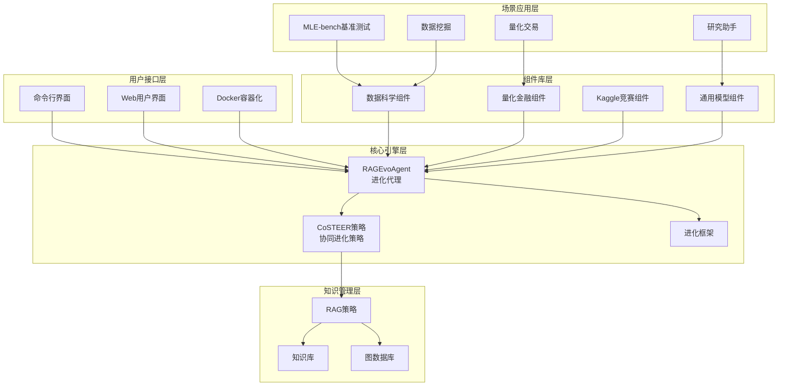
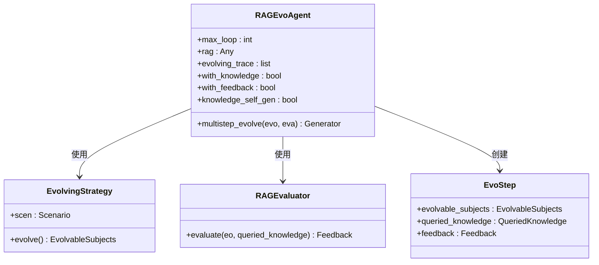
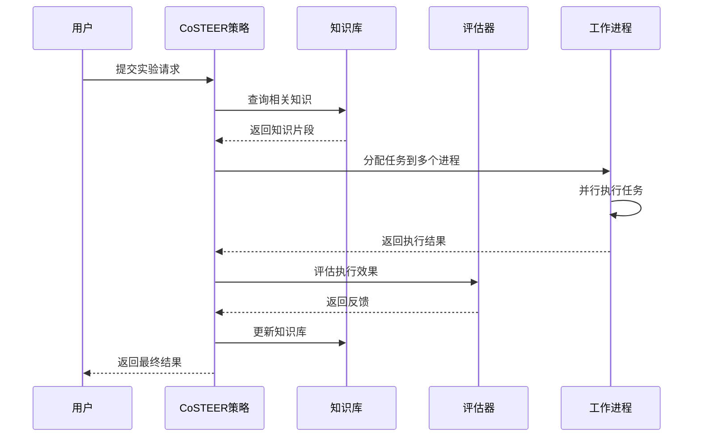
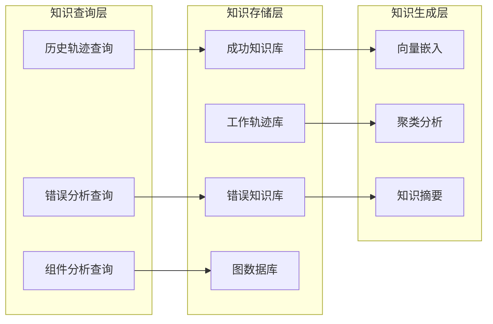
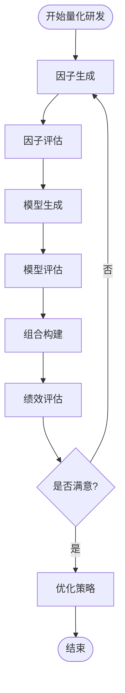
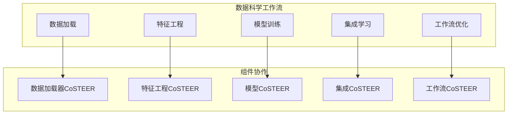
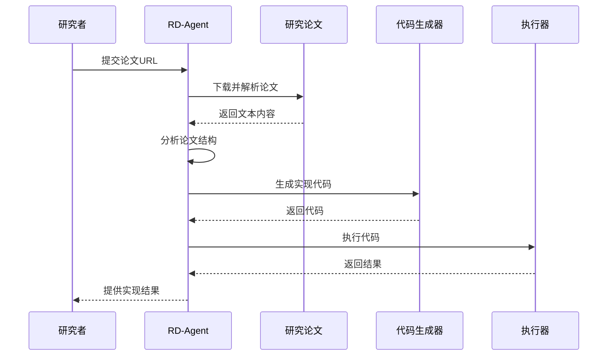
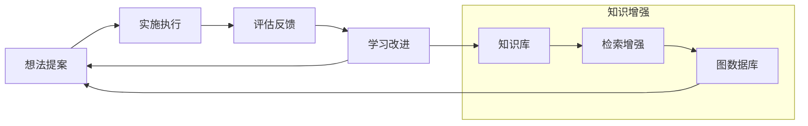

# RD-Agent项目概述

<cite>
**本文档中引用的文件**
- [README.md](file://README.md)
- [rdagent/core/evolving_agent.py](file://rdagent/core/evolving_agent.py)
- [rdagent/core/evolving_framework.py](file://rdagent/core/evolving_framework.py)
- [rdagent/components/coder/CoSTEER/__init__.py](file://rdagent/components/coder/CoSTEER/__init__.py)
- [rdagent/components/coder/CoSTEER/evolving_strategy.py](file://rdagent/components/coder/CoSTEER/evolving_strategy.py)
- [rdagent/components/coder/CoSTEER/knowledge_management.py](file://rdagent/components/coder/CoSTEER/knowledge_management.py)
- [rdagent/app/cli.py](file://rdagent/app/cli.py)
- [rdagent/scenarios/data_science/loop.py](file://rdagent/scenarios/data_science/loop.py)
- [rdagent/app/qlib_rd_loop/quant.py](file://rdagent/app/qlib_rd_loop/quant.py)
- [rdagent/core/conf.py](file://rdagent/core/conf.py)
- [rdagent/components/coder/CoSTEER/config.py](file://rdagent/components/coder/CoSTEER/config.py)
</cite>

## 目录
1. [项目简介](#项目简介)
2. [核心使命与价值](#核心使命与价值)
3. [技术架构概览](#技术架构概览)
4. [核心组件详解](#核心组件详解)
5. [应用场景](#应用场景)
6. [创新特性](#创新特性)
7. [与其他工具的对比](#与其他工具的对比)
8. [总结](#总结)

## 项目简介

RD-Agent是一个基于大语言模型（LLM）驱动的自动化研发框架，旨在实现数据驱动的研发过程自动化。该项目由微软开发，代表了人工智能在科学研究和工程开发领域的重大突破。

### 核心特点

- **自动化研发**：自动化的研究与开发流程，从想法提出到代码实现
- **多场景支持**：涵盖数据科学、量化金融、Kaggle竞赛等多个领域
- **智能进化**：基于多轮迭代、反馈学习和知识增强的自主进化能力
- **LLM驱动**：充分利用大型语言模型的强大推理和生成能力

## 核心使命与价值

### 使命宣言

RD-Agent致力于自动化工业研发过程中最关键和最有价值的部分，专注于数据驱动场景下的模型和数据开发。

### 核心价值主张

1. **知识提取**：从真实世界材料（报告、论文等）中提取关键公式、特征和模型
2. **代码实现**：将提取的知识转化为可运行的代码
3. **创新提案**：基于当前知识和观察提出新想法

### 技术愿景

项目相信，高质量解决方案的关键在于能够像人类专家一样持续改进研发技能的能力。通过不断学习和进化，代理应该能够在各个领域实现卓越的表现。

**章节来源**
- [README.md](file://README.md#L1-L100)

## 技术架构概览

RD-Agent采用模块化架构设计，核心围绕RAGEvoAgent和CoSTEER策略构建。

**图表来源**
- [rdagent/core/evolving_agent.py](file://rdagent/core/evolving_agent.py#L1-L50)
- [rdagent/components/coder/CoSTEER/__init__.py](file://rdagent/components/coder/CoSTEER/__init__.py#L1-L50)
- [rdagent/app/cli.py](file://rdagent/app/cli.py#L1-L30)

### 架构层次说明

1. **用户接口层**：提供多种交互方式，包括命令行、Web界面和容器化部署
2. **核心引擎层**：包含RAGEvoAgent和CoSTEER策略，负责智能决策和进化控制
3. **组件库层**：针对不同场景的专业化组件集合
4. **知识管理层**：支持检索增强生成（RAG）的知识管理系统
5. **场景应用层**：具体的应用场景和基准测试

**章节来源**
- [rdagent/core/evolving_agent.py](file://rdagent/core/evolving_agent.py#L1-L116)
- [rdagent/components/coder/CoSTEER/__init__.py](file://rdagent/components/coder/CoSTEER/__init__.py#L1-L177)

## 核心组件详解

### RAGEvoAgent：进化代理核心

RAGEvoAgent是RD-Agent的核心组件，实现了基于知识增强的进化代理功能。

**图表来源**
- [rdagent/core/evolving_agent.py](file://rdagent/core/evolving_agent.py#L20-L80)

#### 核心工作流程

1. **知识查询**：通过RAG系统查询相关知识
2. **进化策略**：应用CoSTEER策略进行任务进化
3. **评估反馈**：收集执行结果和性能反馈
4. **知识更新**：自动生成和更新知识库
5. **循环迭代**：重复上述过程直到完成

**章节来源**
- [rdagent/core/evolving_agent.py](file://rdagent/core/evolving_agent.py#L60-L116)

### CoSTEER策略：协同进化策略

CoSTEER（Collaborative STEpping Evolutionary Research）是RD-Agent的核心进化策略，实现了多进程协同的任务执行和知识管理。

**图表来源**
- [rdagent/components/coder/CoSTEER/evolving_strategy.py](file://rdagent/components/coder/CoSTEER/evolving_strategy.py#L20-L80)
- [rdagent/components/coder/CoSTEER/knowledge_management.py](file://rdagent/components/coder/CoSTEER/knowledge_management.py#L100-L200)

#### 策略特性

1. **多进程并行**：支持多个任务的并行执行
2. **智能分配**：根据历史反馈智能分配任务
3. **知识融合**：整合成功经验和失败教训
4. **动态调整**：根据执行情况动态调整策略

**章节来源**
- [rdagent/components/coder/CoSTEER/evolving_strategy.py](file://rdagent/components/coder/CoSTEER/evolving_strategy.py#L1-L135)
- [rdagent/components/coder/CoSTEER/knowledge_management.py](file://rdagent/components/coder/CoSTEER/knowledge_management.py#L1-L200)

### 知识管理系统

RD-Agent采用先进的RAG（Retrieval-Augmented Generation）策略，构建了多层次的知识管理体系。

**图表来源**
- [rdagent/components/coder/CoSTEER/knowledge_management.py](file://rdagent/components/coder/CoSTEER/knowledge_management.py#L300-L500)

**章节来源**
- [rdagent/components/coder/CoSTEER/knowledge_management.py](file://rdagent/components/coder/CoSTEER/knowledge_management.py#L500-L799)

## 应用场景

RD-Agent支持多个重要的数据驱动工业场景，每个场景都有专门的组件和优化策略。

### 量化金融场景

#### 自动化量化交易工厂

RD-Agent-Q是第一个数据驱动的多代理框架，用于自动化量化策略的全栈研发。

**图表来源**
- [rdagent/app/qlib_rd_loop/quant.py](file://rdagent/app/qlib_rd_loop/quant.py#L20-L80)

#### 核心功能

1. **因子迭代进化**：自动提出和实现新的因子
2. **模型协同优化**：因子与模型的联合优化
3. **报告因子提取**：从财务报告中自动提取因子
4. **实时回测**：基于Qlib平台的实时策略回测

**章节来源**
- [rdagent/app/qlib_rd_loop/quant.py](file://rdagent/app/qlib_rd_loop/quant.py#L1-L144)

### 数据科学场景

#### 自动化机器学习工程

RD-Agent的数据科学组件专注于Kaggle竞赛和实际数据科学问题的自动化解决。

**图表来源**
- [rdagent/scenarios/data_science/loop.py](file://rdagent/scenarios/data_science/loop.py#L50-L150)

#### 支持的竞赛类型

1. **Kaggle竞赛**：支持各种类型的Kaggle比赛
2. **医疗预测**：医学数据的预测建模
3. **金融预测**：金融市场的时间序列预测
4. **通用数据科学**：各种数据科学挑战

**章节来源**
- [rdagent/scenarios/data_science/loop.py](file://rdagent/scenarios/data_science/loop.py#L1-L100)

### 研究助手场景

#### 自动化研究论文处理

RD-Agent可以自动阅读研究论文并实现模型结构或构建数据集。

**图表来源**
- [rdagent/app/cli.py](file://rdagent/app/cli.py#L40-L60)

**章节来源**
- [rdagent/app/cli.py](file://rdagent/app/cli.py#L1-L88)

## 创新特性

### 多轮迭代进化

RD-Agent的核心创新在于其多轮迭代进化机制，实现了真正的自主学习和改进。

#### 进化循环

### 检索增强生成（RAG）

RD-Agent实现了先进的RAG策略，支持多种知识查询和融合方式：

1. **历史轨迹查询**：利用过去的成功和失败经验
2. **组件分析查询**：基于任务组件的相似性匹配
3. **错误分析查询**：从错误中学习和避免重复

### 知识图谱构建

项目构建了复杂的知识图谱，包含：

- **任务描述节点**：表示具体的任务要求
- **成功实现节点**：存储成功的代码实现
- **错误节点**：记录常见的错误模式
- **组件节点**：抽象的算法和方法组件

**章节来源**
- [rdagent/components/coder/CoSTEER/knowledge_management.py](file://rdagent/components/coder/CoSTEER/knowledge_management.py#L600-L964)

## 与其他工具的对比

### 传统自动化工具 vs RD-Agent

| 特性 | 传统自动化工具 | RD-Agent |
|------|---------------|----------|
| 学习能力 | 预定义规则，无自我改进 | 基于LLM的自主学习 |
| 知识管理 | 静态知识库 | 动态知识图谱 |
| 进化机制 | 固定流程 | 多轮迭代进化 |
| 应用场景 | 有限范围 | 多领域通用 |
| 智能程度 | 规则驱动 | 推理驱动 |

### 技术优势

1. **更强的泛化能力**：基于LLM的通用推理能力
2. **更好的适应性**：能够适应新的任务和环境
3. **更高的效率**：通过知识重用减少重复工作
4. **更好的质量**：通过多轮迭代获得更优解

### 性能表现

根据MLE-bench基准测试，RD-Agent在机器学习工程任务上表现出色：

| Agent | Low==Lite (%) | Medium (%) | High (%) | All (%) |
|-------|---------------|------------|----------|---------|
| R&D-Agent o3(R)+GPT-4.1(D) | 51.52 ± 6.9 | 19.3 ± 5.5 | 26.67 ± 0 | 30.22 ± 1.5 |
| R&D-Agent o1-preview | 48.18 ± 2.49 | 8.95 ± 2.36 | 18.67 ± 2.98 | 22.4 ± 1.1 |

**章节来源**
- [README.md](file://README.md#L50-L100)

## 总结

RD-Agent代表了人工智能在自动化研发领域的重大突破，通过以下核心创新实现了真正的智能自动化：

### 核心贡献

1. **架构创新**：提出了基于RAGEvoAgent和CoSTEER策略的新型自动化框架
2. **知识管理**：构建了先进的RAG知识管理系统和知识图谱
3. **场景覆盖**：支持数据科学、量化金融、Kaggle竞赛等多个重要场景
4. **性能领先**：在多个基准测试中取得优异成绩

### 技术特色

- **自主进化**：通过多轮迭代实现持续改进
- **知识增强**：利用检索增强生成提升性能
- **多模态支持**：支持文本、代码、数据等多种输入形式
- **实时反馈**：提供即时的执行反馈和改进建议

### 应用前景

RD-Agent为工业界提供了强大的自动化研发工具，能够显著提高研发效率和质量，降低技术门槛，推动人工智能在各个领域的深入应用。

随着技术的不断发展和完善，RD-Agent有望成为未来研发工作的重要基础设施，为人工智能时代的科技创新提供强有力的支持。