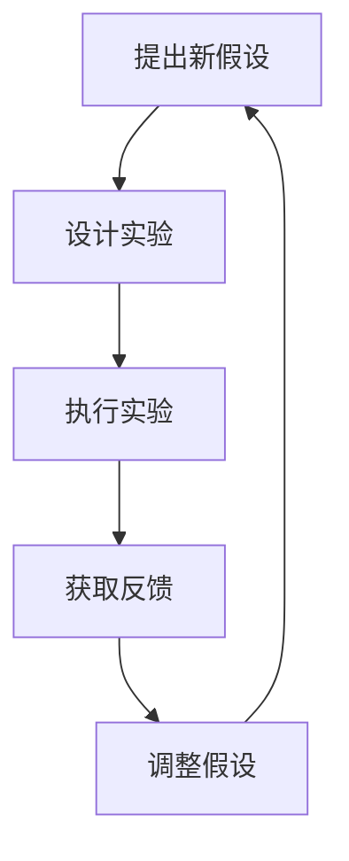
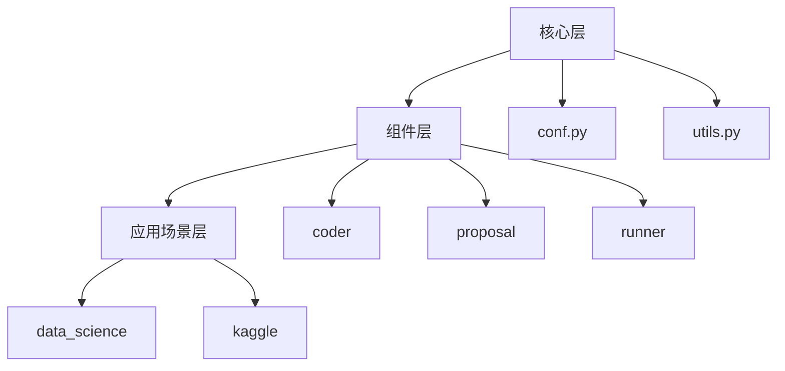
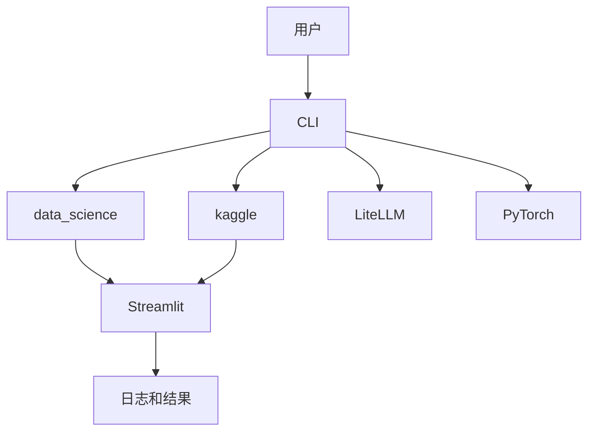

# 项目概述

<cite>
**本文档中引用的文件**  
- [README.md](file://README.md)
- [pyproject.toml](file://pyproject.toml)
- [rdagent/core/conf.py](file://rdagent/core/conf.py)
- [rdagent/app/cli.py](file://rdagent/app/cli.py)
- [rdagent/components/workflow/rd_loop.py](file://rdagent/components/workflow/rd_loop.py)
- [rdagent/components/workflow/conf.py](file://rdagent/components/workflow/conf.py)
- [rdagent/core/scenario.py](file://rdagent/core/scenario.py)
- [rdagent/oai/backend/litellm.py](file://rdagent/oai/backend/litellm.py)
- [rdagent/app/data_science/loop.py](file://rdagent/app/data_science/loop.py)
- [rdagent/app/qlib_rd_loop/quant.py](file://rdagent/app/qlib_rd_loop/quant.py)
- [rdagent/core/proposal.py](file://rdagent/core/proposal.py)
- [rdagent/utils/workflow/loop.py](file://rdagent/utils/workflow/loop.py)
</cite>

## 目录
1. [引言](#引言)
2. [核心定位与技术愿景](#核心定位与技术愿景)
3. [R&D双循环架构](#rnd双循环架构)
4. [技术栈集成](#技术栈集成)
5. [模块化分层架构](#模块化分层架构)
6. [典型使用场景](#典型使用场景)
7. [系统上下文图](#系统上下文图)

## 引言

RD-Agent 是一个基于大语言模型的自动化研发代理框架，旨在通过自动化数据驱动的研发流程来提升工业研发效率。该项目聚焦于数据科学、量化金融和Kaggle竞赛等场景，通过提案-执行-评估闭环实现自主进化。RD-Agent 的设计目标是构建一个能够自动提出新想法并实现这些想法的系统，从而推动数据驱动研发的自动化。

**Section sources**
- [README.md](file://README.md#L1-L50)

## 核心定位与技术愿景

RD-Agent 的核心定位是成为一个自动化研发代理框架，专注于数据驱动的研发过程。其技术愿景是通过自动化模型和数据的开发，实现工业研发的高效化。RD-Agent 通过两个关键组件 'R'（提出新想法）和 'D'（实现新想法）来实现这一目标。'R' 组件负责提出新的假设和实验设计，而 'D' 组件则负责将这些假设和设计转化为可执行的代码，并通过反馈机制不断优化。

**Section sources**
- [README.md](file://README.md#L51-L100)

## R&D双循环架构

RD-Agent 采用 R&D 双循环架构，通过提案-执行-评估闭环实现自主进化。该架构的核心是通过不断提出新假设、设计实验、执行实验并获取反馈，从而持续改进研发能力。具体来说，'R' 组件生成假设，'D' 组件将假设转化为实验代码，执行实验后获取反馈，再根据反馈调整假设，形成一个闭环。

**Diagram sources**
- [rdagent/core/proposal.py](file://rdagent/core/proposal.py#L1-L50)
- [rdagent/components/workflow/rd_loop.py](file://rdagent/components/workflow/rd_loop.py#L1-L20)

## 技术栈集成

RD-Agent 集成了多种关键技术，包括 LiteLLM、PyTorch、Qlib 和 Streamlit。LiteLLM 作为后端，支持多种 LLM 提供商的集成；PyTorch 用于深度学习模型的开发；Qlib 用于量化金融策略的自动化研发；Streamlit 用于构建用户界面，展示日志和结果。

**Section sources**
- [README.md](file://README.md#L101-L150)
- [pyproject.toml](file://pyproject.toml#L1-L20)

## 模块化分层架构

RD-Agent 采用模块化分层架构，分为核心层、组件层和应用场景层。核心层包含基础配置和通用工具，如 `conf.py` 和 `utils.py`；组件层包含具体的研发组件，如 `coder`、`proposal` 和 `runner`；应用场景层包含针对不同场景的具体实现，如 `data_science` 和 `kaggle`。

**Diagram sources**
- [rdagent/core/conf.py](file://rdagent/core/conf.py#L1-L20)
- [rdagent/components/coder/data_science/pipeline/exp.py](file://rdagent/components/coder/data_science/pipeline/exp.py#L1-L10)
- [rdagent/app/data_science/loop.py](file://rdagent/app/data_science/loop.py#L1-L20)

## 典型使用场景

RD-Agent 支持多种典型使用场景，包括自动化量化交易、自动化模型研发和自动化 Kaggle 竞赛。在自动化量化交易中，RD-Agent 可以通过迭代因子和模型的联合优化，实现高效的量化策略开发。在自动化模型研发中，RD-Agent 可以自动读取研究论文并实现模型结构。在自动化 Kaggle 竞赛中，RD-Agent 可以自动进行模型调优和特征工程。

**Section sources**
- [README.md](file://README.md#L151-L200)
- [rdagent/app/qlib_rd_loop/quant.py](file://rdagent/app/qlib_rd_loop/quant.py#L1-L20)

## 系统上下文图

RD-Agent 的系统上下文图展示了其与外部系统的交互关系。RD-Agent 通过 CLI 入口接收用户命令，调用不同的应用场景模块，如 `data_science` 和 `kaggle`，并通过 Streamlit 展示日志和结果。同时，RD-Agent 依赖于 LiteLLM 和 PyTorch 等外部技术栈，实现高效的模型开发和推理。

**Diagram sources**
- [rdagent/app/cli.py](file://rdagent/app/cli.py#L1-L20)
- [rdagent/app/data_science/loop.py](file://rdagent/app/data_science/loop.py#L1-L20)
- [rdagent/app/qlib_rd_loop/quant.py](file://rdagent/app/qlib_rd_loop/quant.py#L1-L20)