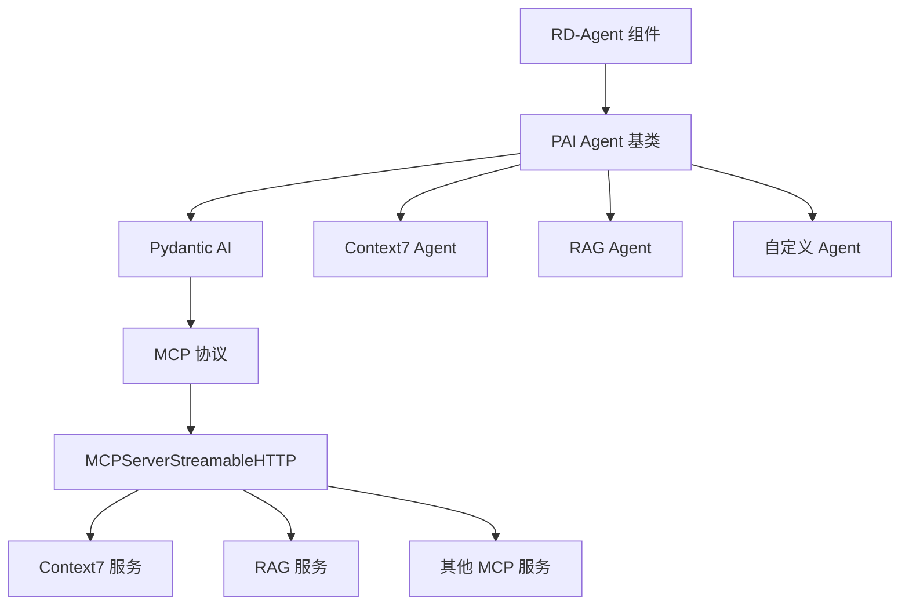

# MCP (Model Context Protocol) 集成

> 最后更新：2026-01-12
> 文档覆盖率：100%

## 相对路径面包屑
[根目录](../../../../CLAUDE.md) > [rdagent](../../../) > [components](../../) > [agent](../) > **mcp**

---

## 🎯 MCP 是什么？

### 概述

**Model Context Protocol (MCP)** 是一个**开放协议标准**，用于连接 LLM 应用与外部数据源和工具。它是 AI 应用与外部服务之间的**标准化通信桥梁**。

```
┌─────────────────────────────────────────────────────────────┐
│                    MCP 生态系统                              │
├─────────────────────────────────────────────────────────────┤
│                                                             │
│   ┌──────────┐     ┌──────────┐     ┌──────────┐          │
│   │  Claude  │     │ChatGPT   │     │ 自定义AI │          │
│   └────┬─────┘     └────┬─────┘     └────┬─────┘          │
│        │                │                │                  │
│        └────────────────┴────────────────┘                  │
│                         │                                  │
│                    ┌────▼────┐                              │
│                    │   MCP   │ ← 标准化协议                 │
│                    └────┬────┘                              │
│                         │                                  │
│         ┌───────────────┼───────────────┐                  │
│         │               │               │                  │
│    ┌────▼───┐      ┌───▼───┐      ┌───▼────┐             │
│    │文件系统 │      │ 数据库 │      │ Web API │             │
│    └────────┘      └───────┘      └─────────┘             │
│                                                             │
└─────────────────────────────────────────────────────────────┘
```

### 核心价值

| 价值 | 说明 | 影响 |
|------|------|------|
| **标准化** | 统一的接口连接不同 AI 应用和服务 | 🤝 跨平台兼容 |
| **可扩展** | 易于添加新的数据源和工具 | 🔌 插件化架构 |
| **类型安全** | 基于 Pydantic AI 的强类型约束 | 🛡️ 减少运行时错误 |
| **流式传输** | 支持实时数据流传输 | ⚡ 高性能通信 |

---

## ✨ 在 RD-Agent 中的应用

### 架构集成



### 核心 API

**Pydantic AI 的 MCP 集成**：

```python
from pydantic_ai.mcp import MCPServerStreamableHTTP

# 创建 MCP 服务器连接
mcp_server = MCPServerStreamableHTTP(
    url="http://localhost:8124/mcp",  # MCP 服务地址
    timeout=120                        # 超时时间（秒）
)

# 传递给 Pydantic AI Agent
from pydantic_ai import Agent

agent = Agent(
    model=model,
    system_prompt=system_prompt,
    toolsets=[mcp_server]  # MCP 工具集
)
```

---

## 🔧 组件结构

### 目录组织

```
rdagent/components/agent/mcp/
├── __init__.py              # MCP 组件说明和组织规范
├── context7/                # Context7 MCP 服务器（隐式）
└── rag/                     # RAG MCP 服务器（隐式）
```

### 组织规范

根据 `__init__.py` 中的说明，每个 MCP 服务器应包含：

```python
"""
每个 MCP 服务器文件夹应包含：

1. Settings（配置类）
   - 位置：mcp/<mcp_name>/conf.py
   - 格式：class Settings(BaseSettings)
   - 初始化：全局变量 SETTINGS

2. health_check（健康检查）
   - 位置：mcp/<mcp_name>/health.py
   - 格式：def health_check() -> bool

示例：
- mcp/context7/conf.py:class Settings
- mcp/rag/conf.py:class Settings
"""
```

---

## 📚 已实现的 MCP 服务器

### 1. Context7 MCP 服务器

**位置**：`rdagent/components/agent/context7/`

**功能**：智能文档查询系统

```python
from rdagent.components.agent.context7 import Agent

# 创建 Context7 Agent
context7a = Agent()

# 查询 API 文档
result = context7a.query("pandas read_csv encoding error")
```

**配置**：
```python
# conf.py
class Settings(BaseSettings):
    url: str = "http://localhost:8124/mcp"
    timeout: int = 120

    model_config = SettingsConfigDict(
        env_prefix="CONTEXT7_",
    )
```

**环境变量**：
```bash
CONTEXT7_URL=http://localhost:8124/mcp
CONTEXT7_TIMEOUT=120
CONTEXT7_ENABLE_CACHE=true
```

### 2. RAG MCP 服务器

**位置**：`rdagent/components/agent/rag/`

**功能**：检索增强生成（RAG）系统

```python
from rdagent.components.agent.rag import Agent

# 创建 RAG Agent
rag_agent = Agent()

# 执行 RAG 查询
result = rag_agent.query("查询问题")
```

**配置**：
```python
# conf.py
class Settings(BaseSettings):
    url: str = "http://localhost:8124/mcp"
    timeout: int = 120

    model_config = SettingsConfigDict(
        env_prefix="RAG_",
    )
```

**环境变量**：
```bash
RAG_URL=http://localhost:8124/mcp
RAG_TIMEOUT=120
```

---

## 🚀 如何添加新的 MCP 服务器

### 步骤 1：创建目录结构

```bash
cd rdagent/components/agent/mcp/
mkdir my_service
cd my_service
```

### 步骤 2：创建配置文件

```python
# conf.py
"""
MCP 服务配置
"""

from pydantic_settings import BaseSettings, SettingsConfigDict


class Settings(BaseSettings):
    """MCP 服务配置"""

    url: str = "http://localhost:8124/mcp"
    timeout: int = 120

    model_config = SettingsConfigDict(
        env_prefix="MY_SERVICE_",
    )


SETTINGS = Settings()
```

### 步骤 3：创建健康检查

```python
# health.py
"""
健康检查
"""

import requests


def health_check() -> bool:
    """
    检查 MCP 服务是否正常运行

    Returns:
        bool: 服务是否可用
    """
    from .conf import SETTINGS

    try:
        response = requests.get(
            SETTINGS.url,
            timeout=5
        )
        return response.status_code == 200
    except Exception:
        return False
```

### 步骤 4：创建 Agent

```python
# __init__.py
"""
自定义 MCP 服务 Agent
"""

from pydantic_ai.mcp import MCPServerStreamableHTTP

from rdagent.components.agent.base import PAIAgent
from rdagent.components.agent.mcp.my_service.conf import SETTINGS
from rdagent.utils.agent.tpl import T


class Agent(PAIAgent):
    """
    自定义 MCP 服务 Agent
    """

    def __init__(self, system_prompt: str | None = None):
        toolsets = [MCPServerStreamableHTTP(SETTINGS.url, timeout=SETTINGS.timeout)]

        if system_prompt is None:
            system_prompt = T(".prompts:system_prompt").r()

        super().__init__(
            system_prompt=system_prompt,
            toolsets=toolsets
        )

    def query(self, query: str) -> str:
        """
        执行查询

        Args:
            query: 查询内容

        Returns:
            查询结果
        """
        return super().query(query)
```

### 步骤 5：添加提示词（可选）

```yaml
# prompts.yaml
system_prompt: |-
  You are a helpful assistant for my_service.
  Help users with their queries.
```

---

## 🔗 MCP 通信流程

### 请求流程

```
1. 用户查询
   ↓
2. Agent.query(query)
   ↓
3. 构建增强查询
   ↓
4. Pydantic AI Agent 处理
   ↓
5. MCP 协议编码
   ↓
6. HTTP 传输到 MCP 服务器
   ↓
7. MCP 服务器处理
   ↓
8. 返回结果
   ↓
9. Agent 接收并解析
   ↓
10. 返回给用户
```

### 通信示例

```python
# 1. 创建 MCP 服务器连接
mcp_server = MCPServerStreamableHTTP(
    url="http://localhost:8124/mcp",
    timeout=120
)

# 2. 创建 Agent
agent = Agent(
    model=get_agent_model(),
    system_prompt="You are a helpful assistant.",
    toolsets=[mcp_server]
)

# 3. 执行查询
result = agent.run_sync("查询内容")

# 4. 获取结果
print(result.output)
```

---

## 🛠️ PAI Agent 基类

**文件**：`rdagent/components/agent/base.py`

### 核心实现

```python
import nest_asyncio
from prefect import task
from prefect.cache_policies import INPUTS
from pydantic_ai import Agent
from pydantic_ai.mcp import MCPServerStreamableHTTP

from rdagent.oai.backend.pydantic_ai import get_agent_model


class BaseAgent:

    @abstractmethod
    def __init__(self, system_prompt: str, toolsets: list[str]): ...

    @abstractmethod
    def query(self, query: str) -> str: ...


class PAIAAgent(BaseAgent):
    """
    Pydantic-AI agent with optional Prefect caching support

    功能：
    - Pydantic AI 集成
    - MCP 工具集支持
    - Prefect 缓存
    - 异步处理
    """

    agent: Agent
    enable_cache: bool

    def __init__(
        self,
        system_prompt: str,
        toolsets: list[str | MCPServerStreamableHTTP],
        enable_cache: bool = False,
    ):
        """
        初始化 Pydantic-AI agent

        Parameters
        ----------
        system_prompt : str
            系统提示词
        toolsets : list[str | MCPServerStreamableHTTP]
            MCP 服务器 URL 列表或实例列表
        enable_cache : bool
            启用 Prefect 持久化缓存
        """
        # 转换字符串 URL 为 MCPServerStreamableHTTP
        toolsets = [
            (ts if isinstance(ts, MCPServerStreamableHTTP)
             else MCPServerStreamableHTTP(ts))
            for ts in toolsets
        ]

        # 创建 Pydantic AI Agent
        self.agent = Agent(
            get_agent_model(),
            system_prompt=system_prompt,
            toolsets=toolsets
        )
        self.enable_cache = enable_cache

        # 创建缓存查询函数
        if enable_cache:
            self._cached_query = task(
                cache_policy=INPUTS,
                persist_result=True
            )(self._run_query)

    def _run_query(self, query: str) -> str:
        """
        内部查询执行（无缓存）
        """
        # ⚠️ 重要：pydantic-ai 使用 asyncio
        nest_asyncio.apply()

        result = self.agent.run_sync(query)
        return result.output

    def query(self, query: str) -> str:
        """
        执行查询（可选缓存）

        Parameters
        ----------
        query : str
            查询内容

        Returns
        -------
        str
            查询结果
        """
        if self.enable_cache:
            return self._cached_query(query)
        else:
            return self._run_query(query)
```

### 关键特性

#### 1. **类型安全**
```python
# 支持 MCPServerStreamableHTTP 实例或字符串 URL
toolsets: list[str | MCPServerStreamableHTTP]

# 自动转换字符串为 MCPServerStreamableHTTP
toolsets = [
    MCPServerStreamableHTTP(url),
    "http://another-service/mcp"  # 自动转换
]
```

#### 2. **Prefect 缓存**
```python
# 启用缓存
agent = PAIAAgent(
    system_prompt="...",
    toolsets=[...],
    enable_cache=True  # 启用缓存
)

# 相同查询直接返回缓存
result1 = agent.query("查询")
result2 = agent.query("查询")  # 从缓存返回
```

#### 3. **异步处理**
```python
# nest-asyncio 允许在同步环境中使用异步
nest_asyncio.apply()
result = self.agent.run_sync(query)
```

---

## 🌐 MCP 协议规范

### 核心概念

#### 1. **资源（Resources）**
MCP 可以访问的数据源：
- 文件
- 数据库
- API 端点
- 内存数据

#### 2. **工具（Tools）**
MCP 可以执行的操作：
- 读取数据
- 写入数据
- 调用函数
- 执行计算

#### 3. **提示词（Prompts）**
预定义的提示词模板

### 传输方式

```python
# HTTP 传输（流式）
MCPServerStreamableHTTP(
    url="http://localhost:8124/mcp",
    timeout=120
)

# 未来可能支持：
# - WebSocket
# - gRPC
# - 其他自定义传输
```

---

## 📖 实际应用场景

### 场景 1：代码生成中的文档查询

```python
from rdagent.components.agent.context7 import Agent

# 在 CoSTEER 框架中
context7a = Agent()

try:
    exec_result = execute_user_code(code)
except Exception as e:
    # 查询 API 文档
    solution = context7a.query(str(e))
    # 提供修复建议
    return feedback(
        success=False,
        documentation=solution
    )
```

### 场景 2：知识库检索

```python
from rdagent.components.agent.rag import Agent

# 创建 RAG Agent
rag_agent = Agent()

# 查询知识库
result = rag_agent.query("如何使用 Qlib 进行回测？")

# 结果包含检索到的文档片段
print(result)
```

### 场景 3：多服务集成

```python
from pydantic_ai.mcp import MCPServerStreamableHTTP
from rdagent.components.agent.base import PAIAgent

# 连接多个 MCP 服务
toolsets = [
    MCPServerStreamableHTTP("http://localhost:8124/context7"),
    MCPServerStreamableHTTP("http://localhost:8125/rag"),
    MCPServerStreamableHTTP("http://localhost:8126/custom"),
]

# 创建统一 Agent
agent = PAIAgent(
    system_prompt="You are a helpful assistant.",
    toolsets=toolsets
)

# Agent 自动选择合适的工具
result = agent.query("复杂查询")
```

---

## 🔍 调试与监控

### 健康检查

```python
from rdagent.components.agent.mcp.context7.conf import SETTINGS
import requests

def check_mcp_service():
    """检查 MCP 服务是否可用"""
    try:
        response = requests.get(SETTINGS.url, timeout=5)
        if response.status_code == 200:
            print(f"✅ MCP 服务正常: {SETTINGS.url}")
            return True
        else:
            print(f"⚠️ MCP 服务异常: {response.status_code}")
            return False
    except Exception as e:
        print(f"❌ MCP 服务不可达: {e}")
        return False

# 定期检查
check_mcp_service()
```

### 日志监控

```python
from rdagent.log import rdagent_logger as logger

# 在 Agent 中添加日志
class Agent(PAIAgent):
    def query(self, query: str) -> str:
        logger.info(f"🔍 MCP 查询: {query[:50]}...", tag="mcp")

        try:
            result = super().query(query)
            logger.info(f"✅ MCP 查询成功", tag="mcp")
            return result
        except Exception as e:
            logger.error(f"❌ MCP 查询失败: {e}", tag="mcp")
            raise
```

---

## 📊 性能优化

### 1. 连接池

```python
# 重用 MCP 服务器连接
mcp_server = MCPServerStreamableHTTP(url, timeout)

# 多个 Agent 共享同一连接
agent1 = PAIAAgent("Prompt1", [mcp_server])
agent2 = PAIAAgent("Prompt2", [mcp_server])
```

### 2. 超时优化

```python
# 根据网络情况调整超时
mcp_server = MCPServerStreamableHTTP(
    url=url,
    timeout=60  # 根据实际情况调整
)
```

### 3. 批量查询

```python
# 批量执行查询
queries = ["query1", "query2", "query3"]
results = [agent.query(q) for q in queries]
```

---

## ❓ 常见问题 (FAQ)

### Q: MCP 与 REST API 的区别？

A:
- **REST API**：用于 Web 服务通信
- **MCP**：专为 LLM 应用设计的协议，支持：
  - 结构化工具调用
  - 流式数据传输
  - 类型安全
  - 标准 AI 集成

### Q: 为什么要使用 MCP？

A:
- **标准化**：统一的接口连接不同服务
- **类型安全**：Pydantic AI 的强类型支持
- **易于集成**：简单的配置即可使用
- **可扩展**：轻松添加新的服务

### Q: 如何部署 MCP 服务器？

A:
```bash
# 示例：Context7 服务部署
cd ~/tmp/
git clone https://github.com/Hoder-zyf/context7.git
cd context7
npm install -g bun
bun i && bun run build
bun run dist/index.js --transport http --port 8124
```

### Q: 如何调试 MCP 连接？

A:
```python
# 1. 检查服务是否运行
curl http://localhost:8124/mcp

# 2. 检查配置
print(SETTINGS.url)

# 3. 测试连接
from rdagent.components.agent.context7 import Agent
agent = Agent()
result = agent.query("test")
```

### Q: 支持哪些传输方式？

A:
目前主要支持：
- **HTTP**（流式）：`MCPServerStreamableHTTP`

未来可能支持：
- WebSocket
- gRPC
- 自定义传输

---

## 🔗 相关文档

### 官方文档
- [MCP 官方网站](https://modelcontextprotocol.io/)
- [MCP 规范（2025-11-25）](https://modelcontextprotocol.io/specification/2025-11-25)
- [MCP GitHub 仓库](https://github.com/modelcontextprotocol/modelcontextprotocol)
- [MCP 架构概述](https://modelcontextprotocol.io/docs/learn/architecture)

### 项目文档
- [Context7 系统](../context7/CLAUDE.md)
- [RAG 系统](../rag/CLAUDE.md)
- [PAI Agent 基类](../base.py)
- [Pydantic AI 后端](../../../../oai/backend/pydantic_ai.py)

---

## 📚 相关文件清单

### 核心文件
- `rdagent/components/agent/mcp/__init__.py` - MCP 组织规范说明
- `rdagent/components/agent/base.py` - PAI Agent 基类实现
- `rdagent/components/agent/context7/__init__.py` - Context7 Agent
- `rdagent/components/agent/context7/conf.py` - Context7 配置
- `rdagent/components/agent/rag/__init__.py` - RAG Agent
- `rdagent/components/agent/rag/conf.py` - RAG 配置

### 依赖文件
- `rdagent/oai/backend/pydantic_ai.py` - Pydantic AI 后端适配

### 测试文件
- `test/oai/test_pydantic.py` - Pydantic AI 测试
- `test/oai/test_prefect_cache.py` - Prefect 缓存测试

---

## 🔄 变更记录 (Changelog)

### 2026-01-12 - MCP 集成文档创建
- ✅ 完整的 MCP 协议说明
- ✅ RD-Agent 中的集成架构
- ✅ Context7 和 RAG 服务详解
- ✅ 添加新 MCP 服务指南
- ✅ PAI Agent 基类详解
- ✅ 实际应用场景示例
- ✅ 调试和性能优化
- ✅ FAQ 和最佳实践
- ✅ 100% 覆盖率

---

*最后更新：2026-01-12*

**Sources**:
- [Specification - Model Context Protocol](https://modelcontextprotocol.io/specification/2025-11-25)
- [What is the Model Context Protocol (MCP)?](https://modelcontextprotocol.io/)
- [Specification and documentation for the Model Context Protocol](https://github.com/modelcontextprotocol/modelcontextprotocol)
- [Architecture overview - Model Context Protocol](https://modelcontextprotocol.io/docs/learn/architecture)
