# Qlib 量化交易场景

> 最后更新：2026-01-12
> 文档覆盖率：100%

## 相对路径面包屑
[根目录](../../../CLAUDE.md) > [rdagent](../../) > [scenarios](../) > **qlib**

---

## 模块职责

Qlib 场景是 RD-Agent 中专门面向量化交易的应用场景，集成了微软开源的 Qlib 量化投资框架。该场景提供了完整的量化因子开发、模型构建、回测评估和生产部署的端到端自动化能力。

**核心价值**：
- 🎯 **因子自动挖掘**：基于 AI 的量化因子自动生成和优化
- 📊 **多因子模型**：支持复杂的多因子组合和权重优化
- 🔄 **报告期架构**：正确处理财务数据的时效性，避免前视偏差
- 🏭 **生产级示例**：4 个完整可运行的量化策略示例
- 🧪 **完整工具链**：从数据处理到因子验证的完整工具集

---

## ✨ 模块结构图

```mermaid
graph TD
    A["(Qlib 场景) rdagent/scenarios/qlib"] --> B["experiment/"];
    A --> C["developer/"];
    A --> D["proposal/"];
    A --> E["factor_experiment_loader/"];
    A --> F["docker/"];
    A --> G["prompts.yaml"];

    B --> B1["factor_experiment.py"];
    B --> B2["model_experiment.py"];
    B --> B3["quant_experiment.py"];
    B --> B4["report_period_utils.py"];
    B --> B5["workspace.py"];
    B --> B6["examples/"];

    C --> C1["factor_runner.py"];
    C --> C2["model_runner.py"];
    C --> C3["factor_coder.py"];
    C --> C4["model_coder.py"];
    C --> C5["feedback.py"];
    C --> C6["utils.py"];

    D --> D1["factor_proposal.py"];
    D --> D2["model_proposal.py"];
    D --> D3["quant_proposal.py"];
    D --> D4["bandit.py"];

    E --> E1["pdf_loader.py"];
    E --> E2["json_loader.py"];

    B6 --> B61["ex01_basic_financial_factors.py"];
    B6 --> B62["ex02_composite_value_momentum.py"];
    B6 --> B63["ex03_industry_relative_strength.py"];
    B6 --> B64["ex04_report_period_roe.py"];
    B6 --> B65["run_all_examples.py"];

    click B1 "./experiment/factor_experiment.py" "查看因子实验"
    click B2 "./experiment/model_experiment.py" "查看模型实验"
    click B4 "./experiment/report_period_utils.py" "查看报告期工具"
    click C1 "./developer/factor_runner.py" "查看因子运行器"
    click D1 "./proposal/factor_proposal.py" "查看因子提案生成"
```



---

## 🎯 核心功能特性

### 1. 📊 报告期（Report Period）架构

**核心问题**：财务数据是季度报告，不能简单 forward-fill，必须使用公告日期确定数据可用性。

**解决方案**：
```python
from rdagent.scenarios.qlib.experiment.report_period_utils import ReportPeriodAccessor

# 创建访问器
accessor = ReportPeriodAccessor(df)

# 获取某股票在指定日期可获得的最新财务数据
roe_at_date = accessor.get_financial_at_date('600000.SH', '2025-12-29', 'ROE')

# 获取时间序列
roe_series = accessor.get_financial_series('600000.SH', 'ROE',
                                           start_date='2025-11-01',
                                           end_date='2025-12-29')

# 获取横截面数据（用于因子计算）
cross_section = accessor.get_all_financials_at_date('2025-12-29', 'ROE')
```

**关键特性**：
- ✅ 财务数据只在公告日有值（保留其季度特性）
- ✅ 在任意日期 t，使用"在时间 t 已公告的最新报告"的数据
- ✅ 正确反映信息可获得性，避免前视偏差
- ✅ 支持时间序列、横截面、单点查询等多种访问模式

### 2. 🔗 复合因子系统

**支持多因子组合和优先级管理**：
```python
# 价值 + 动量复合因子
value_signal = 1 / (PE.rank(pct=True) + 0.01)  # PE 百分位倒数
momentum_signal = returns_20d.zscore()          # 20日收益率 z-score

composite_factor = (
    value_signal * 0.4 +      # 价值信号 40%
    momentum_signal * 0.6     # 动量信号 60%
)
```

**学术依据**：Asness, Moskowitz, Pedersen (2013) "Value and Momentum Everywhere"
- 价值和动量负相关，组合后更稳定
- 长期表现优于单因子

### 3. 🏭 行业因子引擎

**基于行业分类的相对强度和轮动策略**：
```python
# 行业相对 PE 因子
industry_pe = PE.groupby(industry).rank(pct=True)
industry_relative_pe = (PE / PE.groupby(industry).transform('mean'))

# 行业中性动量
industry_neutral_momentum = (
    returns_20d.groupby(industry).apply(lambda x: x - x.mean())
)
```

**优势**：
- 消除行业偏差
- 降低行业集中风险
- 更公平的公司间比较

### 4. 🧪 数据质量保障

**完整的数据验证和处理工具链**：
- 数据验证：检查数据完整性和一致性
- 前向填充：正确处理财务数据的时效性
- 数据合并：整合多源数据（价格、财务、行业）
- 异常检测：识别和处理异常值

---

## 🏗️ 实验框架架构

### 因子实验 (Factor Experiment)

**核心类**：`QlibFactorExperiment`

```python
from rdagent.scenarios.qlib.experiment.factor_experiment import QlibFactorExperiment

exp = QlibFactorExperiment(
    target=None,           # 目标因子
    based_experiments=[],  # 基于的实验
    ...
)
```

**功能**：
- 📝 自动生成因子代码
- 🔄 执行因子回测
- 📊 计算因子收益（IC、IR、RankIC 等）
- 🎯 自动评估因子质量

**实验配置**：
```yaml
# conf_baseline.yaml
experiment:
  name: baseline
  # 因子定义
  # 数据源配置
  # 回测参数
  # 评估指标
```

### 模型实验 (Model Experiment)

**核心类**：`QlibModelExperiment`

```python
from rdagent.scenarios.qlib.experiment.model_experiment import QlibModelExperiment

exp = QlibModelExperiment(
    target=None,           # 目标模型
    based_experiments=[],  # 基于的实验
    ...
)
```

**功能**：
- 🤖 自动生成模型代码
- 🎓 支持多种机器学习算法
- 📈 模型训练和验证
- 🔮 预测和回测

### 量化实验 (Quant Experiment)

**核心类**：`QlibQuantScenario`

综合因子和模型的完整量化策略开发场景。

---

## 🔧 开发工具

### Factor Runner - 因子运行器

**核心类**：`QlibFactorRunner`

**功能**：
- 📊 因子数据预处理和合并
- 🔄 自动去重（IC > 0.99 的因子）
- 🐳 Docker 容器化执行
- 💾 结果缓存和管理

**关键方法**：
```python
def develop(self, exp: QlibFactorExperiment) -> QlibFactorExperiment:
    """
    生成实验：处理和组合因子数据，
    然后将组合数据传递给 Docker 进行回测
    """
    # 1. 处理基线实验
    # 2. 合并因子数据
    # 3. 去重新因子
    # 4. 执行回测
    # 5. 返回结果
```

### Model Runner - 模型运行器

**核心类**：`QlibModelRunner`

**功能**：
- 🤖 模型训练和验证
- 📊 特征工程和选择
- 🎯 超参数优化
- 🔮 预测和评估

### Factor Coder - 因子编码器

**核心类**：`QlibFactorCoder`

**功能**：
- 💬 根据假设生成因子代码
- ✅ 代码质量检查
- 🧪 自动测试和验证
- 📝 生成文档和注释

### Model Coder - 模型编码器

**核心类**：`QlibModelCoder`

**功能**：
- 💬 根据需求生成模型代码
- 🎓 支持多种 ML 框架
- ✅ 代码质量检查
- 🧪 自动测试和验证

---

## 🎲 提案系统

### Factor Proposal - 因子提案生成

**核心类**：`QlibFactorHypothesisGen`

**功能**：
- 💡 自动生成因子假设
- 📊 基于历史反馈优化
- 🎯 多样性策略支持
- 🧠 RAG 增强的知识复用

**输出格式**：
```json
{
  "hypothesis": "因子假设描述",
  "reason": "理论依据",
  "concise_reason": "简明理由",
  "concise_observation": "观察",
  "concise_justification": "论证",
  "concise_knowledge": "相关知识"
}
```

### Model Proposal - 模型提案生成

**核心类**：`QlibModelHypothesisGen`

**功能**：
- 🤖 自动生成模型假设
- 📊 算法选择建议
- 🎯 超参数配置
- 🧠 基于经验的优化

### Quant Proposal - 量化提案生成

**核心类**：`QlibQuantHypothesisGen`

综合因子和模型的完整量化策略提案生成。

---

## 📚 生产级示例

### 示例概览

| 示例 | 文件 | 说明 | 输出 |
|------|------|------|------|
| **ex01** | `ex01_basic_financial_factors.py` | 基础财务因子（ROE、PE、DebtToAssets） | `ex01_*.h5` |
| **ex02** | `ex02_composite_value_momentum.py` | 复合因子：价值 + 动量组合 | `ex02_*.h5` |
| **ex03** | `ex03_industry_relative_strength.py` | 行业相对强度因子（行业中性） | `ex03_*.h5` |
| **ex04** | `ex04_report_period_roe.py` | 报告期概念：正确使用财务数据 | `ex04_*.h5` |

### 快速开始

```bash
# 进入示例目录
cd rdagent/scenarios/qlib/experiment/examples/

# 检查环境
python run_all_examples.py --check-only

# 列出所有示例
python run_all_examples.py --list

# 运行单个示例
python run_all_examples.py --example 1

# 运行所有示例
python run_all_examples.py --all
```

### 示例详解

#### ex01: 基础财务因子

**包含因子**：
- **ROE Factor** - 净资产收益率（盈利能力）
- **PE Factor** - 市盈率（估值）
- **DebtToAssets Factor** - 资产负债率（偿债风险）

**核心概念**：
- 截面标准化（z-score、rank）
- 过滤缺失值
- 因子统计和分析

#### ex02: 复合因子 - 价值 + 动量

**因子构成**：
- **价值信号** (40%): PE 百分位倒数
- **动量信号** (60%): 20日收益率 z-score

**学术依据**：
- Asness, Moskowitz, Pedersen (2013): "Value and Momentum Everywhere"
- 价值和动量负相关，组合后更稳定

#### ex03: 行业相对强度因子

**包含因子**：
- **行业相对 PE** - 在行业内比较估值
- **行业相对 ROE** - 在行业内比较盈利能力
- **行业中性动量** - 在行业内比较价格动量

**优势**：
- 消除行业偏差
- 降低行业集中风险
- 更公平的公司间比较

#### ex04: 报告期概念

**核心问题**：
- 财务数据是季度报告，不能简单 forward-fill
- 必须使用公告日期确定数据可用性

**正确做法**：
- 使用 `end_date`（报告期结束日）和 `ann_date`（公告日期）
- 每个交易日使用该日或之前公布的最新财报

---

## 📋 配置系统

### 配置模板

#### 1. 基线配置 (`conf_baseline.yaml`)

单因子回测的基础配置。

#### 2. 组合因子配置 (`conf_combined_factors.yaml`)

多因子组合的回测配置。

#### 3. SOTA 模型配置 (`conf_combined_factors_sota_model.yaml`)

包含 ML 模型的完整回测配置。

### 实验设置

```python
from rdagent.app.qlib_rd_loop.conf import FACTOR_PROP_SETTING, MODEL_PROP_SETTING

# 因子实验时间设置
FACTOR_PROP_SETTING.train_start  # 训练开始
FACTOR_PROP_SETTING.train_end    # 训练结束
FACTOR_PROP_SETTING.valid_start  # 验证开始
FACTOR_PROP_SETTING.valid_end    # 验证结束
FACTOR_PROP_SETTING.test_start   # 测试开始
FACTOR_PROP_SETTING.test_end     # 测试结束

# 模型实验时间设置
MODEL_PROP_SETTING.train_start
MODEL_PROP_SETTING.train_end
# ...
```

---

## 🔗 对外接口

### 核心类

```python
# 实验类
from rdagent.scenarios.qlib.experiment.factor_experiment import (
    QlibFactorExperiment,
    QlibFactorScenario
)
from rdagent.scenarios.qlib.experiment.model_experiment import (
    QlibModelExperiment,
    QlibModelScenario
)

# 运行器类
from rdagent.scenarios.qlib.developer.factor_runner import QlibFactorRunner
from rdagent.scenarios.qlib.developer.model_runner import QlibModelRunner

# 提案生成类
from rdagent.scenarios.qlib.proposal.factor_proposal import (
    QlibFactorHypothesisGen,
    QlibFactorHypothesis2Experiment
)

# 工具类
from rdagent.scenarios.qlib.experiment.report_period_utils import ReportPeriodAccessor
```

### CLI 集成

```bash
# 启动量化交易场景 - 因子模式
rdagent quant factor

# 启动量化交易场景 - 模型模式
rdagent quant model
```

---

## 🧪 测试与验证

### 测试策略

**单元测试**：
- 报告期访问器测试
- 因子计算逻辑测试
- 数据处理工具测试

**集成测试**：
- 完整因子回测流程测试
- 模型训练和预测测试
- Docker 环境测试

**示例测试**：
- 4 个生产级示例可独立运行
- 验证输出正确性
- 性能基准测试

### 运行测试

```bash
# 运行示例
cd rdagent/scenarios/qlib/experiment/examples/
python run_all_examples.py --all

# Docker 环境测试
pytest test/utils/test_env.py::EnvUtils::test_docker -v
```

---

## 📊 数据处理工具链

### 数据文件

```
~/git_ignore_folder/factor_implementation_source_data/
├── daily_pv.h5           # 价格 + 财务数据
└── daily_pv_report_period.h5  # 报告期数据
```

**数据结构**：
- **索引**: MultiIndex `(datetime, instrument)`
- **列数**: 29 列
  - 6 列价格/成交量数据
  - 22 列财务数据
  - 1 列现有因子

### 财务数据列

**估值指标**：
- PE, PB, PS, PCF

**盈利能力**：
- ROE, ROA, ROIC
- NetProfitMargin, GrossProfitMargin

**成长能力**：
- EPS_Growth, CFPS_Growth
- NetProfit_Growth, OP_Growth

**偿债能力**：
- DebtToAssets, CurrentRatio, QuickRatio, OCF_To_Debt

**运营能力**：
- AssetsTurnover, AR_Turnover, CA_Turnover

**基础指标**：
- EPS, BPS, OCFPS, CFPS, EBITDA

---

## 💡 最佳实践

### 1. 因子开发流程

```python
# 1. 使用报告期访问器获取财务数据
accessor = ReportPeriodAccessor(df)
roe = accessor.get_all_financials_at_date(date, 'ROE')

# 2. 计算因子
factor = roe.rank(pct=True)

# 3. 处理缺失值
factor = factor.dropna()

# 4. 标准化（可选）
factor = (factor - factor.mean()) / factor.std()
```

### 2. 复合因子构建

```python
# 定义子因子
value_signal = 1 / (PE.rank(pct=True) + 0.01)
momentum_signal = returns_20d.zscore()

# 组合（根据研究或经验设置权重）
composite = value_signal * 0.4 + momentum_signal * 0.6
```

### 3. 行业中性处理

```python
# 在行业内标准化
industry_neutral_factor = (
    factor
    .groupby(industry)
    .transform(lambda x: (x - x.mean()) / x.std())
)
```

---

## 🚀 扩展指南

### 添加新因子

1. 在 `examples/` 目录创建新的因子脚本
2. 使用 `ReportPeriodAccessor` 获取数据
3. 实现因子计算逻辑
4. 运行并验证结果
5. 添加到 `run_all_examples.py`

### 添加新模型

1. 在 `model_template/` 目录创建模型配置
2. 实现模型代码生成逻辑
3. 使用 `QlibModelRunner` 执行回测
4. 验证模型性能

### 自定义场景

1. 继承 `QlibFactorScenario` 或 `QlibModelScenario`
2. 自定义提示词和配置
3. 实现特定的评估逻辑
4. 在 CLI 中注册新场景

---

## ❓ 常见问题 (FAQ)

### Q: 什么是报告期概念？

A: 报告期概念是指正确使用财务数据的时效性。财务数据是季度报告，不能简单 forward-fill，必须使用公告日期确定数据在某个时间点的可获得性。

### Q: 如何避免前视偏差？

A: 使用 `ReportPeriodAccessor`，它会确保在每个时间点只使用该时间点或之前已公告的最新财务数据。

### Q: 复合因子的权重如何确定？

A: 可以通过历史回测优化权重，也可以参考学术文献或实际经验。价值和动量的常用权重是 40:60。

### Q: 行业分类数据从哪里获取？

A: 行业分类数据位于 `~/.qlib/qlib_data/cn_data/industry_data/` 目录，需要提前准备。

### Q: 如何在 Docker 中运行回测？

A: 使用 `QlibFactorRunner` 或 `QlibModelRunner`，它们会自动处理 Docker 容器化执行。

### Q: 示例数据在哪里？

A: 示例数据位于 `~/git_ignore_folder/factor_implementation_source_data/` 目录。

---

## 📖 相关文档

- [Qlib 官方文档](https://qlib.readthedocs.io/)
- [数据 README](../../../../../git_ignore_folder/factor_implementation_source_data/README.md)
- [报告期概念详解](../REPORT_PERIOD_CONCEPT.md)
- [报告期工具函数](../report_period_utils.py)
- [因子编码提示词](../prompts.yaml)

---

## 🔄 变更记录 (Changelog)

### 2026-01-12 - 场景文档初始化
- ✅ 完整的 Qlib 场景架构文档
- ✅ 报告期系统详细说明
- ✅ 复合因子和行业因子引擎文档
- ✅ 4 个生产级示例说明
- ✅ 完整的工具链文档
- ✅ 配置系统和最佳实践
- ✅ 100% 覆盖率

---

*最后更新：2026-01-12*
